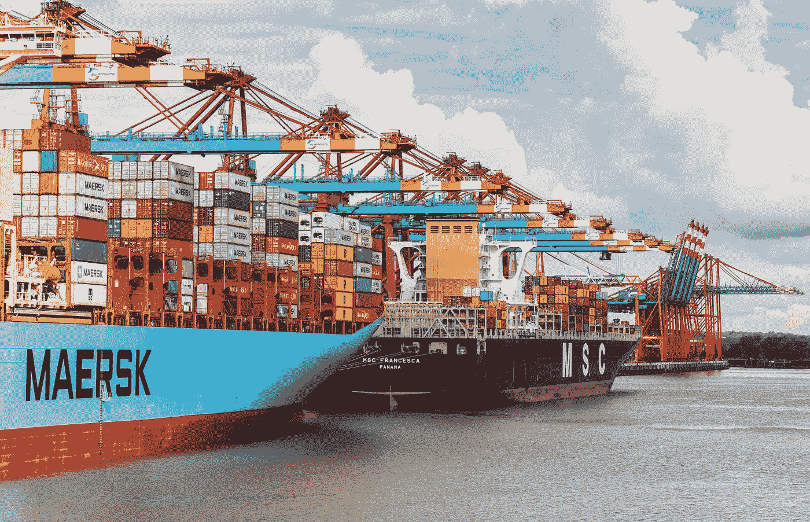
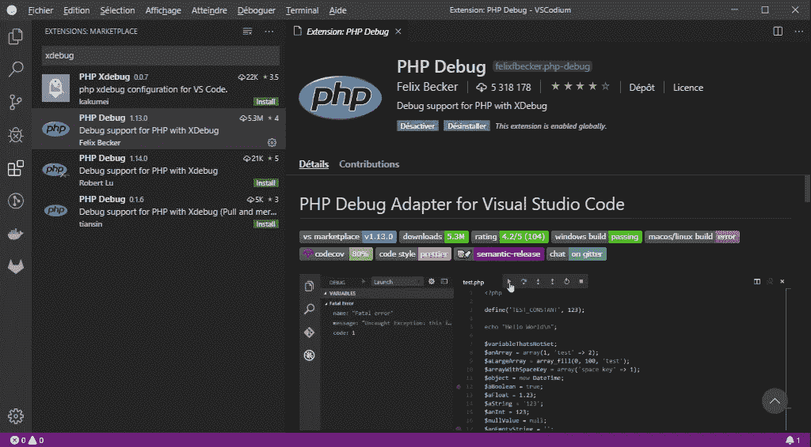
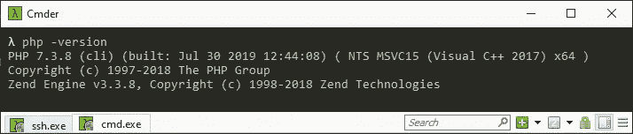

# 使用 xDebug 调试您的 Laravel Sail 应用程序

> 原文：<https://medium.com/geekculture/debug-your-laravel-sail-applications-with-xdebug-160ad70fcd41?source=collection_archive---------5----------------------->

Laravel 在版本 8 中为 docker 环境引入了一个非常实用的包装器:Laravel Sail。我个人觉得它比 Laravel Homestead 更容易使用，Laravel Homestead 的目的是在虚拟机中提供一个开发环境。尤其是在部署的时候。



Photo by [Dominik Lückmann](https://unsplash.com/@exdigy?utm_source=unsplash&utm_medium=referral&utm_content=creditCopyText) on [Unsplash](https://unsplash.com/s/photos/docker?utm_source=unsplash&utm_medium=referral&utm_content=creditCopyText)

作为一名低级软件开发人员，我已经习惯了调试器这种极其强大的工具。在我的代码中放置断点，并且能够在一步一步地检查代码的同时观察每个变量，这真是太好了。它有助于理解到底发生了什么，我认为这对初学者来说是不可忽视的。

不幸的是，Laravel Sail 环境没有安装 xDebug。这是一个在 GitHub 库上被粗略讨论的问题！我就不深入讨论了。我理解双方，我不知道如何解决。但是由于目前的结果是不将 xDebug 选项嵌入到 Laravel Sail 中，我将在这里展示如何非常容易地将 xDebug 添加到您的配置中。

# 发布 Laravel Sail docker 文件

我假设你已经在电脑上安装并运行了 *Docker 桌面*。我还假设您已经创建了一个 Laravel 8 项目。如果没有，只需[跟随向导](https://laravel.com/docs/8.x/installation)即可。

您需要通过执行`sail:publish`命令来发布 Sail 的 docker 文件:

```
./vendor/bin/sail artisan sail:publish
```

一个名为 *docker* 的新目录应该出现在项目的根目录下。在里面你会发现两个名为 *7.4* 和 *8.0* 的目录。在这两个文件夹中，您都会找到一个 *Dockerfile* 。睁开眼睛。

# 编辑 Dockerfile 文件

我们将把 xDebug 作为一个选项添加到容器中。这样，如果您需要，它会出现在您的开发环境中，但不会出现在您的部署版本中。

下面是您的 *Dockerfile* 编辑后的样子:

**第 6 行**
我们添加一个名为 *XDEBUG* 的参数，可以在执行这个 Dockerfile 时提供。

**第 33 行到第 35 行**
我们根据 XDEBUG 参数的值，插入一个安装 xDebug 的条件。嵌件必须在这个位置制造。当我把运行指令切成两半时，要小心地完全按照我做的去做。

# 用 xdebug 初始化 PHP

在这两个名为 *7.4* 和 *8.0* 的目录中，你会找到一个 *php.ini* 文件。睁开眼睛。

我们需要配置 xdebug。只需在 php.ini 文件中添加以下内容:

请注意，端口 9003 是为 xDebug 客户端指定的。你可以选择另一个，但是这个很好。

如果您使用浏览器插件偶尔激活 xDebug，可以省略第 4 行。

# 通过 docker-compose 传播论点

为了传递给*docker 文件*，需要在 *docker-compose.yml* 文件中设置 *XDEBUG* 参数。该文件位于项目的根目录下。

为了使它成为动态的，并允许 XDEBUG 根据它是在生产服务器上还是在开发环境中执行而被激活，xDebug 参数将被赋予一个变量，我将把它命名为 *SAIL_XDEBUG* ，但是您可以随意命名它。因此，找到 docker-compose 文件的 laravel.test 部分，并添加如下参数:

# 从 env 文件中激活 xDebug

现在，要在您的开发环境中激活 xDebug，您只需要将`SAIL_DEBUG=true`添加到*中。env* 文件。每次你改变它，你将需要重建你的应用程序的 docker 映像。所以让我们开始吧。回到您的控制台，运行:

```
./vendor/bin/sail build --no-cache
```

这需要几分钟时间…

要确保 XDebug 处于活动状态，请运行以下命令:

```
./vendor/bin/sail php -v
```

您应该看到 PHP XDebug 及其版本。

# 用 VSCode 开始调试

我将向您展示如何配置 VSCode 来开始调试，但是对于其他编辑器，配置应该是类似的。

# 延伸部分的安装

要在 VSCode 中安装它，我们需要:

*   点击“扩展”图标(或 Ctrl + Shift + X)，
*   然后使用搜索字段查找扩展名(键入 *xdebug* )，
*   最后，安装它(点击绿色的“安装”按钮)。



要工作，你需要在你的电脑上安装 PHP。我们可以通过在控制台中键入`php -version`命令来检查它是否已经安装。它应该输出当前安装的 PHP 版本。



如果没有，你可以下载最新版本(非线程安全的[这个网站](http://windows.php.net/download))。

# 监听器的配置

如果我们需要监听 Xdebug 的许多实例，PHP 调试扩展可以管理许多配置。我们将在这里为我们的容器创建唯一的一个。

为此，我们需要:

*   点击工具条上的“调试”图标(或者 Ctrl + Shift + D)，
*   然后点击左侧面板顶部下拉菜单旁边标题为“打开 *launch.json* ”的齿轮图标。
*   然后在建议的环境列表中点击 PHP。一个名为*的隐藏文件夹。包含一个名为 *launch.json* 的文件的 vscode* 被创建在我们的项目根文件夹中。

我们可以很容易地推断出我们的扩展的配置与我们的项目相似，这很方便，因为我们的所有项目不一定都使用 Docker，并且很可能有不同的配置。

在我们的 *launch.json* 文件中，我们注意到有 2 个配置可以删除(或者不删除，这无关紧要)。我们要创造一个新的:

# 让我们调试一下

你起来了。试试看！

如果你想了解更多关于这个配置的细节，可以看看我关于在 Windows 上使用 VSCode、Xdebug 和 Docker 进行调试的文章。

我希望你喜欢这篇文章。

谢谢你阅读我。祝您愉快！

*原载于 2021 年 5 月 3 日 https://www.naept.com**[*。*](https://www.naept.com/blog/easily-debug-your-laravel-sail-applications-with-xdebug/)*