# 在 Visual Studio 代码中调试 Phoenix 和 Elixir 应用程序。

> 原文：<https://medium.com/geekculture/debugging-phoenix-and-elixir-applications-in-visual-studio-code-5f1b63a6713b?source=collection_archive---------7----------------------->

花更少的时间修复代码，花更多的时间交付有价值的新功能。


Photo by [Munro Studio](https://unsplash.com/@universaleye?utm_source=unsplash&utm_medium=referral&utm_content=creditCopyText) on [Unsplash](https://unsplash.com/?utm_source=unsplash&utm_medium=referral&utm_content=creditCopyText)

知道如何正确地调试 Phoenix 或 Elixir 项目，是在几分钟内找到一个 bug，还是在接下来的几个小时内花大量时间阅读数千行代码，寻找导致应用程序崩溃、老板脱发(这是许多开发人员秃顶的原因)和用户弃船的原因。

在本文中，您将学习如何利用 IO、IEX 和内置的 Visual Studio 代码调试器来提高您的调试能力。

# 使用 Elixir 的 IO 模块调试

最简单的调试方法是打印。您可以使用 IO.puts 和 IO.inspect 函数打印值。

## 输入输出

IO.puts 用于实现字符串的简单、可读的值。Chars 协议。这包括整数、字符串和原子。

```
iex(1)> IO.puts("example string")
example string
:ok
iex(2)> IO.puts(:example_atom)
example_atom
:ok
iex(3)> IO.puts(2)
2
:ok
```

如果给 IO.puts 一个类似元组的东西，它就会崩溃。

```
iex(1)> IO.puts({1, 2, 3}) 
** (Protocol.UndefinedError) protocol String.Chars not implemented for {1, 2, 3} of type Tuple
    (elixir 1.11.2) lib/string/chars.ex:3: String.Chars.impl_for!/1
    (elixir 1.11.2) lib/string/chars.ex:22: String.Chars.to_string/1
    (elixir 1.11.2) lib/io.ex:686: IO.puts/2
```

IO.puts 还会给出奇怪的列表值，因为它没有将 elixir 的内部值表示转换回人类可读的形式。

```
iex(1)> IO.puts [1, 2, 3]                
☺☻♥
:ok
```

## IO .检查

IO.inspect 知道如何打印所有数据结构，包括列表、结构、元组和映射。

```
iex(1)> IO.inspect([1,2,3]) 
[1, 2, 3]
[1, 2, 3]iex(2)> IO.inspect({1,2,3}) 
{1, 2, 3}
{1, 2, 3}iex(3)> IO.inspect(%{"example" => "map"}) 
%{"example" => "map"}
%{"example" => "map"}
```

您会注意到 inspect 似乎会将所有内容打印两次。实际上，inspect 只打印一次，iex 打印返回值。没错，IO.inspect 返回传递给它的值。下面是一个使用返回元组的函数的示例。这个函数仍然返回元组{1，2，3}，并打印{1，2，3}。

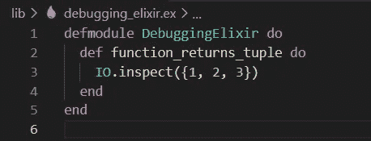

所以当我在别处运行这个函数时，它有正确的返回值。

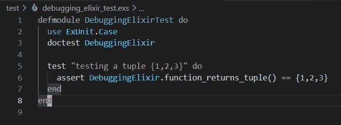

如果您愿意，您可以克隆[范例库](https://github.com/BrooklinJazz/debugging_elixir)并运行`mix test`。您应该会看到类似这样的内容。

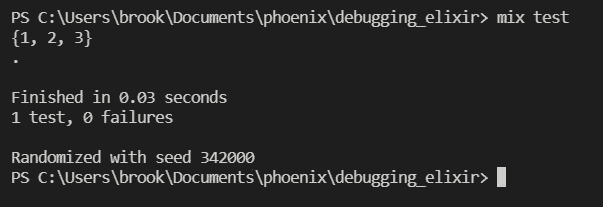

您还可以为检查值添加标签，以便于阅读。

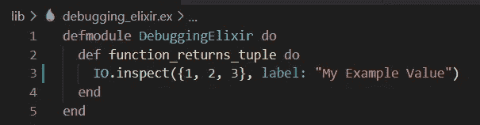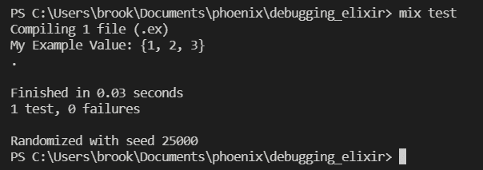

## IO .检查绑定

还可以将 IO.inspect 与 binding()函数一起使用，以查看调用该函数时使用的参数。

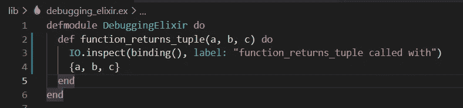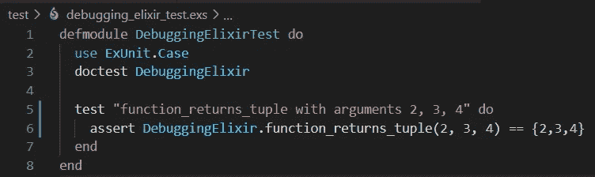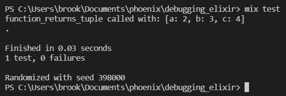

# 使用 IEX 调试

要在交互式 Elixir shell 中运行您的 Elixir 项目，请运行:

```
iex -S mix
```

要在 Elixir 交互式 shell 运行中运行 Elixir 或 Phoenix 项目中的测试:

```
iex -S mix test
```

要在 Elixir 交互式 shell 中运行您的 Phoenix 应用程序，您可以运行:

```
iex -S mix phoenix.server
```

## IEx.pry()

IEx.pry()允许您在代码中设置断点并检查值。当您想要快速检查代码中特定位置的许多值，而不需要挖掘大量的打印语句时，这是非常好的。

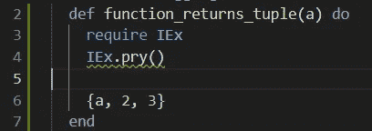

现在，当 elixir 评估 IEx.pry()函数所在的代码时，会提示您请求进行探查。如果您接受，那么您可以检查交互式 Elixir shell 中的值。

忽略我跑的是`iex.bat`而不是`iex`。这是在 Windows 电脑上使用 Elixir 的一个怪癖。

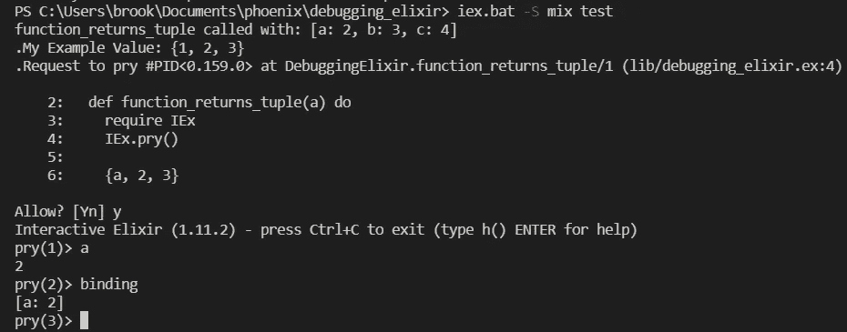

在交互式 Elixir shell 中运行 phoenix 应用程序时，您可以完成同样的事情。

这里有一个来自凤凰博客应用的例子，用户导航到`[http://localhost:4000/author/1](http://localhost:4000/author/1)`来查看一个作者的文章列表。

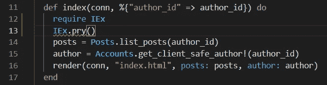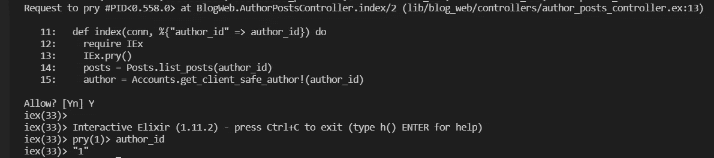

# 使用 Visual Studio 代码调试器

而使用 IEx 快速查看代码库中特定位置的值是很棒的。但是，当您希望查看多个位置、单步执行代码并在应用程序运行时监视数据时，使用具有可视化界面的实际调试器要方便得多。

## 设置调试器

Visual Studio 代码会自动为您设置 phoenix 或 elixir 的调试器。

当您在 Visual Studio 代码中打开 phoenix 或 elixir 项目时，您的菜单中应该有一个运行和调试器选项。如果你没有看到它，你可以用`ctrl-shift-D`运行一个`Show Run and Debug`命令。

如果您想自己运行示例代码，那么您可以克隆[示例库](https://github.com/BrooklinJazz/debugging_elixir)。

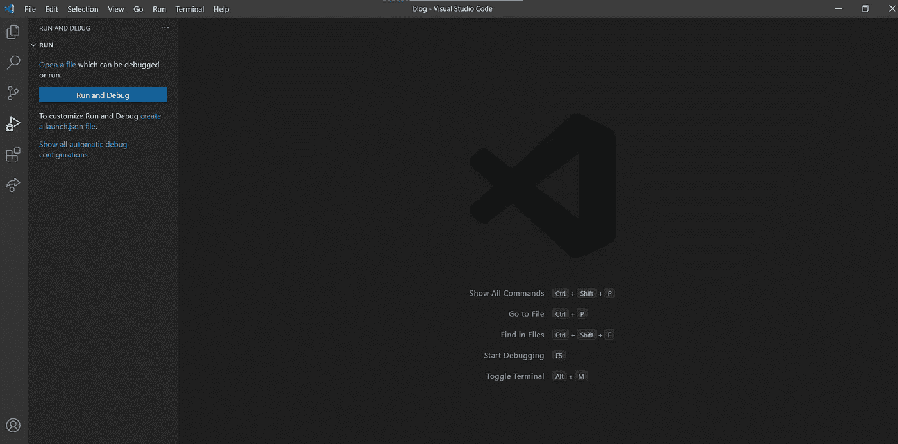

确保你有灵丹妙药。ex 文件打开，点击 ***创建一个 launch.json 文件*** 。这会为您创建一个 launch.json 文件。

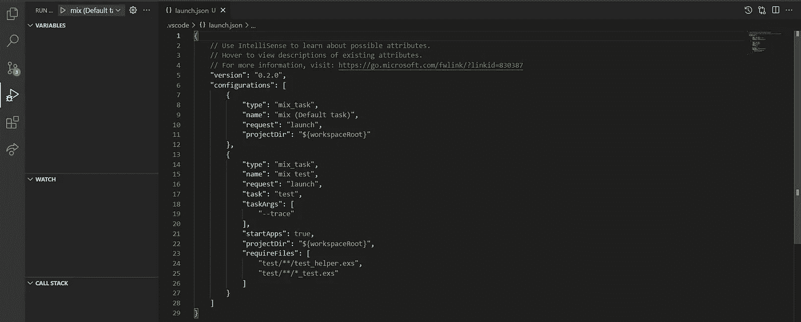

## 使用调试器运行 elixir 项目。

您可以使用混合测试配置通过调试器运行测试。

然而，您可能希望使用`iex -S mix`命令来运行您的项目，以便在调试器中使用交互式的 Elixir shell。

在撰写本文时，我在运行 elixir 项目的默认 mix 任务时遇到了一个 bug。

我会得到一个错误:`:elixir_ls_expression_timeout`

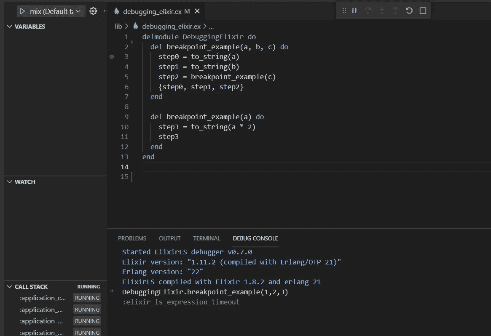

感谢 [Ralphe Maute](https://www.linkedin.com/in/ralphmaute/) 找到了解决方案。问题是没有应用程序的入口点。

如果您遇到同样的问题，请确保/lib 中有一个 application.ex 文件。

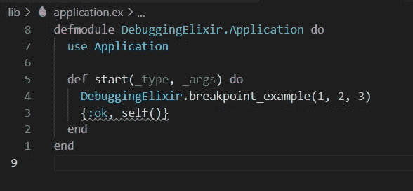

然后引用 mix.exs 中的文件。

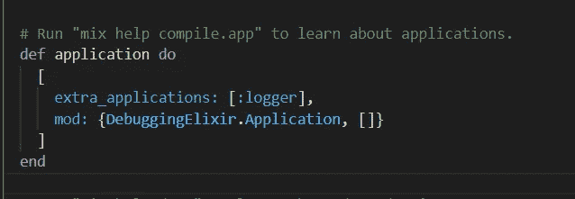

[示例库](https://github.com/BrooklinJazz/debugging_elixir)已经更新，因此如果您设置一个断点并运行默认的 mix 任务，它应该可以工作:

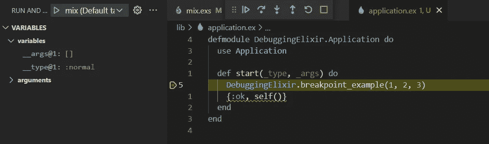

## 使用调试器运行 phoenix 项目。

如果您使用的是 phoenix，将“task”:“phx . server”添加到配置文件中。

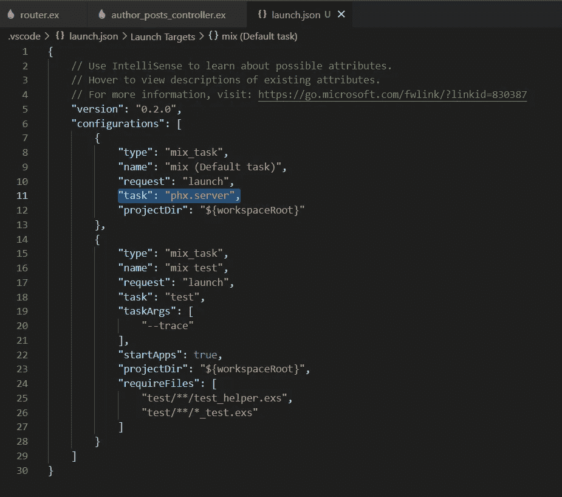

## 设置断点

现在，您可以通过单击任何一行左侧的红点在代码中设置断点。我在下面设置了一些示例代码和测试来显示断点的开始。

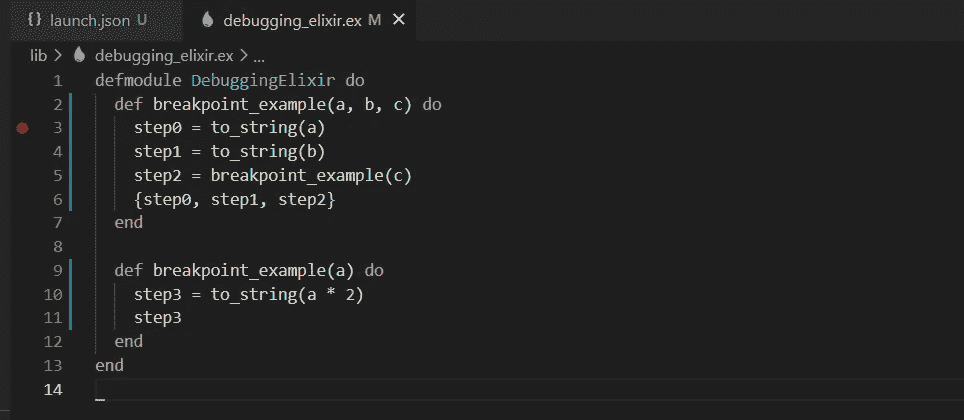

下面是将执行上述代码的测试。

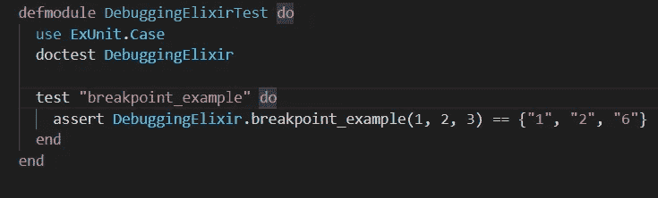

然后选择混合测试配置，并使用绿色的 play 按钮运行它。

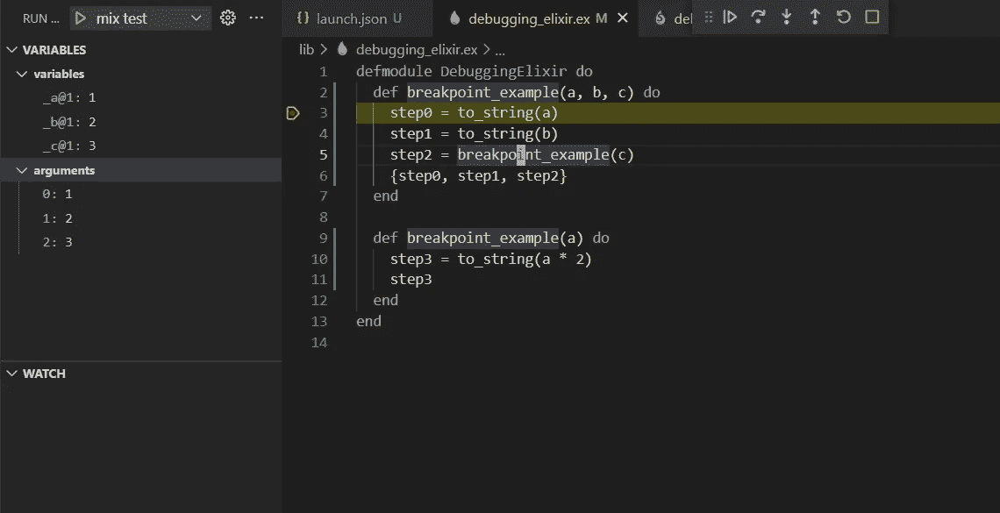

## 跨过

您可以通过按蓝色的单步调试按钮来单步调试您的代码。注意，step0 变量现在被列出来了，因为它已经被定义了，但是在黄线以下定义的变量没有被列出来，因为它们还不存在。

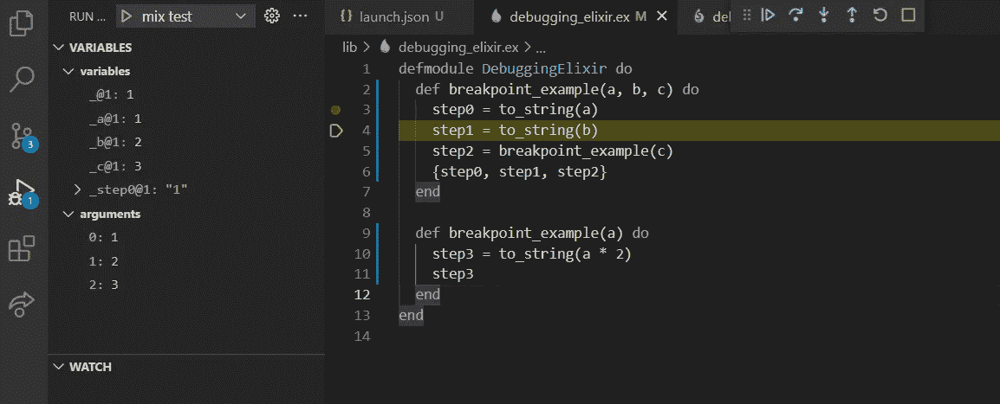

## 进入

您可以使用蓝色的单步执行按钮单步执行一个函数。这允许您看到函数的内部，而不是跳到下一行。

首先，单步执行，直到找到要单步执行的函数所在的行。

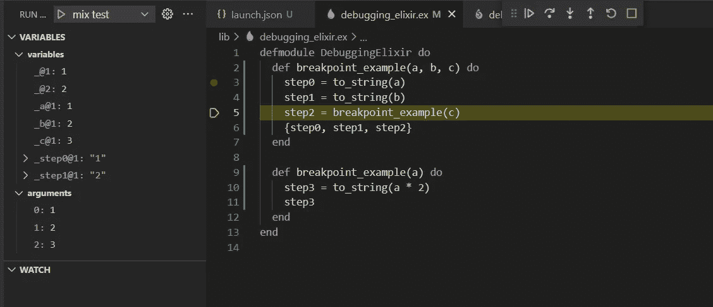

然后按下蓝色的步入按钮。请注意，变量和参数发生了变化，因为我们现在在一个不同的函数中。

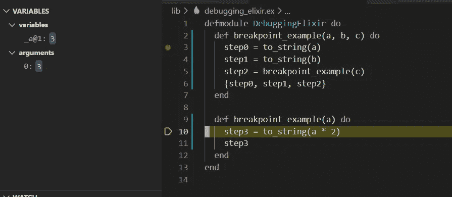

## 继续

为了方便地浏览您的代码，而不是单步执行和进入每个函数，设置另一个断点并点击蓝色的 continue 按钮。

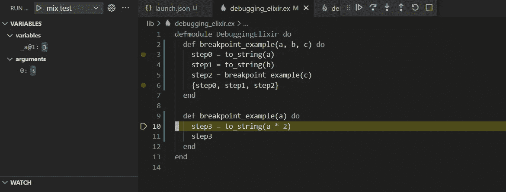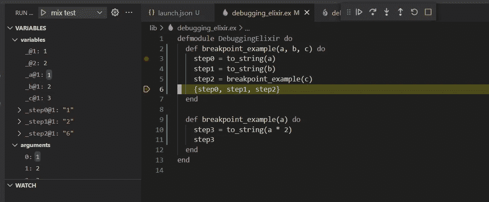

## 观察变量

您还可以设置要监视的变量，以便跟踪值的进度。

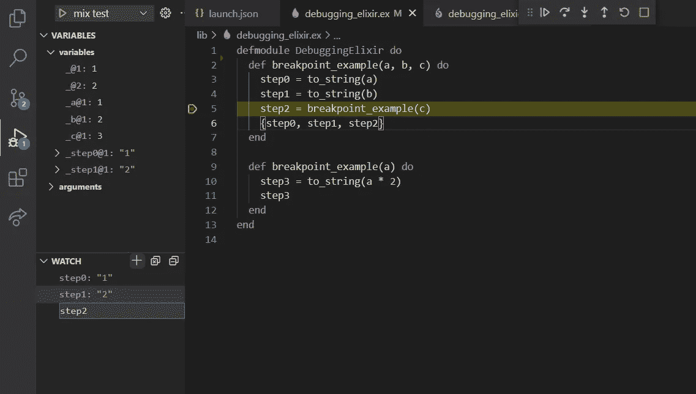

## 条件断点

您可以将断点设置为仅在条件为真时触发。右击通常要添加断点的位置，并选择条件断点选项。

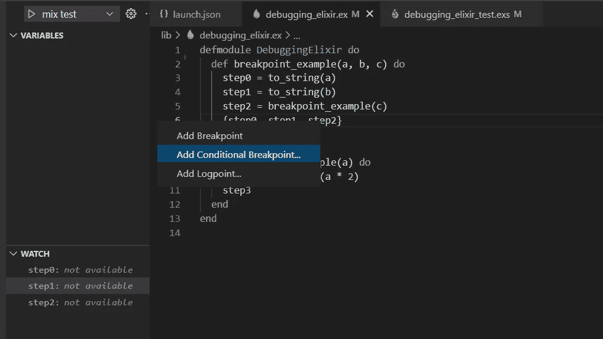

这设置了触发断点的条件。例如，只有当 a 等于 1 时，才会触发此断点。

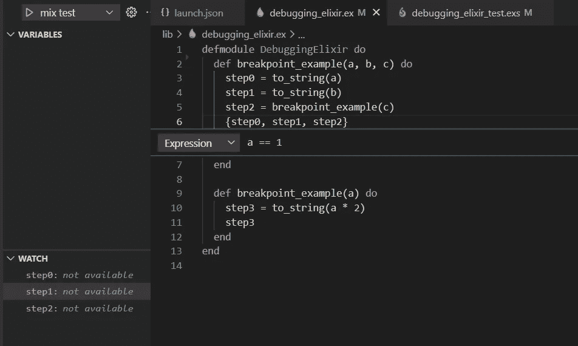

# 结论

知道如何调试代码意味着你要花更多的时间来交付有价值的新特性，而花更少的时间来修复你在这个过程中产生的错误。我希望这篇文章有助于您下次修复棘手的 bug 时避免一些麻烦。如果你有任何意见或问题，请回复这篇文章，我很乐意回复你。