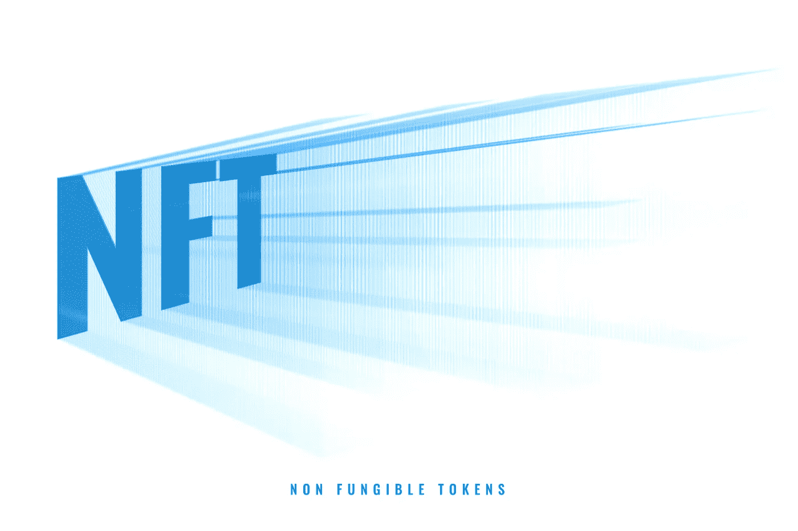

# 揭穿神话周围获得建立一个 NFT 企业！

> 原文：<https://medium.com/geekculture/debunking-myths-surrounding-getting-established-as-an-nft-business-f9bd85a7970c?source=collection_archive---------11----------------------->

由于各种因素，世界在这个千年里发生了许多变化。虽然有些非常糟糕，人类可能在几百年后不复存在，但有些往往会为我们提供急需的进步动力。在这些加速进步的工具中，交互式互联网、Web2 和智能手机通过让人们接触全球内容并为他们提供表达自我的机会而奠定了基础。

虽然这一切都很好，但 Web2 技术使用的存储特性并不好，因为它基于集中式服务器。这就是为什么，Web3 这种颠覆性技术已经从地面上崛起，以结束数据隐私问题和中央控制。目前，通过区块链托管的业务，Web3 一直引领着全球市场。这篇博客详细介绍了如何建立一个基于不可替代代币的企业，并揭露了一些关于经营此类企业的常见神话。

NFT

# 什么是 NFT？

对于那些不知道什么是不可替代令牌的人来说，这些是在区块链注册的数字令牌，可以证明任何资产的所有权和真实性。这些代币为艺术和音乐等创造性职业开辟了更多的赚钱途径。全球 **NFT 市场在 2021 年第三季度首次触及 10 亿美元**大关，尽管经历了漫长的加密冬天，但此后一直高于该关口。

# 建立一个 NFT 企业:所有可能的领域

*   创意 NFT 基于艺术品、音乐、视频剪辑、收藏品和摄影图像。
*   个人资料图片(PFP) NFT 社区企业，功能类似于现实世界中的会员制组织。
*   [**【NFT 市场】**](https://medium.datadriveninvestor.com/nft-art-marketplace-selling-art-nfts-is-the-key-to-the-success-of-this-platform-e44e6571b144) ，通过拍卖向用户出售不同交易模式下的各种 NFT 资产。
*   NFT 发射台，创作者/企业可以通过首次 NFT 募股活动筹集资金。
*   NFT 游戏，玩家通过各种机制来完成游戏中的任务。

# 建立 NFT 企业的一般流程

*   为企业规划和设计商业模式
*   如果需要，开发 NFT 项目和业务平台
*   向全球市场推广业务
*   推出供公众使用的 NFT 业务
*   紧跟潮流的业务管理和维护

> 克服误解，为 NFT 企业奋斗

# 发展非正规金融服务和风险投资平台

许多热衷于经营 NFT 企业的人倾向于了解开发过程的难度。虽然这种想法可能部分正确，但从那时起技术已经进步，最近多种方法和技术栈混合在一起。 [**NFT 平台开发**](https://www.blockchainappfactory.com/nft-development-services?utm_source=medium&utm_medium=14%2Fsep%2F22&utm_campaign=srinivasan+) 使用可定制的白标解决方案和高级的程序员友好的编程工具使过程变得更加容易。使用白标 NFT 平台，甚至使用数据驱动的研究从零开始开发，所花费的时间和成本也可以大大减少。

# 区块链网络的功耗

一个让 Web3 怀疑论者着迷的话题，随着更新的节能网络变得流行，区块链的电力消耗最近已经减少了。此外，以前存在于使用更高能量的机制上的网络正在转换为有效的网络，如以太坊的“合并”到 [**以太坊**](https://ethereum.org/en/) 2.0 的情况。

# 为非功能性测试提供切实的用例

当谈到对 NFT 风险投资的看法时，NFT 怀疑论者的另一个最爱说的话是 NFT 没有有价值的用例。虽然目前围绕数字产品的焦点可能会让人们认为 NFT 不值得投资，但它们往往会带来实实在在的好处。票务、房地产和游戏等应用已经开始受益于 NFT 空间带来的好处。随着时间的推移，metaverses 的出现和大型 Web2 公司对创建 metaverses 的兴趣只会加剧这场革命，不久，怀疑论者可能会爱上 NFTs。

# 积极开展业务，保持在正确的道路上

虽然这句话适用于任何企业，但它更适用于 NFT 企业，因为“非正规金融服务是一个骗局”的常见误解可以消除。虽然您可能计划为项目阶段提供更长的窗口，但是您必须确保为项目提供一些参与(尤其是在初始阶段)。恶意玩家无处不在，在 NFT 领域也是如此。去中心化带来的匿名隐藏了他们的身份，这是怀疑论者的理想拼盘。持续的活动让一家 NFT 企业保持相关性并被记住，即使它经常不会带来重大更新，使诈骗索赔变得无关紧要。

# 联系人们现在比以往任何时候都容易

NFT 企业经常后悔的一点是，他们无法达到预期的目标受众。虽然 NFT 营销艰难有多种原因，但在 Web3 领域接触人们的秘密似乎已经破解。通过不断使用 [**改良的数字营销**](https://bit.ly/3QGh7V4) 和新颖的策略来适应 Web3 的需求，NFT 的项目推广在最近取得了成功。因此，一家 NFT 企业不必考虑如何接触目标受众。

# 我现在该怎么办？

虽然这个博客可能已经消除了世界上误解和低估 NFTs 潜力的冲动观点，但这里的关键要点是，经营一家 NFT 企业比以往任何时候都更有益。在 Web2 世界中创业和维持可能很快就会过时，因为他们可能不得不转向 Web3 规范，直接跳到 Web3 商业模式，如 NFT 平台，是有利的。如果你有一个 NFT 的商业想法，考虑与 NFT 最好的应用开发公司**合作，以获得最大的影响力和巨大的成果。**