# Unity 中的贴花投影

> 原文：<https://medium.com/geekculture/decal-projections-in-unity-294f7ce21d26?source=collection_archive---------6----------------------->

## 贴花是 Unity 的一个非常有用的功能，允许将图像投影到任何表面上。

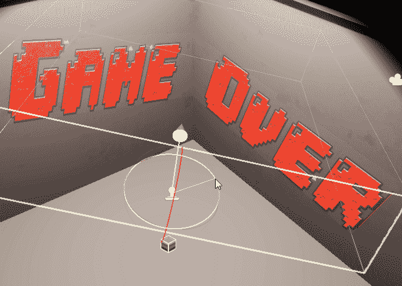

**今天的目标:**探索统一 HDRP 贴花的可能性。

# 贴花:

贴花不仅仅出现在游戏设计中，因为它们已经存在很多年了，尤其是在汽车行业。

非视频游戏版本是:

> 印刷有图案或图像的塑料、布、纸或陶瓷基底，通常借助于加热或水，接触后可移动到另一表面—维基百科

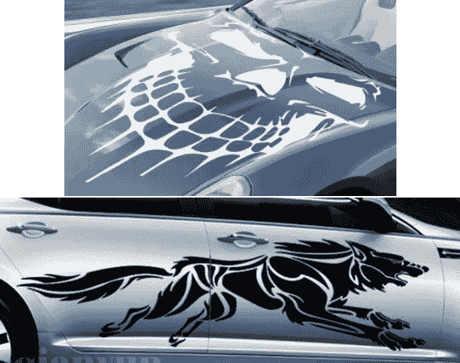

转化为视频游戏开发，它们是一种在任何时间将任何纹理轻松投影到另一个表面上的方法，而不受表面特性的限制，或者一次只限于一个表面。

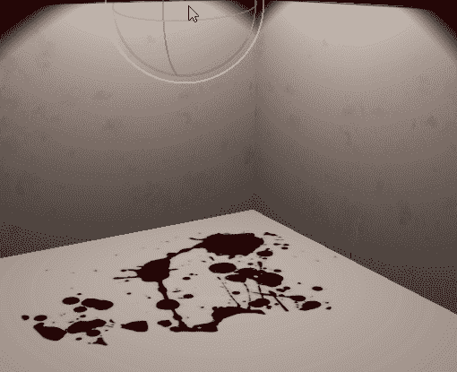

通常，游戏设计中的贴花用于临时效果，如血溅、弹孔或表面标记。但是，当开发商不想将涂鸦包含在完整的墙壁材料中时，它们同样可以用于墙上的永久性涂鸦。

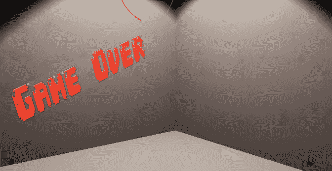

# Unity 贴花:

**注意:**贴花不仅限于 HDRP，我还将展示在 HDR 管道上使用它们的过程。

HDRP 过程非常简单。
在层次窗口中右键单击，选择“渲染/HDRP 贴花投影仪”。

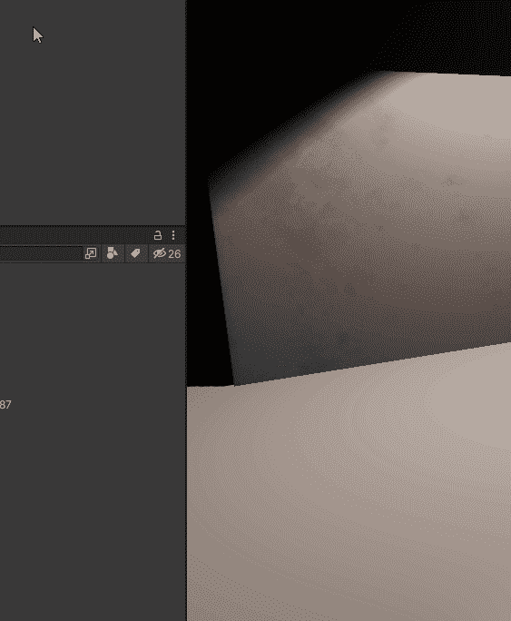

这将创建一个新的贴花投影仪，如下所示:

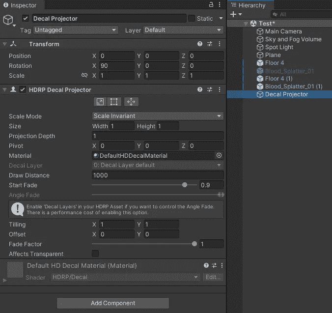

首先创建/选择你想要的贴花材质，它可以使用任何纹理，就像其他材质一样。
记住**将着色器类型更改为 HDRP/贴花**，这是必需的。

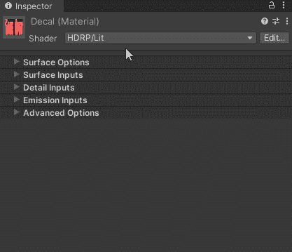

现在回到贴花投影仪上，将材质设置为您选择的贴花材质。

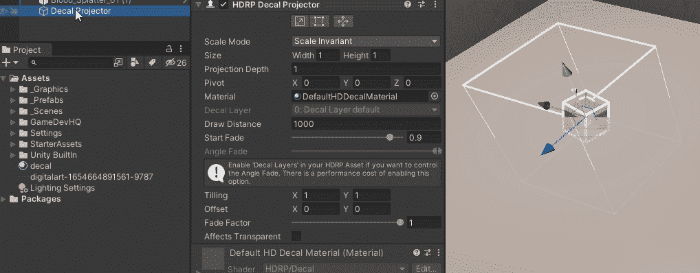

现在我们可以看到贴图被投影，我们可以修改它。

贴花的工作原理是将设定的材质从一个起点投影到“ ***投影深度*** ”距离内的任何对象上。

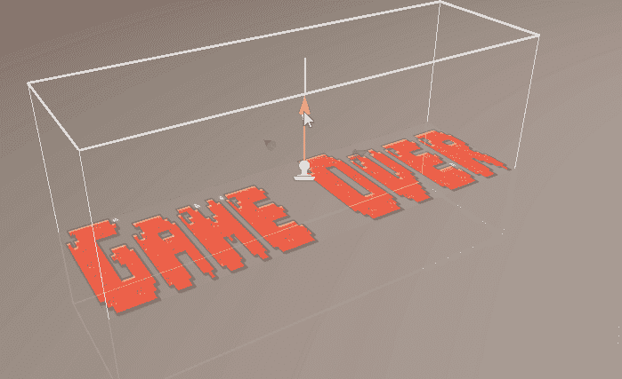

起点和投影方向可以通过显示为小控件的白色箭头来标识:

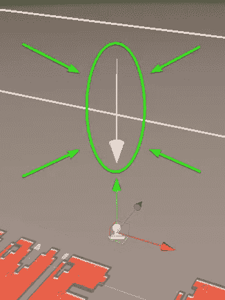

就我而言，我让它正面朝下:

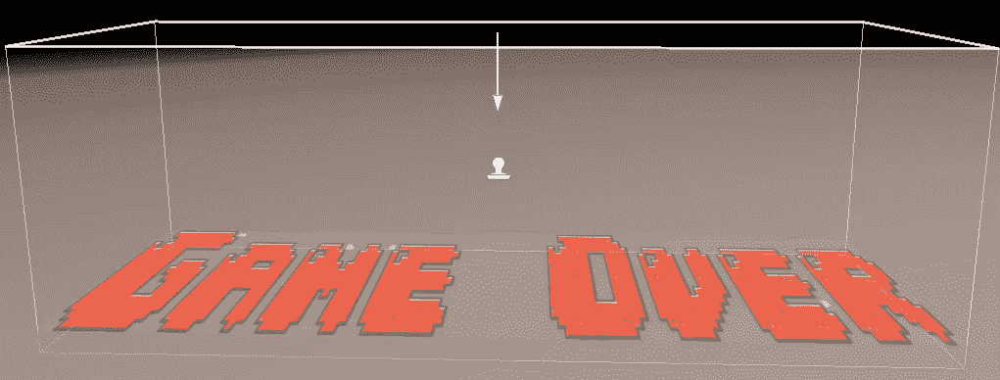

可以使用大小变量或通过进入面编辑模式来改变投影大小，就像您可以对长方体或类似体进行操作一样。

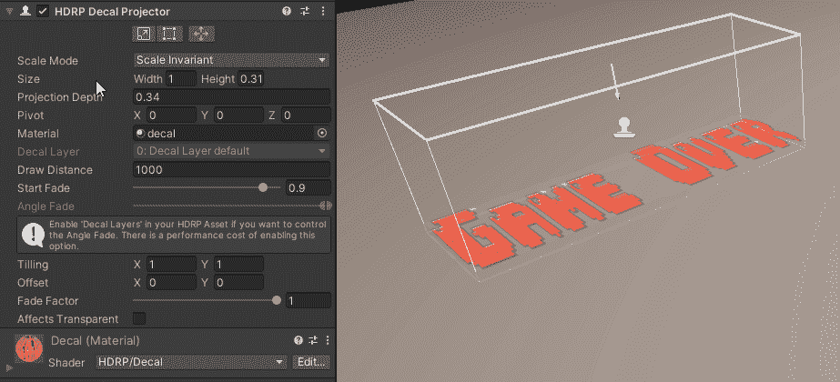

可以使用 ***投影深度*** 改变贴花投影的距离:

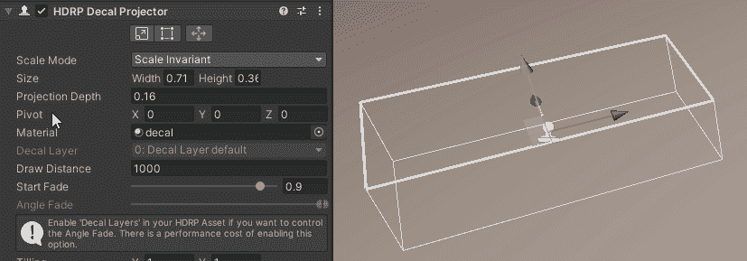

这些是你想要调整的主要选项。剩下的就交给你去玩了。

# 注 1:

贴花可以穿过多个对象:

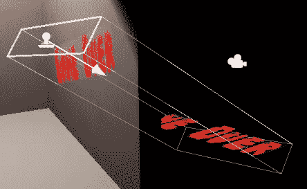

# 注 2:

像所有游戏物体一样，贴花不需要直接面对表面。它们可以旋转，以任何角度投射到任何表面上。

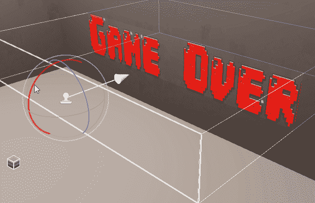