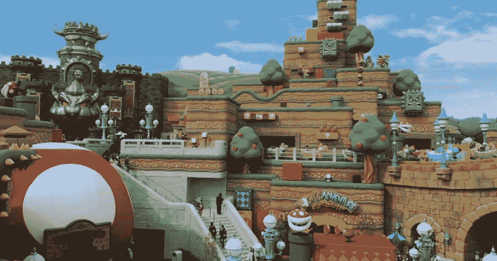

# 分散克隆来建立你的数字世界

> 原文：<https://medium.com/geekculture/decentraland-clone-to-build-your-phygital-world-2022-a35e57b3bf46?source=collection_archive---------11----------------------->

## 了解分散的克隆，启动您的数字化 NFT 市场，为 NFT 爱好者带来身临其境的体验。看了这个博客就知道下落了…！

hydigital 是数字功能与现实世界的结合。**虚拟现实(VR)** 的日益普及极大地增加了从事这一数字贸易的创业公司。一家著名的初创公司——虚拟现实初创公司——最近[宣布与 **D-cave** 合作](https://ambcrypto.com/could-decentralands-phygital-move-be-the-catalyst-for-mana-land-sales/)其**“物理”手表。截至目前，这款手表似乎在元宇宙获得了可穿戴的名称。(通过这样做)分散的土地希望吸引更多的品牌用户到平台。**

*嗯，我想这回避了问题，*

## **什么是分散土地？**

分散王国是一个以太坊建造的 [**虚拟现实平台**](https://www.appdupe.com/decentraland-clone?utm_source=Medium&utm_medium=Blog&utm_campaign=Narmatha) ，使用户能够创造体验和货币化内容。

**Ari Meilich 和 Esteban Ordano——分散之地的创造者，**最初是作为概念证明，后来逐渐发展成为三维(3D)沉浸式世界。允许用户控制和操作分散式虚拟现实平台的能力是其开发的关键组成部分。用户可以在这个平台上拥有土地并要求虚拟土地的所有权，因为它是建立在区块链网络上的。

这些特点促使商业平台创建自己的区块链驱动的 NFT 市场，如分散的土地，并迅速调查广泛的收入潜力。

## **融入 NFT 交易与分散式克隆**

分散克隆体的概念受到元宇宙技术的启发，该项目建立在以太坊网络上。分散式克隆是一个基于 3D 虚拟现实概念的分散式平台。

分散土地被称为虚拟地产，它的工作方式与实际地产相同，一块块土地充当 NFT。此外，基于以太坊区块链的加密货币可以用来买卖这些 NFT。该平台还可以作为一个虚拟现实游戏区，用户可以在这里实时开发、创造和出售土地。研究开发 NFT 市场的最低成本。

分散克隆 的 [**可以用于很多事情，包括娱乐和商业。游戏玩家享受游戏的娱乐价值以及虚拟环境的景象和噪音。企业可以从内陆投资中获利。**](https://www.appdupe.com/decentraland-clone?utm_source=Medium&utm_medium=Blog&utm_campaign=Narmatha)

## **分散型克隆体的特征**

分散王国是一个以创造者为中心的平台，玩家可以在这里探索元宇宙的新奇事物。分散之地游戏中的本地令牌是基于 ERC 令牌规范的，因为游戏是建立在以太网上的。这些硬币是平台发展所必需的。他们在非集权国家的经济稳定中扮演着重要的角色。

1.  **构建工具**

用户可以使用分散的集成构建工具想象、设计和构建自己的 3D 事物和体验。你可以通过创建简单的设置和艺术作品来参加比赛，而熟练的艺术家可以使用分散的方式来构建整个 VR 游戏。在这个意义上，分散的土地是 Meta 的地平线世界的竞争者。

**2。P2P 互动**

对等互动意味着在一个共享的项目或活动中与其他人联合和合作，该项目或活动的特点是基于网络的组织结构、共享的公共资源基础以及所有参与者都可以做出积极贡献的信念。

**3。互动市场**

分散克隆包括一个专门的 NFT 市场，在那里用户可以交易他们的虚拟资产作为代币。记住——像“分散之地”这样的 NFT 市场有“试穿”功能，可以用来检查头像(NFT)的外观。此外，分散克隆的高级搜索过滤器帮助用户筛选和选择他们理想的令牌。

**4。虚拟事件**

活动是分散平台的基石，因为它也是品牌进入元宇宙的门户。记住——创建一个虚拟的元宇宙风格的平台，如“分散的土地”,意味着你可以允许品牌举办虚拟活动(在你的平台上)并赚钱。你是否想知道——哪些品牌在分散式土地上举办活动？这里可以看到[。](https://events.decentraland.org/)

**5。绝对，去中心化！！**

它是一种分散化的平台，允许用户交易和存储他们的 NFT，以及根据用户需求在不同的链上建立的百万美元收入系统，如 Tron、以太坊、币安智能链等。

## **分散克隆是如何工作的？**

分散土地克隆脚本的工作方式和分散土地一样，有两个不同的视角:商人和创造者。该协议分为三层，每层都有其功能:第一层、第二层和第三层。第一层是共识层，这意味着智能合约将监控所有权；第二层是土地内容层，渲染现实世界；第三层由 P2P(对等)连接组成。分散土地也可能使用由流行程序如 Sketch Up 和 Blender 创建的 3D 模型。

## **最后的想法**

分散土地为许多元宇宙信徒铺平了道路，吸引了大量渴望过虚拟生活的个人。如果你想穿过 NFT 市场的洪流，稳步进入元宇宙，今天就去 NFT 的 [**市场，比如分散地**](https://www.appdupe.com/decentraland-clone?utm_source=Medium&utm_medium=Blog&utm_campaign=Narmatha) 。你越早建立并运行你的平台，就越有可能吸引更多更富裕的用户。