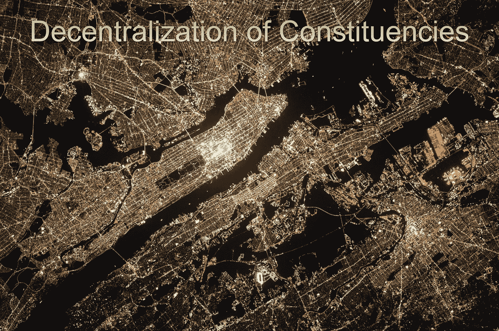
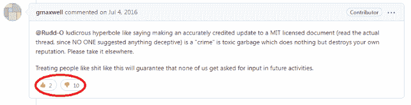
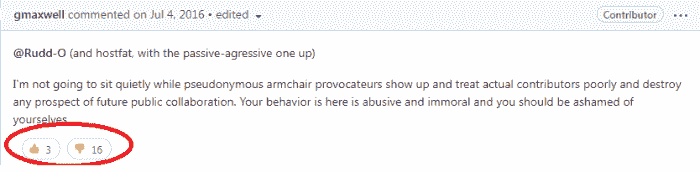
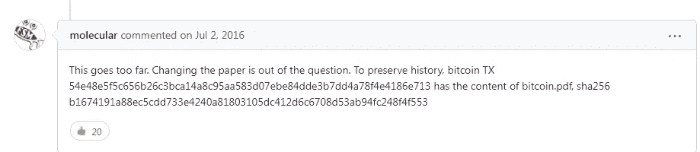
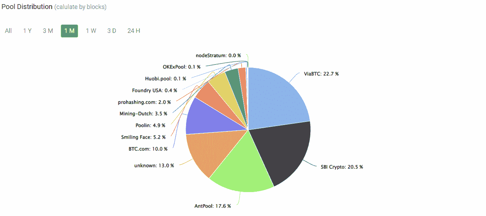

# 选区去中心化:区块链网络的关键组成部分(以 BCH 和 BTC 为例)

> 原文：<https://medium.com/geekculture/decentralization-of-constituencies-a-key-component-of-blockchain-networks-with-bch-and-btc-f116190d1ccd?source=collection_archive---------19----------------------->

去中心化是经济自由的载体，也是标准加密货币的目标。

这一重要特性允许区块链网络不受政府禁令或法规的影响。

> 数字签名提供了部分解决方案，但是如果仍然需要可信任的第三方来防止重复花费，那么主要的好处就失去了。虽然该系统对于大多数交易来说足够好，但是它仍然受到基于信任的模型的固有弱点的影响。随着逆转的可能性，对信任的需求扩大了。

——中本聪，“比特币:一个点对点的电子现金系统”([来源](https://www.bitcoin.com/bitcoin.pdf))

关键词是信任。这是银行支付网络的失败。

区块链要取得成功，就应该维护和促进权力下放。否则，例子是薄弱的区块链网络，往往是 51%的攻击，或集中区块链作为 IBM 区块链，提供低效用。

# 支付与金融领域的信任失败

相反，分散的网络提供了一个不可信的金融环境，它扩展到我们经济的所有金融方面，不包括中介和遗留金融系统的各种问题。然而，分散式网络也是不受限制的，每个人都可以在其上建立。

我们必须信任像银行这样的金融实体，它会兑现承诺，保证我们银行账户中的资金安全，并根据我们的要求执行交易。

对于当前系统，我们还必须:

*   **相信** [**银行不会破产**](https://en.wikipedia.org/wiki/List_of_banks_acquired_or_bankrupted_during_the_Great_Recession)
*   ****相信政府不会拖欠债务** [**从我们的银行账户中扣押资金**](https://nomadcapitalist.com/finance/offshore/your-bank-account-is-no-longer-sacrosanct/) **以支付国家债务，****
*   ****相信我们的现金不会随时间贬值(** [**通货膨胀**](https://eu.usatoday.com/story/money/2021/12/10/inflation-rate-consumer-prices-rose-6-8-annually-november/6455689001/) **)，****
*   **相信每一个银行员工，他们不会只是 [**掏空我们的账户**](https://cnycentral.com/news/local/solvay-bank-employee-charged-with-stealing-thousands-of-dollars-from-customer-accounts) **窃取我们的资金。****

**这只是太多的信任要求，这个遗留系统现在已经过时。**

**加密货币不再需要信任。**

****

# **选区的分散化**

**为了保护网络安全并在不使用中介和信任的情况下提供真正的 P2P 金融交易，Nakamoto 合并了一个基于工作证明(PoW)哈希的分布式分类帐，该分类帐遵循最长链逻辑。**

**完全去中心化很可能只是一种理论。尽管如此，我们可以讨论任何特定网络中的去中心化程度。在一个网络中，分权有不同的形式，而权力的集中不仅仅是在开采范围和权力上。**

**当我们主要在采矿因素中检查网络的分散化时，有一个实体在接受它的位置时控制和操纵其余的支持者的例子。**

**例如，比特币(BTC)受到开发集中化的困扰，因为所有提案都需要获得某家私人公司 Blockstream 的批准。**

**这种事件使权力下放过程失去了可信度，并暴露了网络治理的根本缺陷。**

## **比特币现金的分散化发展**

**比特币现金遇到了这样一种尝试(与 BCHAB 一起)，要求社区中某个小但重要的部分增加对货币收益的控制，尽管最终共识占了上风并排除了它。**

**回想起来，香港商事仲裁处一方的建议看起来像是敲诈，永远不会被接受。虽然更名后的 eCash 不具备长期生存能力，但从财务上看，它可能在短期内从 BCHABC 一方获利。**

**比特币现金有各种开发团队，不像比特币核心是决定性的开发者一方，在 Blockstream 的工资单下执行开发(大部分是停滞的比特币)。**

**在 2018 年 BSV 试图破坏 BCH 网络的另一次尝试中，比特币现金没有屈服于压力。虽然，现在一些重要的元素取代了比特币现金，为电子现金和 BSV 做出了贡献。**

## **白皮书(2016)的修订提案**

**在比特币 BTC，今天的白皮书被撕成碎片。以至于 bitcoin.org 的首席执行官要求修改白皮书:**

**我相信它不再能很好地让人们对比特币有一个坚定的理解(至少现代版是这样)。**

**——Cobra，(来源:Github: [***比特币论文#1325***](https://github.com/bitcoin-dot-org/bitcoin.org/issues/1325) 修正)**

**提议修改比特币白皮书的不只是一个有影响力的人。**

**只要看一下评论，我们就可以很容易地找到这样一个提议背后的动机以及实际上是谁在背后支持它。Gregory Maxwell 和 Theymos 参与其中并不意外。**

****************

**[*source of images*](https://github.com/bitcoin-dot-org/bitcoin.org/issues/1325)**

**Blockstream 工资单下的比特币核心开发人员证明并推动了这一提议。他们失败了，因为 2016 年的情况有所不同，尽管如果这样的提议今天重新提出，它有可能获得压倒性的支持，因为 BTC 今天在发展方面更加集中。**

****

# **共识；一致**

**我们经常在区块链的高层网络中发现权力斗争。即使是最分散的区块链网络(BTC，比特币现金，以太坊，莱特币)也不是完全自治的实体，而是由各自的社区管理。治理模式是共识。**

**共识是区块链分权治理的核心。对网络变革的支持将满足绝大多数网络社群的目标。**

## **选区**

**比特币不仅仅是矿工，(正如安德烈亚斯·安东诺普洛斯(Andreas Antonopoulos)在他的一些演讲中解释的那样)，它基于各种各样的选区，这些选区运营并为网络提供额外的价值。**

**比特币的决策过程是基于共识的机制。**

**这需要比特币*社群*的绝大多数成员同意修改代码。这些选区是:**

*   **矿工们**
*   **“核心”开发者**
*   **交换(运行节点)**
*   **建立在网络之上的开发者(钱包、侧链等)。)**
*   **最终用户**

## **侧链**

**BTC 版本的比特币也有私有和公共侧链，如 Liquid 和 LN，但也有 EVM 兼容侧链(RKS 网络)，可以实现智能合约和令牌化。**

**比特币(BTC)、比特币现金、以太坊和大多数区块链都是开源的无许可网络。任何人都可以在这些网络的基础上进行建设，任何发展都不需要共识。尽管社区的认可对长期的成功很重要。许多以太坊侧链也遵循相同的逻辑，尽管它们都需要一个不同的 ETH 本地令牌用于 gas。以太坊一直在输**

**这些侧链是私人试图在第一层之上建立第二层，旨在满足某些市场需求。它们可以是专用的集中式网络，也可以是分散式的，带有 PoW 或 PoS 形式的加密证明。**

## **发展中的权力下放**

**权力下放主要是在采矿方面，但是，还有一些不经常讨论的更重要的因素。**

**与块流的例子一样，我们现在理解了某些机制如何通过停止创新和不进行可扩展性开发来促进个人利益。**

**发展中的权力下放同样重要，特别是当私人资助的实体有可能控制并在主要和集中的传播媒体中推行某种议程时。**

## **交换**

**加密货币市场可能是世界上最自由的市场，尽管经常受到严重操纵，一些资产中形成泡沫，其他资产被抑制在较低水平。**

**2013 年，交易量集中在一家交易所，即现已停业的 MtGox(约占交易量的 70%)。集中式加密货币交易所是加密货币市场的切入点。**

**MtGox 崩盘的那一刻，比特币价格进入了长达两年的熊市，BTC 也差点成为一场失败的实验。**

**加密货币市场可能是世界上最自由的市场，尽管经常受到严重操纵，一些资产中形成泡沫，其他资产被抑制在较低水平。**

**2013 年，交易量集中在一家交易所，即现已停业的 MtGox(约占交易量的 70%)。集中式加密货币交易所是加密货币市场的切入点。**

**MtGox 崩盘的那一刻，比特币价格进入了长达两年的熊市，BTC 也差点成为一场失败的实验。**

**交易所也在满节点运行，可能会挖掘加密货币。尽管它们是具有特定作用的不同类别。**

****

## **最后**

****

**BCH miner distribution- [Source](https://bch.btc.com/stats/pool?pool_mode=month)**

**分散网络的参与者相互作用，或者采纳或者拒绝对代码的修改。**

**如果网络用户的产品的消费者不再发现它的价值，他们就会停止使用或消费它。如果一个产品不包含想要的特性或者误导公众，那么消费者就会停止使用它。**

**开发与提供给用户的最终产品有关。**

**有竞争力的支付方式将增加用户群，最终提升基础资产的价值。**

**Blockstream 下的比特币被恶意劫持，BTC 开发进展停滞。Blockstream 经常宣传这样一个事实，即比特币(BTC)不能用作货币，这个私人实体的解决方案是它生产的 LN 和 Liquid 侧链。然而，侧链不是可伸缩性的解决方案，而是次要问题。**

**今天，根据白皮书，比特币现金是比特币的定义，并在 BTC 停止的地方继续。**

**一个 P2P 电子现金网络，具有一个健壮的、分散的网络，由第二个顶级 hashrate (~1.5Exahash)保护。**

****

**Writing at the following websites: ● [ReadCash](https://read.cash/@Pantera) ● [NoiseCash](https://noise.cash/u/Pantera99) ● [Medium](/@panterabch) ● [Hive](https://hive.blog/@pantera1) ● [Steemit](https://steemit.com/@pantera1) ●[Vocal](https://vocal.media/authors/pantera) ● [Minds](https://www.minds.com/pantera99/) ● [Twitter](https://twitter.com/Panterabch) ● [LinkedIn](https://www.linkedin.com/in/panterabch/) ● [email](https://read.cash/@Pantera/localcryptos-p2p-exchange-is-now-offering-bitcoin-cash-trading-06637230#bad-link)**

> ****免责声明**:本内容发布的所有材料均用于娱乐和教育目的，并符合**公平使用准则**。无意侵犯版权。如果您是或代表本文所用材料的版权所有者，并且对所述材料的使用有疑问，请发送 [**电子邮件**](https://read.cash/@Pantera/cryptouknowns-battlegrounds-the-crypto-battle-royal-part-i-0ca762da#bad-link) 。**

*****支持内容创作者。*****

**如果你喜欢这个故事，就订阅吧！**

***原载于*[*https://read . cash*](https://read.cash/@Pantera/decentralization-of-constituencies-a-key-component-of-blockchain-networks-1fb4a62d)*。***

****