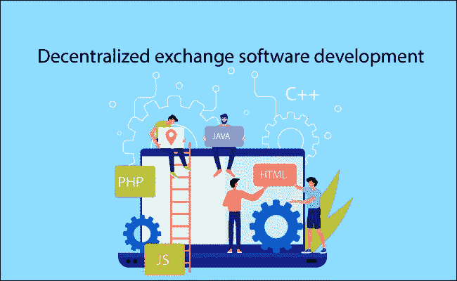
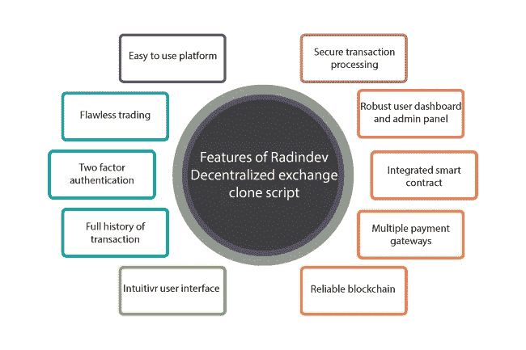
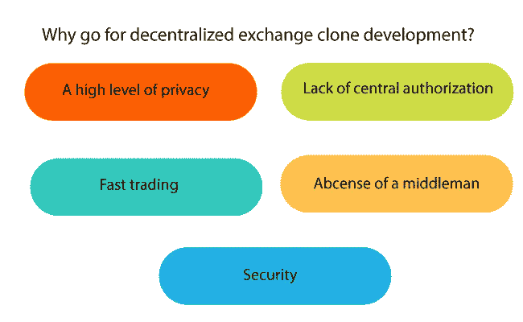
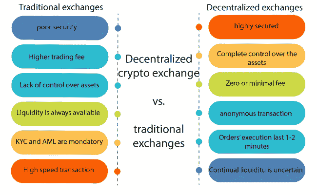

# 分散式交换软件开发

> 原文：<https://medium.com/geekculture/decentralized-exchange-software-development-b6a485bfb83b?source=collection_archive---------19----------------------->

分散加密交换软件是一个平台，可以获取直接交易，没有调解。在许多投资者中，创建加密交换克隆的首要任务是致力于分散的交换软件开发服务。我们可以制定一个一致的路线图，这样您就可以交付功能完善、随时可以上市的 exchange 脚本。

你可以使用白色标签 [**去中心化交换软件开发**](https://radindev.com/decentralized-exchange-software/) 服务，重新创建一个像 pancakeswap 一样流行的 dex 脚本。通过使用 dex 克隆脚本解决方案，您将能够复制众所周知的加密交易所的成功。另一个可能导致您启动 dex 克隆脚本的重要因素是它的隐私性和安全性。因为在 dex 中不需要中央授权，所以没有中间人可以评估和推动交易。

# **什么是分散金融交易所？**

开发了一个分散的 exchange 脚本来满足所有用户所需的安全性和隐私性。具体来说，新来者正在寻求更多的隐私和安全性，因为他们是具有高级功能特征的交易空间的新手。分散加密交换是点对点交易空间，能够实现快速安全的交易。

# **创建 defi 交换的白色标签解决方案**

白标产品是一个定制的平台，可以在几天内为公众部署。白标加密分散交换软件开发不会持续超过几个星期，它是基于定制。白标分散交换软件完全可以根据您的要求定制。所以，你需要的功能越多，完成开发的时间就越长。

可以构建类似于 pancakeswap、uniswap、sushiswap 等流行且最常用的分散式交换的白标分散式交换脚本。在一个白色标签的分散式 exchange 开发服务中，您可以复制一个准备充分的 exchange 脚本来获得相同的成果。

# **我们的 dex 克隆脚本的特性**

我们的分散式 exchange 软件开发服务的基本功能如下所述:

## 双因素认证

双因素认证确保了平台的安全性，也可以集成到加密钱包中。

## 完美的交易

通过启用 dex 脚本中的几个高级功能来促进交易，用户体验平稳整合。

## 直观的用户界面

易于访问 DEX 平台的吸引人且功能丰富的界面可以吸引任何用户使用该平台。

## 交易的完整历史

此选项保证了分散式 exchange 软件的透明度和责任性。此功能会记录每一笔执行的交易。

## 安全交易处理

分散式交易软件开发中交易空间安全功能的多样性保证了交易过程的安全性。

## 强大的用户控制面板和管理面板

这一特点有助于更好地监管，密切关注企业的运营。

## 多个支付网关

分散式交易所是基于多用途和渐进式支付方式部署的。它鼓励更多的用户进行交易。

## 集成智能合同

集成的智能合约有助于提高用户对平台效率的信任。它实现了 DEX 软件的自动化和不可变的工作过程。

## 向上推送通知

分散加密货币交易脚本中的每个参与者都会收到实时警报，以选择最佳匹配顺序。

## 易于使用的平台

分散式 exchange 软件开发服务的最新更新可以快速推出。用户可以在分散的交易软件中交易、管理、添加和删除订单。

## 可靠的区块链

分散的交换脚本运行在可信的区块链上，如 BSC、ETH 等。他们使用智能合同协议，因此在平台上不可能有非法活动。用户可以放心地在 dex 上执行交易。

# **去中心化交换脚本开发流程**

## 用户界面/UX 设计

为您的用户提供和开发令人难以置信的用户体验。详细的可视化可以防止即将到来的用户体验问题。

## 前端开发

前端开发实现了一个 UI 设计，它包含了用户交互的每一个细节，以吸引更多的用户。

## 后端开发

所有的场景操作都是在这一级开发的，可以完全定制。

## 测试

在去中心化交换软件开发的这一步，会反复测试。这甚至可以在最终部署之后继续进行

## 交付

经过多次测试后，您可以为公众部署分散式 exchange 软件。您可以在最终部署之前对其进行测试。

# **为什么选择 dex 脚本？**

## 安全性

分散式交换旨在克服传统集中式交换的安全性不足。它使用可靠的智能合约进行交易。用户的私钥、数据和资金被安全地存储。

## 没有中间人

在一个分散的交换软件开发中，不需要考虑中间人来下单。在 DEX 脚本中，没有中央权威是必不可少的。交易过程受益于更低的成本和更高的效率。

## 快速交易

缺少第三方导致交易过程更快。交易可以在几秒钟内完成，准确性高，无需调解。快速交易，以最佳市场价格为交易双方节省金钱和时间。

## 更高层次的隐私

dex 克隆脚本中的用户不需要向任何人透露他们的身份，除非是他们正在处理的参与者。通常，任何用户的个人数据都是保密的。

## 缺乏中央授权

由于缺乏中央授权，用户可以通过出售和购买加密货币来达成交易，并且由于没有中央服务器，每个用户都可以平等访问。

# **分散交易所与传统交易所**

分散式交换软件开发旨在解决集中式交换，尤其是传统交换中出现的一些主要问题。当传统交易空间缺乏安全性时，分散交易软件提出了提供具有高级功能的高端安全性的解决方案。传统交易所较高的费用解决了在 dex 中进行低费用交易的问题。在传统交易所中，流动性总是可用的，但是由于分散式交易所脚本中的交易较少，因此在 DEX 脚本中没有多少流动性提供者。

传统的交易所像分散的加密交易所一样快，完成整个交易过程只需要几毫秒。在 crypto dex 脚本中，有针对交易所的政府政策，但在传统的脚本中，有更多的限制，放弃了一些用户的交易。在传统的也是集中式的加密交换中，有一个针对黑客的安全性差的大问题。在 DEX 软件中，通过使用智能合约和消除中介，这个问题得到了彻底解决。

# **分散交换软件**

分散式 exchange 脚本被称为一组智能合约协议。dex 软件的交易过程中没有第三方参与，因此失败的几率为零。用户的活动可以在市场上被跟踪，因为它是根据区块链原则建立和运行的，用户可以在分散的交换软件中保持他们资产的所有权。

# **创建 dex 的核心功能**

在分散式 exchange 软件开发过程中，您需要列出一些基本功能，这些功能是操作系统的重要组成部分。分散式 exchange 软件开发服务并不复杂，但为了适应用户的需求和激烈的竞争，需要考虑每一个功能细节。

## 交易引擎

就这一过程而言，高加工是必不可少的。交易引擎是为用户优化交易过程的一个不可或缺的功能。实时模式下的数据修改和趋势。

## 定货簿

分散式交换软件中的请求列表称为订单簿。分散的 exchange 软件开发服务在销售请求中拆分实际资产。订单簿可为用户显示汇率。交易者可以检查列出的请求并选择他们想要的订单，这些订单将不再显示在订单簿上。

## 运营历史

该选项提供了已执行交易的准确订单时间、金额和交易率。用户可以使用此功能监控他们的表现。

## 客户端导航

请记住，您的分散式 exchange 软件的每个元素都与您的受众相关联。换句话说，dex 脚本中的导航必须简单明了，这样用户才能体验顶级的使用体验。

## 洞察力生成

使用报告生成，以便管理员了解当前的平台情况和趋势，并为进一步分散 exchange 软件开发制定未来计划。用户行为模式也可以通过该功能进行跟踪。

## 放款

defi 借出功能，允许用户借出和借出他们的加密资产，除了来自 p2p 交易的中介。贷款功能为投资者提供了更容易获得高利率的方法，就像传统银行业务一样。

## 借款

有了这个选项，用户可以从提供借用的各种协议中借用。为了借款，用户需要抵押一定数量的价值更高的加密资产。

## 高产农业

提高分散加密交换脚本参与度的一个重要方法是流动性耕作或众所周知的收益耕作。当用户参与产量农业时，他们的资产价值会随着时间的推移而增加。

# **最流行的分散加密交换**

薄饼交换

Uniswap

币安

[Sushiswap](https://www.sushi.com/)

1 英寸

Idex

# **结论**

随着世界对透明度和隐私的高度要求，对点对点分散交换软件开发的需求也在增加。推出像 uniswap 克隆脚本这样的 dex 克隆脚本可能是加入数字市场的一个适当开端。分散交换软件中的私钥和个人信息不是由中央机构存储的，这降低了被黑客攻击和盗窃的机会。

基于最新技术开发的可靠、功能良好的 dex 克隆软件在各个层面上支持您在加密时代的冒险。