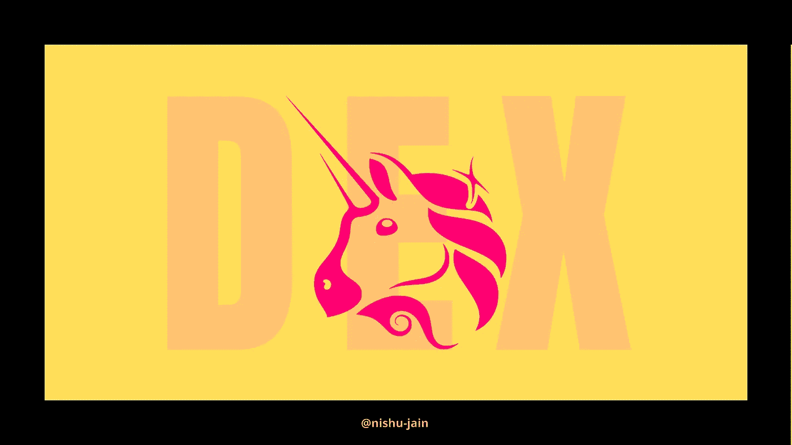

# 为什么去中心化的交流在哲学上和实践上都更好？

> 原文：<https://medium.com/geekculture/decentralized-exchanges-vs-centralized-exchanges-2ee636aa991e?source=collection_archive---------16----------------------->

## 区块链

## 集中式交易所(CEX)与分散式交易所(DEX)

Image by the author

> “一个没有中央银行和高额交易费的世界，你可以完全控制你的钱，没有国界…