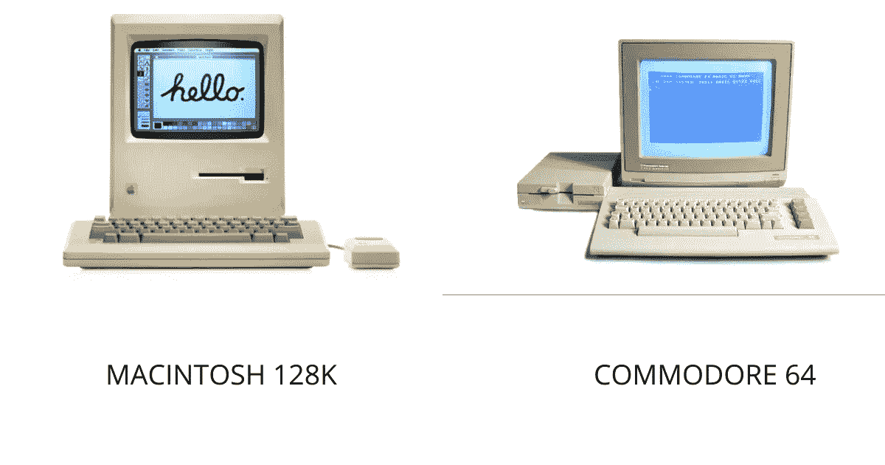
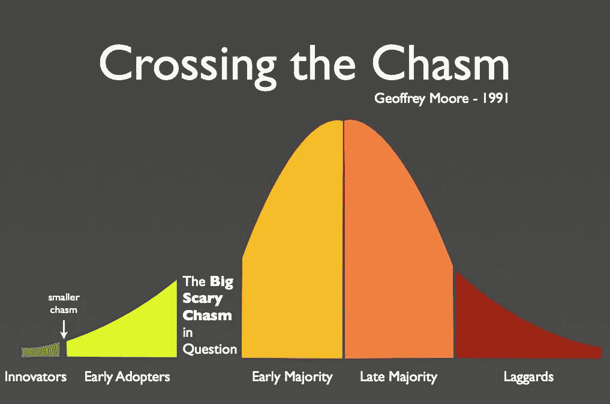
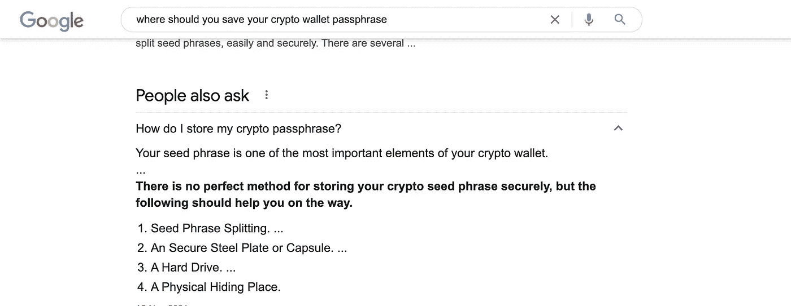
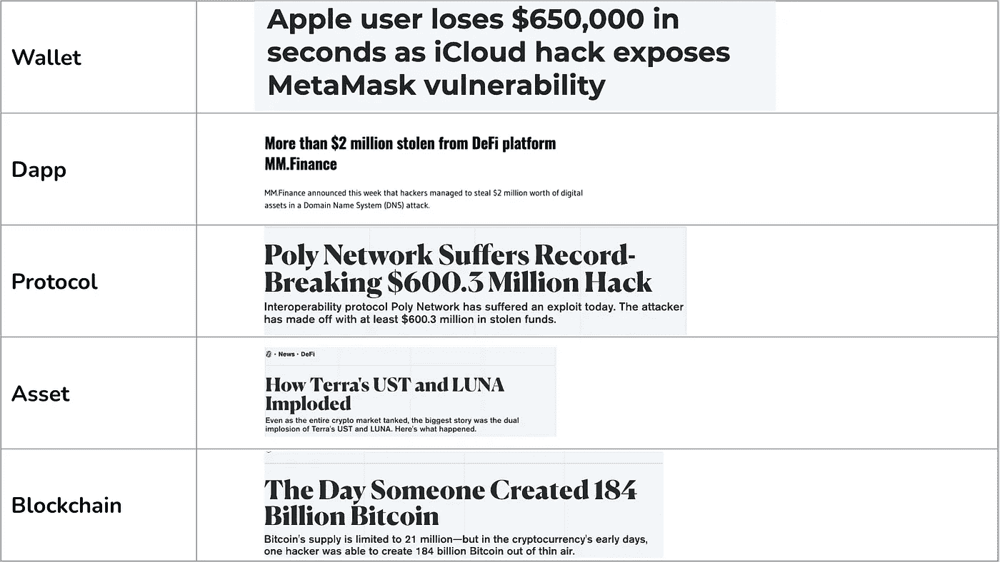

# 对我们其他人来说分散的金融

> 原文：<https://medium.com/geekculture/decentralized-finance-for-the-rest-of-us-c08b4852444d?source=collection_archive---------6----------------------->

## 关于如何让 DeFi 变得更容易获得的想法

# 计算机如何成为主流的一点历史

1984 年 1 月 24 日，是历史性的一天。之前是一个标志性的广告，展示了一个穿着运动服的无名跑步者奔向大屏幕，一个老大哥般的形象，并投掷了一把大锤。苹果麦金塔被介绍为我们其他人的电脑*。*

这是第一台面向大众的带有鼠标、显示器和图形用户界面的通用计算机。在那之前，使用计算机的大多是技术人员，他们知道如何使用终端命令。

Macintosh vs Commodore

麦金塔的推出标志着计算机从技术命令行界面向更直观的图形用户界面的范式转变。它开创了个人计算的新时代，一个更加容易接近和友好的时代。

# 鸿沟

大约有 430 万个独特的钱包。这与估计为 3 亿的加密用户总数相比相形见绌。

我们有远见卓识的超级用户和加密本地人参与 DeFi 生态系统。这是由围绕自我监管和分散化的理想主义联盟、更新和有趣的工具以及短期机会主义游戏的组合驱动的。然而，主流用户或实用主义者需要的不仅仅是从 Tradfi 和 CeFi 到 DeFi 的信仰飞跃。

# DeFi 的消费化

如今有三个问题困扰着 DeFi 成本、复杂性和风险。以太坊仍然是 DeFi 生态系统中的领先链。但是对于那些以 100 美元存款起步的人来说，仍然过于昂贵。L2 和 alt L1s 是存在的，但是它们仍然需要用户相当熟练地在多个平台、链、桥和令牌之间导航，以做任何有用的事情。2021 年黑客窃取了价值超过 100 亿美元的加密资产，这一事实并没有唤起后来者的信心。

## 让 DeFi 的入职变得经济实惠

在过去的 4 年里，出现了多个以太坊和侧链的 L2 扩展解决方案，如 [Polygon](https://polygon.technology/) 、 [Arbitrum](https://portal.arbitrum.one/) 和[乐观主义](https://www.optimism.io/)。这些链条上的 TVL 总额现已超过 70 亿美元，并且还在稳步增长。与此同时，挑战者/alt L1，如 [Solana](https://solana.com/) 、 [Avalanche](https://www.avax.network/) 和 [Fantom](https://fantom.foundation/) 也因更高的吞吐量和低成本的承诺而受到青睐。

虽然这些仍处于早期阶段，很难预测我们是走向一个由以太坊主导的世界，由 L2 或替代的可扩展但不太分散的 L1 增强，还是一个介于这两者之间的世界。但是很清楚的是，要想拥有早期的大多数用户，Web3 的开发者必须要有更经济的定义。这意味着下一波用户将直接到达 L2 连锁店和 Alt L1s。

## 降低复杂性

如今，用户必须应对多层次的复杂性。这从设置加密钱包的第一步开始。

**解决自保管**

经过几十年的适应，人们已经可以通过密码、密码管理器和电话或短信的 2FA 的组合来管理他们在社交媒体、银行、电子邮件等方面的在线账户。加密货币钱包代表了一种范式转变，其中客户端软件是链上发生的一切的门户。

但是，为了确保您能够访问您的链上帐户，您需要安全地保存一个 12 或 24 个单词的短语，用于生成私钥。

谷歌搜索如何保存你的钱包密码给出了上面分享的答案。上述选项都不是非超级用户可以使用的。

[Argent](https://argent.xyz) 提出了一个创新的解决方案，不需要密码，通过引入社会恢复的概念，你可以在你的钱包中添加监护人。监护人是电子邮件/短信/2fa 等第三方服务。或者其他有钱包的人可以帮你找回钱包，锁好钱包，或者过户。虽然这不是一个完美的解决方案，但以太坊的燃气费很高，它可以扩展到解决目前自我监管的差距，即恢复对你的资产的访问，并在不幸发生的情况下，将它们作为一种继承形式转移到你的家人。

**简化工作流程**

如今，登上 DeFi 需要浏览多个平台和链。从交易所获得本地令牌，将它们连接到 L2 链，并在 DeFi 协议上部署资金绝非易事。下一波用户将需要更简单、更集成的东西。钱包是区块链上发生的所有事情的门户，包括 DeFi。他们需要包括强大的进出体验，以及抽象出协议和链上事务的复杂性。

**手机优化**

略多于 50%的互联网流量来自移动设备。在过去的十年里，智能手机已经成为人们花费大部分时间的平台。对于整整一代互联网用户来说，智能手机要么是主要的计算设备，要么是伴随他们成长的设备。要让 DeFi 成为主流，在移动设备上提供无缝体验将是关键。

## 让 DeFi 变得安全

DeFi 是一种新兴现象，充满风险。2022 年 5 月蒸发了 400 亿美元的 Lunacrash 痛苦地提醒我们还有多早。实现 DeFi 的第一步是让用户了解在协议上部署加密资产时的不同潜在风险。Luna 崩溃和 Anchor 协议最终消亡的一个不幸现实是，许多人将其与他们的储蓄账户置于相同的风险等级。事实上，如果我们纯粹从技术角度来看，生态系统的每一层都存在风险。

如今，作为一名用户，你必须付出巨大的努力来让自己了解这些风险，然后在多个平台上查找相关的数据点。但是可能有更好的方法。DeFiSafety 等平台从过程的角度提供了全面的审查。Gauntlet Network 发布关于协议内市场风险的报告，独立的智能合同审计公司从技术和安全角度分享审计报告。考虑到钱包是 DeFi 的入口，它们可以在向用户呈现相关信息方面发挥关键作用。

除此之外，像 [Nexus Mutual](https://nexusmutual.io/) 和 [Solace Finance](https://solace.com/solutions/industries/financial-services/) provide 这样的协议已经开始提供产品来为协议黑客提供保护。虽然目前的覆盖成本很高，但随着规模和成熟，这些应该变得更容易获得，并确保用户可以在将资金转移到协议中的同时轻松获得覆盖。

# 未来

随着更大的经济衰退逼近，我们现在正处于一个隐秘的冬天的早期。接下来的几年将会很艰难。但如果我们退后一步，在上一个熊市周期中，TVL 的损失大约在几亿美元左右。相比之下，今天的数字是十亿。当情绪低落时，是时候为下一个周期到来的用户群建立一个更好、更安全、更容易使用的 DeFi 了。

*我是*[*Brew Money*](https://brew.money)*的联合创始人，我们的目标是让每个人都能使用 Defi。Brew Money 是一个非托管的多边形钱包，使非超级用户可以轻松地在 DeFi 协议上创建稳定的硬币存款，并获得高达 10%的 APY。*

## 参考

 [## DeFi 采用仍然远离主流:Chainalysis

### 相对于更广泛的加密协议，分散金融(DeFi)协议的主流采用仍处于早期阶段

www.coindesk.com](https://www.coindesk.com/business/2021/08/24/defi-adoption-is-still-far-from-mainstream-chainalysis/)  [## 为什么伟大的用户体验躲避 DeFi？

medium.com](/geekculture/why-great-user-experience-eludes-defi-fde11974d2c6)  [## 12 个最大的 DeFi 黑客和抢劫-解密

### 分散金融( )指的是区块链应用程序，它从金融产品和服务中剔除了中间商…

decrypt.co](https://decrypt.co/93874/biggest-defi-hacks-heists)