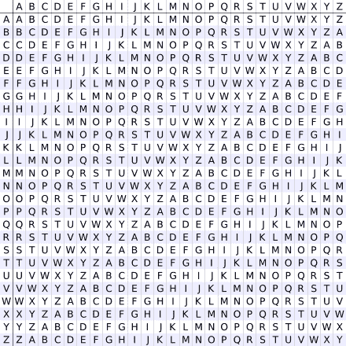
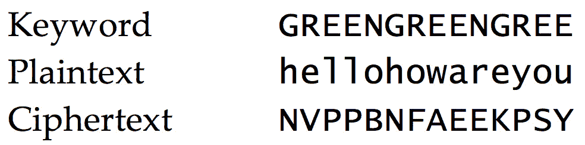

# 解密泰勒·斯威夫特和大钳蟹·帕蒂秘密公式:密码学基础

> 原文：<https://medium.com/geekculture/deciphering-taylor-swift-and-the-krabby-patty-secret-formula-the-basics-of-cryptography-e1fdb6b5b21b?source=collection_archive---------25----------------------->

## STEM 中的宝石:密码学快速入门

在我们开始之前，让我告诉你为什么我决定通过写这个专栏来帮助大众掌握密码学的基础知识是我的职责。我姐姐是一个主要的 Swiftie 和字面上每个星期，她声称泰勒斯威夫特将释放一些巨大的东西！(每周她都是错的。)显然，传奇的 T. Swift 因其优美的歌词、令人惊叹的音乐视频和普遍的社交媒体存在中隐藏的信息而臭名昭著，我毫不羞愧地承认，我最近陷入了她的阴谋网中。

Taylor Swift at the Brit Awards 2021

到目前为止，这些信息(至少我所知道的)还没有被过度加密，但最近它们变得相当棘手。所以，我们必须准备将来破译更复杂的线索！

就这样，我开始了学习一些关于加密的知识，或者说**密码学**的旅程。如果你还不明白，密码学是加密信息的科学，它无处不在*——包括你现在所在的网站(看到顶部的小锁和/或 https://？这意味着您的计算机目前正在使用公钥加密与网站安全地交换数据！有点可爱。*

*秘密存在的时间和人类一样长(哎呀)。自然，我们需要找到一种方法来保守这些秘密，否则坏事就会发生。为了弄清楚我们如何做到这一点，首先假设我们有两个人。现在，这是某种密码学的传统，这两个人被命名为爱丽丝和鲍勃，但我厌倦了他们的秘密，我希望他们过诚实的生活。因此，我们将偷听帕特里克和海绵宝宝的谈话，只是因为我认为那会很有趣，而且我显然从幼儿园起就没有成熟过(但老实说海绵宝宝是永远的)。*

*假设海绵宝宝想要将消息传递给 Patrick:“这是大钳蟹·派蒂的秘密配方: *<出于安全原因进行了编辑>* ”。显然，这个公式不能被泄露，如果有人(即浮游生物)截获这个消息，克莱伯先生*将*崩溃。幸运的是，海绵宝宝听说过一个名叫朱利叶斯·凯撒的罗马将军使用字母移位密码加密军事命令——现在被称为**凯撒密码**——并决定用它来加密他的信息。*

**

*Source: SpongeBob Squarepants*

*但首先，一些快速定义！我们想要传递的普通信息或消息被称为**明文**。为了简单起见，让我们把“这是大钳蟹·帕蒂的秘密公式”看作是海绵宝宝的明文。现在，我们想把这个，或者说**加密**成一种难以理解的形式，叫做**密文**。*

*那么凯撒密码是如何工作的呢？嗯，它被称为移位密码是有原因的——它所做的只是将每个字母在字母表中上下移动一个固定的数字。*

*下面是一个 3 点轮班的示例:*

**

*Shift of 3*

*如你所见，A -> D，B -> E，C -> F，…，X -> A，Y -> B，Z -> C，所以当你到达字母表的末尾时，它会循环。*

*让我们现在加密我们的信息！泰勒最喜欢的数字是 13，所以自然地，我们将应用 13 移位的密码。*

*然后，T -> G，H -> U，I -> V，S ->等等(细节就不赘述了)。因此，我们的明文:“这是大钳蟹·帕蒂的秘密公式”变成了密文:“Guvf VF gur Xenool Cnggl fr perg Sbezhyn。”(没错，我确实用了在线编码器，告我吧。)*

*瞧啊。公式加密！保密！任务完成！*

*…或者是吗？这里有一个明显的问题——浮游生物可以通过尝试 1-25 的每一种可能的移位来轻松破解代码(26 的移位将只是相同的消息)。即使他懒得去做，他的妻子 Karen 实际上是一台防水的超级计算机，可以替他做这件事，而且信息会在不到一秒钟内被解密。*

*好吧，海绵宝宝不怕挑战(证明见驾照那集)。所以，让我们变得更难！让我们把每个字母移动不同的量，而不是固定的移动。这种加密方法被称为 **Vigenère 密码**。注意，这种移位组合就是**密钥**，因为 Patrick(接收消息的明星)需要知道所述密钥才能解密密文。*

*这个键有几种表达方式。最常见的方式是通过书信，类似“民间传说”为了加密我们的消息，我们将明文的每个字母与密钥匹配，并取这个表中的交集，称为 **Vigenère square** 或 **tabula recta** 。*

**

*Vigenère square*

*和往常一样，这里有一个简单的例子来解释这个密码！*

**

*Example of Vigenère cipher*

*现在，让我们再次加密我们的消息:*

*明文:这是克莱伯派蒂的秘密公式*

*关键词:FOLK LO REF olk lor EFOLK LOREFO LKLOREF*

*密文:YVTC TG KLJ YCKMPP TFHEI DSTVJH QYCALPF*

*(如果你愿意，你可以仔细检查我的工作，作为一个有趣的练习！)*

*为什么维根涅尔密码比凯撒密码好？首先，猜测钥匙显然要困难得多！普兰克肯定无法用手破解密码。然而，不幸的是，凯伦可以在几秒钟内破解这个加密。此外，您还可以对密文进行模式分析，并根据最常见的字母(如字母 e)计算出密钥。*

*那么，今天，我们如何足够安全地加密敏感信息和消息(如大钳蟹·帕蒂公式)，使卡伦无法破解它们呢？我们使用一种叫做 **256 位加密**的东西，这是目前最安全的方法之一。为什么是 256 位？嗯，256 是用于加密文件或数据流的加密密钥的长度。之所以可行，是因为在合理的时间内，有太多的可能性需要计算，特别是 2 ⁵⁶.即使使用世界上最快的计算机，计算这些可能性实际上是不可能的。*

*更好的是，使用更长的密钥不会使加密过程变得更加困难，但它会成倍增加解密信息的难度，因为破解密码的猜测次数会飙升。*

*好吧，如果更长的密钥更安全，我们为什么不用 10，000 位的密钥呢？十万比特？100 万比特？？嗯，这是一个性能权衡。比特越长，意味着安全访问信息和网站的时间越长，会造成用户的缺乏。因此，加密方法必须平衡安全性和性能，以便实际使用密码学。*

*现在，这仅仅是密码学所掌握的所有秘密的一点皮毛。一般来说，有四种主要类型的加密:对称、非对称、散列和密钥交换。今天，我们已经讨论了对称加密和一点点非对称加密。最传统的形式是对称加密，即使用相同的密钥(双方事先约定)对消息进行加密和解密，如凯撒密码和维根涅密码。(在以后的专栏中，我们将讨论其他类型和更高级的加密方法的历史，如 Diffie-Hellman、RSA 等等！)*

*然而，在因特网上，任何两台计算机显然不可能私下“会面”并商定一个密钥来加密和解密消息。所以，相反，他们使用**非对称加密。**在这种类型的加密中，加密和解密有不同的密钥。有一个可以与任何人交换的公钥，它用于加密消息，任何人都可以用它来创建秘密消息。然后，有一个不共享的私钥，该秘密只能由有权访问相应私钥的计算机解密。*

*随着计算机变得越来越快，我们需要开始开发新的方法，使加密对像凯伦这样的计算机来说太难破解。但是希望泰勒不要参与进来，找到并破译她的信息已经够难的了。*

*所以，伙计们，这就是我写这篇专栏的公开动机！我希望我们都能运用这些基本方法，准确地理解斯威夫特小姐想告诉我们什么。与此同时，急切地等待下一张专辑流民俗和永远！我还暗自怀疑，目前崭露头角的奥利维亚·罗德里戈正在效仿泰勒·斯威夫特，并给她的粉丝留下秘密线索——还有人认为她的下一张专辑会叫《甜蜜》吗？似乎有点可疑…在这种情况下，我们必须保持警惕！*

*下次见！如果您对此感兴趣，请务必查看下一篇专栏文章！如果您有任何问题或意见，请发电子邮件至[apoorvapwrites@gmail.com](mailto:apoorvapwrites@gmail.com)给我。*

**要成为第一个听到我所有新文章、最近事件和最新项目的人，请务必订阅我的简讯:* [**信？我几乎不认识她！**](http://apoorvapanidapu.substack.com/)*

**这个* [*专栏*](https://apoorvapanidapu.medium.com/list/gems-in-stem-e5f24767d315) *，STEM 中的宝石，是一个了解各种 STEM 主题的地方，我发现这些主题令人兴奋，我希望也会让您兴奋！它总是会被写得相当容易理解，所以你不必担心没有背景知识。然而，它偶尔会在接近尾声时变得更高级。感谢阅读！**