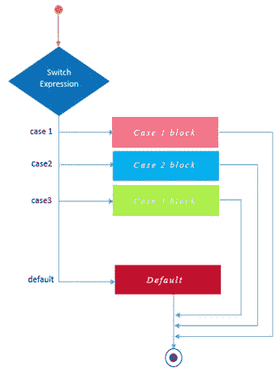

# 使用 Switch 语句进行决策

> 原文：<https://medium.com/geekculture/decision-making-with-switch-statement-9dcfc2a71dfb?source=collection_archive---------47----------------------->



我们 [谈到了用于决策的‘如果和否则’语句。](/geekculture/decision-making-in-programming-743e86895ce4)在需要检查更多条件的情况下，使用 switch 语句会更好、更方便，例如计算器上的操作。在计算器中，我们需要检查运算是加、减、乘还是除。

# 计算器程序

看一看计算器程序

输出

```
Enter first number: 5
Enter the operator: +
Enter second number: 6
5.00 + 6.00 = 11.00
```

[接受输入](/geekculture/how-to-interact-with-users-in-programming-d9eaebb565c1)后，我们做了一个 switch 语句。

```
switch(sign)
```

根据符号变量的值做什么的行写在 switch 语句的花括号之间。

```
case '+':
```

“case”关键字检查符号的值。如果值匹配，它将执行冒号后的语句。在这种情况下，如果值变成'+'，冒号后的代码将被执行，否则不会执行。

```
break;
```

“中断”关键字是什么？“break”关键字用于停止检查。当程序执行到‘break’时，跳出 switch 语句的花括号，跳到花括号后的下一行，打印结果。由于这是一个计算器程序，如果第一个条件匹配，就不需要检查第二个条件，如果第二个条件匹配，就不需要检查第三个条件等等。即使没有给出' break '语句，如果没有缺省条件，程序执行也不会有任何问题。如果默认条件存在，将执行其后的语句。如果没有使用“中断”,程序必须执行剩余的检查，而没有任何实际需要。只是多此一举。尽可能避免冗余是编程中的一个原则。

这就像告诉计算机，“嘿，伙计，如果你有一个条件为真，就不要检查其他的。它只是不必要的。

如果还需要检查其他条件，可以避免中断。

```
default:
```

“default”将始终执行其后的语句。因此，如果不使用“break ”,程序将最终到达“default”并执行其后的语句，而上述条件块中的语句将不会被执行。如果有' break '，当程序跳出检查，跳到 switch 语句的花括号后的下一行时，将不会执行' default '之后的语句。

*注意:由于在缺省之后没有更多的条件要检查，所以没有给出‘break’语句。*

而取自 [< stdlib.h >](https://medium.datadriveninvestor.com/codefactory-hello-world-f5ae4ed545d2) 的‘exit(0)’代码，只是告诉计算机在那里停止程序的执行。停止程序的原因是，如果操作符无效，我们不想显示结果。

```
%0.2f
```

想知道 0.2 在这里做什么？众所周知%f 是[浮点数](https://medium.datadriveninvestor.com/code-factory-variables-and-data-types-aa20cfccfe80)的[格式说明符](https://medium.datadriveninvestor.com/code-factory-variables-and-data-types-aa20cfccfe80)。“0.2”表示显示的数字应该只有两位小数。因此，如果该值为 2.01234，则只显示“2.01”。

您可能已经注意到了字符格式说明符中的空格。

```
scanf(" %c", &sign);
```

如果没有空间，程序将无法正确运行。这背后的原因将在后面的文章中解释。

因此，switch 语句是一个更方便的语句，而不是为检查“符号”值的每个条件编写单独的“if 和 else”语句。

[**先前= >编程中的决策**](/geekculture/decision-making-in-programming-743e86895ce4)

[**Next = >编程中重复逻辑**](/geekculture/repeating-logic-in-programming-4035ebf392d5)