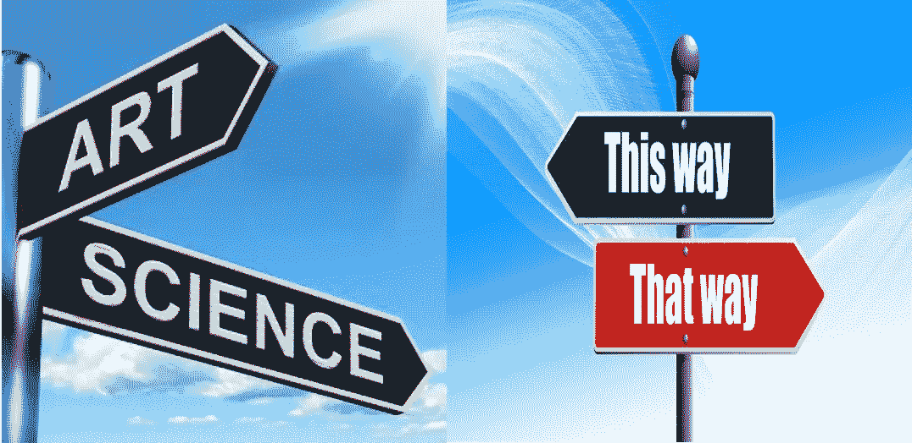
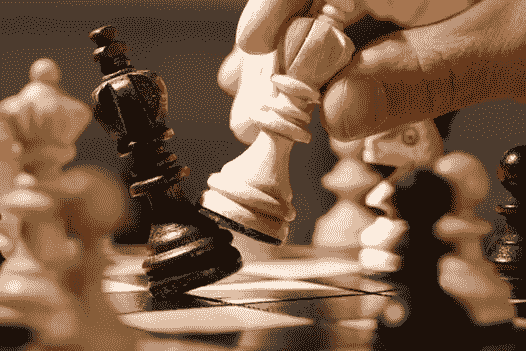

# 决策科学——是科学还是艺术？

> 原文：<https://medium.com/geekculture/decision-science-is-it-a-science-or-an-art-5cf459eafedb?source=collection_archive---------10----------------------->

Source — [https://elearncollege.com/decision-making/important-decision-making-process/](https://www.lanhamassoc.com/blog/is-sales-forecasting-an-art-or-a-science/)

了解决策科学很重要之前我回答“决策科学是科学还是艺术”。

什么是决策科学？

决策科学是复杂的定量技术在决策过程中的应用。其目的是将数据驱动的见解与经济学、机器学习、统计决策理论、运筹学、预测、行为决策理论和认知科学的元素相结合，以辅助决策。

因此，现在我们知道决策科学帮助我们做出各种决策——基于对数据的洞察的操作性、战术性和战略性决策。

在现实生活中，作为个人、主管、所有者、企业家等，我们无时无刻不在做决策。在我们周围存在着各种各样的决策，有许多已知的和未知的。这些决定分为以下几类:

个人决定，

组织决策，

常规决策，以及

基本决定。

上述“决策科学是一门科学还是一门艺术”的问题之所以出现，是因为在决策过程中，我们对未知事物进行推理，而任何未知现象都是通过两种方法预测的——

1.基于适当科学知识的客观应用

2.基于主观的方法。

很多时候，特定决策的选择与决策者的知识和解释有关。在许多情况下，人们认为有经验的人可以在没有科学工具和技术的帮助下做出正确的决定，在这种情况下，决策很大程度上是基于经验的直觉。

举个例子，

有经验的渔民可以通过简单地观察天空来预测天气状况，而不需要应用任何工具或技术

或者，

有时，非常有经验的医生，尤其是在过去，能够通过了解症状来诊断病人的问题。

和许多其他人。

他们的决定完全基于他们的经验。在这种情况下做出决策被称为一门艺术，因为决策是基于个人经验做出的，而不是应用科学工具或技术。

另一方面，决策过程有许多方面，特别是在行业、组织和商业中，都依赖于定量方法和科学分析。

Source — [https://www.iamagazine.com/viewpoints/are-you-playing-chess-or-checkers](https://www.iamagazine.com/viewpoints/are-you-playing-chess-or-checkers)

在这种情况下，决策者将问题分解成更小的部分，并努力发现模式。人们试图分析模式是否符合任何一组规则，或者是否可以根据一组标准进行评估。这些标准是基于对过去事件和经验的了解而制定的。没有具体的规则和术语可以让决策者在事件发生前预见到它们。当一个行业或企业的决策者使用标准和工具时，他们的任务变得更容易。

统计学家试图开发标准和测量工具来解决特定的问题。将科学工具和技术应用于手头的情况而不是完全基于个人的直觉或经验的决策被称为一门科学。

从上面的讨论中，我们可以推断出在工业或商业领域的决策并不总是完全主观的。有许多领域可以应用统计工具和技术，从而使决策变得容易得多。总的来说，我们可以说，就其本身而言，在决策过程中没有适用于所有情况的特定标准。因此，根据不同的情况和要解决的问题，决策可以被视为一门科学或一门艺术。