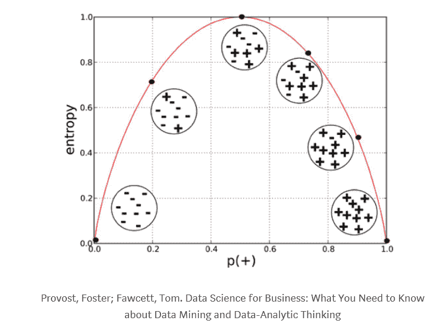
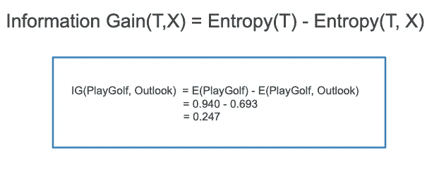
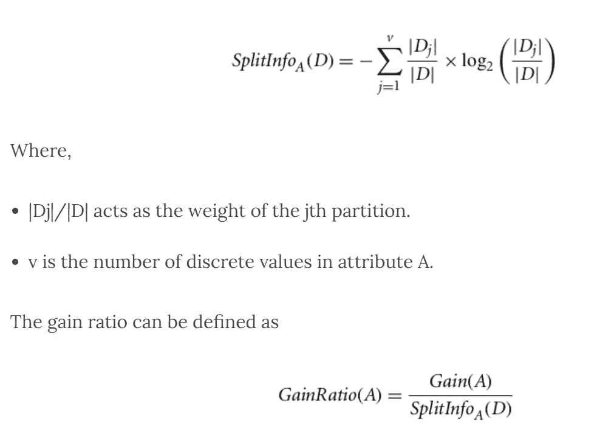
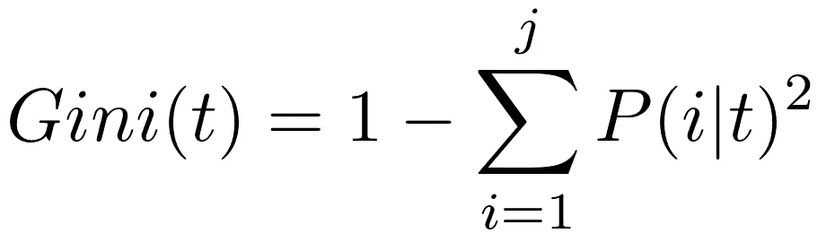
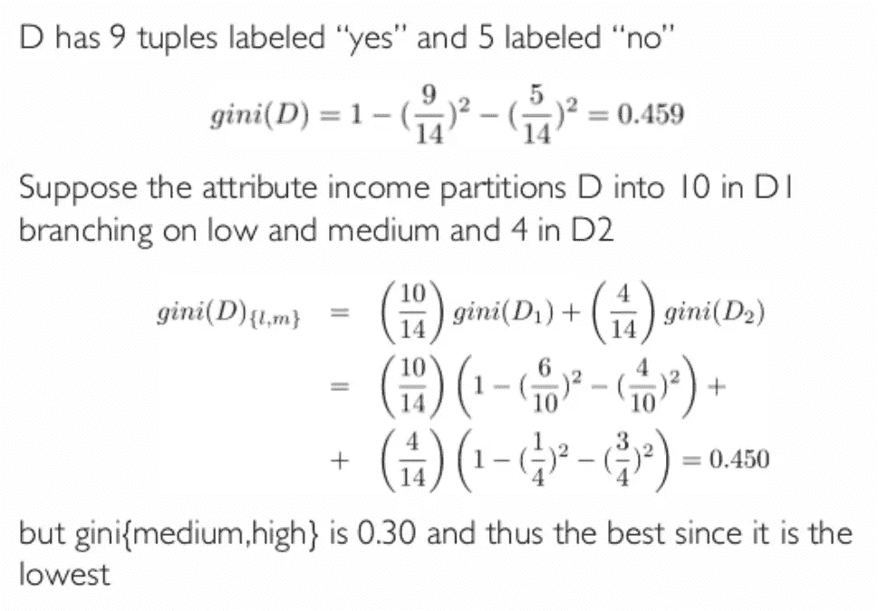
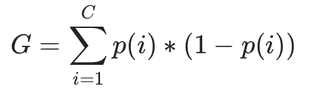
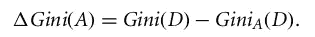
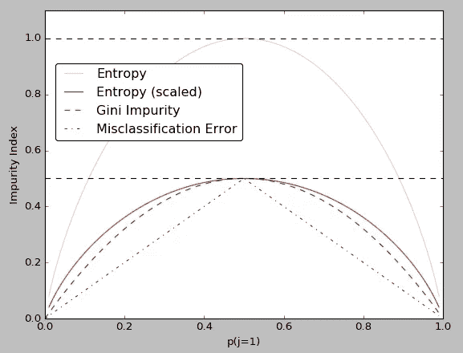

# 决策树——ML 中的构造

> 原文：<https://medium.com/geekculture/decision-tree-construction-in-ml-5ede70eb0596?source=collection_archive---------15----------------------->

在我们的日常生活中，从一天开始到一天结束，我们都要做出巨大的决定。我们在生活中不知不觉地使用了很多次决策树。我们在学校和大学都学习过决策树。这是怎么回事每个人都知道。一种树状结构，以根节点开始，以叶节点结束。在 ML 中还有许多其他基于决策树的算法。

如果你想了解解决问题的数据科学方法，在开始之前。[访问数据科学简介](/swlh/data-science-life-cycle-are-the-stages-for-solving-a-problem-37ab3eef1f2a)。接下来，进入主题

是什么让决策树成为如此重要和有用的算法？它之所以重要，是因为它做出决定的方式。让我们多研究一下。这是一个非常重要的决策模型，因此我们的模型可以对回归或分类数据做出正确的预测。

决策树是最强大和最流行的分类和预测工具。决策树是一种类似流程图的树结构，其中每个内部节点表示对属性的测试，每个分支表示测试的结果，每个叶节点(终端节点)持有一个类标签。

Decision tree and its terms

每家公司在推出任何产品、维护标准、更新或关闭产品之前，都会用到决策树。它有助于节省时间，收入和利润，而不会陷入重大损失，如盈亏平衡分析等。如果你想了解公司是如何使用它的。请在《哈佛商业评论》上阅读这篇文章。[点击这里阅读](https://hbr.org/1964/07/decision-trees-for-decision-making)。

它是如何做出准确预测的？劈叉是怎么做的，哪个在上面？内部的流程是怎样的？好的，让我们来看看它是如何像你一样或者像人类一样做的。是的，人们优先考虑事情，以便他们的决策变得清晰。当你有两个选择，比如你必须去参加一个会议或一个活动，或者呆在你现在的地方，你会选择哪一个？仅仅是基于利益和情况的重要性的重要和正确的事情。就是这样。同样的事情在这里，然后让我们挖掘并找到一些术语，并有一些关于 ML 的理解。

第一个节点(根节点)将数据分割成不同的决策点，如果满足条件，可以基于另一个特征进一步分割数据，或者做出所需的决策或解释。同样的情况发生在不同的决策节点上。末端节点可以被称为终端节点或父节点(决策节点)的叶节点。

有几个重要的指标来衡量节点拆分的发生。它们是:

1.  熵:用于度量数据集中的杂质和随机性。当从一堆相同颜色的球(假设是绿色)中选出一个球或者从一篮子珍珠中选出一颗珍珠时。从这些例子来看，即使你选了 n 次，也是同一个。所以熵为零。当所有不同颜色的球都存在时，得到那个球的概率完全从 1 下降到 0.9。如果有 20%的黄色，10%的白色，30%的蓝色球，40%的绿色。那么只得到绿球的概率是 0.4。随着差异和选择的增加，熵变得更高，意味着得到特定球的概率下降。数学上，香农熵是使用以下公式计算的:

Entropy-The impurity measure

在计算特定球或已知特定物体的熵之后，计算信息增益，以了解我们可以从该特定特征获得多少信息，从而正确预测目标变量。具有最高信息增益的特征成为进行分割的根节点，并被进一步分割，从而提高预测精度。它根据给定的属性值(所需要素的概率)计算数据集分割前的熵和分割后的平均熵之差。通过从数据中所有球或特征的总熵中减去特定球或特征的概率来计算信息增益。

Information gain with example

对于具有多个结果的属性，信息增益是有偏差的。这意味着它更喜欢具有大量不同值的属性。例如，考虑一个具有唯一标识符的属性，比如 customer_ID，由于纯分区，它的信息(D)为零。这最大化了信息增益并产生了无用的分割。

C4.5 是对 ID3 的改进，它使用了一种称为增益比的信息增益扩展。增益比通过使用分割信息标准化信息增益来处理偏差问题。

Gain ratio calculation

2.基尼系数:基尼系数是一个衡量标准，它是根据标签在子集中的分布随机标记的，衡量从集合中随机选择的元素被错误标记的频率。基尼指数也是一种帮助我们计算信息增益的标准。它测量节点的杂质，只计算二进制值。

Gini

Example for Gini

Gini impurity

在离散值属性的情况下，给出所选属性的最小基尼指数的子集被选为分裂属性。在连续值属性的情况下，策略是选择每对相邻值作为可能的分割点，并选择基尼系数较小的点作为分割点。

**基尼系数**是以百分比表示的**基尼系数**，并且**等于**基尼系数乘以 100。(**基尼系数**等于**相对平均差异的一半**。)基尼系数**通常用来衡量收入不平等。**

Range of gini and entropy

请注意，我们引入了熵(熵/2)的缩放版本，以强调**基尼指数**是**熵**和**分类误差**之间的中间度量

*   基尼系数要快得多，因为它的计算成本较低。
*   使用熵准则获得的结果稍好。

让我们看看 Python 中的一些决策树。

**1。迭代分裂器 3 (ID3)** :该算法用于通过计算信息增益来选择分裂。递归地计算树的每一层的信息增益。

**2。C4.5:** 该算法是 ID3 算法的修改版。它使用信息增益或增益比来选择最佳属性。它可以处理连续和缺失的属性值。

**3。CART(分类和回归树):**这个算法既能产生分类，也能产生回归树。在分类树中，目标变量是固定的。在回归树中，目标变量的值是要预测的。

*   用 Python 实现的决策树是通过 sklearn 库实现的，它使用 **CART** 。在 CART 中，我们有两种方法来获取预测信息。他们是基尼和熵。你必须去其他库实现其他决策树。你可以检查 chefboost 等。关于实现[https://github.com/serengil/chefboost](https://github.com/serengil/chefboost)的更多细节，你可以参考这个 GitHub

这种算法也有优点和缺点:

**优点:**

1.  它迫使算法考虑决策的所有可能结果，并追踪每条路径以得出结论。
2.  决策树很容易解释和可视化。
3.  它可以很容易地捕捉非线性模式。
4.  许多商业问题可以用决策树来解决。它们在工程、管理、医学等领域都有应用。基本上，任何有数据可用并且需要在不确定条件下做出决策的情况。
5.  它需要较少的数据处理，甚至不需要对变量进行标准化或规范化。决策树非常有弹性，能够很好地处理相当比例的数据异常(如异常值、缺失值和噪声),而不会改变结果。
6.  它可用于预测缺失值等特征工程，适用于变量选择。
7.  它可用于回归和分类任务。

**缺点:**

1.  决策树对超参数调整非常敏感。不幸的是，如果超参数调得不准确，决策树的输出可能会变化很大。
2.  决策树容易过度拟合。如果对于较简单的数据集，决策树的宽度和深度设置得很高，则决策树容易过度拟合。
3.  决策树也容易出现拟合不足的情况。如果模型的宽度和深度或者节点的数量设置得太低，决策树就会出现不适合的情况。这不允许模型适当地拟合数据，因此无法学习。
4.  决策树可能不稳定，因为数据的微小变化可能会导致生成完全不同的树。这个问题可以通过在集成中使用决策树来缓解。

要了解更多关于参数、实际使用和更多内容，请访问 sklearn 官方网站[访问该网站](https://scikit-learn.org/stable/modules/tree.html#regression)。

是的，决策树中有很多，但它被称为白盒模型，因为它很简单，可以很容易地计算和理解，其他复杂的模型。神经网络被称为黑盒模型，因为它们的复杂性和高水平的计算不容易计算和解释。

Photo by [30daysreplay Germany](https://unsplash.com/@30daysreplay?utm_source=medium&utm_medium=referral) on [Unsplash](https://unsplash.com?utm_source=medium&utm_medium=referral)

> **成功不是终点，失败也不是致命的，重要的是继续下去的勇气。**
> 
> 让你的生活成为一件杰作，想象你能成为什么，拥有什么，做什么都没有限制

如果你已经学到了一些关于决策树和决策的知识，并且确实喜欢它，那就表示出一些支持，并与一些有用的人分享。如果有任何问题或建议或任何其他东西放在评论框，我会尽最大努力回答问题。保持安全，给世界带来光明。🤍