# 决策树与随机森林结合项目讲解

> 原文：<https://medium.com/geekculture/decision-tree-random-forest-explained-with-project-c2c8ef1597ee?source=collection_archive---------5----------------------->

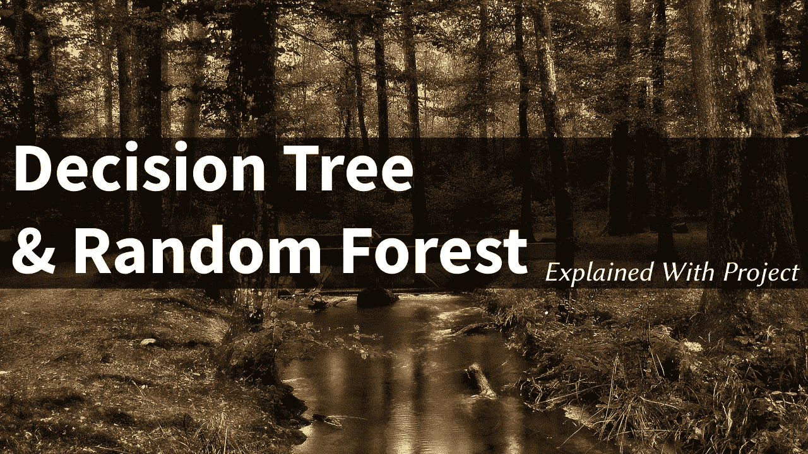

他的文章将用一个简单的项目向你解释决策树和随机森林！

让我们从一个简单的例子开始:假设你必须买一支新笔，现在你必须决定或必须在各种品牌中选择一支笔，你决定使用“**决策树算法**来帮助你，你说你想要一支笔，它可能会选择销量最大的笔，并会给你结果，你对你的决定感到满意。

而另一方面，你的朋友选择了“**随机森林算法**”，他在不同类型的钢笔(圆珠笔、中性笔或自来水笔)中做了几个选择，还有颜色选项(黑色、蓝色或任何其他颜色)，性价比最高，他考虑了各种参数后买了这支笔，现在最开心，而你仍在后悔自己的决定。

**什么是决策树？**

它可以被定义为一种受监督的机器学习算法，使用一系列连续的决策来达到特定的结果

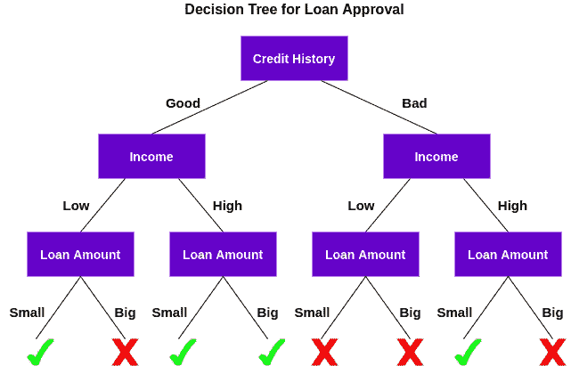

[Figure Source](https://cdn.analyticsvidhya.com/wp-content/uploads/2020/05/rfc_vs_dt11.png)

> **示例:**首先，检查我们的客户是否有良好的信用记录，并基于此将客户分为两组，再次检查客户的收入并再次分为两组。最后，它检查客户请求的贷款金额。根据这三个特征的结果，决策树决定是否批准客户的贷款。

**什么是随机森林？**

它也是一种有监督的机器学习算法，结合多个(随机创建的)决策树的输出来生成最终输出。也可以叫一堆决策树。

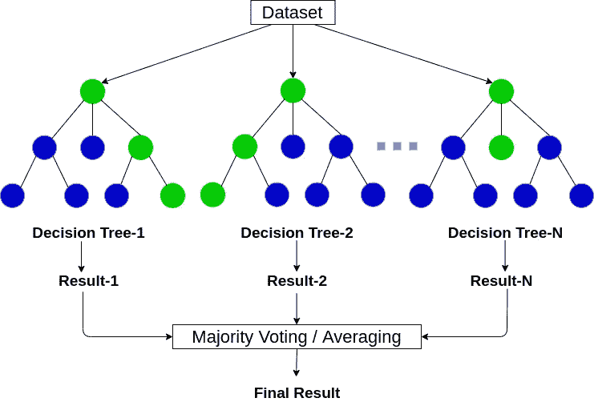

[Figure Source](https://cdn.analyticsvidhya.com/wp-content/uploads/2020/02/rfc_vs_dt1.png)

## 那么现在让我们继续我们的项目，它将帮助我们更清楚地理解决策树和随机森林算法！

## **导入库** |导入熊猫和绘图的常用库。

## 获取数据

用熊猫读取 [loan_data.csv](https://drive.google.com/file/d/157J3bT1torNBJaO9iwt_yKhdphPEZDTE/view?usp=sharing) 作为一个数据帧叫做 loans。

检查贷款的 info()、head()和 describe()方法。

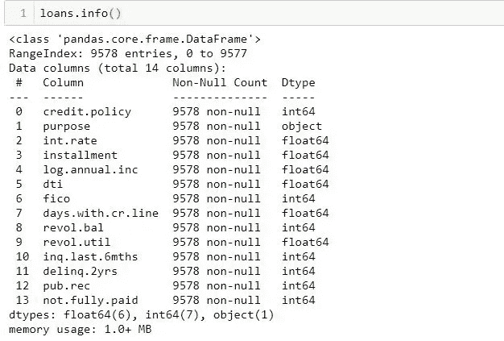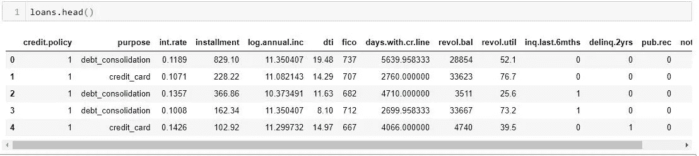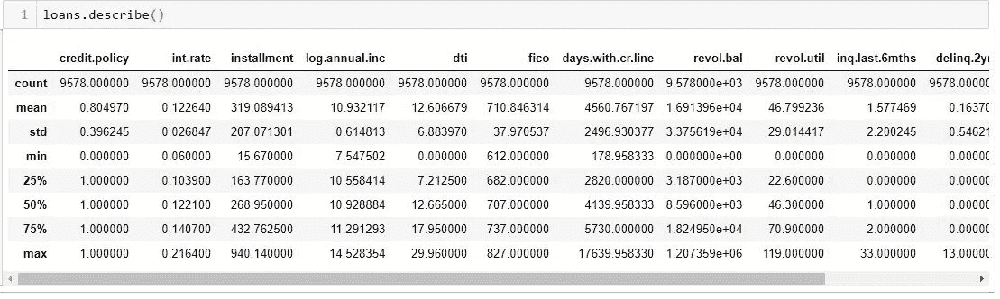

# 数据分析|我们来做一些数据可视化！

我们将使用 seaborn 和 pandas 内置的绘图功能，

创建两个 FICO 分布的直方图，每个分布对应一个"*信用。政策*结果。

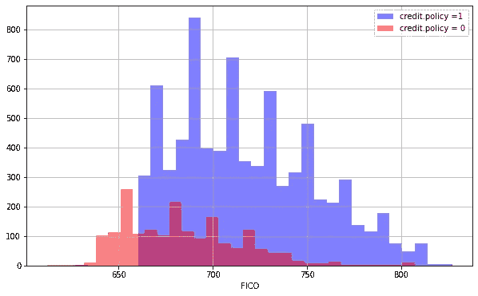

创建一个类似的数字，除了这次我们通过“*未付清”*列进行选择。

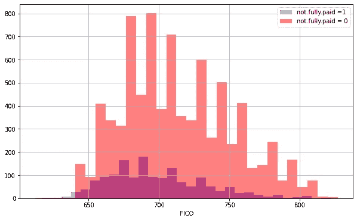

使用 seaborn 创建一个 countplot，显示按“目的”划分的贷款计数，颜色色调由“*not . fully . payed*”定义

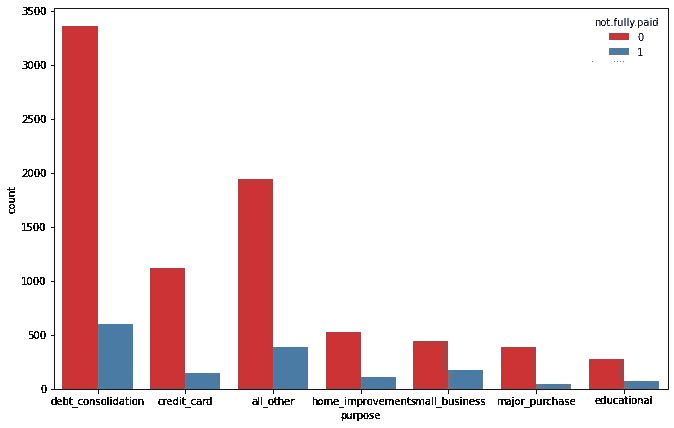

“FICO 评分”和“利率”之间的趋势。(使用 jointplot)

创建以下图表，查看未全额支付和"*信贷政策*"之间的趋势是否不同。

> 注意:如果你想了解更多，请查阅 lmplot() 的[文档。](https://seaborn.pydata.org/generated/seaborn.lmplot.html)

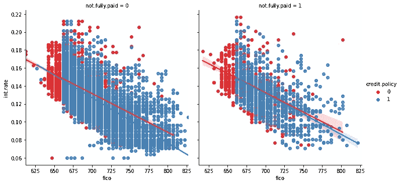

# 设置数据|分类特征

**再查 loans.info()。您将看到“*目的*”列显示为“分类”、**

这意味着我们必须使用虚拟变量来转换它，以便 sklearn 能够理解它们。

> 我们使用 [pd.get_dummies](https://pandas.pydata.org/docs/reference/api/pandas.get_dummies.html) 来一步到位

让我们使用一种方法来处理这些列，如果必要的话，这种方法可以扩展到多个分类特征

**创建一个包含字符串“purpose”的 1 元素列表。称这个列表为 cat_feats。**

**现在使用 pd.get_dummies(loans，columns=cat_feats，drop_first=True)创建一个固定的更大的数据框架，该数据框架包含带有虚拟变量的新特征列。**

> **将该数据帧设置为最终数据。**

# 列车测试分离

现在是时候将我们的数据分成训练集和测试集了！

我们将使用 sklearn 将您的数据分成训练集和测试集。

> 阅读此内容以更好地理解[列车测试分割方法](https://machinelearningmastery.com/train-test-split-for-evaluating-machine-learning-algorithms/#:~:text=The%20reason%20is%20that%20when,effectively%20evaluate%20the%20model%20performance.)

# 训练决策树模型

让我们先训练一个决策树:

**创建名为“ *dtree* ”的 DecisionTreeClassifier()实例，并使其适合训练数据。**

# 决策树的预测和评估

**根据*测试集*创建预测，并创建*分类报告*和*混淆矩阵。***

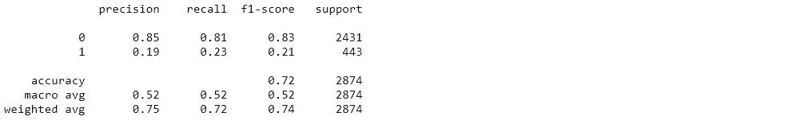

Classification Report

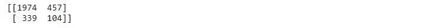

Confusion Matrix

# 训练随机森林模型

**创建 RandomForestClassifier 类的实例，并将其放入上一步的训练数据中。**

# 预测和评估

我们必须预测 y_test 值并评估我们的模型

> 预测“X_test”数据的“未完全支付”类别

**现在我们必须根据结果创建一个分类报告！**

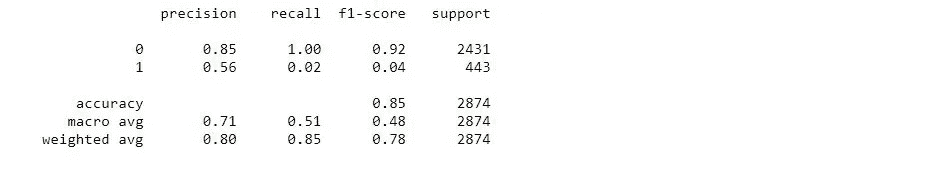

Classification Report

**显示预测的混淆矩阵。**

Confusion Matrix

> 随机森林和决策树哪个表现更好？
> 
> 这显然取决于我们试图优化哪个指标，
> 所以我们可以说这两个模型都做得不好，我们需要更多的[功能工程](https://en.wikipedia.org/wiki/Feature_engineering)

我们何时可以使用决策树:

1.  当我们希望我们的模型简单易懂时
2.  当我们想要一个非参数模型时

当我们可以使用随机森林时:

1.  当我们不太关心模型的解释，而是想要更好的准确性时。
2.  在意外的验证数据集上，随机森林总是在准确性方面胜出。