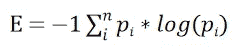
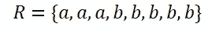
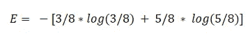
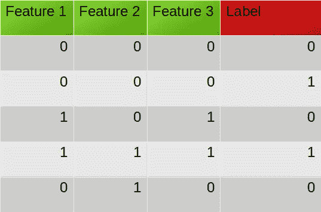
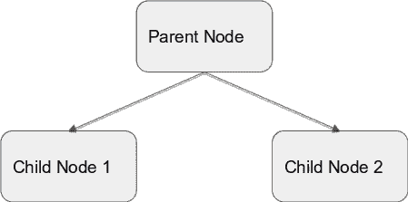
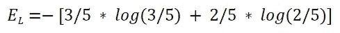
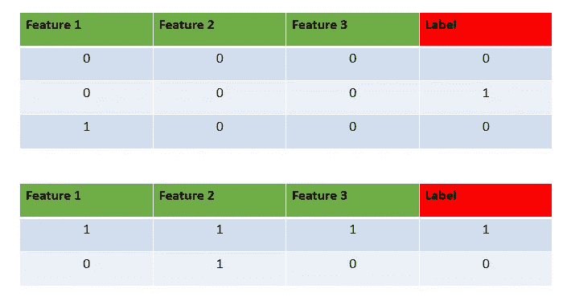
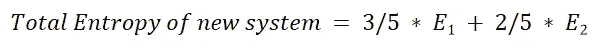
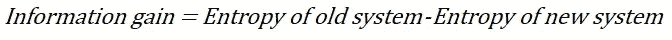
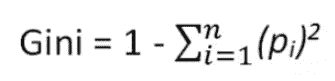

# 决策树

> 原文：<https://medium.com/geekculture/decision-trees-51d4195a58d2?source=collection_archive---------26----------------------->

**一棵树如何决定？**

***什么是决策树？***

决策树是一个类似流程图的结构，其中每个内部节点代表对一个属性的“测试”(例如，掷硬币是正面还是反面)，每个分支代表测试的结果，每个叶节点代表一个类别标签(在计算所有属性后做出的决定)。从根到叶的路径代表分类规则。”—维基百科

**熵**:是准确描述一个样本所需的信息量。其值介于 0(同质)和 1(异质)之间。

这里 p 是类别的概率。

**熵计算**:

R 集合的熵可以计算如下:

# **我们的数据集**:

上图是一个包含 3 个要素和一个标注的数据集示例。

目的是创建一个具有决策条件的树，将数据分类到不同的类别中。

在我们的数据集上应用熵的概念来计算数据集中的当前熵(使用标签)。

让我们根据**特性 2** 分割数据:

类似地，在其他特征的帮助下计算信息增益(IG ),并且我们选择具有最高 IG 的分割。一旦分割完成，算法再次尝试分割 E1 和 E2，依此类推。这确保了熵在树的末端最小。

**GINI 指数:**

作为熵的替代，GINI 指数也可以用来创建决策树。它被定义为

p 表示该类别的概率。

注意:-决策树算法也可以用作回归变量。当我们试图解决回归问题时，我们使用 MSE(均方误差)、MAE(平均绝对误差)、Poisson(泊松偏差)而不是熵。

决策树容易过度拟合。为了避免这种情况，早期停止或最大深度等参数。可以使用。

我希望这篇文章能帮助你理解决策树算法是如何工作的。

仅此而已。