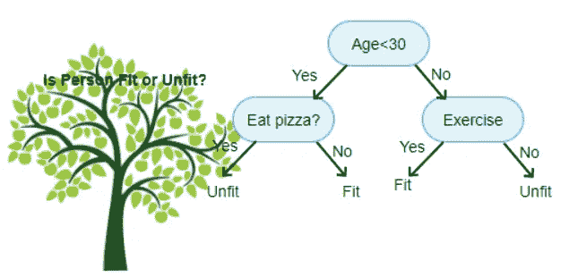
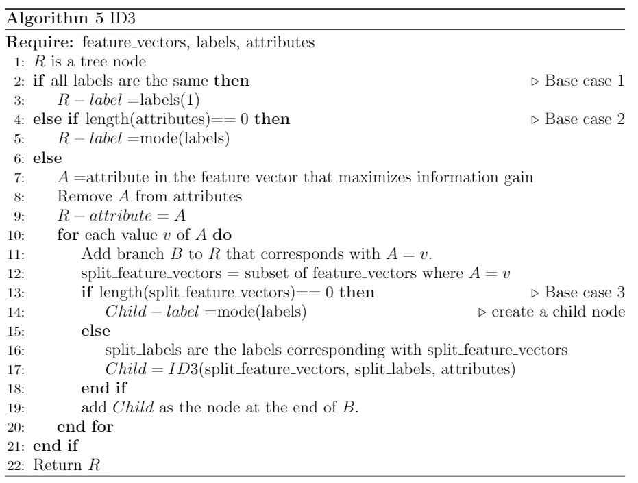

# 决策树

> 原文：<https://medium.com/geekculture/decision-trees-adb32c47c8ef?source=collection_archive---------10----------------------->

决策树的工作原理是基于包含最多信息的特征向量元素递归分割数据。基于信息论，我们可以定义一个简单的模型，它容易被人类和机器理解，甚至在它完成训练之后。

决策树是从训练数据构建的树结构，其中每个节点表示一个测试条件，分支是基于测试结果定义的，并且树的终端节点预测数据的标签。

使用信息论标准定义测试条件。因为信息论处理有序和分类数据，这允许决策树使用分类和有序数据。

# **例子**

考虑根据一个人的年龄、是否吃比萨饼以及是否锻炼来预测一个人是否健康的问题。在这个问题中，年龄可以是任何实数，如果他们吃比萨饼，如果他们锻炼是二元变量，对/错。

Image from google

我们可以使用上面的决策树作为做出这些预测的模型。为了说明树是如何工作的，考虑一个由变量 *A、P* 和 *E* 描述的人，对应于年龄、比萨饼消费量和锻炼量。从根节点开始，如果*是< 30* ，那么决策树沿着左分支到达下一个节点。新的测试询问 *P* =True。因为这是一个终端节点，所以这个测试的输出导致一个预测，而不是一个新的测试节点。如果*P*=真，那么模型预测此人不适合。否则，模型预测这个人是健康的。但是，回到根节点，如果 *A* 不小于 30，那么决策树沿着右分支。下一个节点询问*E*=真。同样，这是一个终端节点，它将进行预测。如果*E*=真，那么模型预测这个人是健康的。否则，模型预测这个人不适合。

在所有情况下，模型都使用 *A* 的值，但请注意，并非每个人都考虑了所有变量。如果 *A < 30* 则不考虑 *E* 的值。同样，如果 *A* 不小于 30，则不考虑 *P* 的值。决策树没有一个通用的规则来说明哪些变量总是相关的，哪些变量总是不相关的。这是如何构建决策树的结果，这将在下一节中讨论。

# **迭代二分法 3 (ID3)**

对于决策树，训练是基于训练数据构建树的过程。这需要递归计算树中每个节点的最优测试。这通过选择具有最大信息增益的特征来完成。

因为构建树是一个递归过程，所以考虑递归的基本情况是很重要的。这些基本案例构建了树的终端节点，因此它们预测数据的标签。这是三种基本情况:

1.  如果所有特征向量具有相同的标签，则该节点预测公共标签。
2.  如果没有剩余的属性来分割数据，则节点预测最常见的标签。
3.  如果该节点中没有特征向量，则该节点预测该节点的父节点看到的最常见标签。

ID3 算法执行上述过程，其伪代码如下。关于这个算法有趣的一点是，在算法开始时只检查了 2 个递归情况，而第 3 个基本情况实际上是在算法对其进行递归调用之前检查的。

ID3 是训练决策树最简单的算法。C4.5 和 C5 是 ID3 算法的扩展，也是常用算法。

# **修剪**

决策树容易过度拟合。决策树模型的复杂性是树的深度的函数，并且与所有模型相似，因为模型的复杂性增加了模型对训练数据的过度拟合。

为了防止这种情况，决策树被修剪以限制树的大小。修剪可以基于以下启发进行。

**最大深度**

为决策树设置最大深度可以防止它们无休止地增长。由于决策树的复杂性是树的深度的函数，这直接限制了模型的复杂性。然而，这种方法可能是有害的，因为它不允许模型足够复杂。虽然设置最大深度可以防止过度拟合，但是它也可以防止模型学习数据的所有重要方面。

**最小样本量**

可以修剪决策树，使得每个节点都基于训练数据中的至少$n$个样本。通过防止决策树中的节点表示训练数据的小子集(样本少于$n$的子集)，该模型应该只捕获在训练数据之外概括的数据方面。

**显著性检验**

当信息标准没有达到阈值时，重要性修剪防止决策树中的节点增长。决策树中的每个节点代表一个测试。回到这个例子，第一个节点的测试是这个人是否在 30 岁以下。这些测试使用信息论标准来形式化。ID3 使用信息增益，但也可以使用基尼指数和其他指标。当在给定节点上对要素进行分割所获得的最大信息很小时，模型不会从在该节点上构建子树中获得更多信息，因此将该节点设置为终端是有意义的。