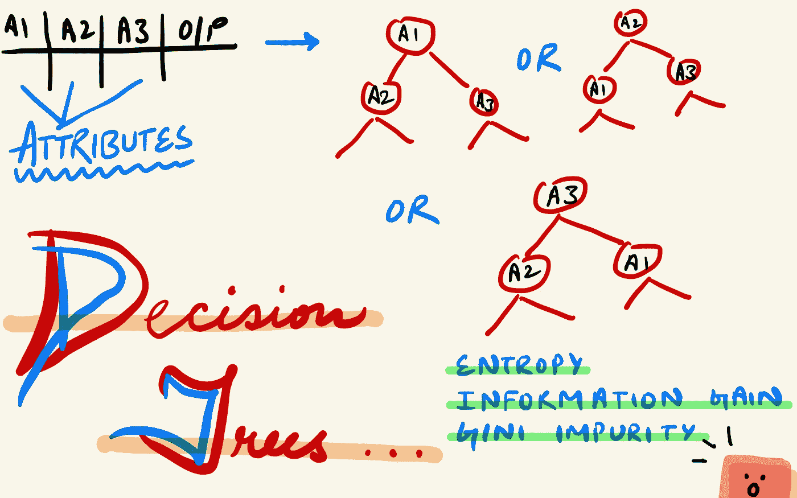
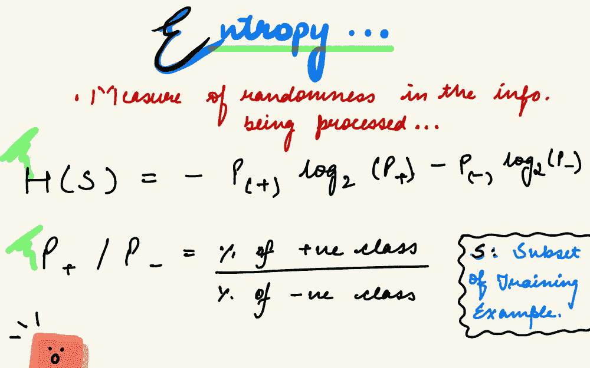
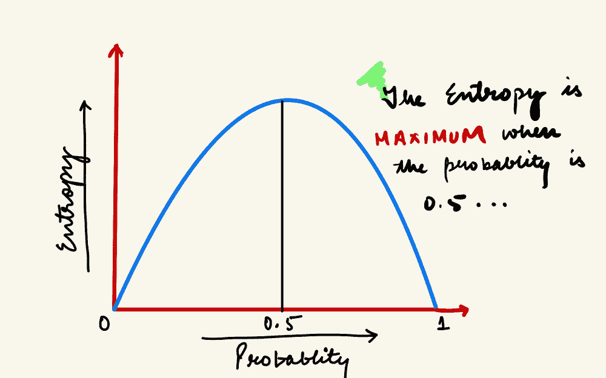
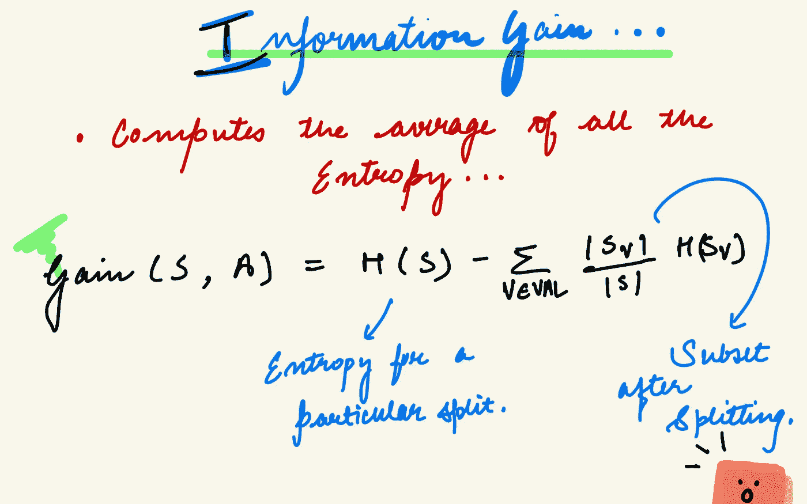

# 决策树|分类直觉

> 原文：<https://medium.com/geekculture/decision-trees-classification-intuition-a593c4eab160?source=collection_archive---------44----------------------->

Decision Tree Algorithm

今天让我们了解更多关于监督学习算法的知识。首先，我们有线性回归，它是关于预测一个连续的数字变量，逻辑回归可以帮助我们在两个或更多的分类变量之间进行分类。然后，我们今天将学习决策树，它具有执行两种类型任务的能力。

**决策树**是一个树状模型，用于制定决策及其可能的结果。它是一种监督学习算法，用于回归和分类任务，并且易于实现。这个模型/算法帮助你做决定。

决策树通常从单个节点开始，分支成可能的结果。这些结果中的每一个都会导致额外的节点，这些节点又分支成其他的可能性。它给我们一个树状的形状。决策树是一个类似流程图的**结构**，其中:

*   内部节点(非叶节点)表示对属性的测试。
*   分支代表测试的结果。
*   叶节点保存一个类标签。

# 术语

*   **根节点:**该节点是树中最高的节点，没有父节点。
*   **拆分:**将一个节点分成两个或更多子节点的过程称为拆分。
*   **父节点和子节点:**被分成子节点的节点被称为子节点的父节点，而子节点是父节点的子节点。
*   **分支/子树:**整个树的一个子部分称为分支或子树。
*   **决策节点:**将一个子节点拆分成更多的子节点称为决策节点。
*   **终端节点:**不分裂的节点称为叶/终端/末端节点。

# 直觉

决策树在构造树时遵循不同类型的算法。在这篇博客中，我们将讨论 ID3 算法。我们的目标是快速到达终端节点。该算法断言，我们应该在第一步中选择合适的属性来分割决策树。现在，为了选择第一个合适的属性来分割决策树，熵就出现了。**熵(H)** 帮助我们测量分裂的纯度。为了快速到达叶节点，我们必须选择合适的参数。分裂继续下去，直到我们得到一个纯粹的子集(要么纯粹是，要么纯粹不是)。更深意味着更多的时间消耗。熵的值介于 0 和 1 之间。熵越高，就越难从这些信息中得出任何结论。熵为零的分支是叶节点，熵大于零的分支需要进一步分裂。

Entropy

Information Gain

我们如何确定熵在减少或很低？下面来说说**信息增益(IG)** 的话题。它是一种统计属性，用于衡量给定属性根据目标分类将训练示例分开的程度。它计算所有熵的平均值，并且是熵的减少。当分裂决策树时，它将采用具有较高信息增益的特定分裂。

所以算法如下:

1.  它以原始集合 S 作为根节点开始，即以完整的训练数据集作为其根节点。
2.  该算法的每次迭代遍历集合 S 的非常未使用的属性，并计算**该属性的熵(H)** 和**信息增益(IG)** 。
3.  然后它选择具有最小熵和最大信息增益的属性。
4.  然后，选定的属性对集合进行分割，以产生数据的子集。
5.  该算法继续在每个子集上重复，直到它到达叶节点。

# 假设

*   一开始，整个训练集被认为是**根。**
*   特征值最好是分类的。如果这些值是连续的，则在构建模型之前会将其离散化。
*   记录是基于属性值递归分布的。
*   使用统计方法完成将属性放置为树的根或内部节点的顺序。

# 优势

*   易于理解和实施。
*   需要更少的数据清理。
*   它可以处理回归和分类问题。

# 不足之处

*   过度拟合:我们正在训练我们的模型，以获得良好的训练数据准确性，但每当新的测试数据出现时，它都不会表现得很好。

这篇博客谈到了决策树中熵和信息增益背后的直觉。在接下来的博客中，我们将了解比熵更好的基尼系数、决策树剪枝、回归方法以及脏数据对决策树的影响。