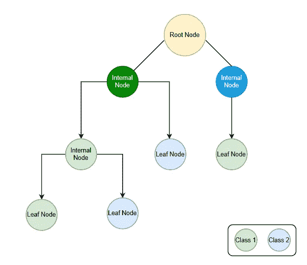
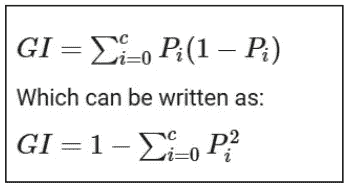
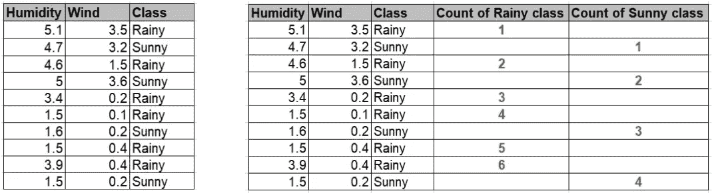
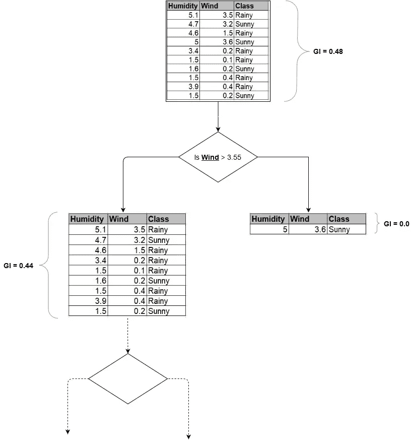
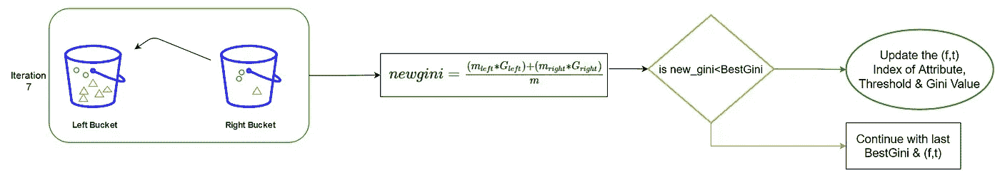
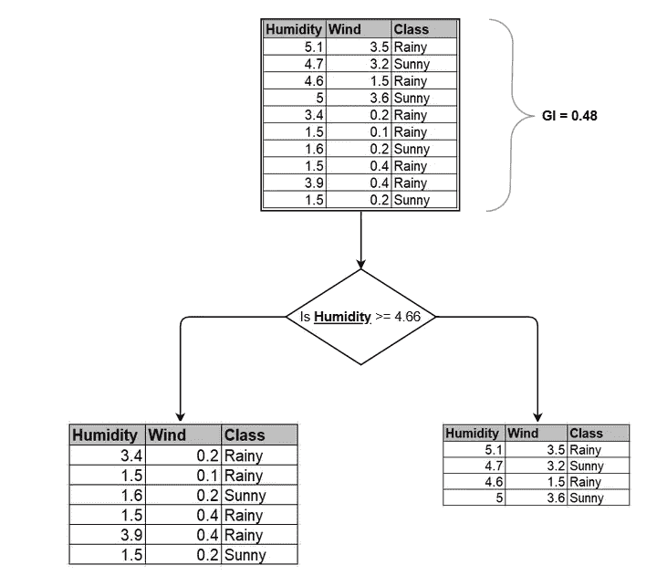
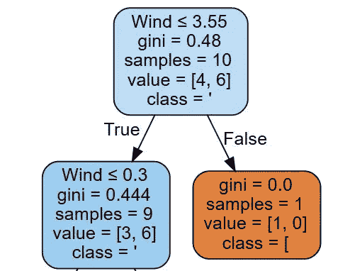

# 带 CART 算法的决策树

> 原文：<https://medium.com/geekculture/decision-trees-with-cart-algorithm-7e179acee8ff?source=collection_archive---------0----------------------->

决策树是最基本的机器学习算法之一，具有广泛的用例，易于解释和实现。我们可以在回归和分类任务中使用决策树。在本文中，我们将尝试理解决策树算法的基础。然后，如何使用 CART 算法从训练数据集中生成决策树。

## 关于[决策树](https://en.wikipedia.org/wiki/Decision_tree#Overview)T2:

决策树是一种[非参数](https://www.geeksforgeeks.org/difference-between-parametric-and-non-parametric-methods/)监督学习技术，它是一个由多个决策规则组成的树，所有这些规则都将从数据特征中导出。这是最容易理解的可解释的机器学习算法之一。这种 ML 算法是随机森林最基本的组成部分，也是最流行的&强大的 ML 算法。

1.  **决策树的结构**:

*   在下图中，我试着展示了决策树的样子。每个内部节点代表一个段或区域。关于树的类比，片段或区域是树的节点或叶子。

Image 1 : Decision tree structure

*   **根节点**:这是我们训练数据集的第一个节点。
*   **内部节点**:这是子组被分割成新的子组或叶节点的点。我们也可以称之为决策节点，因为这是基于子组的最佳属性进一步分裂的节点。
*   **叶节点**:任意内部节点的最后一个节点，保存决策。

**2。关于决策树中的节点？**

*   如前所述，决策树是一种具有嵌套节点的树状结构，根据属性的阈值将一个节点拆分为另一个节点，我们将很快对此进行详细讨论。
*   决策树算法将训练集(根节点)分成子组- **内部节点** &任何具有最终子组的内部节点都将是**叶节点。**我们可以称之为[递归分割](https://en.wikipedia.org/wiki/Recursive_partitioning)。

> 现在我们将更深入地理解“节点的分割是如何基于属性的阈值发生的？”

基于纯度将节点(根节点)分裂成子节点，决策树算法在为子节点找到最佳同质性的地方分裂节点。如果一个子节点拥有它的所有类成员，那么[同质性](https://discuss.analyticsvidhya.com/t/decision-tree-gini-impurity-purity/37650/3)将会更高。如果你的子节点具有 5/5 的类成员分布，那么当它是 8/2 或 9/1 时，同质性将是最低和最高的。

分割一个节点的决策树算法需要最佳的**属性&阈值**。最佳属性&阈值对( **f，t** )的选择基于以下算法进行，这些算法将为您提供最纯净的节点。以下算法有助于找到最佳属性的测量值:

*   CART 算法:[基尼指数](https://en.wikipedia.org/wiki/Decision_tree_learning#Gini_impurity)
*   ID3 算法:信息增益
*   C4.5 算法:增益比率

在这篇文章中，我将使用 CART 算法来创建决策树。

**购物车算法:**

该算法可用于分类和回归。CART 算法使用基尼指数标准将一个节点拆分为一个子节点。它从作为根节点的训练集开始，在成功地将根节点一分为二之后，它使用相同的逻辑来分裂子集&再次递归地分裂子子集，直到它发现进一步的分裂不会给出任何纯子节点或生长树中的最大数量的叶子，或者称之为树修剪。

**如何计算基尼指数？**

Image 2: Formula of Gini Index

在基尼系数中，P 是阶级**I**存在总 **c** 阶级的概率。

考虑到你只有两个预测因子/属性:湿度和风

班级:雨天和晴天

Image 3: Data & it’s distribution by class

GI = 1 —((来自特征 1 的观察值数量/总观察值)+(来自特征 2 的观察值数量/总观察值) )

GI = 1-((6/10)+(4/10))= > 1-(0.36+0.16)= > 1–0.52 = > 0.48

因此，第一组/初始组的基尼指数为 0.48

**关于节点分割如何发生的基本想法:**

Image 4: Node splitting on Gini Index

基于属性“风”(f)和阈值“3.55”(t)，CART 算法创建了节点/子集，这些节点/子集将给出上述流右侧的纯子集(参考:图 4)。

> 让我们理解我们如何选择最佳对( **f，t** )来分割根节点:

## 步骤 1:从初始集合中找到最佳基尼指数/分数

我写了一小段代码来更好地理解它:

现在，在加载数据之后，我们将找到初始集合或根节点的基尼系数，这将是 best_gini 系数:

Utility function to calculate gini score

从上面的代码中，我们得到了要执行的下一组指令的输入:

*   行号 2:特征数= 2
*   行号 9:最佳属性(最佳属性)和阈值(最佳阈值)的占位符
*   行号 11:初始设置的 best_gini 得分= 0.48(参考图 4)

**步骤 2:从初始/训练集中找到最佳分割**

现在我将解释最重要的部分，我们将如何从初始集合中搜索最佳属性(f)和阈值(t)？

*   行号 1:8 -该算法将循环“属性”的次数，即 2 次&创建两个左右桶。左边一个没有分配任何值，而右边一个将所有排序的行值命名为阈值
*   行号 14:26 -两个初始化的桶(左和右)将进入下一个循环，该循环将迭代行数次-10，在每次迭代中，算法将从右到左分配每个类观察值，并每次计算基尼加权平均值 new_gini
*   行号 35:38 -如果 new_gini 低于 best_gini，那么接下来我们将找到最佳属性& threshold (f，t)

代码流:算法选取每个属性，对其值列表(我们称之为阈值列表)进行排序，将每个观察值顺序移动到左侧存储桶，计算 new_gini ( **Gini 加权平均值**)并将其与初始 Best_Gini 进行比较，如果 new_gini 得分较小，则将其作为最佳属性(f) &阈值(t) &再次对所有属性重复该过程。然后使用最佳属性(f) &阈值(t)将节点分裂为子节点/子集。

> 下面的图片试图总结流程，这里绿色圆圈代表班级成员:晴天，红色三角形代表班级成员:雨天。

Image 6: Flow to calculate new_gini

**最佳分割方式示例**

为了更好地解释最佳分割是如何发生的，考虑第 7 次迭代中的属性“湿度”,其分布如下:

Image 7: Flow for 7th iteration for “Humidity” attribute

分配步骤后的等式是 CART 成本函数或**基尼加权平均值**，它将给出新的基尼系数(new_gini):

Image 5: Gini weighted average

new_gini 分数将基于左右桶的等级分布:

*   左侧桶:2 晴天和 5 雨天

G_left = 1 —((晴天观测数/总观测数)+(雨天观测数/总观测数) )

G_left = 1-((2/7) +(5/7) )) => 0.40

*   右侧铲斗:2 晴天和 1 雨天:

G_right = 1 —((晴天的观测数/总观测数)+(雨天的观测数/总观测数) )

G_right = 1- ((2/3) +(1/3) )) => 0.44

左= 7，右= 3

new _ Gini =(7 * 0.40)+(3 * 0.44)/10 = > 0.41

其小于 best_gini (0.48)，因此，我们将其视为最佳阈值&属性:

阈值列表= [1.5，1.5，1.5，1.6，3.4，3.9，4.6，4.7，5.0，5.1]

如果我们记得我们在第 7 次迭代中，best_threshold 值将是= (4.7+4.6)/2=>4.66

目前，最佳特征和阈值(f，t)为(0，4.66)，如果这是最小的基尼系数，则算法将根据属性“湿度”和阈值“4.66”来分割初始节点，如下图所示:

Image 8: Node splitting assumption

但它**不是最佳对** (f，t)。对于所有可用的属性，上述过程将继续&将继续搜索新的最低基尼系数，如果它发现它将保持其属性的阈值&，稍后它将基于最佳属性阈值&来分割节点。根据我们的数据集，“风”属性的最佳基尼系数为“0.40”(**f**)&，“3.55”为最佳阈值(t)。由 DecisionTreeClassifier 使用 scikit-learn 生成的以下树显示了基于相同阈值&属性发生的节点拆分:

Image 9: Tree Generated by DecisionTreeClassifier

让我们回顾一下:

*   我们学习了什么是决策树
*   创建新节点/子集的不同标准度量
*   基尼指数
*   如何计算基尼指数
*   如何基于属性( **f** ) &阈值( **t** )创建节点的示例
*   我们如何搜索最佳属性，阈值对( **f，t** )
*   (f，t)对值如何帮助创建纯节点
*   决策树的工作代码

谢谢&阅读愉快…

参考资料:

1.  图 2 - [统计学习介绍及在 R 中的应用](https://www.springer.com/in/book/9781461471370)
2.  图 5- [用 Scikit-Learn 进行动手机器学习& Tensorflow](https://www.oreilly.com/library/view/hands-on-machine-learning/9781491962282/)
3.  一些[代码引用](https://gist.github.com/joachimvalente/9c221f1937a0e5b1726701467abbbbba#file-cart-py)