# 反编译 Nvidia 着色器，并优化

> 原文：<https://medium.com/geekculture/decompiling-nvidia-shaders-and-optimizing-5aeaeb65f828?source=collection_archive---------2----------------------->

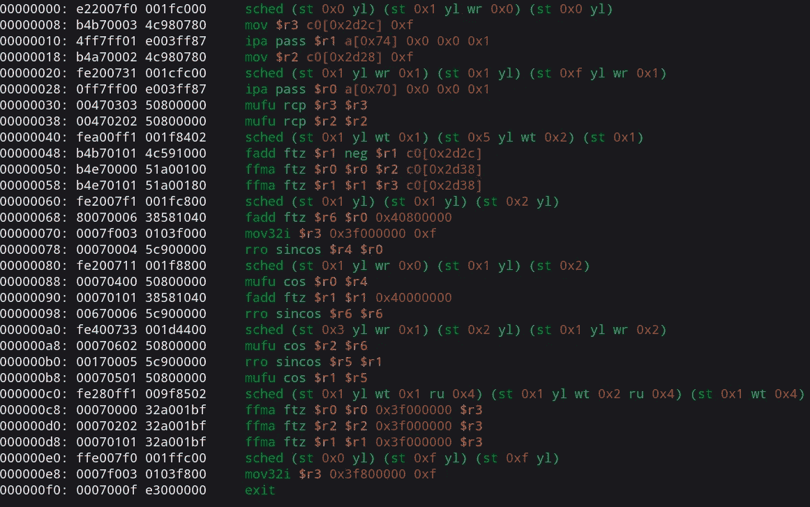

Nvidia instructions for Shadertoy New shader, envydis output

关于反编译 Nvidia OpenGL 和 Vulkan 片段着色器。

**主要工具**使其工作-[nvcachetools](https://github.com/therontarigo/nvcachetools)塞隆 [**塔里戈**](https://github.com/therontarigo) 。

**这是我的 Linux 教程/笔记**，但它在 Windows 上的工作方式非常相似，查看 [nvcachetools github 页面](https://github.com/therontarigo/nvcachetools)以了解更多关于在其他操作系统上使用它的信息。

看 ***例子-用法*** 和 ***着色器-优化*** 最后。

> [**nvcachetools**](https://github.com/therontarigo/nvcachetools)*—它从指定的缓存 toc 文件中提取着色器，通常在* `*$HOME/.nv/GLCache/*` *Nvidia 驱动程序将着色器放在这里，不管是 Vulkan 还是 OpenGL API。
> 着色器可以用*[**nvdisasm**](https://docs.nvidia.com/cuda/cuda-binary-utilities/index.html#nvdisasm)*(-二进制选项)反编译，或者用这个开源反汇编器*[**envytools**](https://envytools.readthedocs.io/en/latest/envydis/index.html)*如果你有 Maxwell 或者它支持的一个比较老的 GPU 的话。*

详细说明和示例使用案例如下。

# 工具

1.  构建[**nvcachetools**](https://github.com/therontarigo/nvcachetools)**。**
2.  构建 [**环境工具**](https://github.com/envytools/envytools/) **。** 非开源**替代**，Nvidia 做的专有软件——安装 CUDA ***或*** 下载 [cuda-nvdisasm](https://developer.download.nvidia.com/compute/cuda/repos/rhel9/x86_64/cuda-nvdisasm-11-7-11.7.91-1.x86_64.rpm) 并解压 nvdisasm 文件。

# 简短指令

1.  `./nvcachedec nv_bin/*.toc objs`
2.  `./nvucdump objs/object00000.nvuc sections`
    **或** `object00001.nvuc`或其他数字
    请看 ***高级用法—文件名*** 下面。
3.  `./envydis -i -mgm107 sections/section4_0001.bin`
    **或** `/usr/local/cuda-11.8/bin/nvdisasm --binary SM87 objs/object00000.nvuc`

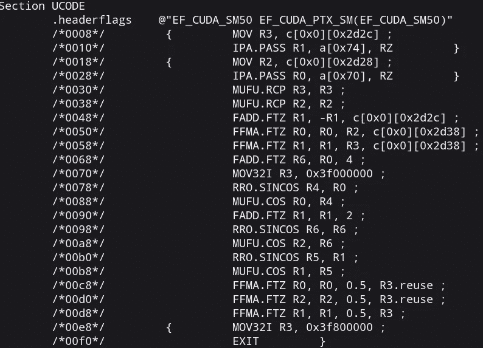

nvdisasm output for Shadertoy New shader

# 指令

## 从着色器缓存中获取已编译的着色器。

**着色器缓存的默认位置:** `~/.nv/GLCache`

**例如——删除“默认着色器缓存”中的所有内容，并运行您的 OpenGL 或 Vulkan 应用程序。**
如果出现一个新文件夹——这是你编译的着色器。

*谷歌 Chrome 之类的应用使用自定义位置的缓存并加密，所以无法使用。使用最小的发射器。
我只有 Vulkan launcher—[**Vulkan-shader toy-launcher**](https://github.com/danilw/vulkan-shadertoy-launcher)。(对于 OpenGL，你必须寻找最小的东西)*

**您需要的文件**是与同名的`*.bin`和`*.toc`文件。
每个唯一的文件名都是这个应用程序的着色器。

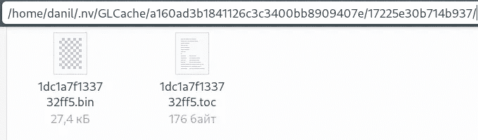

Example of single application compiled shaders, after launching this app.

将`*.bin`和`*.toc`文件复制到位于`nvcachedec`文件的新文件夹`nv_bin`文件夹中，这样就可以得到这个应用程序的结果。

并使用`nvcachedec`进行反编译。
然后调用`nvucdump`提取截面。
然后`envydis`带参数，参数可以在 [***envydis 和 envyas 文档***](https://envytools.readthedocs.io/en/latest/envydis/index.html#using-envydis-and-envyas) 页面找到。
或者使用`nvdisasm`选项可以在 [***nvidia docs 门户***](https://docs.nvidia.com/cuda/cuda-binary-utilities/index.html#nvdisasm-options) 上找到。

# 高级用法

## 指令集参考:

*   官方 [**Nvidia 文档链接**](https://docs.nvidia.com/cuda/cuda-binary-utilities/index.html#instruction-set-ref)
*   *envytools* 文档:
    [nVidia 硬件文档](https://envytools.readthedocs.io/en/latest/hw/index.html) **—** 费米或麦克斯韦章节
    [猎鹰微处理器](https://envytools.readthedocs.io/en/latest/hw/falcon/index.html)章节比其他章节有更多的信息

## 要计算指令数:

从`nvdisasm`输出。
该命令的视觉结果——在下面的截图上，显示了每个着色器的指令统计数量。

`/usr/local/cuda-11.8/bin/nvdisasm --print-code --binary SM87 objs/object00000.nvuc | sed '1d' | sed -e 's/@[!|A-Za-z0-9]* / /g' | perl -p0 -e 's#/\*.*?\*/##sg' | sed "s/^[{|}| \t]*//" | sed 's/\s.*$//' | sort | uniq -c`

# 文件名到着色器名称

使用我的[**Vulkan-shader toy-launcher**](https://github.com/danilw/vulkan-shadertoy-launcher)文件名为命令`./nvucdump objs/object<**NUMBERS**>.nvuc sections`
或/和为`nvdisasm`命令

## 只有当 ***代码在每个着色器中是唯一的*** :

*   `object**00000**.nvuc`是`shaders/shadertoy/**buf0.glsl**`
*   `object**00001**.nvuc`是`shaders/src/**buf.vert**`
*   `object**00002**.nvuc`是`shaders/shadertoy/**buf1.glsl**`
*   `object**00003**.nvuc`是`shaders/shadertoy/**buf2.glsl**`
*   `object**00004**.nvuc`是`shaders/shadertoy/**buf3.glsl**`
*   `object**00005**.nvuc`是`shaders/shadertoy/**main_image.glsl**`
*   `object**00006**.nvuc`是`shaders/src/**main.vert**`

***但是当着色器代码是相同的* —着色器将被编译成一个单独的** `***.nvuc**` **文件。**

**例如**，在下载[*vulkan-shadertoy-launcher _ Linux . zip*](https://github.com/danilw/vulkan-shadertoy-launcher/releases)中使用了 [***这个 shader toy 着色器***](https://www.shadertoy.com/view/WlcBWr) 。
E **这个 Shadertoy ***中的非常缓冲着色器和图像着色器***是唯一的** — *文件顺序将遵循我在*上面列出的顺序。**除了**两个顶点着色器`buf.vert`和`main.vert`——它们都将在`object**00001**.nvuc`文件中。

而**为**[***empty _ template _ shadertoy . zip***](https://github.com/danilw/vulkan-shadertoy-launcher/releases)只在图像着色器中使用**的“新 shader toy 着色器”**。
**中的着色器代码** `**buf0-3.glsl**` **与顶点着色器相同。**
这为什么会只是 3 个`*.nvuc`文件，请看截图:

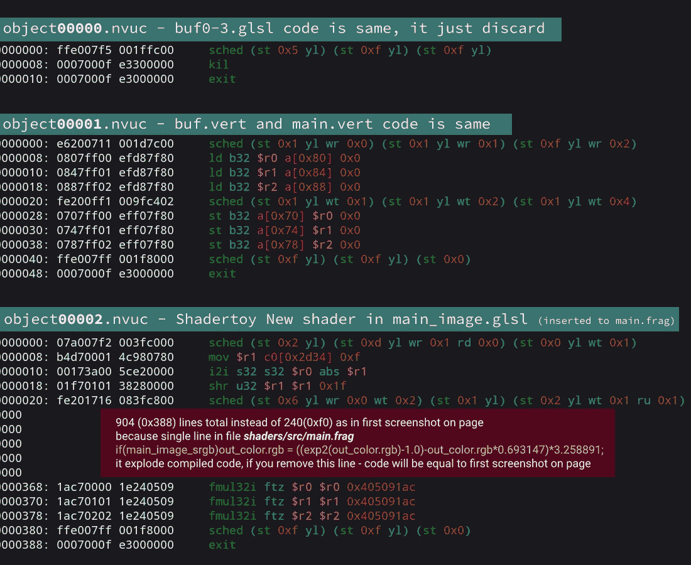

3 decompiled *.nvuc files from empty-template where 4 buffers is just discard, Vertex shader, and image shader is simple New Shader code.

*我不确定为什么文件名会这样。(没想法)*
**OpenGL 中**文件名顺序取决于应用，有时名字会有巨大差距。
我看到——`objs/object00016.nvuc`是我的第一个片段着色器，然后`objs/object00019.nvuc`是第二个片段着色器，当文件`00017-18`不存在的时候，还有很多类似的文件名“缺口”。

# 用法示例

# 要查看着色器速度大幅下降的原因，请执行以下操作:

着色器中的主要减速可能来自`**STL**` **—存储到本地内存**指令，这主要由着色器中的大型数组使用，和/或当数组将自身复制为参数时使用。

并且反编译编译后的二进制着色器，可以看到编译后的代码中`STL`调用的次数:

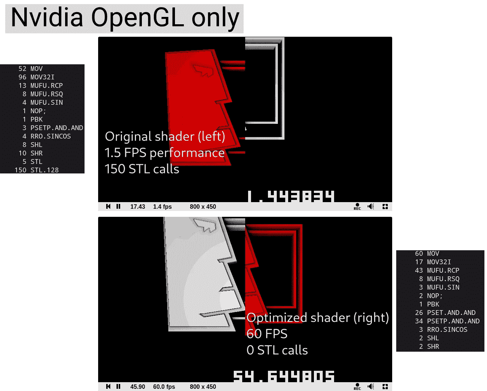

Original vs optimized shader

**本次测试着色器**来自截图— [**Shadertoy 链接 STL 减速**](https://www.shadertoy.com/view/cdB3WG) 。
这个 bug/减速只对 OpenGL 中的 Nvidia 有效。

*STL 优化在*[*Theron Tarigo*](https://github.com/therontarigo)*制作的着色器上链接。*

# 比较在 OpenGL 和 Vulkan 中编译的相同 GLSL 代码着色器:

在 Nvidia 案例中——Nvidia 驱动程序中的 OpenGL 着色器编译器*可能比驱动程序中 Vulkan 的着色器编译器*差得多。Nvidia 有很多 OpenGL only bug， [**我的 bug 列表**](https://github.com/danilw/GPU-my-list-of-bugs) 列出一些 OpenGL only bug。

**上面截图中的着色器**(STL 减速)在 Vulkan 中的 Nvidia 上运行得非常好，速度也一样快(与其优化版本一样)，所以— **让我们看看 Vulkan 中相同着色器的编译代码:**

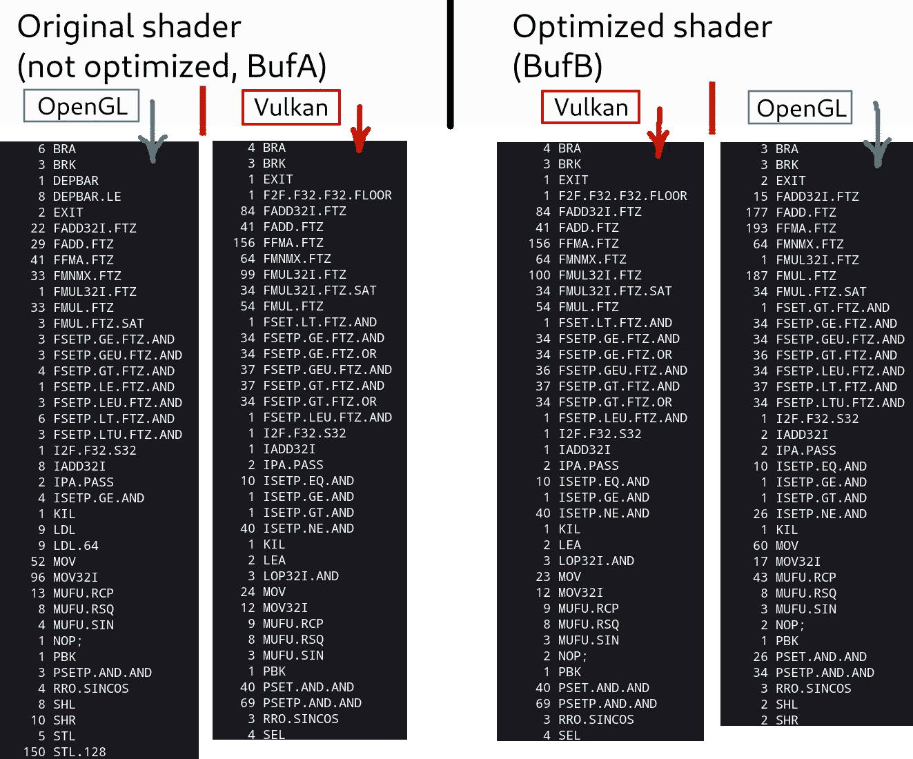

Comparing two shaders compiled in Vulkan and OpenGL

**本次测试着色器**来自截图— [**Shadertoy 链接 STL 减速**](https://www.shadertoy.com/view/cdB3WG) 。

很明显 ***只有 OpenGL 没有优化着色器*使用 STL** 。

**两个着色器**的 Vulkan 代码几乎相同，可能是因为 glslangValidator 优化了着色器代码，所以未优化的*着色器的优化发生在 glslangValidator 端。*

**Vulkan 和 OpenGL 中着色器优化版本**的编译代码不同。

# STL 总是不好！(较小的阵列和较少的阵列读/写总是更好)

*但是 STL 不总是坏的！(不总是减速的主要原因)*

请记住，如果你有一个巨大的着色器，有很多分支并使用数组——因为在着色器中，你可以展开成千上万的 STL 作为结果，但着色器将工作得非常快。

**像这样的着色器的例子和测试——我的着色器** [**GLSL 汽车俄罗斯方块**](https://www.shadertoy.com/view/3dlSzs) **。下面截图上的**
——AI 工作时 BufA 的着色器(`#define no_AI`未设置)

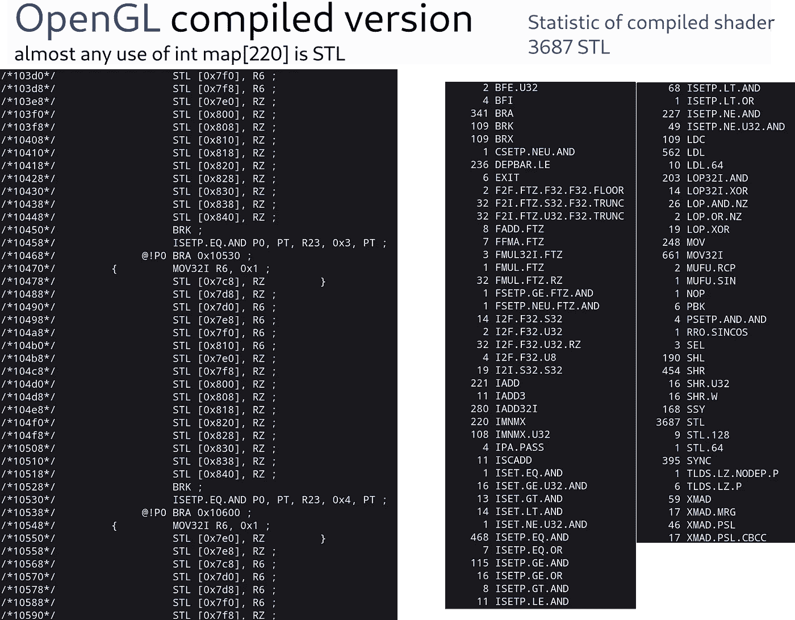

OpenGL statistic of shader in BufA

Vulkan statistic of same shader

OpenGL 版本使用 3600+ STL 指令，但着色器在 OpenGL 和 Vulkan 中运行速度相同(非常相似的 FPS，即使在低端 Nvidia GPU 上)。

*在这种情况下，STL 并不会对性能产生巨大的影响。(* ***)在这种情况下我没有 100%的把握，但是 STL 确实影响性能即使在这种大型着色器中*** *)*

## **优化本我的** [**GLSL 汽车俄罗斯方块**](https://www.shadertoy.com/view/3dlSzs) 着色器:

**主要的性能加速是** —从使用`int[220]`数组切换到`uint[7]`。
我用`int[220]`存储 220 位，所以*七个单位*就足够存储了。

**在链接 Shadertoy 着色器上看起来很普通** —第 11 行`#define use_uint_map`
*取消注释此定义以使用新贴图。*

**我看到了大约 5 倍的加速** *(在 OpenGL 中)*——如果你设置`#define AI 0`来测试最大着色器负载。在 Vulkan 中——我认为使用更小的数组会快大约 2 倍。

# 分析和优化神经(ML)着色器:

这个着色器— [**一个咖啡杯光照图神经网络**](https://www.shadertoy.com/view/fl3BWB) 在预览 800x450 中以**2–5 FPS 为我(在 Nvidia 上)工作。*(没错其是因为我用的是低端 Nvidia GPU，在 AMD GPU 或者更好的 Nvidia 上这个着色器工作也快)***

当另一个数据量非常相似的着色器— [**苏珊娜神经光场**](https://www.shadertoy.com/view/wlyczt) 即使在 1080p 全屏下也能与 **60 FPS** 一起工作。

我们来对比一下。

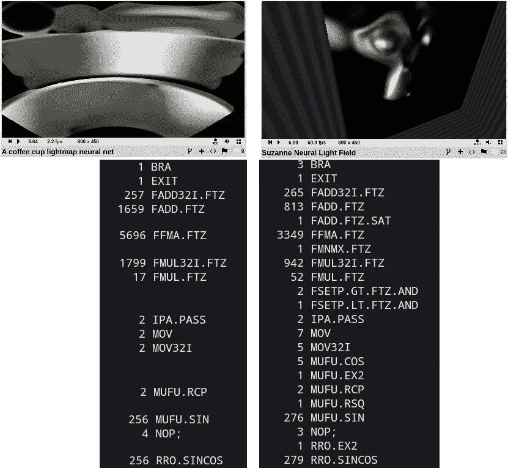

Statistic of instructions in each shader

## 由此我可以假设

*   这不是因为 sin/cos 指令，两个着色器中的 sin/cos 数量相同。
*   在第一个着色器中，FFMAFP32 — *融合乘法和加法*指令的使用增加了约 2 倍。

所以这意味着——如果我只是"**运行第二个着色器两次** " ( [*苏珊娜神经光场*](https://www.shadertoy.com/view/wlyczt) 着色器)着色器的性能将下降到 2–4 fps，与第一个着色器相同……
**让我们测试:**

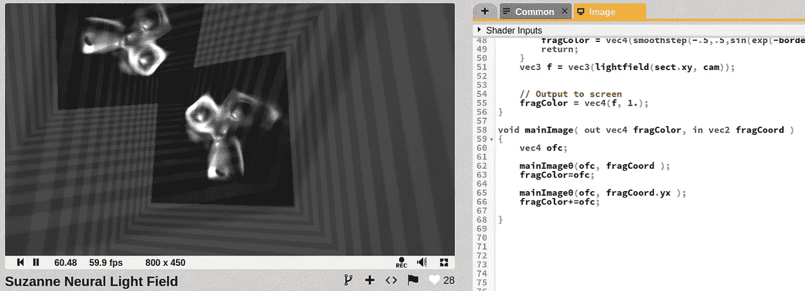

Rename original mainImage to mainImage0 and run it twice — I have two monkeys.

依然是 60 FPS
**编译代码**:

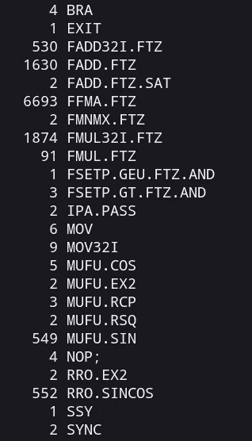

2x of everything

几乎所有东西都要乘以二，甚至 sin/cos 都要运行两次，但是性能一点也不下降。
仍然是 60 FPS，当第一个着色器(*一个咖啡杯光照图神经网络*)在具有相同数量的指令的预览中具有非常慢的性能 2–4 FPS。

这两个着色器之间唯一的区别是 mat4 常量的内部数据量。

[**一个咖啡杯 lightmap 神经网络**](https://www.shadertoy.com/view/fl3BWB) —用 7x8x8 ( [**这个 Jure Triglav 博客**](https://juretriglav.si/compressing-global-illumination-with-neural-networks/) 解释了一部分)是 mat4 的 448—*28k 字节的数据*。(**实际存储的** `**0x1ef4**` **字节或 7kb**)

[**苏珊娜神经光场**](https://www.shadertoy.com/view/wlyczt)**——**使用 16x16 模型即着色器代码中的 256 个 mat4 常量或*常量中的 16 Kbyte 数据*。(**实际存储的** `**0x43c**` **字节或约 1k 字节**)

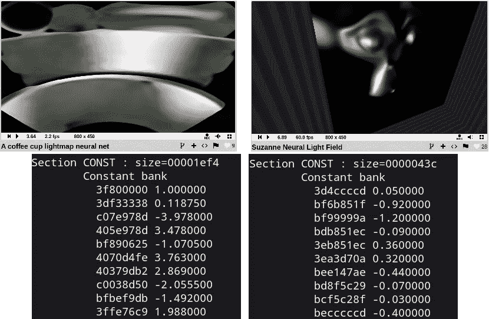

*Section CONST* in `nvdisasm` output

我认为我的 GPU 性能问题是“常数太多”。

## 我的结论是——对于我的 Nvidia GPU 来说，大约 1 或 2 千字节的常量是“良好性能”的极限。

1k 字节是 256 个唯一的浮点值。

## 我试图解决这个问题:

我有一个明显而简单的想法——将每个“唯一的浮点”转换到某个极限范围，然后用“压缩的”替换原始值。
这个简单的 python 脚本[***cfloats . py***](https://gist.github.com/danilw/c9cf7d1c630ca1ad1da10b9efc4621bd)用来处理浮动。

# 结果:

[*Optimized ML/Neural shader*](https://www.shadertoy.com/view/dd23Dc)

我在 800x450 预览中获得了 60 FPS，在全屏中获得了 30 fps，而在 1080p 全屏中则为 0。

**优化**——只是将代码中的浮点常量替换成一些其他的浮点，比如`0.011`和`0.012`变成单个`0.011`以使用更少的常量内存空间。

## **最终优化着色器—** [***优化 ML/神经着色器***](https://www.shadertoy.com/view/dd23Dc) **。**

对于这个着色器，我使用了[***cfloats . py***](https://gist.github.com/danilw/c9cf7d1c630ca1ad1da10b9efc4621bd)python 脚本中的`b_scale = 132.0`来缩放浮动。

我测试了更小的值和更大的值，甚至 1/64 或 1/32 的浮动步长性能几乎与 120–150(`b_scale`)的相同。当`b_scale`为 180+时，它在预览时下降到 30 fps。
看起来当常量大小达到 3kb+时，我的 Nvidia GPU 比常量的 1-2kb 慢得多。

## 是的，有一些质量损失:

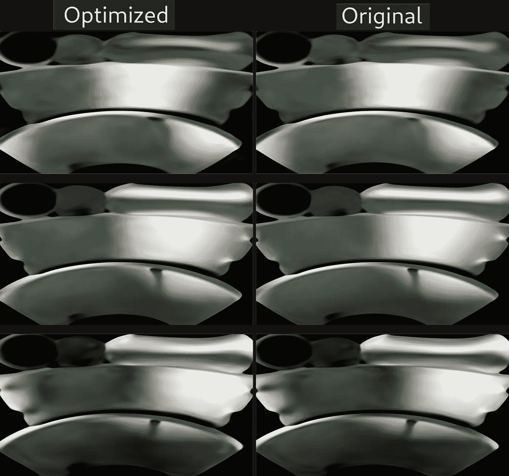

[*Optimized ML/Neural shader*](https://www.shadertoy.com/view/dd23Dc)

我觉得可以用来优化低端硬件的 ML/神经着色器。
就像仍然支持现代图形 API 的旧 GPU，但它们处理现代数据量的速度太慢了。

享受调试 xD