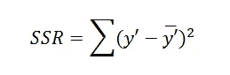
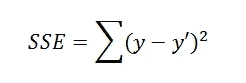
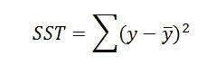
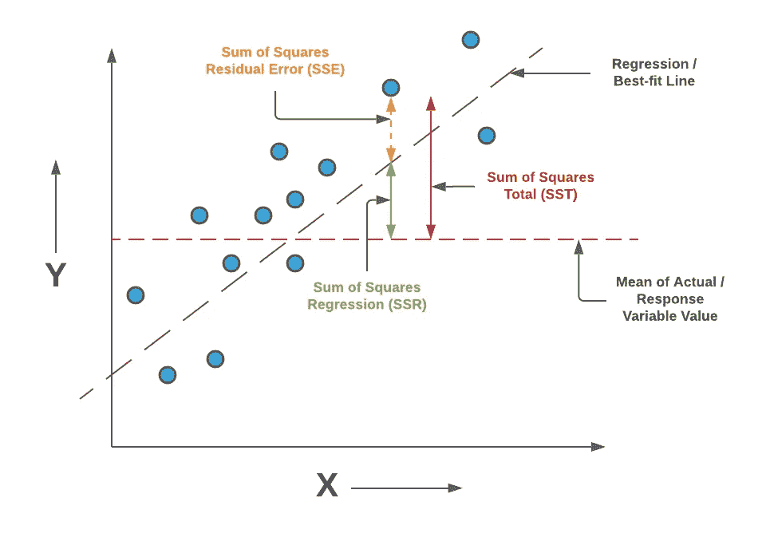
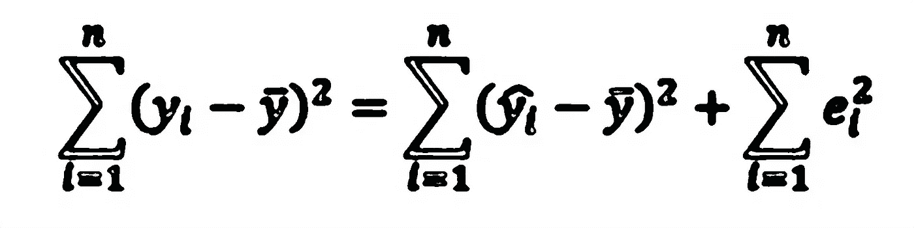
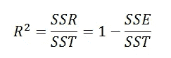
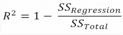
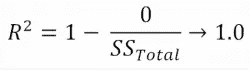
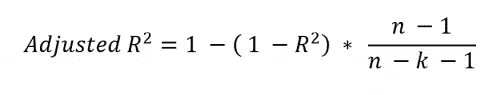

# 可变性的分解

> 原文：<https://medium.com/geekculture/decomposition-of-variability-da4ba31b4ceb?source=collection_archive---------16----------------------->

> 本文是一段 [**线性回归概括地说**](https://arunaddagatla.medium.com/linear-regression-in-a-nutshell-1714d5665fd2)

您需要了解一些指标来确定回归模型是准确的还是误导的。

遵循一个有缺陷的模型是一个坏主意，所以重要的是你能量化你的模型有多准确。其中一个指标是**方差。**

> 其他概念如**偏差**、**偏差-方差权衡**将在后续文章中讨论。[跟随得到通知](https://arunaddagatla.medium.com/)。

## 什么是方差？

就线性回归而言，**方差**可以定义为观察值与预测值的平均值相差多远的度量。开发回归模型的目标是获得低方差。

> 在机器学习行话中，数据集之间拟合度的差异称为方差。

**那么什么是可变性的分解呢？**

考虑一个例子，该例子探索了一个人的月收入和可能影响月收入的许多因素之间的关系，这些因素包括每个人的智商(IQ)、知识、资格、经验和任期(在当前工作的年限)。

*这里的目标是确定所有解释变量对结果变量(平均月收入)的解释程度。*

我们知道收入存在可变性——有些人收入高，有些人收入低，而很多人处于中间。但是收入也可以用回归中没有包括的因素来解释，比如运气、努力程度、职业选择和其他我们没有衡量的东西。

收入的一些差异可以用我们的解释变量的差异来解释。

举个例子，

我们知道，平均而言，经验和资历越丰富的人收入越高。*因此，在评估回归模型时，我们需要考虑以下参数:*

*   *解释可变性——在我们的回归中使用的解释变量来解释可变性。*
*   无法解释的可变性——由我们忽略或不包括的其他因素(如运气)解释的可变性。
*   *总可变性——结果变量(收入)的可变性*
*   决定系数——你的解释变量解释了你的结果变量的变化百分比。

## 解释可变性

*解释平方和(SSE)* 也称为*回归平方和(SSR)* 是对回归中解释变量所解释的结果变量可变性的测量。

回归平方和(SSR)计算如下:

Sum of Square Regression

在哪里，

*   ***【y’***-因变量的预测值
*   *‘y̅’*——因变量的均值

数学上，SSR 是预测值和因变量均值之差的总和。

> SSR 是描述回归线与数据拟合程度的指标。

## 残留或无法解释的可变性

*残差平方和残差(RSS)* 也称为*平方和误差(SSE)* 是对回归无法解释的结果变量可变性的测量。

误差平方和(SSE)计算如下:

Sum of Square Error

在哪里，

*   ***y -*** 因变量的实际值
*   ***y '-*-**因变量的预测值

在我们的例子中，它是某人的实际月收入与回归线上预测的月收入之间的距离。

> 残差平方和(SSR)是对回归线无法解释的变异性的总体估计。

## 总可变性

*总平方和(SST)* 也称为*总 T21 平方和(TSS)* 是数据集总可变性的度量。它是观察变量围绕平均值的离差

总平方和(SST)计算如下:

Sum of Square Total

在哪里，

*   ***y -*** 因变量的实际值
*   ****-***因变量的含义*

> *SST 是观察到的因变量与其平均值之差的平方。*

## *SST、SSR 和 SSE 之间的关系*

**

> **总可变性=已解释的可变性+未解释的可变性**

**

*SST = SSR + SSE*

## *决定系数*

**决定系数*，有时也称为 *R 平方*，是一个衡量结果变量中由解释变量解释的可变性百分比的指标。*

*它由表达式给出，*

**

*R-Squared*

*在哪里，*

*   *SSR -回归平方和*
*   *SST -平方和*
*   *SSE -误差平方和*

> *由于 SST > SSR，R 平方将介于 0 和 1 之间。越接近 1，模型越好。*

***什么是好的 R 平方值？***

*我们得到的最佳 R 平方值是 1。回归分析中相对于总误差的误差越低，R 平方值越高。

要让 R 的平方为 1，我们需要让 SSE 即 SSregression 为零。*

****

*所以，*

*   ***R** - **平方值****R<0.3**-**模型通常被认为是一个非常弱的预测器***
*   *****R** - **平方值 0.3** < **r < 0.5** -模型一般被认为是弱预测器***
*   *****R** - **平方值 r > 0.7** -模型通常被认为是强预测器***

*****R 平方可以是负数吗？*****

***出于实际目的，你能得到的最小 R 平方是零，但这仅仅是因为假设你的回归线比使用平均值更好。***

***但是，如果您的回归线比使用平均值差，您计算的 r 平方值将为负。***

*   ***R 的平方为 1 意味着回归没有误差。***
*   ***R 平方为 0 意味着你的回归并不比取平均值好，也就是说，你没有使用来自其他变量的任何信息***
*   ***R 的平方为-1 意味着你的表现比平均值差***

*****R 平方的缺点:*****

***当您将额外的解释变量放入回归中时，R 平方值将会增加，无论额外的解释变量对结果变量是否有意义。***

***因此，为了惩罚变量的过度使用，引入了一种新的测量方法，称为调整的 R 平方。***

*****调整后的 R 平方:*****

***调整后的 R 平方值是一种包含回归附加变量惩罚的度量。***

***它由表达式给出，***

******

***在哪里，***

*   *****R** - R 平方值***
*   ***n 是记录或条目的总数***
*   ******k*** 是解释变量的总数***

***分母 ***(n - k - 1)*** 每增加一个变量就罚 R。***

***让我们添加另一个变量高度作为回归的解释变量。***

***假设增加高度后，R 平方值增加，但调整后的 R 平方值减少。那么解释将是增加身高作为解释变量无助于解释产出变量月收入。***

***感谢您阅读这篇文章！如果你有任何问题，请在下面留言。请务必关注[*@ arunadagatla*](https://arunaddagatla.medium.com/)*，获取关于数据科学和深度学习的最新文章通知。****

> ****可以在*[***LinkedIn***](https://www.linkedin.com/in/arun-addagatla/)*[***Github***](https://github.com/arun2728)*[***Kaggle***](https://www.kaggle.com/arun2729)*上与我联系，或者通过访问*[***Medium.com***](https://arunaddagatla.medium.com/)**。*******