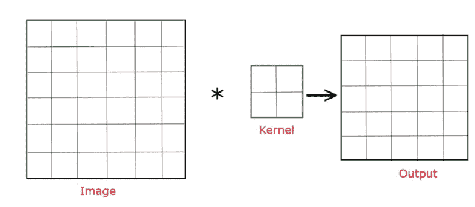
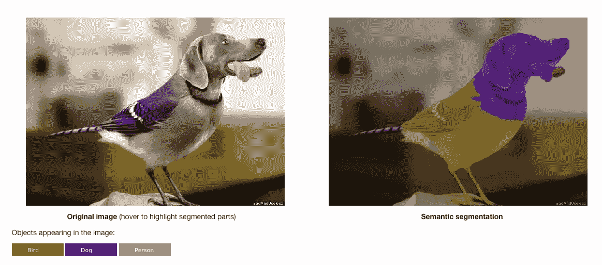

# 反卷积及其工作原理和重要性？

> 原文：<https://medium.com/geekculture/deconvolution-and-how-it-works-and-its-importance-80ce8f137e1b?source=collection_archive---------8----------------------->

在反卷积之前，我们先*快速回顾一下什么是*卷积。

**卷积**是利用核从图像中提取重要信息，并做出输出矩阵通常被称为**T5 特征图 。图像的尺寸减小了，重要的信息也保留了下来。**

Image getting converted into Output(feature map) using kernel (Credits: [Codicals](https://www.instagram.com/codicals_/))

**反卷积**是与*卷积完全相反的过程。*又称***转置卷积*** *。*在反卷积中，特征图被转换成图像。*将卷积后的图像转换成原始图像就是反卷积。*

> **卷积**将散布在各个像素中的信息加到一个像素上，*而* **去卷积**将一个像素中存在的信息散布到各个像素上。

这迫使我们思考，当我们将复杂的图像转换成原始图像时，额外的像素是从哪里来的。除此之外，不可能插入过多的一个像素。

此 的 ***解决方案可以是*在应用卷积*之前添加一些填充，没有填充的输出矩阵看起来会明显不同。填充将在边界添加许多 0，这在开始时可能看起来很奇怪。但是添加*填充有助于我们恢复图像的原始尺寸。*这就是去卷积，它起作用了。***

Deconvolution (Credits: [Codicals](https://www.instagram.com/codicals_/))

## 在哪里使用反卷积？

去卷积用于图像分割。 ***图像分割是将一幅图像分成多个片段或类。分割使得理解和分析图像变得更加容易。*** 分割是一个计算量非常大的过程，因为我们需要为此对每个像素进行分类。

Image Segmentation (Credits: [Codicals](https://www.instagram.com/codicals_/))

由于分割是为了找到每个像素的类别，因此下采样特征图无法工作。于是 ***我们用去卷积把它转换成和原图*** 一样维度的图像。

> 在应用卷积层后进行去卷积，以保持图像的输出大小与原始图像相同。

## 为什么反卷积如此重要？

分段是反卷积的用途之一。在任何计算机视觉应用中，当所需的最终图像分辨率大于输入分辨率时，去卷积就变得非常重要。

反卷积层在生成对抗网络(GANs)、图像超分辨率、表面深度估计等应用中非常流行。在这种用例中，去卷积层用于合并来自不同卷积层的响应，并显著提高精度。

敬请关注，继续学习。

关注 [Instagram](https://www.instagram.com/codicals_/) 了解更多有趣的事情。