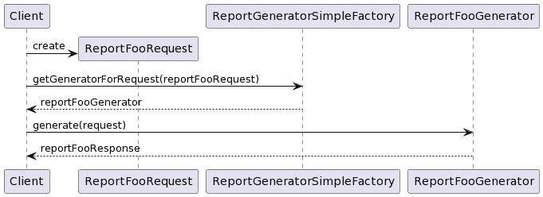
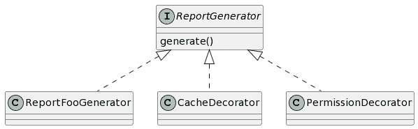
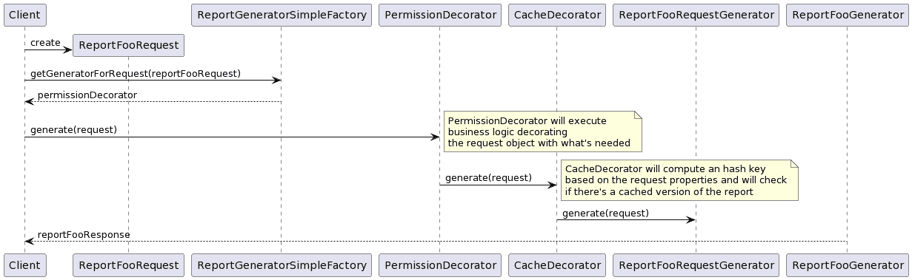

# 装饰图案？这是怎么回事？

> 原文：<https://medium.com/geekculture/decorator-pattern-what-thats-all-about-11b7aa6bceeb?source=collection_archive---------12----------------------->

Photo by [Christopher Burns](https://unsplash.com/@christopher__burns?utm_source=medium&utm_medium=referral) on [Unsplash](https://unsplash.com?utm_source=medium&utm_medium=referral)

我记得几年前当我在大学参加软件工程课程时*(相当多，时间飞逝)*，那是一个春天的下午，由于某种丰盛的午餐*(你知道，我们意大利人在午餐时确实喜欢吃很多)。*

在某个时候，教授浏览了他的报告，对我想法的最佳猜测是“哦，我的上帝，这太无聊了，什么时候结束？”。

课程是关于四人帮的装饰设计模式。

快进到今天，在我目前的工作中，我经常使用这种模式来创建灵活的、可扩展的、易于测试的以及所有其他好的形容词解决方案。

因此，本文的目标是与您分享为什么您应该了解这种模式，以及您如何从中受益:)

# 那么这个装饰设计模式是什么呢？

在面向对象编程中，装饰器是一种设计模式，它允许动态地将行为添加到单个对象中，而不会影响同一类中其他对象的行为。

这种方法允许将功能划分到具有独特关注领域的类中。装饰器的使用可能比子类化更有效，因为一个对象的行为可以在不定义一个全新的对象的情况下被增强。

如果你想了解更多，我建议你阅读 [GoF 设计模式书](https://en.wikipedia.org/wiki/Design_Patterns)中的装饰章节或者查看维基百科文章。

# 报告生成问题

所以，最近我不得不在工作中面对一个新的挑战，我需要创建多个报告来向客户展示一些*精确的*数据。

显然，当您需要向用户显示数据时，您必须:

*   检查请求它的用户是否被授权这样做
*   检查是否需要仅显示所请求数据的子集
*   检查请求是否有效，是否提供了所有必需的信息

根据您的使用情况，这个列表还可以继续下去。

为了证明软件开发是一个不断变化的过程，在这个过程中，产品团队寻求一种方法来提供报告的缓存版本**，但是只有在报告在缓存中的存储和请求时间之间用户权限没有改变的情况下**。

# 天真的解决方案

起初，我开始以相当独立的方式一个接一个地写这些报告，这意味着，我缓慢但稳定地复制我的代码，以考虑所有的业务需求。

解决方案没那么糟糕，大概是这样的

基本上，我为每个报告定义了一个请求、生成器和响应对象，简单的工厂负责根据请求检索正确的生成器。

业务逻辑都位于负责考虑**所有**业务需求的生成器类中。

它很好，而且很容易扩展，如果你需要处理一个特定的报告，你可以在一个类上完成，而且它很容易测试。

但是，我创建的报告越多，我就越意识到我可以通过更加注意我的方法来改进一些东西，特别是，我认为我可以找到一种更好的方法来处理一些常见的业务需求。

# 装饰设计模式的解决方案

所以，下面是我利用装饰者设计模式改进我的解决方案所做的工作:)

基本思想是定义多个 decorator 类，每个类都有非常明确的职责:一个检索用户可以访问和不可以访问的内容，一个检查是否已经有报告的缓存版本，等等。

让装饰者只承担一个明确的责任的好处是，他们很容易一起开发、测试和组合。这是敲钟如[单责任](https://en.wikipedia.org/wiki/Single-responsibility_principle)还是[开合](https://en.wikipedia.org/wiki/Open%E2%80%93closed_principle)原理？👀

每个生成器将处理请求对象，并将执行它的东西，例如:

*   `PermissionDecorator`将从请求中删除用户无法访问的项目
*   `CacheDecorator`将检查相同的请求是否已经被处理，以及响应是否在缓存中可用，如果是这样，将不再进行处理，缓存的响应将被返回给客户端

# 最后的想法

我希望这篇文章能帮助你们中的一些人在处理类似问题时理解这种设计模式的潜力！

感谢您的阅读，并随时添加关于您的体验的评论:)

*所有的图表都是使用*[*https://plantuml.com/*](https://plantuml.com/)创建的