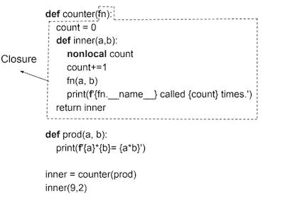
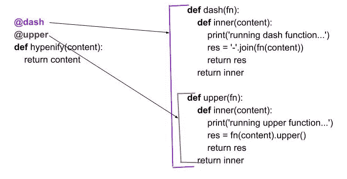

# 装饰者— Python

> 原文：<https://medium.com/geekculture/decorators-python-ad5531ae3658?source=collection_archive---------45----------------------->


Photo by [Sixteen Miles Out](https://unsplash.com/@sixteenmilesout?utm_source=unsplash&utm_medium=referral&utm_content=creditCopyText) on [Unsplash](https://unsplash.com/s/photos/olive-plant-with-bird?utm_source=unsplash&utm_medium=referral&utm_content=creditCopyText)

一年前，我写了一篇关于装饰者的文章，现在当我重温它时，我认为我可以做得更好，尤其是在下半年。所以在这里补偿它。作为先决条件，您应该理解[闭包](https://dkhambu.medium.com/closure-python-53c7f896aef)是如何工作的。

在本文中，我们将通过**简单**、**堆叠**和**参数化**装饰器的例子来**了解**什么是**装饰器**。我们还有动态装饰者作为奖励。

让我们看一个简单的例子:

运行该文件时，我们得到:

```
9*2= 18
prod called 1 times.
```

现在让我们剖析一下`counter`函数:



closure depicted in dashed lines

如虚线所示，`counter`函数使用其局部变量`fn`和`count`将`inner`函数包围起来。

我们调用`counter`函数的方式是将`prod`函数传递给它。`counter`函数返回`inner`函数，该函数通过向其传递参数来调用，并由调用`counter`函数期间传递的`prod`函数使用。

代码的第 13 行和第 14 行执行这些调用:

```
inner = counter(prod)
inner(9,2)
```

我们可以使用`@<decorator-name>`符号进行同样的调用。因此，我们不必像第 13 行那样调用嵌套函数。

当一个函数被修饰时，你可以把它想象成**整个函数**得到**传递给装饰器**并在装饰器的**内部**函数中得到使用。

让我们用一个例子来看看堆栈装饰器:

运行该文件时，我们得到:

```
running dash function...
running upper function...
C-R-O-W-N- -O-F- -W-I-L-D- -O-L-I-V-E
```

正如您在输出中看到的，如果有**堆叠的装饰器**，那么之外的**中的装饰器将它下面的装饰器**作为参数**传递给它。它递归地到达最里面的装饰器，并完成每个内部函数调用。**

所以这里先执行`upper(fn)`的`inner`方法，然后执行`dash(fn)`的`inner`方法。

以下是解释的图表:



stacked decorators schematic diagram

让我们做一个小的修改，这样我们可以调用这个堆栈装饰器 5 次。

运行该文件时，我们得到:

```
C-R-O-W-N- -O-F- -W-I-L-D- -O-L-I-V-E
C-R-O-W-N- -O-F- -W-I-L-D- -O-L-I-V-E
C-R-O-W-N- -O-F- -W-I-L-D- -O-L-I-V-E
C-R-O-W-N- -O-F- -W-I-L-D- -O-L-I-V-E
C-R-O-W-N- -O-F- -W-I-L-D- -O-L-I-V-E
```

我们所做的是定义参数化的外部装饰器`rep`，它接受值`times`并包含`dash`装饰器。`dash` decorator 的内部方法使用`rep`的参数进行迭代。

我们装修工做的基本都是装修功能！

这就是装修工的全部工作。希望这对您的理解有所帮助。如果你有任何澄清，请评论。

祝贺完成！🎈我的下一篇文章将讨论元组和命名元组。到时候见。

*奖励*:这可能有点吓人**动态堆叠**装饰器，用于将中间层节点映射到较低层设备。看看吧，玩一玩，应该是对处理装饰器概念的一个很好的温度测试。*先决条件:* [*闭包*](https://dkhambu.medium.com/closure-python-53c7f896aef) *，*[*λ函数*](/geekculture/lambda-function-python-b8fa9167fd3b)

运行该文件时，我们得到:

```
lower-node-1 is mapped to ['router-x-1', 'router-x-2']
lower-node-2 is mapped to ['firewall-x-1']
lower-node-3 is mapped to ['firewall-next-gen-x-1', 'vm-2.2']
Not a valid mapping
```

**灵感**:

*   [Python 3:深潜(功能性)](https://www.udemy.com/course/python-3-deep-dive-part-1/)

你可以在 [Patreon](https://www.patreon.com/dkhambu) 支持我！谢谢大家！