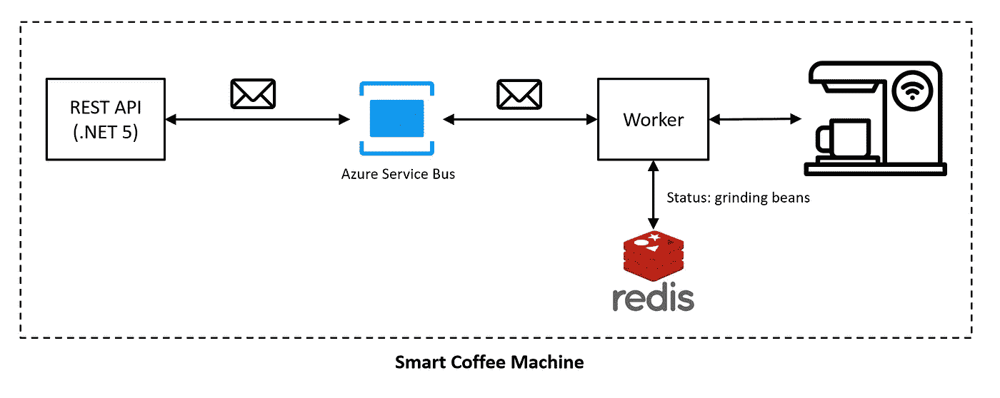

# 将长期运行的任务从 HTTP 请求处理中分离出来——可伸缩的消费者

> 原文：<https://medium.com/geekculture/decouple-long-running-tasks-from-http-request-processing-scalable-consumers-380e24d662de?source=collection_archive---------3----------------------->

## 第 4 部分:讨论如何使用一个单独的控制台应用程序作为我们的消费者，而不是进程内的消费者，这样它就可以很容易地扩展到多个实例。

## 背景