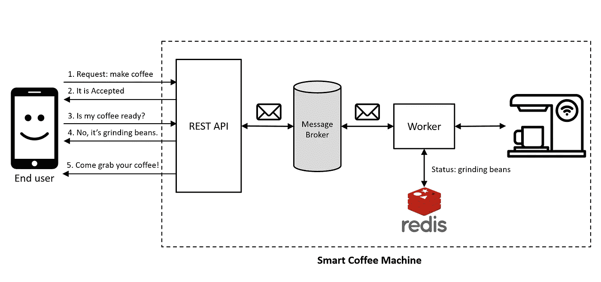

# 将长期运行的任务从 HTTP 请求处理中分离出来——使用 Azure 服务总线

> 原文：<https://medium.com/geekculture/decouple-long-running-tasks-from-http-request-processing-using-azure-service-bus-3a11605714ee?source=collection_archive---------1----------------------->

## 第 3 部分:讨论如何使用 Azure Service Bus 作为消息代理而不是内存中的消息代理，以及如何自动配置主题和队列。

System Diagram by Author

## 背景