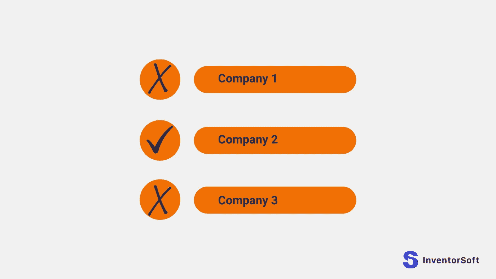
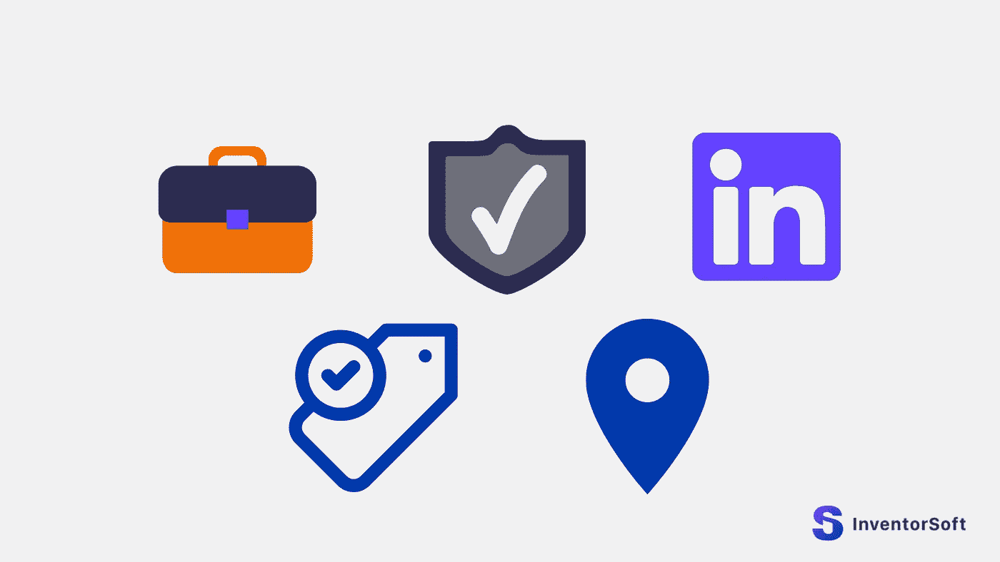
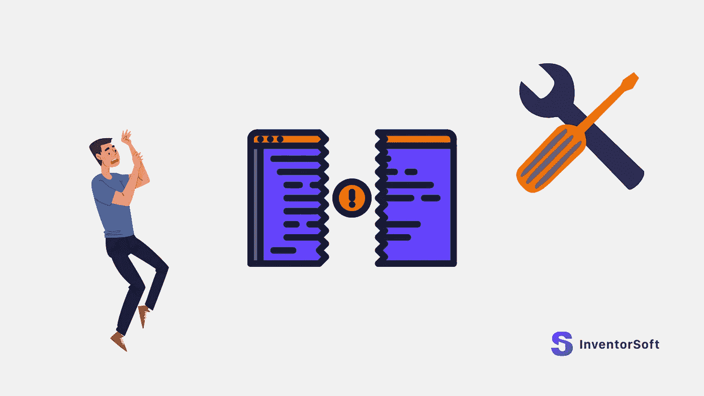

# 敬业的开发团队——招聘前你必须知道的 21 件重要事情

> 原文：<https://medium.com/geekculture/dedicated-development-team-21-crucial-things-you-must-know-before-hiring-8f2c6e2162d2?source=collection_archive---------21----------------------->

全球越来越多的商业公司通过使用专门的开发团队来寻求利润。每年大约有 300，000 家公司雇佣专门的团队。此外，IT 外包行业预计将在 2025 年增长到 3976 亿美元。其他报告显示，该行业将在 2020-24 年间[增长 975.1 亿美元](https://www.technavio.com/report/it-outsourcing-market-industry-analysis)，其势头以 4.58%的 CAGR 加速。

专门的软件开发团队是公司雇佣的从事特定任务的外部开发团队。如果你雇佣了他们，他们会表现得像员工一样，你可以根据需要指挥他们。

# 雇佣专门开发团队的主要原因

雇佣专门开发团队的公司可以获得许多优势，但是他们不一定对每个业务都有效。能够从中受益的组织往往属于特定的类别，包括:

*   拥有一个需要扩展的小型数字/IT 部门:许多企业需要扩展部门以满足其义务和抱负。然而，这种行动可能需要巨额投资，对许多公司来说是不切实际的。雇佣一个专门的开发团队可以降低扩张成本，使其更加实惠，同时相关的后勤工作变得更加易于管理。这给了资金较少的小公司扩张和实现抱负的机会。
*   必须在特定时期提高产量:一些公司经历过需要在中短期内提高生产率的时期。这种需求可能是由于需求的季节性变化，或者是必须尽快处理的积压工作。在这种情况下，最好的选择是雇佣一个团队，因为它不允许在项目持续时间之外做出长期承诺。
*   员工忙于其他项目:当员工忙于其他项目时，一些组织雇佣专门的开发团队来帮助他们。外部软件开发人员可以在您的员工忙碌时帮助完成他们的任务，以确保您的公司能够掌控日常事务。此外，以这种方式招聘可以让你的专家在不同的项目上工作，而不会牺牲公司的其他方面。允许你的员工从事特定的工作也将有助于他们发展技能。
*   资金少的创业公司:创业可能需要很多钱，尤其是当你需要招聘专家的时候。对于许多人来说，这种成本可能是创办公司的高昂费用，但专门的软件开发人员可以帮助降低成本，帮助新企业建立起来。
*   初创公司需要帮助来实现想法:一些初创公司可能有吸引市场的惊人的产品想法，但不确定如何将他们的愿景付诸行动。专注的软件开发人员可以向有技能和经验的专业人士介绍创业公司，以帮助创业者让他们的产品起步。
*   内部招聘困难:在某些情况下，你可能很难找到合适的员工。在这种情况下，与专门的开发团队合作可能正是所需要的。通过供应商招聘时，他们可以确保您获得适当的技能和知识，从而有效地完成工作。这有助于企业在考虑长期招聘内部员工时，实现中短期目标。

# 如何雇佣一个专门的开发团队

如果是正确的团队，专门的软件开发人员会在许多方面帮助企业。正确团队的必要性使得公司进行有效的研究以确保团队是正确的组合变得至关重要。

在寻找合适的团队合作之前，你应该首先定义你的技术需求。此外，你应该评估项目的整个范围，以明确你需要什么，以及为了达到你的目标必须做什么。

在选择供应商之前，您需要定义工作需要哪些工具，需要哪些技能，以及最终产品应该提供什么。定义技术需求是必不可少的，因为它确切地告诉你你需要在专门的软件开发人员中寻找什么。

您应该进行的其他研究包括:

*   定义你的预算:在你开始搜索之前，你应该建立预算。定义您可以花费多少是一个重要的步骤，因为这将有助于确保供应商提供一个您可以负担得起的平台，并且仍然具有您需要的所有功能。超出预算可能会给你的项目和公司带来灾难性的后果，所以要确保一切都被考虑在内。
*   选择合作模式:你还应该研究各种可用的商业模式，并询问它们如何为你服务。例如，您可以决定雇佣一个专门的团队来承担全部工作，或者雇佣一个团队与您当前的员工一起工作。哪种模式最适合您取决于各种因素，如项目的性质和已经为您工作的员工。在与专门的开发团队交流时，您应该提到合作模型，以确保他们可以与您合作开发您喜欢的模型。

*   寻找在线评论:研究任何业务最有效的方法之一是寻找供应商以前客户的评论。在网上搜索，看看你能找到什么，并尝试询问周围的意见。谷歌是一个很好的起点，谷歌公司的名字会给你提供一些定性信息。开始寻找的一个很好的地方是 B2B 平台，如 Clutch，因为你可能会在那里找到很多业内人士。
*   寻求推荐:如果你认识其他曾经在专门的开发团队工作过的人，问问他们是否能给你提供一份推荐。如果你不认识任何人，互联网可以给你所需要的。如果你在网上寻求建议，寻找人们可能谈论软件开发的群体是一个好主意。然而，你需要记住的是，对一份推荐信进行研究以确保它是你的正确选择仍然很重要。
*   联系以前的客户:在你雇佣一个专门的开发团队之前，试着联系供应商过去合作过的客户。尝试收集他们对项目进展的反馈，以及是否有任何事情可以做得更好。询问他们任务的范围也是一个好主意，这样可以帮助你了解供应商是否可以处理与你类似的任务。你也可以询问他们是否有推荐给之前可能合作过的其他团队。

*   创建一个候选名单:当你雇佣一个专门的开发团队时，最好不要一开始就只关注一个团队。相反，创建一个几个潜在供应商的候选名单，这样你就可以选择最适合你的。比较不同的团队会帮助你找到最适合你的选择。
*   面试供应商:在你决定选择哪家供应商之前，你应该面试你候选名单上的所有供应商。询问大量关于他们历史的问题，以及他们过去是否完成过类似的任务。尽可能多地与团队成员交谈，深入讨论你的项目。正确的问题将有助于你判断他们对你的项目的理解程度。确保让你的团队参与到面试中来，这样他们也可以得到与他们的特定技能相关的答案。一定要为面试做好准备，这样你就知道该问哪些问题了。
*   询问公司政策:当你雇佣一个专门的开发团队时，询问该机构的政策以了解它们是否符合你的需求是很重要的。询问他们的政策很重要，因为任何第三方适应您的业务目标和要求都是至关重要的。否则，你们可能很难一起工作，项目可能会因此受到影响。

*   检查团队的专业知识:在做任何决定之前，了解供应商的专业知识也是一个好主意。如果你也询问团队以前做过哪些项目，了解他们的经验和成就，这将是一个好主意。
*   检查安全标准:如果安全标准对您的项目至关重要，那么有必要确保您雇佣的任何专门的开发公司都具有所需的资格。当你雇佣一个专门的开发团队时，确保高安全标准有助于保证安全完成项目。
*   当你雇佣一个专门的开发团队，提供高安全标准的补偿，有助于保证一个安全的完成项目。
*   检查他们的费率:公司收费多少是一个显而易见的问题，很难知道不同的定价模式是如何工作的。自然，许多企业希望选择更便宜的方案来削减成本，但这通常不是最佳选择。重要的是要记住，有技能的专业人士会期望高薪，所以如果你选择一家更便宜的公司，他们可能没有你需要的属性。因此，从长远来看，选择便宜的方式可能会让你付出更多的代价，以防你不得不付钱给另一家公司为你重新做这项工作。首先，选择错误的公司也可能会阻碍你的项目，有可能导致你在截止日期前失败。
*   查看他们的 LinkedIn 账户:看看公司的 LinkedIn 账户。这可能会告诉你他们做过的项目的细节，以及他们有哪些合作关系。LinkedIn 还将提供专门的开发公司有多大以及他们有多少员工的信息。LinkedIn 账户上的其他有用信息包括一家企业运营了多长时间，以及其办公室位于何处。
*   查看他们在哪里有办公室:即使在一个你可以在网上做很多生意的世界，在正确的位置雇佣一个专门的团队仍然很重要。虽然许多人对保持完全远距离的关系没有意见，但其他人更喜欢与本地的公司合作。
*   询问他们在哪个时区工作:你通常希望在工作时间与其他人合作；这对交流来说是必不可少的。例如，可能经常有人需要在旁边快速回答问题，或者可能出现需要快速解决的问题。试着找一个专门的软件团队，在你所在的时区工作，或者至少愿意和你同时工作。

*   他们说哪种语言？:有些国家的成本比其他国家低，这意味着你可以在不同的国家找到相对便宜的选择。然而，当你雇佣一个专门的开发团队时，考虑语言是至关重要的，因为你需要能够清晰地交流。在大多数情况下，你需要一个具有高水平英语口语和书面语的整个团队来避免误解，并确保项目的每个方面都按照你的要求完成。
*   他们的软技能是什么:软技能是对完成任务仍然重要的非技术性技能。例子包括团队合作、强烈的职业道德、领导技能和人际交往技能。扎实的沟通技巧对于确保每个人都明白自己需要什么也很重要。清晰有效的话语也很重要，因此当问题出现时，你可以迅速纠正。
*   询问他们的流程:询问公司的任务流程是什么，总体而言。很重要的一点是，团队可以适应你自己的流程，以便彼此兼容，这样你就可以有效地一起工作。向供应商询问他们的流程也将有助于您评估他们对您的需求的理解程度。

*   他们是否提供持续的服务和维护:即使是最好的平台也会偶尔需要服务和维护。有时，一个平台会开发出需要解决的技术问题，而在其他时候，随着您需求的变化，它可能需要升级。无论如何，让专门的软件开发人员继续与您合作是很有意义的，这样您的平台将在未来许多年继续提供服务和所需的更新。
*   签订合同:在开始任何工作之前，你必须签订一份合同。合同应该包括关于任务范围、预算和双方期望的所有细节。当你雇佣一个专门的团队时，一份合同将有助于以书面形式明确需要做什么以及如何做。签订合同也是双方在工作开始前对协议进行最后调整或提出异议的机会。

*   签署一份 NDA:你的想法对你很有价值，对其他人也很有利。与另一家公司密切合作可以让他们接触到你平台的想法和代码，有可能让他们把你的想法据为己有。因此，当你雇佣一个专门的开发团队时，签署一份受法律保护的 NDA 是非常重要的，以防有人试图窃取你的知识产权。理想情况下，NDA 应该由项目中的每个人签名，以确保您尽可能多地被覆盖。

*   定期开会:和别人一起工作时，定期开会总是个好主意。定期聚在一起将有助于确保项目尽可能顺利地运行，并且双方都应该有机会发言，以获得关于项目进展情况的准确反馈。会议是一个很好的机会，你可以借此检查团队是否得到了他们需要的一切，并准备好挑战任何看起来没有按计划进行的事情。

最初发布于此[https://inventor soft . co/blog/dedicated-development-team-21-critical-things-you-must-know-before-hiring-](https://inventorsoft.co/blog/dedicated-development-team-21-crucial-things-you-must-know-before-hiring-)