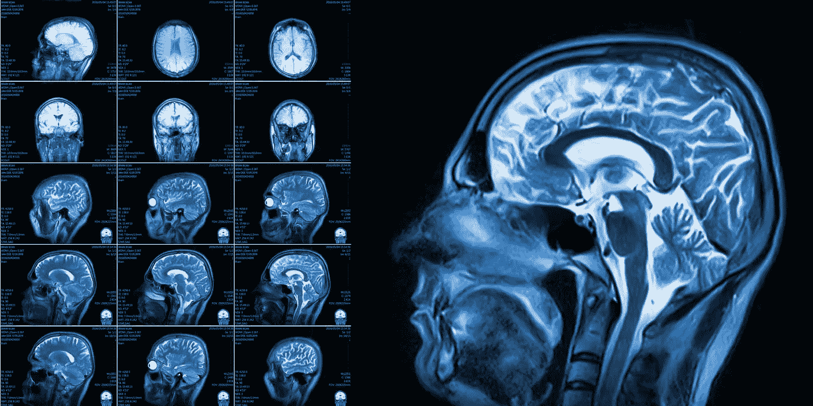
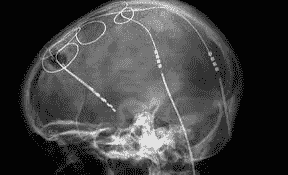
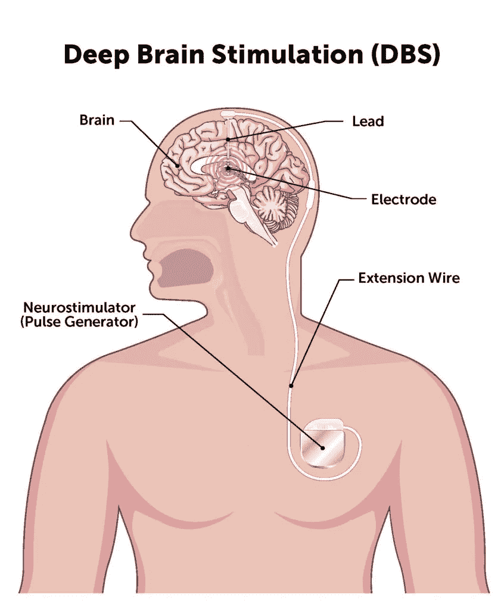
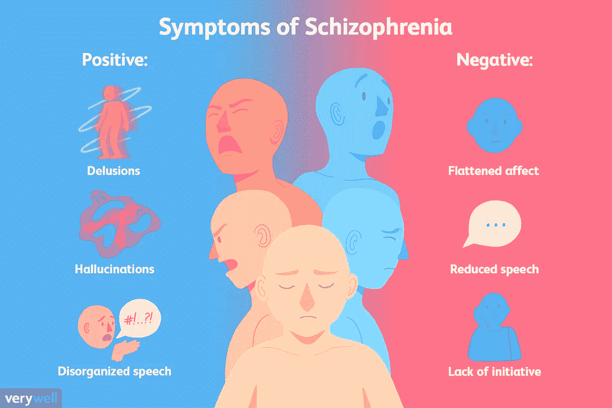
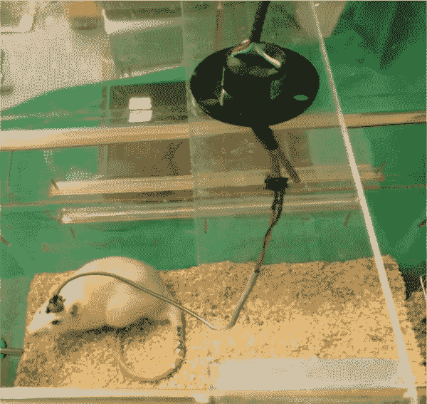
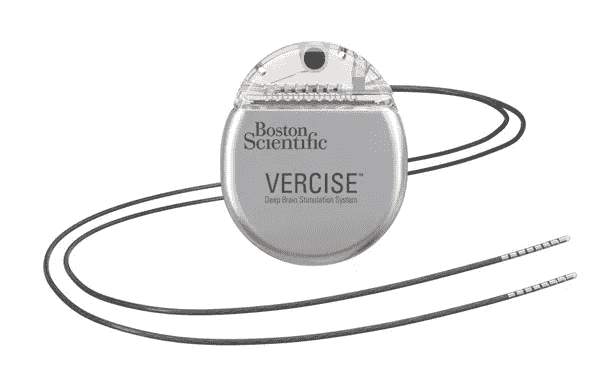

# 精神分裂症的深部脑刺激

> 原文：<https://medium.com/geekculture/deep-brain-stimulation-for-schizophrenia-350e34c88ee4?source=collection_archive---------23----------------------->

基于现代科技的进步，扩展了已经存在了几十年的治疗精神分裂症的技术的视野。

## 目录

1.  介绍
2.  DBS 是如何工作的？
3.  什么是精神分裂症？
4.  是什么使得精神分裂症的 DBS 比其他精神疾病的 DBS 更难实现？
5.  精神分裂症的 DBS 是如何工作的？
6.  成功之路
7.  关键要点

## 介绍

1987 年，一组致力于治疗特发性震颤的法国科学家首次开发出一种称为深部脑刺激(DBS)的侵入性神经技术。从那时起，它开始广泛用于治疗特发性震颤以及其他基于运动的疾病，如帕金森氏症和肌张力障碍。然而，在过去的二十年里，这项技术的视野已经扩展到某些类型的精神疾病，如重度抑郁症和强迫症。

Deep Brain Stimulation has been being used for Parkinson’s and essential tremor for decades.

这一转变一开始，人们就开始尝试利用深度大脑刺激来治疗各种基于大脑的疾病，如阿尔茨海默氏症、癫痫、神经性厌食症，甚至成瘾。他们能够将这些疾病的 DBS 治疗进展到试验的高级阶段，结果看起来非常有希望。然而，在那个时候，有一种特殊的情况，测试甚至不能进入临床阶段:精神分裂症。这种情况下的 DBS 提出了当时科学家没有技术解决的障碍。因此，当其他 DBS 疗法以新的有影响力的方式帮助患者时，这种情况被搁置了。

也就是说，现在是 2021 年。在过去的十五年里，科学技术领域取得了全面的指数级进步。雄心勃勃的科学家将各种新技术带入生活，将视频游戏和虚拟现实等实体融入现代神经疾病治疗中。虽然 DBS 似乎已经存在了几十年，但它持续广泛的疗效使它值得那些从未接触过的有需要的精神分裂症患者重访。**随着现代科学技术的进步，对精神分裂症患者使用深度大脑刺激是一种我们可以实现的可能性，也是一种值得去做的工作。**

## DBS 是如何工作的？

深度脑刺激是通过一种称为深度脑计算机接口(dBCI)的侵入性脑计算机接口(意味着它直接位于颅骨内或大脑上)启动的。dBCI 向其目标区域发送一系列一致的电脉冲，这些电脉冲根据它们被用于治疗的情况而变化。然后脉冲从目标区域到达神经元，治疗能够基于一种称为神经调节的自然技术传播到整个区域，在这种技术中，神经元使用化学物质来控制附近的其他神经元。

The parts of a DBS device

目前的 DBS 系统以开环方式运行，大脑可以接收来自 dBCI 的脉冲，但设备无法读取任何大脑信号。该领域目前正在努力的一个项目是创造一种可以发送和接收信号的双向 DBS 设备。

## 什么是精神分裂症？

**精神分裂症是一种慢性精神病，全世界有超过 2000 万人患有这种疾病，它影响人的思考、感觉和清晰行为的能力。**精神分裂症患者通常会经历似乎与现实脱节的想法或经历(妄想或幻觉)、言语或行为混乱、日常活动参与度下降以及高度混乱或异常的运动行为等症状。

**精神分裂症的症状分为两类:阳性和阴性。**阳性症状(包括幻觉、妄想、思维或言语混乱等。)是一个人在普通经历之外经历的症状，没有这种情况或类似情况的人根本不会经历。

Patients with Schizophrenia can experience both positive and negative symptoms.

消极症状，也称为缺乏症状(如缺乏情感，减少快乐或动机，延迟说话，开始和继续活动困难等。)是一种症状，表现为一个普通人以更高的数量或频率体验到的品质缺陷。这些缺陷可以分为四大类:关系型、交流型、情感型和认知型(基于动机)。

虽然研究未能成功确定精神分裂症的单一根本原因，但它被认为是基因、环境和心理社会因素的结合。精神分裂症没有已知的治疗方法，但可以治疗，通常是通过抗精神病药物、心理疗法和协调专科护理服务(康复导向治疗计划)的组合。然而，多达 30%的服用抗精神病药物的患者对这种药物有耐药性，因此很明显需要一种新的替代药物。

## 是什么使得精神分裂症的 DBS 比其他精神疾病的 DBS 更难实现？

有许多因素将精神分裂症与其他精神疾病区分开来，使其成为深度大脑刺激的一个用例。最显而易见的一点是 dBCI 需要针对特定的大脑区域，而其他条件则不需要治疗。对于精神分裂症的阳性症状，这方面的一个例子是需要针对颞叶皮层(负责创建意识记忆、语言理解和行为等功能)。对于阴性症状，一个独特的目标区域是腹侧被盖区(VTA)，它负责奖励、动机、认知和厌恶。

另一个挫折在于试验过程中为获得精确模型而执行的协议。在试验过程中，为了设计出一个好的原型，需要进行大量的观察和测试，并且总是使用动物模型来完成。这种动物通常是某种形式的大鼠或小鼠。**不仅在这些啮齿动物中没有发现精神分裂症，地球上也没有其他物种会得精神分裂症。**科学家推测这是基于人类大脑及其部分相对于其他动物的显著复杂性。无论如何，这使得对这种情况有更好的理解变得更具挑战性，因为其他动物不会经历这种情况，而人类在这方面也不容易被观察到。

Typically, DBS treatments are tested on mice.

此外，阻止精神分裂症患者获得这种治疗的一个更简单的障碍是缺乏基于这些其他障碍的试验。尽管技术一直在进步，并使其更容易实现，但如果没有许多试验和证据来支持其安全、有效和一致的事实，一项技术不能也不会被批准成为一种广泛的治疗方法。

## 精神分裂症的 DBS 是如何工作的？

根据治疗的目的，深部脑刺激器可以执行几种不同的机制。鉴于精神分裂症的阳性和阴性症状本质上是相反的，但仍然是同一种疾病的一部分，它们需要以相反的机制作为靶点。**阳性症状需要直接抑制(抑制或阻断)神经活动，而阴性症状需要直接激发神经活动。**

A DBS device can perform a variety of different functions depending on what it’s being used to treat.

针对每种症状的大脑区域也会有轻微的差异。这两种类型的症状都需要针对伏隔核(naCC)，但如上所述，阳性症状也需要针对颞叶皮层，而阴性症状应在 VTA 中治疗。

由于精神分裂症患者可能会经历阳性和阴性症状，因此一名患者需要将他们的 dBCI 扩展到许多不同的区域，使其稍微更大、更复杂。然而，最近被批准用于 DBS 治疗(如强迫症)的条件需要针对多达 5 个不同的区域，因此这应该是可以实现的。

**尽管深度脑刺激可能与精神分裂症有本质上的不同，但最近对其他精神疾病(如强迫症和重性抑郁症)的批准是一个案例研究，表明现代创新和技术如何使 DBS 成为许多以前无法治疗的疾病的治疗选择。**他们帮助奠定了这种技术可以成功用于治疗精神分裂症的基础，并且似乎可以立即开始实施，而不必再等待即将到来的技术。

## 成功之路

我已经提供了许多具体的细节，包括对该技术的要求、它的目标以及它应该具有的特性。鉴于这种技术已经存在于其他情况下，一旦获得批准，就有一个预先存在的关于如何设计和植入 dBCI 设备的协议。执行上的主要区别在于审判。

由于没有动物会经历精神分裂症，观察要么必须从人类观察中获得(这可能需要与小鼠不同的策略)，要么从预先存在的数据和实验中获得。

**创造一种 DBS 精神分裂症治疗方法所需的大部分时间将很可能花在试验上。**在这种疗法像其 DBS 前辈一样获得 FDA 批准之前，还需要进行许多试验。虽然这种治疗显然是可行的，并且有证据表明它可以通过试验的所有阶段，至少对于耐药患者来说成为主流，但仍然会出现许多问题，并且需要进行测试，以便推出该产品的最佳版本。像往常一样，这需要时间，但这并不能说明产品本身的实用性或功效。

最后，直播卫星将通过每个阶段的试验，并应获得美国食品和药物管理局的批准。随着时间的推移，它将变得更广泛地被接受，更容易获得和负担得起。当像这样的入侵性 BCI 产品首次发布时，通常会遭到抵制，尤其是来自社会中年长成员的抵制。然而，随着它们变得越来越普遍，最初的阻力通常会逐渐消失，这将使该产品在财务上取得成功。

最终，一旦 DBS 可以用于治疗精神分裂症，它将具有非常好的可扩展性，并且也可以成为患有各种精神障碍和疾病的患者的一种选择。正如对患有其他疾病的患者一样，针对精神分裂症的 DBS 将影响数百万人的生活，并帮助精神分裂症患者减轻他们的病情损害。

## 关键要点

1.  深度脑刺激(DBS)已经用于治疗特发性震颤和帕金森病几十年了。最近，它还被扩展到帮助治疗精神疾病，如 MDD 和强迫症。
2.  由于各种原因，它以前不能用于治疗精神分裂症，但随着这些新的扩展以及科学和技术的进步，它现在成为可能。
3.  DBS 由一个深度脑计算机接口执行，该接口将一系列电脉冲发送到目标大脑区域，治疗通过使用一种称为神经调节的自然发生技术来传播。
4.  精神分裂症是一种精神障碍，会影响人的思考、感觉和清晰行为的能力。精神分裂症患者会出现积极症状，如妄想和幻觉，这是普通人没有的额外体验，也会出现消极症状，如缺乏动力和言语减少，这些症状表现为普通人表现出的品质缺陷。
5.  使用 DBS 治疗精神分裂症不同于其他疾病，原因有很多，例如靶向不同的大脑区域，缺乏动物受试者，因为没有动物患有精神分裂症，以及缺乏预先存在的试验
6.  虽然为了获得可以治疗精神分裂症的 DBS 设备，需要进行一些实质性的调整，但是基于现在用于治疗其他精神疾病的现有设备以及现代创新和技术的进步，进行一些实质性的调整肯定是可行的。

感谢阅读我的文章，我希望你喜欢！我叫刘冰·博恩施泰因，今年 15 岁，我热衷于神经科学和大脑疾病。我很乐意在 [LinkedIn](https://www.linkedin.com/in/raina-bornstein-bb18331b7/) 上联系，或者你可以在 rainabornstein@gmail.com 联系我，与我交谈或合作。我等不及收到你的来信了！