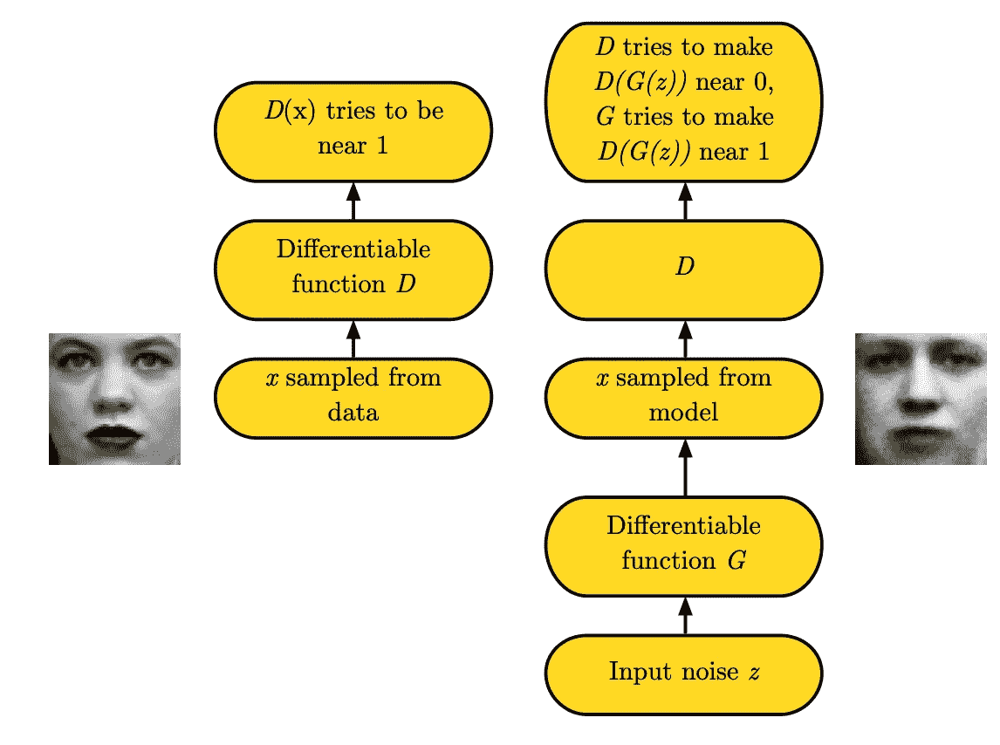
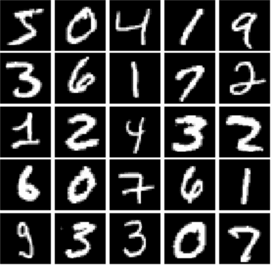
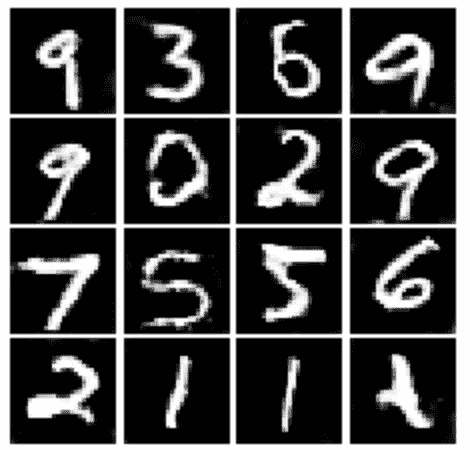

# 深度卷积生成对抗网络

> 原文：<https://medium.com/geekculture/deep-convolutional-generative-adversarial-networks-a6a0b0da3253?source=collection_archive---------25----------------------->

在 2014 年， [Goodfellow 等人](https://arxiv.org/abs/1406.2661)提出了生成对抗网络(GAN ),它可以生成与图像数据集中的图像相似的图像，而不需要训练标签。从那以后，研究界开始接受 GANs，并且不断有关于 GANs 的新论文发表。我将向您展示 GAN 的基本结构，以及如何构建 GAN 来生成 [MNIST 数字](http://yann.lecun.com/exdb/mnist/)。随附的 Colab 笔记本在[这里](https://colab.research.google.com/drive/1xniGgjynsrceFKEVSlt_FPXDHqkQQAGR?usp=sharing)有售。

GAN 由一个生成器网络(G)和一个鉴别器网络(D)组成，每个网络都是一个具有潜在卷积层的神经网络。鉴别器接收一幅图像，并试图辨别该图像是真的还是假的，而生成器接收高斯噪声并输出一幅图像，试图欺骗鉴别器，使其相信假图像是真的。甘的设置就像一盘棋，每个玩家都试图让他的对手失败。

image from [Goodfellow’s NIPS 2016 Tutorial](https://arxiv.org/pdf/1701.00160.pdf)

训练的每次迭代包括两个步骤。首先，鉴别器被给予来自未标记的训练数据集的一批真实数据和由生成器生成的另一批虚假数据，并且鉴别器使用梯度下降来更新其参数，以最大化其正确区分虚假和真实图像的能力，就像在图像分类的情况下一样。第二，生成器接受高斯噪声，输出一批假图像。鉴别器接收一批假图像，并输出它对这些图像是真实图像的置信度。然后，发生器使用梯度下降来更新其参数，以最大化鉴别器的置信度，即当这些图像是假的时，它们是真实的。在每一步中，只有 GAN 的一部分(鉴别器或发生器)更新其参数。

随着训练的进行，鉴别器在区分真实和虚假图像方面变得更好，而生成器必须产生更真实的图像才能骗过鉴别器。在训练结束时，我们的希望是生成器将产生与真实图像无法区分的假图像。

现在，我们将通过一个真实的例子来尝试生成 MNIST 数字。我们将使用 PyTorch 和 NumPy 来完成这个任务。

real MNIST images

让我们首先用公式表示发生器和鉴别器的损耗函数。

鉴别器输出[0，1]范围内的数字。对于真实图像，它希望输出接近 1 的数字，而对于虚假图像，它希望输出接近 0 的数字，因此一个好的损失函数应该是(D(真实图像)-1) + D(G(高斯噪声))。

生成器希望鉴别器为它生成的假图像输出接近 1 的数字，因此一个好的损失函数应该是(D(G(gaussian_noise))-1)。

这是论文[这里](https://arxiv.org/abs/1611.04076)使用的损失函数，他们声称最小二乘损失比原始的二元交叉熵损失提高了 GANs 的稳定性。python 代码如下所示。因为我们是在一批图像上训练，而不是一张，所以我们另外取损失的平均值。

discriminator loss and generator loss

然后，我们指定鉴别器网络。它由两个卷积层、一个最大池层和两个线性层组成。它使用 LeakyReLU 而不是通常的 ReLU。

discriminator network

这是本文使用的发电机网络[这里](https://arxiv.org/abs/1606.03657)。它接收维数为 96 的高斯噪声。它由 2 个线性层和 2 个卷积转置层组成。步长为 2 的卷积转置层具有将图像上采样 2 倍的效果。在跨距 2 的两个卷积转置层之后，7×7 图像将变成 28×28 图像，这是 MNIST 图像的大小。

generator network

我们将省略实际的训练循环。如果你有兴趣，可以在这里看看我创作的[的 Colab 笔记本。](https://colab.research.google.com/drive/1xniGgjynsrceFKEVSlt_FPXDHqkQQAGR?usp=sharing)

通过运行 Colab 笔记本，我们可以得到看起来相当不错的假图像。

fake images generated

就是这样！现在你知道如何使用 GANs 生成图像了。GANs 的内容比我在这里介绍的要多得多。甘动物园列出了很多关于甘的论文。还有其他生成图像的方法，如[变型自动编码器](https://arxiv.org/abs/1312.6114)和[标准化流程](/swlh/why-i-stopped-using-gan-eccv2020-d2b20dcfe1d)。