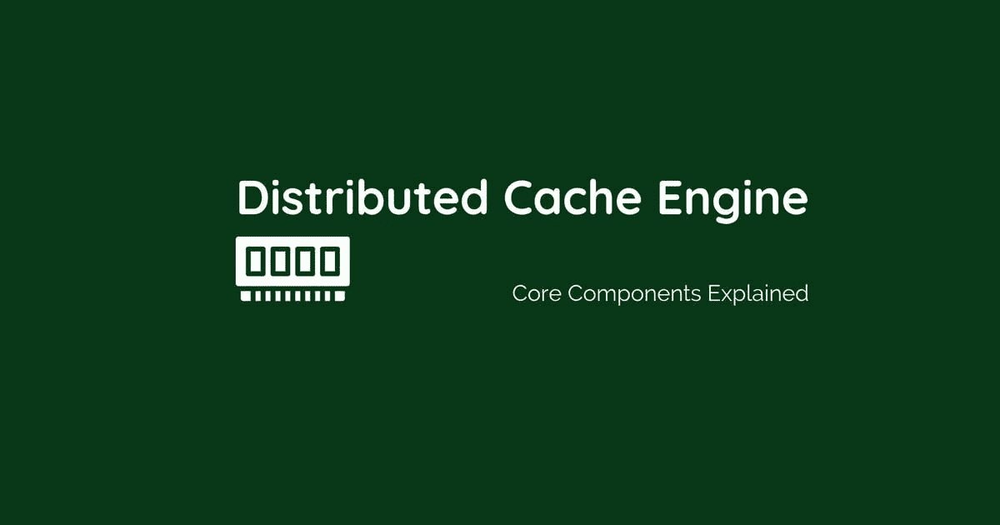

# 深入了解分布式缓存引擎

> 原文：<https://medium.com/geekculture/deep-dive-inside-a-distributed-cache-engine-7bf72c3908b9?source=collection_archive---------20----------------------->

核心组件，同时设计一个分布式、可扩展和容错的缓存系统。

*原载于*[*https://blog.shams-nahid.com*](https://blog.shams-nahid.com/deep-dive-inside-a-distributed-cache-engine)*。*

缓存数据有助于提高应用程序性能。缓存服务失败会给数据库带来极大的负载，导致性能下降，在最糟糕的情况下，会导致服务崩溃。当我们设计缓存服务时，我们应该以尽可能低的成本考虑低延迟。根据不同的场景和应用需求，我们应该选择合适的、经济的缓存机制。缓存机制应该提供，

*   存储数据
*   定义数据的存储方式
*   删除/无效数据
*   定义数据将如何被替换
*   检索数据

# 缓存优势

*   最小化数据库层中复杂查询的计算
*   API 缓存减少`API Gateway -> Application Service`调用
*   数据库缓存可以减少`Application Service -> Database`次查询
*   存储用户的会话数据。例子可以是
*   在电子商务应用程序中存储用户购物车
*   乘客或司机在拼车应用程序中的位置信息

# 缓存的类型

**通读**:应用程序首先去缓存存储器取数据

如果缓存存储中存在数据，它会将数据返回给应用程序

当数据不存在于缓存存储中时，缓存本身从数据库中获取数据

*   它可以将数据保存在缓存中，并将其返回给应用程序
*   它可以首先将数据返回给应用程序，并将数据保存在缓存存储中(更好)

**直写**:存储数据到`Database`可以由`Cache`或者`Application`处理。

当`data persist`由`Cache`处理时，应用首先将数据写入`Cache`存储器，然后`Cache`存储器将数据写入`Database`。这可能很耗时，因为我们需要验证缓存和数据库是否同步保存了数据。如果缓存在数据保存到数据库之前关闭，数据可能会丢失。

**将缓存放在一边**:使用这种方法，数据将保存在应用程序处理的缓存和数据库中。在这种情况下，缓存机制的故障不会丢失数据。

**回写/缓存后写**:另一种混合架构最初可以将数据存储在缓存中，在某个时间段/阈值之后，我们会将所有这些数据作为批量插入保存在数据库中。

**读取/刷新缓存**:数据在用户寻找之前被缓存。使用一些预测引擎或机器学习模型来决定应该加载哪些数据。如果我们知道，用户将寻找追随者饲料，我们将加载它的时刻，用户登录并显示数据时，要求。

# 放置缓存

根据应用程序的需求，我们必须决定缓存和应用服务器之间的距离。

可能是，

*   高速缓存服务器可以与每个应用服务器相连
*   缓存服务器可以在数据库前面的全局位置

如果我们将高速缓存与每个应用服务器放在一起，它将是更快的响应。但是考虑到如果一个服务器出现故障，缓存也会出现故障。此外，服务器之间不会同步缓存数据。

另一方面，如果我们使用全局数据库，即使应用程序失败，缓存数据仍然可用。在这种情况下，虽然这是一个相对较慢的响应，但仍然更准确，我们可以独立地扩展缓存机制。

# 缓存替换/驱逐策略

缓存内存是有限的，我们需要一个明确的策略来确定如何使缓存数据无效。

*   **最近最少使用的**替换之前使用时间最长的数据。
*   **最不常用的**替换使用率很低的数据。
*   **最近使用的**替换最近使用的数据。在这种情况下，数据根据可能被访问的预测进行缓存。只有当数据到达客户端时，缓存中才不再需要这些数据。
*   **FIFO** 通过缓存最新数据来替换缓存中最旧的数据。

# 非功能性需求

在设计分布式缓存机制时，我们必须考虑，

**可伸缩性**:对于一个可伸缩的系统，我们必须考虑多个服务器。为了处理和分发数百万的数据，我们应该将这些缓存数据分发到多个服务器。我们既可以使用一个密钥范围来分发数据，也可以使用一致的散列法来均匀地分发最初在[https://blog.shams-nahid.com](https://blog.shams-nahid.com)发布的数据。所有服务器之间的数据。

**容错**:我们可以使用多台服务器，将每台服务器的数据复制到其他服务器上。在这种情况下，即使一台服务器丢失，我们也可以使用复制的数据。为了管理这种数据复制，我们可以采用以下方法之一，

*   单个主服务器:在这种情况下，单个主服务器负责复制数据，并决定子服务器来定义读操作。
*   多服务器:在某些情况下，正在使用这种方法。
*   没有主人:应用层负责所有的数据复制工作。

**系统拓扑**:他们所有的主/子服务器的数据，他们的读写操作，一个代理服务器来处理`Client SDK`将由拓扑管理器来处理。

当涉及到设计像 Redis 这样的分布式缓存机制时，会有很多问题。这些都是我们设计如此大规模系统时的核心组件。如有任何疑问，请随时联系我们。