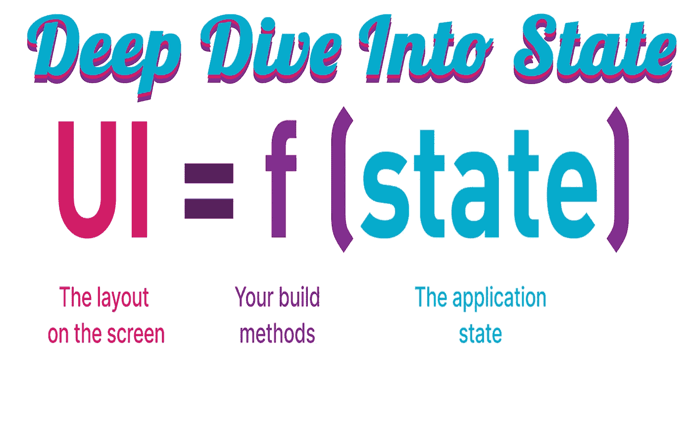

# 深入状态

> 原文：<https://medium.com/geekculture/deep-dive-into-state-34b443da3573?source=collection_archive---------21----------------------->

**猜猜在 Flutter 中理解状态的秘诀是什么？状态解决方案来自不同的小组，他们通过小部件做什么来工作，并使用 OOP 模式来解决特定的状态问题。**

谷歌没有指出这一点，但如果我们只是通过使用继承的小部件的所有变体工作；然后，我们可以深入了解每个二态解决方案是如何工作的。

# **开始状态在** …