# 深度学习——初学者指南

> 原文：<https://medium.com/geekculture/deep-learning-a-to-z-part-1-1d5bd4e9944c?source=collection_archive---------3----------------------->

曾经想知道什么是深度学习，以及它如何改变我们做事的方式。在这一系列教程中，我将深入探讨深度学习领域中使用的术语。一个完整的数学背后的激活函数，损失，函数，优化等等。一路上，我也会分享一些我觉得有用的链接，而不是在文章结尾才提到。

**深度学习:**简而言之， ***“深度学习就是让机器像人脑一样思考和学习”。*** 为了做到这一点科学家们想出了神经网络的概念。术语“深”是指网络的深度。

[吴恩达](https://en.wikipedia.org/wiki/Andrew_Ng)是[谷歌大脑](https://en.wikipedia.org/wiki/Google_Brain)的联合创始人和领导者，他在 2013 年关于[深度学习、自学和无监督特征学习](https://www.youtube.com/watch?v=n1ViNeWhC24)的演讲中很好地解释了这个概念。下图说明了深度学习的必要性。

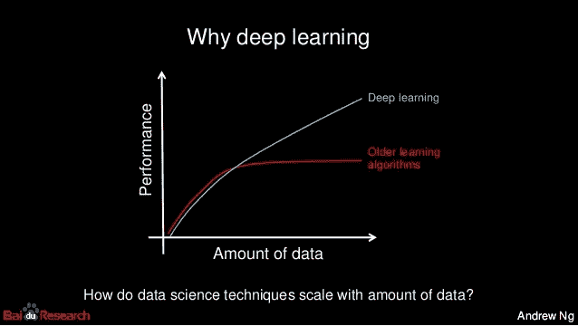

Figure 1 — Need of Deep Learning

**神经网络:**尝试在谷歌中搜索神经网络，你会得到定义 ***“一个模仿人脑和神经系统的计算机系统”。*** 我发现这个定义对于一个门外汉来说更加贴切和简单。神经网络是一系列相互连接的神经元，它们一起工作以产生输出。

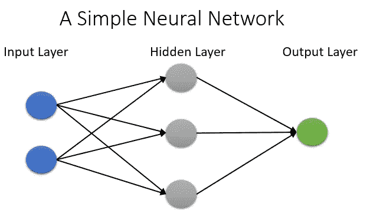

Figure 2 — A Simple Neural Network

第一层是输入层。这一层中的每个节点接受一个输入或一个特征，然后将其输出传递给下一层中的每个节点。同一层内的节点不相连。最后一层产生输出。隐藏层具有与输入或输出无关的神经元。它们被来自前一层节点的输入激活。

现在让我们了解一些与神经网络功能相关的微小细节。我在下面放了一个简化的图表，以便解释概念，使图表不那么笨拙。

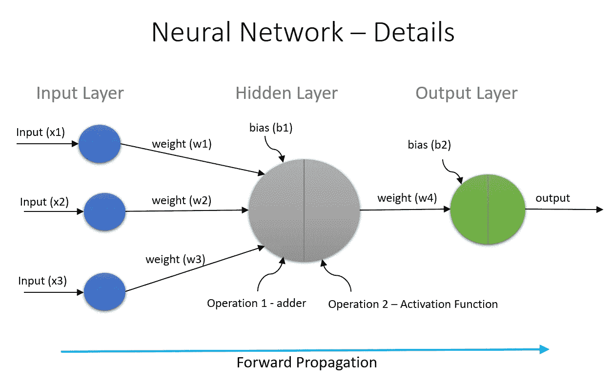

Figure 3 — Neural Network Details

上图中有不少术语。让我们一个一个来看

**输入(x1，x2，x3):** 输入是预测输出所基于的输入值或特征。例如，“通过/失败输出(y)将根据输入的学习时间(x1)、玩耍时间(x2)和睡眠时间(x3)来决定”

**权重(w1，w2，w3):** 权重表示输入的强度。换句话说，权重决定了输入对输出的影响程度。考虑到上面的例子，学习时间可能比其他两个时间更重要。

**Bias (b1):** 在神经网络中加入 Bias，照顾零输入。偏置单元确保神经元即使在全零输入的情况下也将被激活。值得注意的是，这个值不受先前层的影响。如果你知道线性函数 *y = mx + c，*，你可以将偏差与常数*‘c’联系起来。*偏置值允许向左或向右移动激活功能。在这篇 [stackoverflow 帖子](https://stackoverflow.com/questions/2480650/what-is-the-role-of-the-bias-in-neural-networks)中解释得非常好。

# **神经元内的操作**

每个神经元完成的操作总是 2 步。

**加法器或预激活函数:**不确定是否有明确的名称，但我打算将第一个操作称为加法器。在此步骤中，计算输入和权重乘积的总和。在这一步骤中，我们还考虑了偏差。注意，当权重和输入可能变化时，偏差保持不变。它由下面的函数定义:

考虑到我们上面的例子，它可以写成:

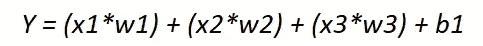

**激活函数:**激活函数取加法器函数计算出的值，将其转换为 0 到 1 之间的数(激活(0)，去激活(1))。该函数根据与模型预测相关的神经元输入，确定是否应该激活(激发)神经元。有许多不同的激活功能，我将在后续文章中介绍它们。下面是一个 Sigmoid 激活函数的描述。

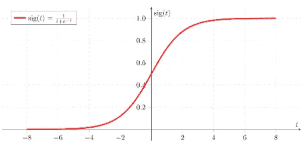

Figure 4 — Sigmoid Activation Function

# 正向传播

计算隐藏层和输出层中的值的完整过程称为正向传播。这种网络也被称为*前馈网络*。请注意，我刚刚显示了一个隐藏层中的计算，其中有一个神经元。在真实的神经网络中，可以有多个隐藏层，每个层中有多个神经元。在产生最终输出之前，在所有层中重复相同的过程。

# 损失函数、反向传播和优化器

在我介绍新概念之前，理解我们为什么需要它们是很重要的。为此，让我们举个例子。我取一条输出(y)值为 1 的记录。我们将建立一个简单的神经网络来根据输入特征 x1、x2、x3 预测该输出。

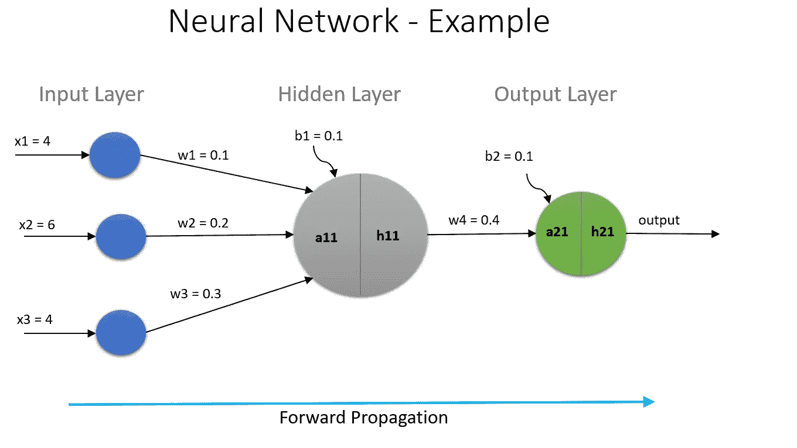

Figure 5— Neural Network Example

如上所述，第一个操作是隐藏层中的加法器功能( *a11* )，随后是激活功能( *h11* )，在这种情况下转换为:

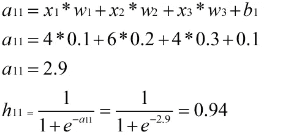

在输出层重复相同的计算，如下所示。注意 *h11* 是来自隐藏层的输入。

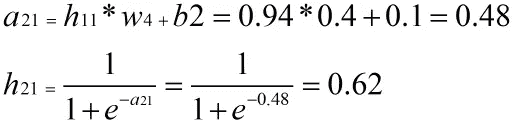

h21 是输出，它只不过是我们的 Y-hat。Y 的真实值是 1。

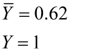

目标应该是使 Y 和 Y-hat 更接近，以便我们在给定一组输入参数的情况下准确预测输出。现在是时候理解关于*损失函数、反向传播*和*优化器的新概念了。*

**损失函数:**简单来说，损失就是神经网络的预测误差，计算损失的方法称为损失函数。有许多不同的损失函数，我将在后续主题中介绍。现在，让我们使用均方误差(MSE)损失函数。考虑我们上面的例子，MSE 是:

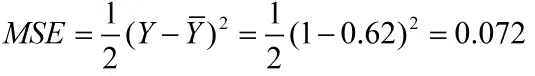

**优化器:**优化器是负责减少损失(Y-Y-hat)的算法或方法。减少损失的方法是更新权重和偏置参数。还有一个参数叫做“学习率”,当我写优化器的时候我会介绍这个参数。有不同的优化器，如梯度下降(GD)，随机梯度下降(SGD)，阿达格拉德，亚当等。

# 反向传播

反向传播的目的是更新权重以减少损失(Y-Y-hat)。它通过考虑损失函数和使用优化器来更新权重来做到这一点。一旦我们完成一组正向传播和反向传播，我们称之为迭代。我们不断重复这一过程，直到我们减少(Y-Y-hat ),以便获得更准确的结果。新术语可以想象如下。

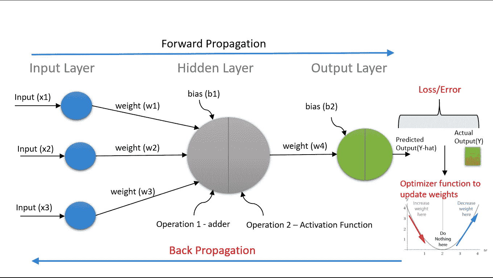

Figure 6 — Back Propagation

所以给你。这是人工神经网络(ANN)的要点。下面的图表描述了行动的顺序，可能有助于消化一些东西。

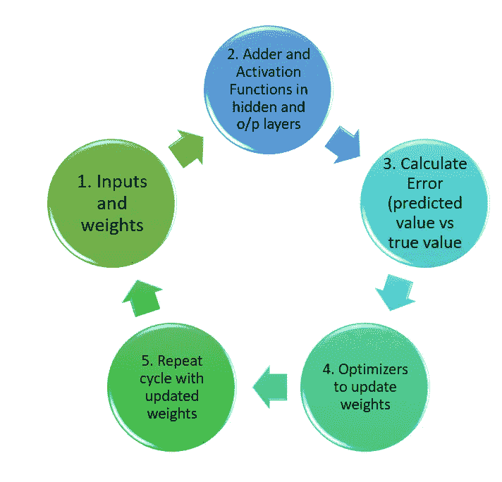

Figure 7 — Learning Cycle

在我的下一篇文章中，我将探索不同的激活功能，并讨论何时使用什么。我希望您对这个广阔而令人兴奋的领域有一个快速的了解。不断学习。

继续阅读本系列的下一篇文章:

[https://srinivas-kulkarni . medium . com/deep-learning-a-to-z-part-2-Mn ist-the-hello-world-of-neural-networks-2429 c 4367086](https://srinivas-kulkarni.medium.com/deep-learning-a-to-z-part-2-mnist-the-hello-world-of-neural-networks-2429c4367086)