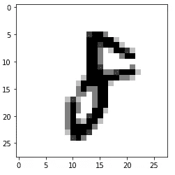
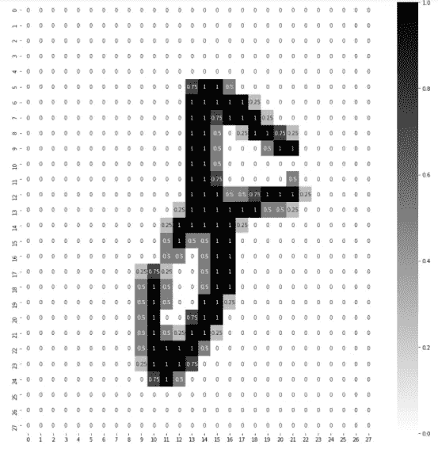
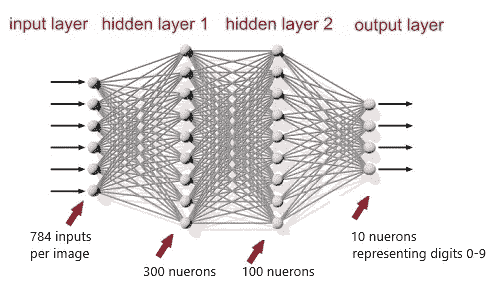
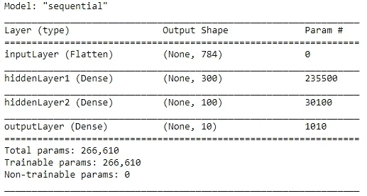
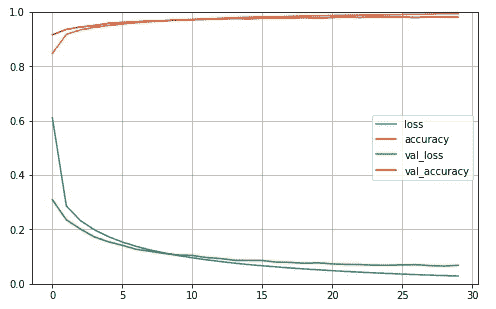

# 深度学习——“你好，世界！”

> 原文：<https://medium.com/geekculture/deep-learning-a-to-z-part-2-mnist-the-hello-world-of-neural-networks-2429c4367086?source=collection_archive---------0----------------------->


这是我上一篇文章的延续。如果你还没有读过，我强烈建议你先读一下，以获得深度学习概念的高层次概述。这是第一部分的链接([深度学习——初学者指南](https://srinivas-kulkarni.medium.com/deep-learning-a-to-z-part-1-1d5bd4e9944c))

我本可以深入到激活函数、损失函数、优化器等更多的理论和数学部分。但是我认为，这是一个好主意，让我们动手实现第一个人工神经网络(ANN)来了解工具集。所以让我们开始吧。

# 安装软件和设置环境

首先，您需要在您的计算机上安装 Anaconda 发行版。如果您还没有，请从 [Anaconda](https://www.anaconda.com/products/individual) 网站下载。安装完成后，您需要设置环境。conda 环境通常是一组相互兼容的相关软件。当您创建一个环境时，anaconda 会创建一个目录，并将该环境的所有相关软件存储在该目录中。按照以下步骤创建环境。

1.  打开 Anaconda 提示符(默认环境显示为(base))并键入以下内容:

```
conda create -n helloworld python==3.6.9conda activate helloworld
```

*你可以在这里* *找到不同 conda 命令* [*的 cheetsheet。*](https://docs.conda.io/projects/conda/en/4.6.0/_downloads/52a95608c49671267e40c689e0bc00ca/conda-cheatsheet.pdf)

2.一旦创建并激活了环境，您需要安装以下软件，这些软件是我们第一次实施 ANN 所需要的。

```
pip install jupyterpip install pandas
pip install matplotlib
pip install seaborn
pip install tensorflow
```

上述软件的快速介绍。

***Jupyter Notebook****允许你编写现场代码，并与他人分享笔记本。今后你会经常用到它。*

****熊猫*** 是一个 python 数据分析库。关键数据结构是数据帧。*

****Matplotlib*** 和 ***Seaborn*** 是数据可视化库，对于探索性数据分析非常有效。*

****Tensorflow*** 是 Google 开发的机器学习和深度学习库。默认情况下，它将安装 tensorflow 的第 2 版。请注意，tensorflow 的 b/w 版本 1 和版本 2 略有不同。我建议你使用最新版本。*

****Keras*** 提供高级 API，并与 tensorflow 2 集成。它是一个构建在 tensorflow 之上的 API 包装器。*

*3.一旦所有的软件安装完毕，在 anaconda 提示符下输入`jupyter notebook`。这将打开一个浏览器窗口。右上方会有一个*【新建】*下拉。从下拉列表中选择*“Python 3”*。从文件菜单中选择*“另存为”*，将笔记本另存为“hello world”。您可以使用以下语句检查 tensorflow 和 Keras 的版本。*

```
*import tensorflow as tf
print(f"tensorflow version: {tf.__version__}")
print(f"Keras version: {tf.keras.__version__}")*
```

*如果你已经走了这么远，管道工程就完成了😌我们现在准备实现我们的第一个人工神经网络。但首先，让我们看看 MNIST 数据集。*

# ***MNIST 数据集***

*MNIST 数据集包含 60，000 幅训练图像和 10，000 幅测试图像。数据集包含从 0 到 9 的手写数字。每个数据点是 28×28 大小的 2D 阵列。我们将使用这个数据集来训练我们的模型，以预测手写数字。这是数据集的视觉图像(来源:[维基百科](https://upload.wikimedia.org/wikipedia/commons/2/27/MnistExamples.png))*

**

*Figure 1 — MNIST Dataset*

# ***我们的第一个安实现***

*现在，我们准备出发了😃我只是想让你知道，现在可能还有一些事情没有被很好地理解。我将试着简要地写一下它们。在接下来的文章中将会更详细地介绍它们。这里的目的是向您介绍深度学习工具集的世界以及如何使用它们。*

***加载库并导入 MINST 数据集:**第一步是加载库并导入数据集。MNIST 数据集现在作为 Keras 数据集的一部分捆绑在一起。下面是执行此操作的代码:*

```
*import numpy as np
import matplotlib.pyplot as plt
import pandas as pd
import os
import tensorflow as tf
import seaborn as sns# Step 1\. Load train and test data set.
mnist = tf.keras.datasets.mnist
(X_train_full, y_train_full), (X_test, y_test) = mnist.load_data() # Step 2\. check the size of training and test datasets print(X_train_full.dtype, "-", X_train_full.shape)
print(y_train_full.dtype, "-", y_train_full.shape)
print(X_test.dtype, "-", X_test.shape)
print(y_test.dtype, "-", y_test.shape)# Step 3\. Randomly check one of the data points.
X_train_full[30]
y_train_full[30]*
```

*代码是自我解释的，没有什么复杂的。当您执行`X_train_full[30],`时，它将显示一个 28 X 28 的 2D 数组，数值范围从 b/w 0 到 255，因为每个数据点的大小都是 28 X 28。`dtype`是`unit8`，它保存值 b/w 0 和 255。*

***缩放数据并创建验证集:**下一步是缩放数据 b/w 0 和 1 并创建验证数据集。对于验证数据集，我们将把`X_train_full, y_train_full`分为`X_valid, X_train`和`y_valid, y_train`两组。*

```
*# Scale the data b/w 0 and 1 by dividing it by 255 as its unsigned int
X_train_full = X_train_full/255.
X_test = X_test/255.# View the matrix now. The values will be b/w 0 and 1 X_train_full[30]# Create the validation data from training data.
X_valid, X_train = X_train_full[:5000], X_train_full[5000:]
y_valid, y_train = y_train_full[:5000], y_train_full[5000:]X_train.shape
# should give o/p of (55000, 28, 28)X_valid.shape
# should give o/p of (5000, 28, 28)*
```

*我们有 5000 条记录的验证集和 55000 条记录的训练集。对了，我们到现在都没用过 matplotlib 和 seaborn。让我们用它们来看看朱庇特笔记本中的图像。执行下面的代码来查看实际图像的输出以及图像的热图。*

```
*# view the actual image at index 30
plt.imshow(X_train[30], cmap='binary')*
```

*上面的输出将如下所示:*

**

*Figure 2: visual image at index 30*

```
*# Lets look at the pixels in detail using SNSplt.figure(figsize=(15,15))
sns.heatmap(X_train[30], annot=True, cmap='binary')*
```

*这段代码显示了完整的 28 X 28 网格，每个像素的数据如下。*

**

*Figure 3: Pixel view of the image*

***模型构建:**现在是时候构建我们的模型了。我第一篇文章中的概念将有助于更好地理解它。下面是构建模型的代码。*

```
*# lets create the model
# Flatten = make the array to sequential layer
# Dense = creating a hidden OR output layerLAYERS = [tf.keras.layers.Flatten(input_shape=[28,28],
name="inputLayer"),
         tf.keras.layers.Dense(300, activation="relu", name="hiddenLayer1"),
         tf.keras.layers.Dense(100, activation="relu", name="hiddenLayer2"),
         tf.keras.layers.Dense(10, activation="softmax", name="outputLayer")]model = tf.keras.models.Sequential(LAYERS)*
```

*这里发生了很多事情。让我解释一下*

*输入层:我们已经展平了 28 X 28 的输入矩阵。这意味着每幅图像将有 28 x 28 = 784 个输入值。*

*隐藏层:我们使用“密集”来创建隐藏和输出层。在上面的代码中，我们创建了两个隐藏层。我们在隐藏层 1 和 2 中有 300 和 100 个神经元。这些只是我选的随机值。现在，您可以选择任何其他值。在后面的教程中，我将展示如何使用 Keras tuner 获得这些值。我在隐藏层中使用“relu”激活功能。再说一次，从现在开始就这样做。随着我们对激活函数的了解，我们会发现更多的激活函数。*

*输出层:输出层有 10 个神经元，因为我们的数据集中有值 b/w 0 和 9。由于我们正在处理多类分类问题，所以我们在输出层使用“softmax”作为激活。*

*你可以想象我们的神经网络如下:*

**

*Figure 4: Deep neural network with 2 hidden layers*

*现在让我们看看模型的概要。它有很多信息需要消化。执行 jupyter 笔记本中的代码`model.summary()`。您应该会看到下面的输出。*

**

*Figure 5: Model Summary*

*它显示了 3 列。“层”列显示了层的名称。“输出形状”栏显示每层中的神经元数量。“Param #”是需要理解的列。里面有一些随机数。让我解释一下。*

*Param #是权重和偏差的计算。在 hiddenLayer1 中，我们有 300 个神经元从 inputLayer 的 784 个神经元接收输入。这意味着我们有 300 X 784 = 235200 个重量。偏差等于该层中神经元的数量。在 hiddenLayer1，是 300。所以，如果你把权重和偏差加起来，你会得到 235500 (235200 + 300)。类似地，其他层的值可以计算如下:*

```
*# Param # (Nodes in layer A * Nodes in layer B + Bias)
# hiddenLayer1 = 784*300 + 300 = 235500
# hiddenLayer2 = 300*100 + 100 = 30100
# outputLayer = 100*10 + 10 = 1010# Trainable Params = 235500 + 30100 + 1010 = 266610*
```

*可训练参数是可以被修改以训练模型的权重和偏差的总数。如果你把以上数字加起来，你会得到 266，610。我希望这一点现在已经非常清楚了。让我们继续。*

***权重和偏差:**让我们来看看权重和偏差。我们可以使用下面的代码来查看初始分配的权重和偏差。*

```
*hidden1 = model.layers[1]
weights, biases = hidden1.get_weights()#weights should be a metrics of 784 X 300 and biases should be 300
weights.shape
biases.shapeprint(weights)
print(biases)*
```

*当您执行 print 语句时，您将看到权重的随机值和所有偏差的 0 值。当模型在反向传播期间开始学习时，这些信息被更新。*

***损失函数，反向传播优化器:**我们现在需要定义反向传播的操作。我们需要设置要使用的损失函数、更新权重和偏差的优化器以及准确性的度量标准。*

```
*LOSS_FUNCTION = "sparse_categorical_crossentropy"
OPTIMIZER = "SGD"
METRICS = ["accuracy"]model.compile(loss=LOSS_FUNCTION,
             optimizer=OPTIMIZER,
             metrics=METRICS)*
```

*我使用`sparse_catagorical_crossentropy`作为损失函数，使用`stochastic gradient descent`作为优化器。我将在以后的文章中写更多关于这些的内容。指标指定了我们想要用来作为评估模型性能的度量的参数。一旦所有这些都选择好了，我们就在模型上调用编译方法。*

***模特训练:**是时候训练我们的模特了，看看她的表现如何。我们需要理解一个新术语，它叫做纪元。简单地说，epoch 是模型在训练期间必须被评估的次数。*

```
*EPOCHS = 30
VALIDATION_SET = (X_valid, y_valid)history = model.fit(X_train, y_train, epochs=EPOCHS,
                   validation_data=VALIDATION_SET)*
```

*在上面的代码中，我们定义了 30 个历元，这意味着模型必须进行 30 次正向传播和反向传播。验证集用于对照训练数据集验证模型。当执行代码时，您将看到如下输出:*

```
*Epoch 1/30
1719/1719 [==============================] - 5s 3ms/step - loss: 0.6110 - accuracy: 0.8479 - val_loss: 0.3095 - val_accuracy: 0.9162
Epoch 2/30
1719/1719 [==============================] - 5s 3ms/step - loss: 0.2867 - accuracy: 0.9175 - val_loss: 0.2354 - val_accuracy: 0.9360
Epoch 3/30
1719/1719 [==============================] - 5s 3ms/step - loss: 0.2328 - accuracy: 0.9341 - val_loss: 0.2017 - val_accuracy: 0.9450
Epoch 4/30
1719/1719 [==============================] - 6s 3ms/step - loss: 0.1986 - accuracy: 0.9433 - val_loss: 0.1725 - val_accuracy: 0.9506
...
...
...
...
Epoch 30/30
1719/1719 [==============================] - 6s 3ms/step - loss: 0.0285 - accuracy: 0.9937 - val_loss: 0.0681 - val_accuracy: 0.9808*
```

***批次大小和批次数量:**当模型被训练时，它不会在每次迭代中传递一个输入。相反，它需要批量大小。`fit`方法有一个 batch_size 参数，如果没有指定，这个参数默认为 32。因此，在我们的例子中，考虑到批量大小为 32，训练集为 55000，我们得到的批量数为 1719。*

*以下是输出的所有参数的简要说明:*

```
*# Epoch 1/30
# 1719/1719 [==============================] - 5s 3ms/step - loss: 0.6110 - accuracy: 0.8479 - val_loss: 0.3095 - val_accuracy: 0.9162# default batch size=32
# No. of batches = X_train.shape/batch_size = 55000/32 = 1719# 1719 = No of batches
# 5s = 5 seconds for one single Epoch
# 3ms/step = time taken for one batch
# loss: 0.6110 = training loss (summation of all losses in all batches)
# accuracy: 0.8479 = training accuracy (summation for all batches)
# val_loss: 0.3095 = validation loss
# val_accuracy: 0.9162 = validation accuracy*
```

*当您观察模型训练的输出时，您可以看到准确性在每个历元之后都在提高。这表明该模型通过调整作为可训练参数的权重和偏差来学习。我们可以直观地看到模型如何使用我们在模型训练期间捕获的`history`来减少损失和提高准确性。下面是代码和可视化表示*

```
*pd.DataFrame(history.history).plot(figsize=(8,5))
plt.grid(True)
plt.gca().set_ylim(0,1)
plt.show()*
```

**

*Figure 5: loss and accuracy*

*从上图可以清楚地看出，在 20 个时期(x 轴)之后，模型没有学到多少东西。我们有优化的方法，我们将在接下来的文章中讨论如何优化。*

*模型测试:现在让我们根据我们在开始时创建的测试数据来测试我们的模型，看看它的表现如何。实现这一点的代码非常简单。*

```
*# validate against test data now
model.evaluate(X_test, y_test)#Output:
#313/313 [==============================] - 1s 2ms/step - loss: #0.0734 - accuracy: 0.9763*
```

*从输出中可以看出，损失和精度非常接近验证数据集(val _ loss:0.0681-val _ accuracy:0.9808)。我们可以对此进行调整，但这超出了本文的范围。*

*现在让我们从测试数据集中抽取一些样本，看看我们是否得到了正确的预测:*

```
*X_new = X_test[:3]
y_pred = np.argmax(model.predict(X_new), axis=-1)
y_test_new = y_test[:3]for data, pred, actual in zip(X_new, y_pred, y_test_new):
    plt.imshow(data, cmap="binary")
    plt.title(f"Predicted: {pred}, Actual: {actual}")
    plt.axis('off')
    plt.show()
    print("---"*20)*
```

*我们从测试数据中提取前 3 个值，并尝试预测这些值。然后，我们将预测值与循环中的实际值进行比较。我的 3 个预测都是正确的。你可以尝试一些其他的随机样本，或者将一些手写的图像转换成 28 X 28 像素，看看这个模型的表现如何。*

*这就完成了我们深度学习的*‘hello world’*。在结束这篇文章之前，我想展示另一个工具，它可以非常方便地可视化检查模型。这个工具叫做***‘Netron’。你既可以从 [github](https://github.com/lutzroeder/netron) 位置下载，也可以使用网址[https://netron.app/](https://netron.app/)直接在浏览器窗口打开你保存的模型。我将让您更多地探索这个工具，它对于初次学习来说非常方便。****

*你可以参考 jupyter 笔记本的 MNIST 实现[这里](https://github.com/srinivaskulkarni2020/deep-learning/blob/main/MyFirstANN.ipynb)。*

*嗯……如果你读到这一行，并且至少理解了文章的 40%,你就已经达到了前进的目标。不断学习。*