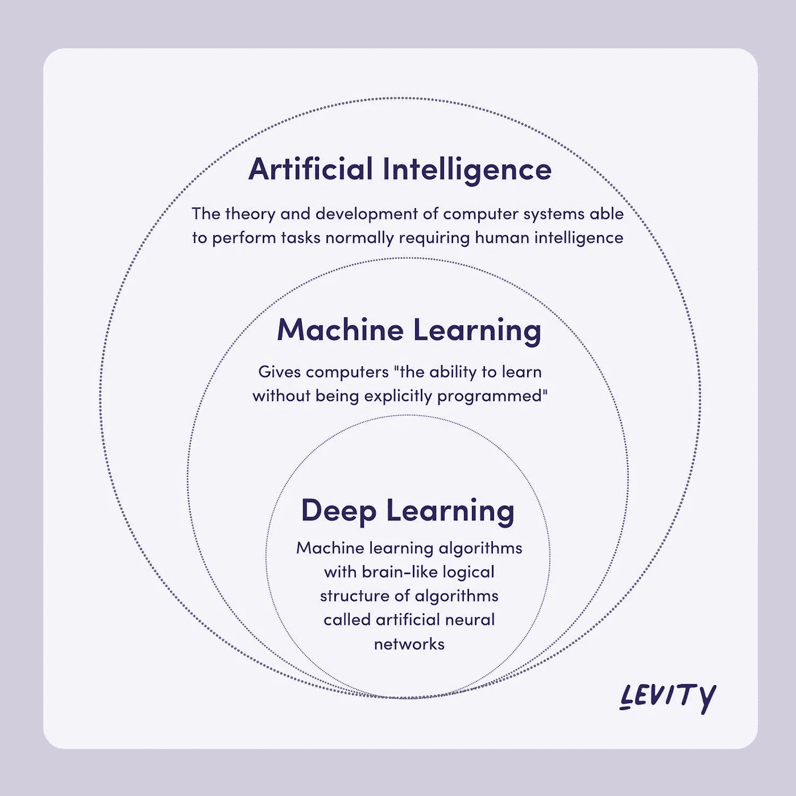
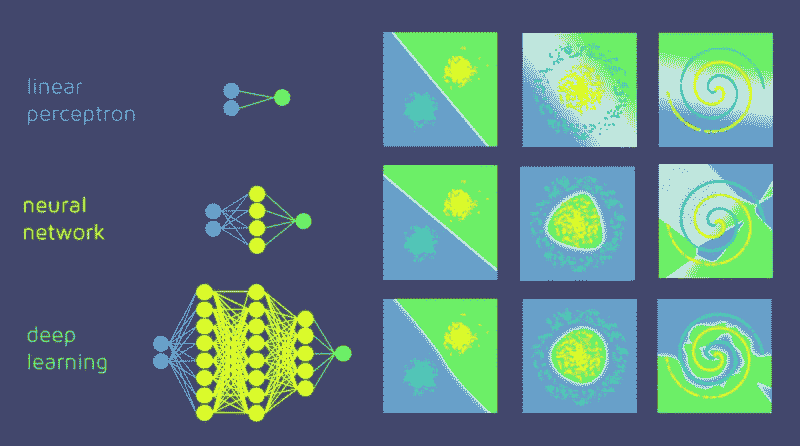
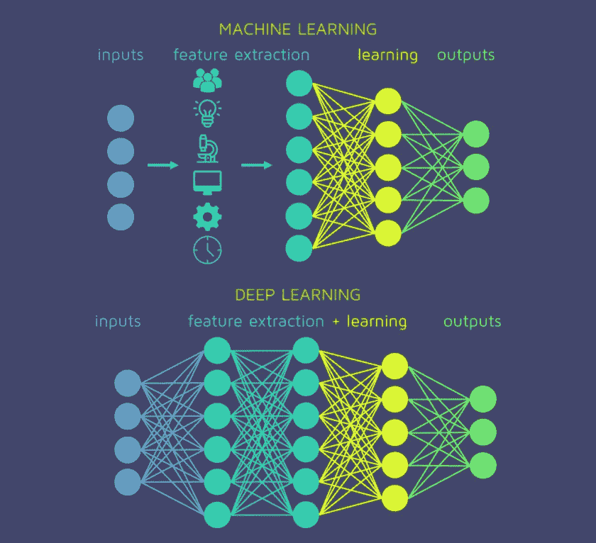
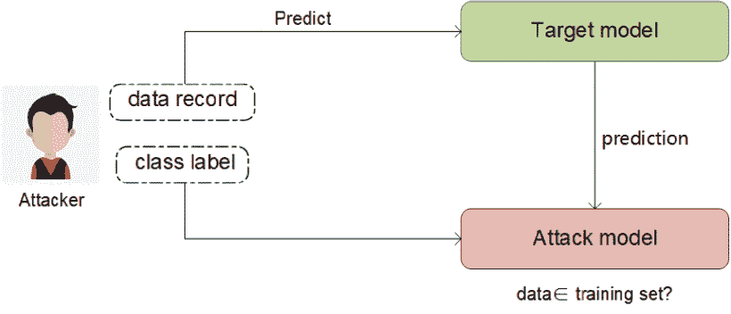
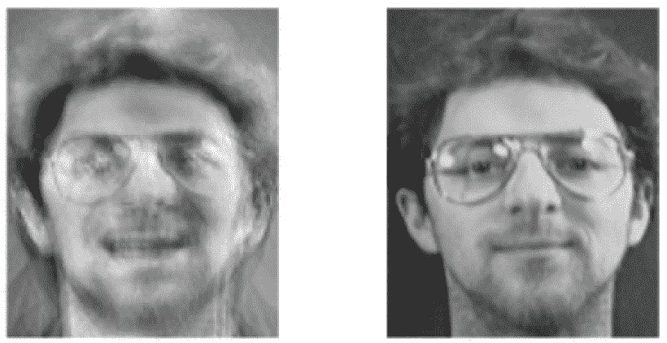
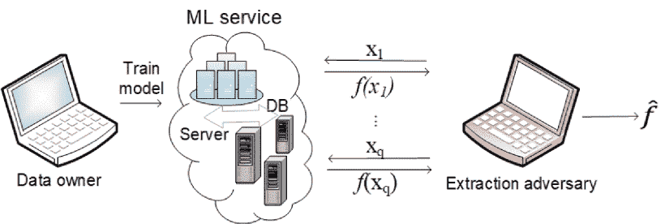

# 深度学习及其隐私挑战

> 原文：<https://medium.com/geekculture/deep-learning-and-its-privacy-challenges-eb74a5601e5f?source=collection_archive---------15----------------------->

当应用于深度学习时，隐私期望如何变化

Photo by [**Francesco Ungaro**](https://www.pexels.com/@francesco-ungaro?utm_content=attributionCopyText&utm_medium=referral&utm_source=pexels) from [**Pexels**](https://www.pexels.com/photo/metal-stairs-underwater-3205267/?utm_content=attributionCopyText&utm_medium=referral&utm_source=pexels)

*改善就是改变；完美意味着经常改变——温斯顿·丘吉尔*

隐私，使消费者更喜欢某项服务的信任底线。毕竟，如果你的活动和数据有可能被用来识别你的身份，你为什么还要选择一个应用程序、一个网络服务或一个设备呢？当然，有很多方法可以通过匿名化、添加噪声等来确保数据的隐私。事实上，我已经谈到了一种叫做[的酷技术，以及它如何在更简单的算法和机器学习(ML)模型的情况下工作](/geekculture/can-differential-privacy-hide-your-love-for-hawaiian-pizza-3b5cf78612d9)。在这个故事中，我将谈论当深度学习(DL)参与进来时，隐私要求如何采取不同的形式，即**深度学习模型的隐私要求与你已经知道的隐私要求有什么不同**。

那么，为什么当涉及到深度学习时，隐私预期会发生变化呢？答案可能在于深度学习和机器学习有什么不同。让我在此基础上略谈一下。

人工智能领域的机器学习和深度学习的层次非常简单。

[Source](https://levity.ai/blog/difference-machine-learning-deep-learning)

**深度学习是机器学习的一个专门子集**，或者我们可以说深度学习是机器学习，但有特殊的骑手。

那么深度学习模型是由什么组成的呢？

使用模拟驻留在我们大脑中的神经网络的网络实现的人工智能被称为神经网络。类似于生物神经元，神经网络构建模块被称为**神经元**。每个神经元都有一个传播函数和一个激活函数，传播函数根据分配的权重、偏差和网络中的现有噪声来组合输入，激活函数会扭曲先前的组合并为网络提供非线性。这些神经元通过分层架构得到最好的利用，其中每一层做一些工作并将结果传递给下一层。例如，为了对手势图像进行分类，输入层神经元将致力于识别边缘，下一层可以区分背景中手的颜色或手指和拇指的位置，等等。直到我们到达映射到预期类的输出层。每一层都建立在前一层所学知识的基础上，并将其传递给下一层。**最简单的神经网络由两层组成，输入和输出，称为感知器**。在神经网络中增加隐藏层以获得更好的学习效果。随着隐藏层数量的增加，网络架构变得更深，因此被称为深度学习模型。

[Source](https://quantdare.com/from-the-neuron-to-the-net/)

机器学习模型训练起来更快，也更容易理解。此外，它们不需要像 GPU 这样的特殊硬件。但是深度学习的复杂性具有多方面的优势，使得这种令人毛骨悚然的困惑是值得的。**最大的优势是最少需要人工干预**。虽然机器学习模型依赖人类进行特征工程，但 DL 模型本身也是如此。

[Source](https://quantdare.com/what-is-the-difference-between-deep-learning-and-machine-learning/)

当模型需要自主工作和处理未知类时，这个属性变得很重要；例如手势识别、面部识别或自动驾驶。

深度学习的特性会导致隐私问题，相反，有助于训练数据的隐私保护。**对 DL 模型的隐私威胁可能发生在训练和预测阶段**。

在训练阶段，威胁与模型的结构更密切相关。驱动这种行为的概念是模型的过度拟合倾向。神经网络会记住训练数据的一些细节，深度模型尤其具有良好的学习能力。由于已经报道了利用 ML 模型的隐式记忆的隐私攻击，这意味着由 DL 模型形成的内部表示可以用于查询训练数据的敏感细节[。](/wicds/internal-representation-learned-by-neural-networks-and-why-they-are-compared-80a2a9c1e89b)

在预测阶段，隐私泄露有三种主要形式:

*   **成员推断:**这种类型的隐私泄露**旨在检测训练数据集**中出现过的特定记录。攻击者需要一个样本记录，该样本记录可以是合成数据或从训练数据源采样的不相交集，并且目标模型可以作为可查询的黑盒。执行这种攻击的关键方法之一是**影子训练技术**，攻击者在其中构建一个攻击模型。此攻击模型可以识别目标模型行为的差异，并使用目标模型的输出来区分目标模型训练数据集的成员和非成员。攻击者使用数据记录(来自样本)查询目标模型，并获得模型对该记录的预测。预测是记录属于某个类别的概率向量。这个预测向量连同目标记录的标签一起被传递给攻击模型，攻击模型推断该记录是在目标模型的训练数据集中还是在目标模型的训练数据集中。例如，考虑用于训练药物剂量预测模型的医院记录。成员推断攻击可用于推断某个患者是否患有相关疾病。

Membership inference attack. [Source](https://ieeexplore.ieee.org/abstract/document/8683991)

*   **训练数据提取:**当训练好的模型作为白盒可用时，就会发生这种隐私泄露。攻击者由此可以定义元分类器模型，该模型可以被训练来从目标分类器中提取有用的信息。对于训练模型不透明的情况，可以利用公开可用的元数据。例如，由面部识别系统 API 提供的置信度得分可以用于构建攻击模型。用户的可识别图像可以通过简单地访问人脸识别系统并用用户的名字进行查询来获得。不过应该注意的是，这种攻击的有效性非常局限于像人脸识别这样的任务，并且只适用于某些特定类型的模型。

An image was recovered using a model inversion attack. [Source](https://ieeexplore.ieee.org/abstract/document/8683991)

*   **模型提取:**模型提取攻击是**用来提取在私有数据**上训练的模型的参数。如果目标模型的预测性能类似于验证数据集，那么攻击者可以复制模型的功能。由于模型参数和训练集之间有着密切的联系，在黑箱模型参数泄露后，训练集的隐私会进一步暴露。通过连续向黑盒模型提供样本并记录预测向量，可以构建与目标模型 f 相似的模型 fˇ。然后，可以通过求解方程或路径寻找算法来设计用于原始数据重建的决策树。

Model extraction attack. [Source](https://ieeexplore.ieee.org/abstract/document/8683991)

我们看到了深度学习的本质是如何促进隐私泄露的。但弱点可以转化为优势(正如民间故事和众多迪士尼电影所教导的那样)。深度学习算法通常使用**正则化技术**，如 L2 正则化、丢弃等，以防止模型过度拟合，这可能有助于**保护训练数据的隐私**。此外，使用**多重非线性层变换**进行表征学习具有强大的数据抽象能力。除此之外，在仔细考虑其在 DL 阶段方案中的位置后，可以应用类似差分隐私的规定。

来源:

*   [深度学习与机器学习——有什么区别？](https://levity.ai/blog/difference-machine-learning-deep-learning)
*   [从神经元到网络](https://quantdare.com/from-the-neuron-to-the-net/)
*   [深度学习和机器学习有什么区别？](https://quantdare.com/what-is-the-difference-between-deep-learning-and-machine-learning/)
*   [深度学习中的差异隐私保护:挑战、机遇和解决方案](https://ieeexplore.ieee.org/abstract/document/8683991)
*   [针对机器学习模型的成员推理攻击](https://arxiv.org/pdf/1610.05820.pdf)