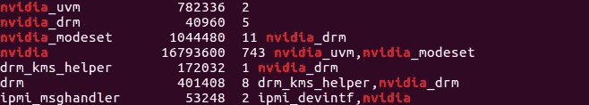
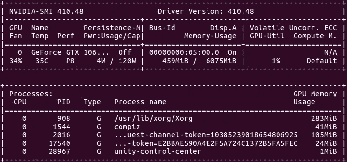
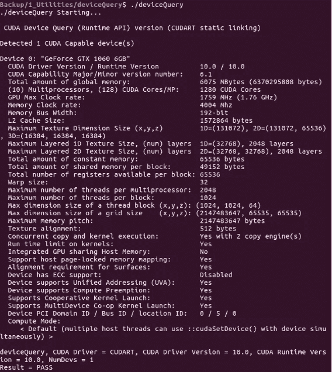

# 从零开始深度学习 GPU 设置

> 原文：<https://medium.com/geekculture/deep-learning-gpu-setup-from-scratch-75f730c49c01?source=collection_archive---------2----------------------->

# 使用 Ubuntu 的深度学习 GPU 驱动的机器设置

在这篇文章中，我试图提供简单的说明。但挑战是每台计算机都有不同的硬件和软件配置，人们想要的东西也不同。没有通用的指令。需要时，广泛搜索你的问题。这是不可避免的。

我将简单介绍一下我的工作系统。系统规格如下:

> *RAM — 16 GB
> 处理器—英特尔酷睿 i5–7400 CPU @ 3.00 GHz×4
> 显卡—GeForce GTX 1060 6GB/PCIe/SSE 2
> 操作系统类型— 64 位
> 磁盘空间— 256 GB*

我的日常工作包括许多各种人工智能模型的训练和测试，因此我需要最大限度地利用我的 GPU。系统配置过程包括以下步骤:

```
*1\. Ubuntu 20.04 installation
2\. Install nvidia driver and verify
3\. Install cuda toolkit and verify
4\. Install cuDNN and verify
5\. Install python and dependent libraries through anaconda platform
6\. Verify GPU utilisation*
```

# 1.Ubuntu 安装

1.  先在这里大致了解一下安装流程[(大概 10 分钟)。](https://tutorials.ubuntu.com/tutorial/tutorial-install-ubuntu-desktop#10)
2.  [下载](https://ubuntu.com/download/desktop) Ubuntu(注:本说明使用桌面版)。选择 LTS(长期支持)版本。截至目前(2021 年)，这将是 Ubuntu 20.04 LTS。
3.  按照这里的说明[为 Ubuntu 创建一个 USB 引导。](https://tutorials.ubuntu.com/tutorial/tutorial-create-a-usb-stick-on-windows#0)

在安装过程中，原始操作系统和数据可能会被破坏。即使设置更改可能是可逆的，原始操作系统也可能是不可引导的，无需重新安装。因此，

> ***总是*** *创建一个* [*恢复*](https://support.microsoft.com/en-us/help/4026852/windows-create-a-recovery-drive) *驱动器和一个镜像* [*备份*](https://support.microsoft.com/en-us/help/17127/windows-back-up-restore) *给你原来的电脑。*

为恢复光盘准备一个 32GB 的 USB 驱动器，为 Ubuntu bootable 准备一个 8GB 的 USB 驱动器。映像备份可以存储在外部驱动器中。

# 2.**安装 Nvidia 驱动程序并验证**

安装完成后，我们可以修复显示驱动程序。首先，找出你需要的驱动程序的[版本](https://www.nvidia.com/Download/index.aspx?lang=en-us)。用内核参数 nomodeset 引导已安装的 Ubuntu 系统。用您需要的驱动程序版本替换下面的 410。

```
$ sudo add-apt-repository ppa:graphics-drivers/ppa
$ sudo apt update
$ sudo apt-get install build-essential
$ sudo apt-get install nvidia-driver-410
$ sudo apt-get install mesa-common-dev
$ sudo apt-get install freeglut3-dev
```

阻止可能破坏驱动程序的自动更新。通过从软件源中删除图形驱动程序 PPA 来实现

```
$ sudo add-apt-repository — r ppa:graphics-drivers/ppa
```

每当更换驱动器时，都需要系统**重启**。为了以后 Ubuntu 安装后的驱动更新，你也可以使用这里展示的[的 GUI 界面](https://www.linuxbabe.com/ubuntu/install-nvidia-driver-ubuntu-18-04)。

现在，您不再需要设置 nomodeset 参数。再练一遍“即插即用”:)。我在 15 分钟内安装了 Ubuntu，但有时整个过程可能需要更长时间，因为会出现意想不到的问题。

使用以下步骤验证 nvidia 安装:

```
$ lsmod | grep nvidia
```

响应将类似于



$ lsmod | grep nvidia

确保禁用新驱动程序。按如下方式输入命令，应该不会显示任何内容。

```
$ lsmod | grep nouveau
```

使用 Nvidia-smi 工具验证驱动程序安装

```
$ watch -n 1 nvidia-smi
```

上述监视命令每秒刷新一次。Nvidia-smi 应该显示类似的内容:



$ watch -n 1 nvidia-smi

# *3。安装 cuda 工具包并验证*

Nvidia CUDA toolkit 提供了一个开发环境来创建 GPU 加速的应用程序。深度学习(DL)平台用它来加速运算，需要为 GPU 安装。

来到[这里](https://developer.nvidia.com/cuda-downloads)选择如下选项。


CUDA TOOLKIT

这将生成上面的指令供您运行。下面是文字形式的。

```
wget https://developer.download.nvidia.com/compute/cuda/repos/ubuntu1804/x86_64/cuda-ubuntu1804.pinsudo mv cuda-ubuntu1804.pin /etc/apt/preferences.d/cuda-repository-pin-600wget https://developer.download.nvidia.com/compute/cuda/11.3.1/local_installers/cuda-repo-ubuntu1804-11-3-local_11.3.1-465.19.01-1_amd64.debsudo dpkg -i cuda-repo-ubuntu1804-11-3-local_11.3.1-465.19.01-1_amd64.debsudo apt-key add /var/cuda-repo-ubuntu1804-11-3-local/7fa2af80.pubsudo apt-get updatesudo apt-get -y install cuda
```

驱动程序版本决定了与您的配置相匹配的 CUDA 工具包版本:[https://docs.nvidia.com/deploy/cuda-compatibility/](https://docs.nvidia.com/deploy/cuda-compatibility/)

认识到 Ubuntu 18.10 是正确的选择，该文档有助于确定什么内核和 C 编译器版本是合适的:[https://docs . NVIDIA . com/cuda/cuda-installation-guide-Linux/index . html](https://docs.nvidia.com/cuda/cuda-installation-guide-linux/index.html)

但是如果在安装 CUDA 的最后一个命令中有依赖问题，可以使用 aptitude。它在这里更好地处理了依赖性问题。

```
sudo apt-get install aptitude
sudo aptitude install cuda
```

在我们的示例中，将安装 CUDA 11.3，您可以在您的环境中设置以下内容。

```
export PATH=$PATH:/usr/local/cuda/bin
export CUDADIR=/usr/local/cuda
export LD_LIBRARY_PATH=$LD_LIBRARY_PATH:/usr/local/cuda/lib64
```

要验证 Cuda 安装，请前往 Cuda 安装时选择的 Cuda 示例位置，并遵循以下步骤:

```
$ cd NVIDIA_CUDA-11.3_Samples_Backup
$make
cd 1_Utilities/deviceQuery
$ ./deviceQuery
```

Cuda 安装成功后，上面的查询应该会显示如下内容:



# ***4。安装 cuDNN 并验证*和**

cuDNN 是面向 DL 的 Nvidia GPU 加速库。从[这里](https://developer.nvidia.com/rdp/cudnn-download)下载 Ubuntu 需要的三个包。然后用下载包的相应名称安装它们。

cuDNN 是最终与您选择的 ML 框架集成的库。该支持矩阵有助于确定正确的版本:[https://docs . NVIDIA . com/deep learning/SDK/cud nn-support-matrix/index . html](https://docs.nvidia.com/deeplearning/sdk/cudnn-support-matrix/index.html)

```
sudo dpkg -i libcudnn7_7.6.5.32-1+cuda10.2_amd64.deb
sudo dpkg -i libcudnn7-dev_7.6.5.32-1+cuda10.2_amd64.deb
sudo dpkg -i libcudnn7-doc_7.6.5.32-1+cuda10.2_amd64.deb
```

您的新环境设置应该设置为:

```
export PATH=$PATH:/usr/local/cuda/bin
export CUDADIR=/usr/local/cuda
export LD_LIBRARY_PATH=$LD_LIBRARY_PATH:/usr/local/cuda/lib64:/usr/local/cuda/extras/CUPTI/lib64
```

按照下面的说明测试安装。如果您可以构建并通过下面的 MNIST 应用程序，那么您的系统已经为 CUDA 和 cuDNN 做好了准备。将代码示例复制到 home ($HOME)位置。

```
$ cp -r /usr/src/cudnn_samples_v7/ $HOME
$ cd $HOME/cudnn_samples_v7/mnistCUDNN
$ make clean && make
$ ./mnistCUDNN
```

如果 cuDNN 已正确安装并运行在您的 Linux 系统上，您将会看到类似以下内容的消息:

```
*Test Passed!*
```

# *5。通过 anaconda 平台安装 python 和依赖库*

从[这里](https://repo.anaconda.com/archive/Anaconda3-2021.05-Linux-x86_64.sh)下载并安装 Anaconda 最新版本的 Linux。

在终端中转到下载的目录并输入

```
$ sudo sh Anaconda3-2021.05-Linux-x86_64.sh
```

重启终端。为了更好地使用 python 库，请使用虚拟环境。我将基于这样的虚拟环境进行演示。选择虚拟环境的名称。由于我广泛从事深度学习项目，我选择将虚拟环境命名为 deep learning。

```
$ conda create -name deeplearning
$ source activate deeplearning
```

虚拟环境提示激活后，安装 opencv、tensorflow、keras 库。

```
(deeplearning)$ conda install -c conda-forge opencv
(deeplearning)$ conda install -c anaconda tensorflow-gpu
(deeplearning)$ conda install -c anaconda keras
```

当提示确认安装依赖项时，输入(Y)yes。

# **6。验证 GPU 利用率**

通过输入以下内容，从虚拟环境中打开 python:

```
(deeplearning)$ python
```

在 python 控制台中输入以下命令:

```
from tensorflow.python.client import device_libdef get_available_gpus():
 local_device_protos = device_lib.list_local_devices()
 return [x.name for x in local_device_protos if                                                                                         x.device_type==‘GPU’]listGPU = get_available_gpus()
```

它应该会列出可用的 GPU。结果会像下面这样:

```
I tensorflow/core/common_runtime/gpu/gpu_device.cc:1
115] created TensorFlow device ([device:GPU:0 with 5111 MB memory) —> physical 
GPU (device: 0, nane: GeForce GTX 1060 6GB, pci bus id: 0000:05:00.0, compute capability : 0.1)
```

# 走向

我很不情愿写这篇文章。软件和硬件配置的变化使得通用指令非常困难。不同的步骤使机器进入不同的状态。不追查你做了什么，就不太可能解决你的问题。广泛搜索你的错误信息。如果您在一个小时内找不到任何提示信息，很可能您的系统状态或配置非常不同。您可能想先从一个更好的已知状态重新开始。也就是说，由于复杂性，我不想在本文中讨论单个故障诊断。我知道你的痛苦，但我发现这样支撑太难了。

当你不熟悉设置过程时，保持简单，不要要求完美。迭代地精炼过程会让你更快地达到目标。如果你找到了一个可以帮助人们的解决方案，请在回复中留言。

另一个挑战是更新这些信息。比如 TensorFlow API 变化非常快，往往不是向后兼容的。如果您发现过时的信息，请列出旧的描述，并说明什么应该是新的。那将对我了解这些变化有很大帮助。

如果你知道更好的做事方法，也请告诉我。保持事情简单。我想应用 80/20 法则:涵盖重要但不是每个角度。