# 使用 Keras 神经网络和 Python(tabby)在 Tableau 中进行深度学习

> 原文：<https://medium.com/geekculture/deep-learning-in-tableau-using-a-keras-neural-network-and-python-tabpy-8f8716c35488?source=collection_archive---------14----------------------->

最近我一直在尝试利用 Tableau 桌面中的分析扩展。我还没有看到任何人整合任何 Keras 深度学习模型，所以我认为探索可能性将是一个很好的挑战。下面我使用了一个包含少数机场航班数据的数据集，试图用 Keras 深度学习模型预测未来的航班是否会延误。然后，我将使用 TabPy 包将模型部署到 Tableau Desktop。


你可以找到我的 GitHub 回购的链接。

下面是教程…好好享受！

**目录**

1.  数据集
2.  不平衡数据
3.  比较其他机器学习分类器
4.  Keras 深度学习神经网络模型
5.  在 Keras 模型上放上泡菜包装纸
6.  使用 Tableau 设置 TabPy 连接
7.  创建 Python 函数并处理虚拟变量
8.  部署 Keras 模型
9.  在 Tableau 中创建参数和计算字段
10.  构建仪表板

**数据集**

在我开始之前，我只想声明，本教程的重点不会与构建深度学习模型的复杂性相关，甚至不会与处理不平衡的数据相关——稍后会详细介绍。重点是将 Keras 模型部署到 Tableau(我还没有看到这样做)，并分享我一路上学到的东西。

数据集和总体思路来自微软的学习模块([见此处](https://docs.microsoft.com/en-us/learn/modules/predict-flight-delays-with-python/))和一个很棒的教程，我从其中借用了很多数据预处理代码([见此处](https://sagnik20.medium.com/predicting-flight-delay-using-machine-learning-models-and-azure-notebook-2a8e69b94bd5))。该数据集由 2016 年期间少数机场的数据组成，包括出发地、目的地、时间、距离、尾号等因素。目标变量将是航班是否延误，我将尝试预测。

**不平衡数据**

这个数据集带来的更独特的挑战之一是它的阶级不平衡。如果数据中的每个类别没有太多的表示或相等的表示，机器学习算法就很难在数据中学习到足够好的模式。在这种情况下，数据中有许多航班被归类为“准时”，但“延误”的航班要少得多。有许多技术可以解决这个问题，例如[欠采样、过采样](https://towardsdatascience.com/oversampling-and-undersampling-5e2bbaf56dcf)，甚至[阈值移动](https://machinelearningmastery.com/threshold-moving-for-imbalanced-classification/)。如果你想阅读一篇关于这个主题的伟大文章，作者探索了一些先进的技术，如 SMOTE，请点击这个链接([在这里找到](https://machinelearningmastery.com/imbalanced-classification-of-good-and-bad-credit/))。

由于本教程的重点不在数据上，我将坚持使用官方 [Keras 教程](https://keras.io/examples/structured_data/imbalanced_classification/)中的一个简单方法。

它在均衡数据方面做得相当好，但是另一种获得均衡类的简单方法是在分割训练集和测试集的数据时对目标变量使用分层分割。Scikit-Learn 有一些很棒很简单的选项，你可以阅读更多的内容(在这里找到)。

**比较其他机器学习分类器**

我现在想说的一点是，深度学习可能不是在这个数据集上进行预测的最佳方法。它当然可以胜过传统的机器学习模型，但通常是在数据集非常大的时候，正如本文中所解释的那样。在深入学习之前，我确实对一些 ML 模型进行了比较。你当然可以花一整天做网格搜索来找到最好的超参数，但我没有。即使数据集很小，深度学习模型仍然优于其他模型。不出所料，模特们很难从少数积极阶层中学习。

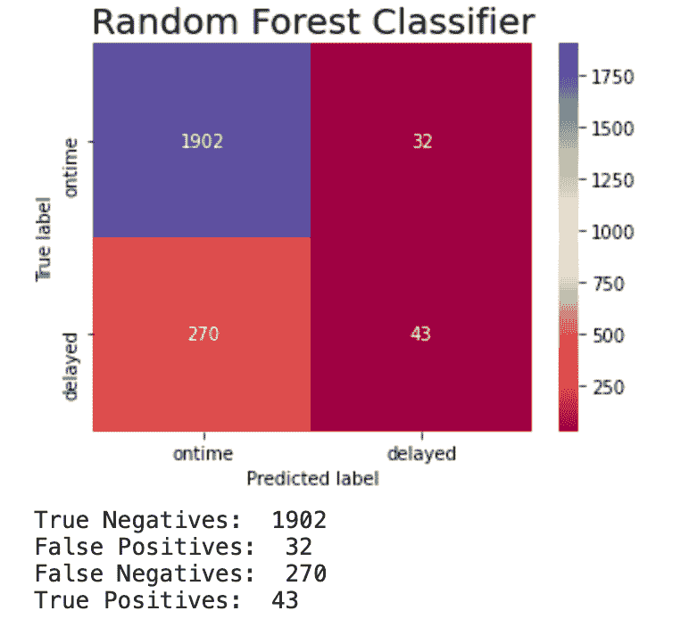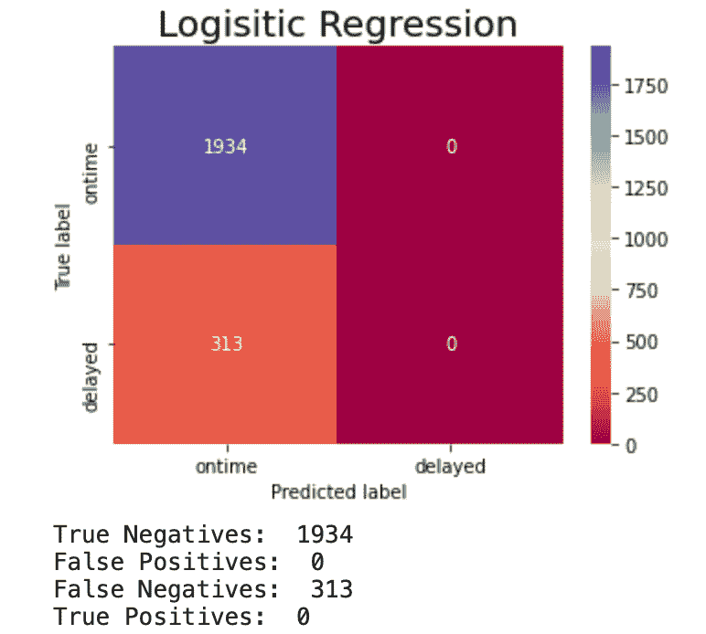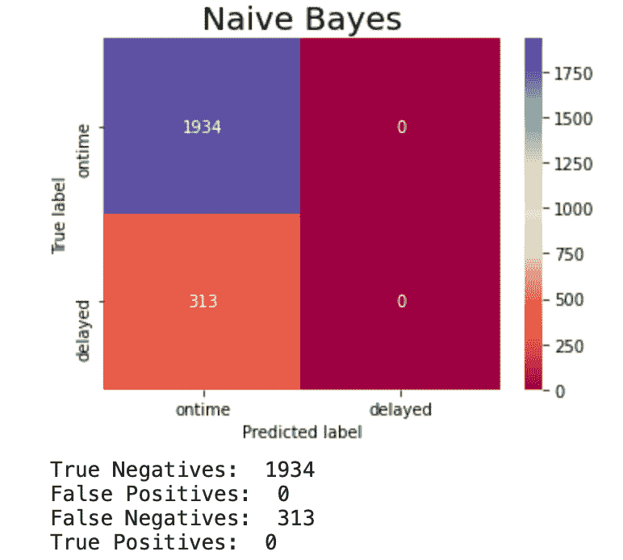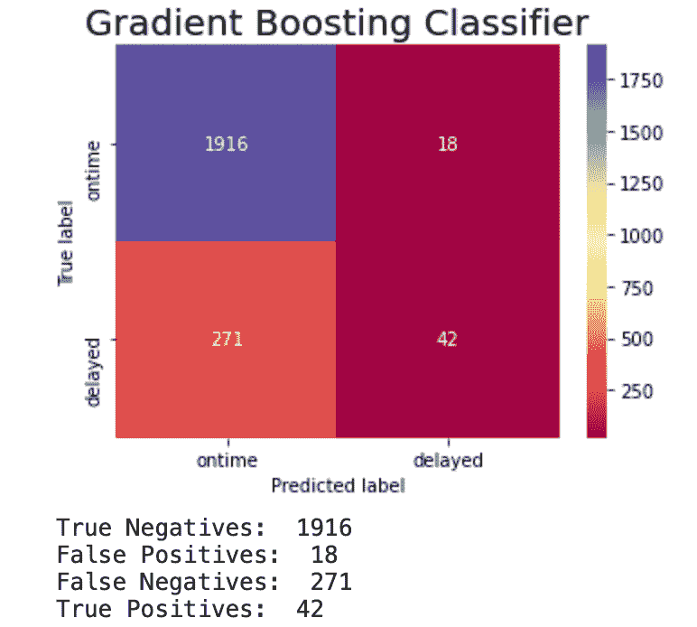

最终这变成了一个商业问题…我们应该最小化假阴性还是最大化真阳性？哪个成本更高？建立模型在很大程度上取决于对这些问题的回答，以及对你想要实现的目标有一个清晰的想法。

这是 Keras 模型。它仍然需要一些调整，但假阴性要低得多，即预测为*准时，但实际上是*延迟的航班。**

**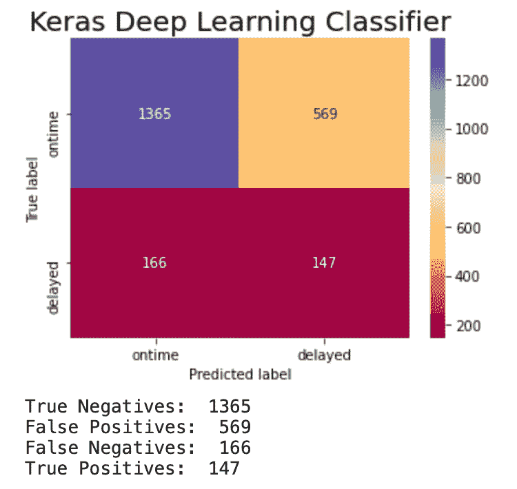**

****Keras 深度学习神经网络模型****

**为了建立模型，我只是参考了这个 [Keras 不平衡分类教程](https://keras.io/examples/structured_data/imbalanced_classification/)并稍微修改了他们的模型。它提供了一个伟大的基础，并进一步建立在以前计算的重量级。在文章的最后，作者提出了一个重要的观点，为进一步的实验指明了方向。一个简单的方法是将 ***weight_for_1*** 变量乘以一个略大于 1.0 的值，也许 1.125 左右的值会更好。**

> **在现实世界中，人们会给第 1 类赋予更高的权重，以反映出假阴性比假阳性的代价更大。**

**这是我非常简单的神经网络。**

****在 Keras 车型上放上泡菜包装纸****

**现在我认为阻碍许多人在 Tableau 上使用 Keras 的一个挑战是很难跨服务器导出模型。你可以在这里了解更多关于这个 [Keras 支持问题](https://github.com/tableau/TabPy/issues/120)。**

**一个变通的办法是在把模型送到 Tableau 之前，简单地对其进行*处理。有一个奇妙的，简单的泡菜包装器叫做 [keras_pickle_wrapper](https://github.com/wwoods/keras_pickle_wrapper) 可以很容易地完成这个任务。***

***最后，这个工作就是正在建造的模型。注意 ***class_weight*** 变量来处理类的不平衡。***

****设置与 Tableau 的 TabPy 连接****

**现在是时候连接 Tableau 了。首先，您可以通过 pip 或其他方法安装 TabPy，然后导入笔记本上的库。你可以按照他们 [GitHub Repo](https://github.com/tableau/TabPy/blob/master/docs/server-install.md#starting-tabpy) 里的说明。点击了解更多关于[tabby 的信息。](https://github.com/tableau/TabPy/blob/master/docs/tabpy-tools.md#deploying-a-function)**

```
**import tabpy
import tabpy_client
from tabpy.tabpy_tools.client import Client**
```

**安装后，您必须导航到您的终端并输入命令:**

```
**tabpy**
```

**接下来转到 Tableau，找到“管理分析扩展连接”选项卡。你可以在这个[帖子中从 Tableau 这里](https://help.tableau.com/current/server/en-us/config_r_tabpy.htm)了解更多信息。**

**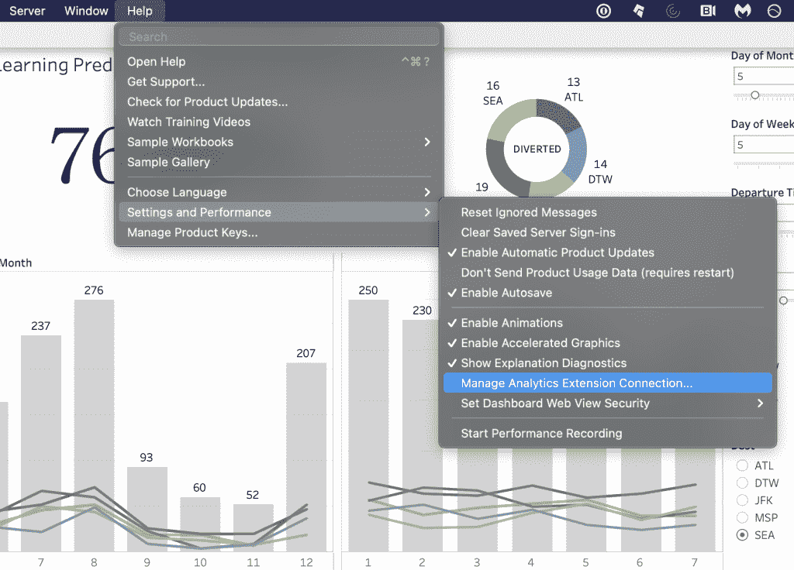**

**然后选择 TabPy，输入“ ***【本地主机】*** ”和 python 使用的端口 ***9004*** 。**

**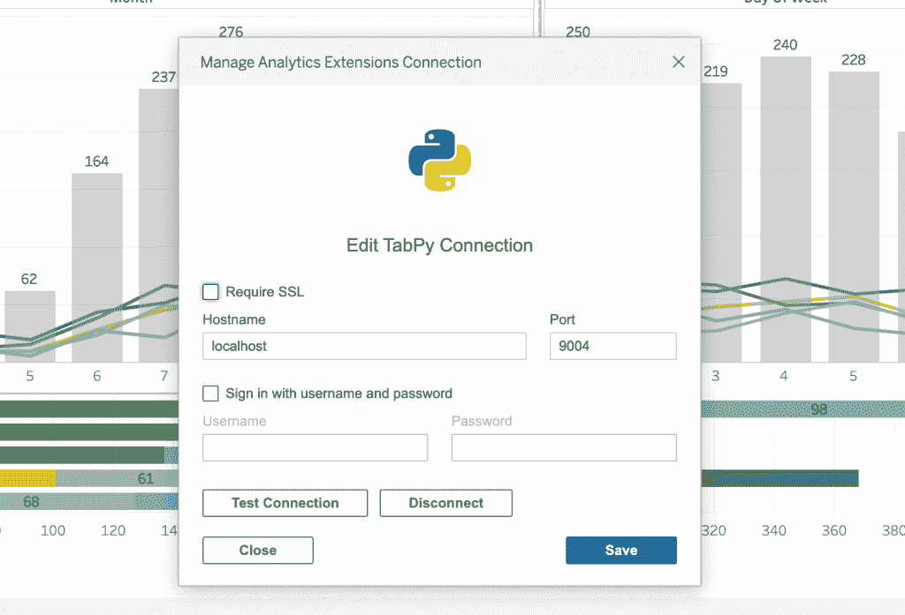**

**最后一步是导航回 python 笔记本并运行以下代码来建立连接。**

```
**client = tabpy_client.Client('http://localhost:9004/')**
```

****创建 Python 函数并处理虚拟变量****

**现在，为了让 Tableau 仪表盘与您的模型进行动态交互，您需要编写一个 python 函数来传递变量。您会注意到，我的函数从 Tableau 获取输入变量，对它们进行转换，将它们放入数据框中，从 pickle 包装器直接进行预测，然后返回一个字符串(Float32 变量将给出一个错误)。**

**在 Tableau 上使用深度学习模型的另一个挑战是，它们通常需要使用虚拟变量来编码分类数据。要转换变量，可以在 python 中运行一些简单的 if else 行。确保访问参数列表的第一个元素，因为 Tableau 的变量存储为列表(例如，使用 **_arg5[0]** )。**

****部署 Keras 模型****

**您还需要最后一个函数来将 python 函数发布到服务器。override 参数允许函数更新其预测。**

****在 Tableau 中创建参数和计算字段****

**现在，您的 python 笔记本已连接并准备就绪，您可以导航回 Tableau 并为此预测创建一个新的计算字段。在这个计算字段中，您将需要访问参数，所以让我们先创建它们。模型中的每个预测变量都需要一个。确保将值和数据类型设置为任何有意义的值和数据类型。例如，一个月中的天数变量需要是从 1 到 30 的整数。**

**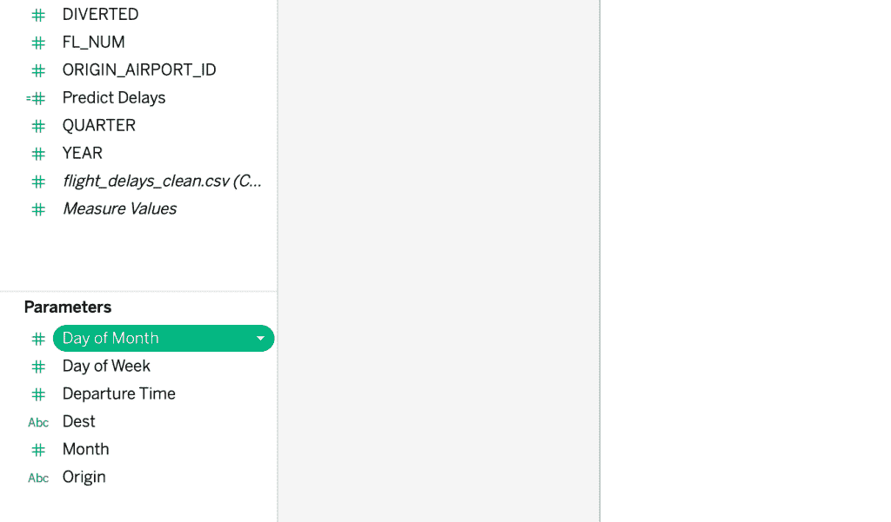****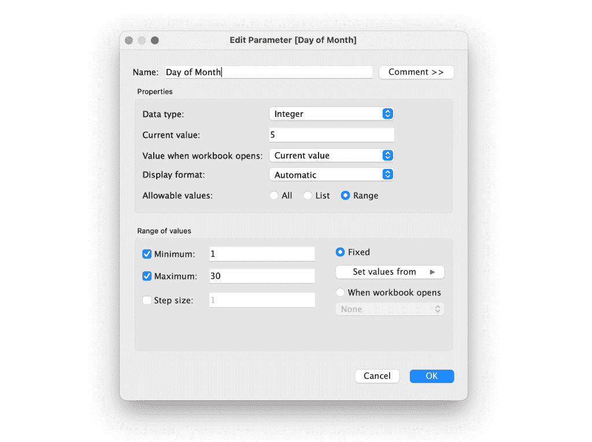**

**现在创建一个计算字段。您可以遵循此表格，从 [Tableau 这里](https://www.tableau.com/about/blog/2017/1/building-advanced-analytics-applications-tabpy-64916)了解更多信息。这里我使用了 **SCRIPT_STR()** 函数，因为 python 预测是以字符串形式返回的，但是我随后将它包装在一个 **FLOAT()** 函数中以将其返回为数字形式(这允许我将它从小数转换为百分比)。您应该使用形式**tabpy . query()[' response ']**与 python 函数进行交互，将函数的名称作为第一个变量，然后将每个变量的一系列参数作为 **_argX** ，后面是下面的参数列表。这些参数将允许您控制传递到 python 深度学习模型中的值。**

**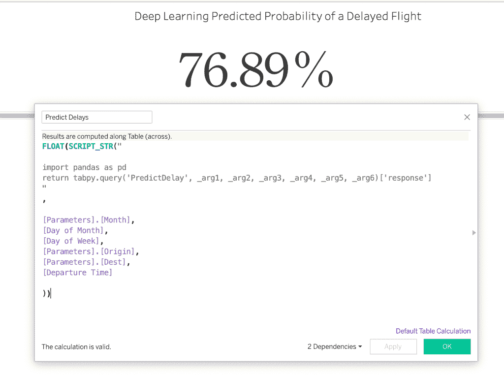**

****构建仪表板****

**现在剩下唯一要做的事情就是构建仪表板。Tableau 中的预测是动态的，这是一个很好的探索工具。您可以通过将参数添加到仪表板上来试验这些参数。但是请记住，预测的好坏取决于数据和模型的质量。**

**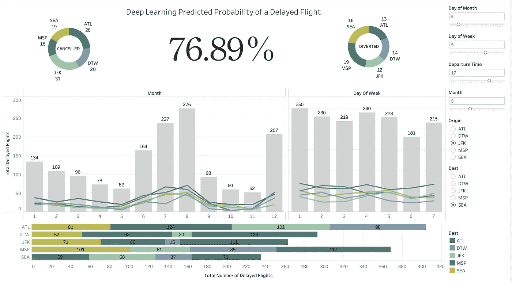**

**这里有一个仪表盘运行的视频！**

**如果你有兴趣下载笔记本，你可以在我的 [GitHub Repo 这里](https://github.com/sam-brady/deeplearning-tableau/blob/main/FlightDelays.twb)找到仪表盘的链接。**

**感谢阅读！**

**请访问我的[个人项目页面](https://samsdataprojects.wordpress.com/)！**

**并且可以随意在 [LinkedIn](https://www.linkedin.com/in/sam-brady-15b726191/) 上加我。**