# 深度学习:意义、动机和神经网络基本结构

> 原文：<https://medium.com/geekculture/deep-learning-meaning-motivation-and-nn-basic-structure-44b57b481e4c?source=collection_archive---------7----------------------->

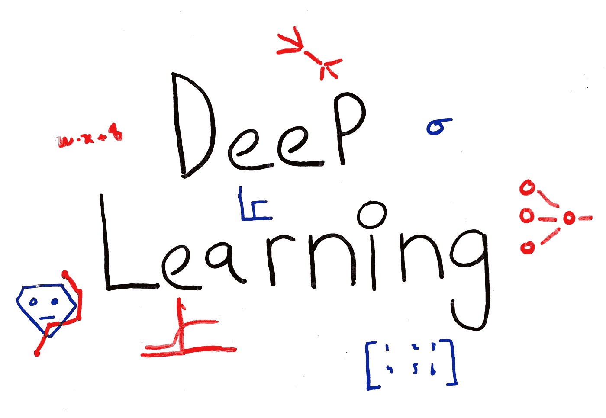

## 什么是深度学习，为什么需要深度学习，通过神经网络最基本的结构了解神经网络

人工智能、机器学习、神经网络:如果你正在阅读这篇文章，这些都是你每天都会听到的时髦词汇。这是有原因的。

人工智能已经成为当今计算机科学中最热门的话题之一，该领域的进步丝毫没有减缓。见鬼，即使你不是计算机科学家，你一生中也至少有一次想过人工智能系统如何变得比人类更聪明，最终接管整个社会。

如今一个更热门的话题是深度学习(DL)，它是人工智能的直接衍生物，据称将带给我们最接近全计算机智能的东西。

> **深度学习**是机器学习的一个子领域，涉及受大脑结构和功能启发的算法，称为**人工神经网络**。*【1】*

在这个定义中有很多东西需要解开，这也是我们在这个新系列文章中要做的事情。

在第一篇文章中，我们将首先描述传统机器学习算法的一些局限性，以及神经网络(NN)如何被用作这些局限性的答案。从那里，我们将通过解释一个神经网络的基本结构，以及如何进一步开发这个基本神经网络来创建高度复杂的 DL 算法，为以后的 DL 文章打下基础。

我写这篇文章的前提是假设您已经了解基本的机器学习概念，例如:

*   什么是机器学习算法
*   监督与非监督学习
*   回归与分类
*   如何训练、验证和测试 ML 算法
*   基本的最大似然算法，如线性回归、逻辑回归等。

如果没有，我会让你参考我写的关于基本机器学习算法和概念的系列文章:

 [## 中等

### 基本机器学习算法和概念列表

ali-h-khanafer.medium.com](https://ali-h-khanafer.medium.com/list/introductory-machine-learning-concepts-44fd6466f471) 

让我们开始吧。

# 传统最大似然算法的局限性

一方面，当你处理简单的数据集时，传统的机器学习算法非常好。如果你研究过线性回归、逻辑回归或 KNN 之类的算法，那么你就有了第一手经验，知道这些算法可以如何很好地解决复杂的问题，例如预测房价或向用户推荐商品。

另一方面，当处理更复杂的数据集，即要素和输出之间的关系不容易理解的数据集时，这些算法可能会变得非常低效。让我们看一个例子。

假设您要使用某种分类算法来确定肿瘤是癌性的还是恶性的。为此，您决定使用肿瘤的两个特征:大小(`x_1`)和硬度(`x_2`)。下面是一些训练数据的绘制示例，其中`O`表示标记为恶性的肿瘤，`X`表示标记为癌性的肿瘤:

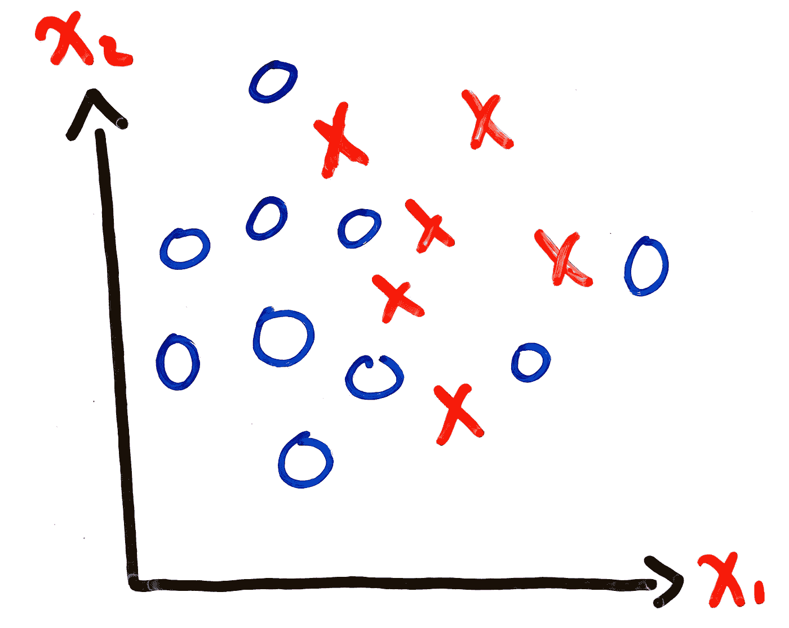

**Figure 1:** Example Tumor Training Data

我们可以用什么样的假设来拟合这个训练数据？以下是几个选项，以及它们的大致决策界限:

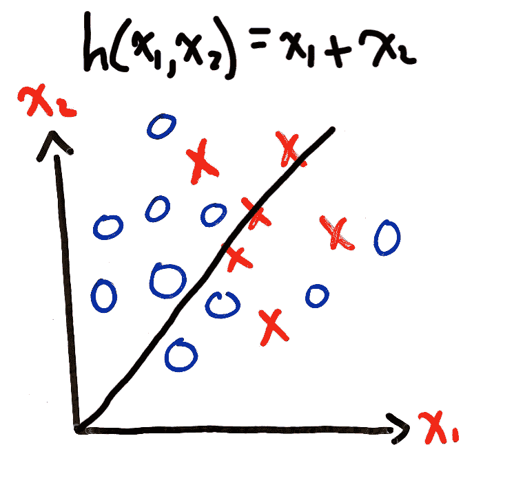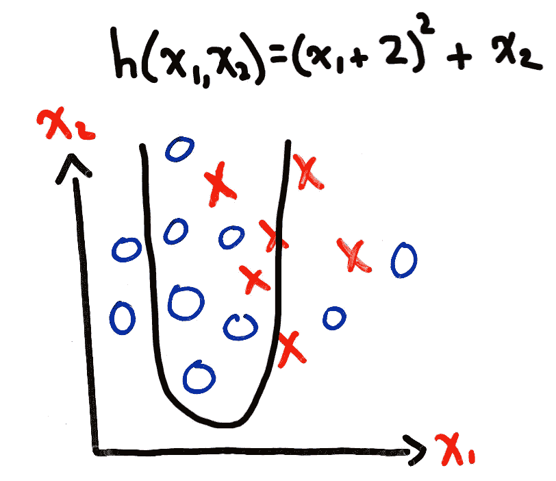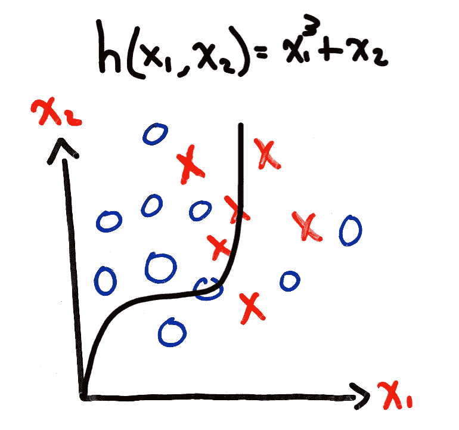

**Figure 2:** Different Hypothesis Possibilities

这些都没有真正成功地对我们的训练集进行正确分类，迫使我们提出一个更复杂的假设，一个更高阶的假设，可能还有更多术语。反过来，这将导致更复杂的决策边界，这可能是我们区分恶性肿瘤和癌性肿瘤所需要的。例如:

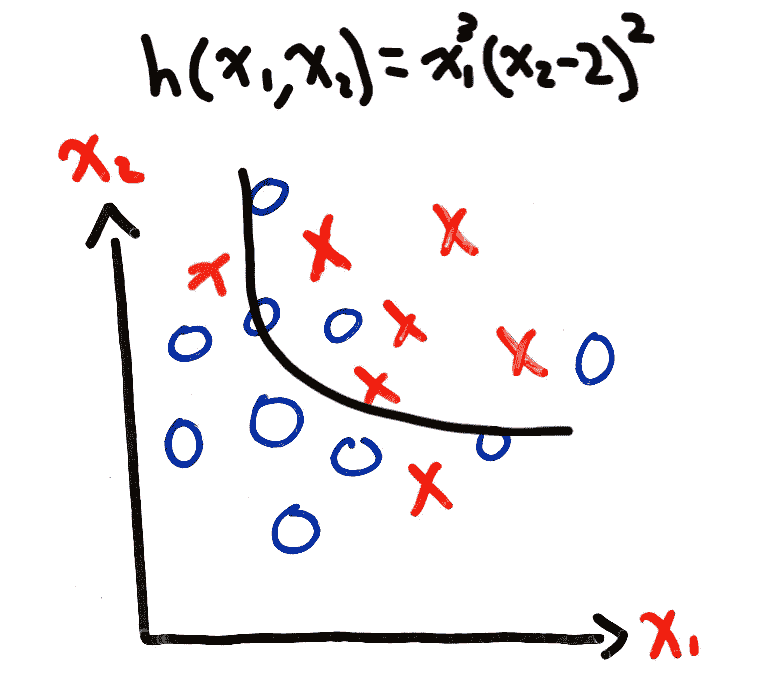

**Figure 3:** Example of a More Complex Hypothesis

好点了，但没那么有说服力。我们能提出一个更详细的假设吗？一个更高的层次，更多的术语？大概吧。我们应该吗？我们愿意走多远？如果一个问题只有两个特征，我们已经有了一个复杂的假设，有很多术语。想象一下，现在，我们要用 100 个特征来解决我们的问题:肿瘤的大小、硬度、患者的性别、年龄等等。最坏的情况是，我们最终不得不采用所有可能的二阶项来形成我们的假设，留给我们一个 10000 项的假设。事实上，对于任何考虑了所有二阶项的假设，我们都会得到`O(n^2)`项，其中`n`是特征的数量:

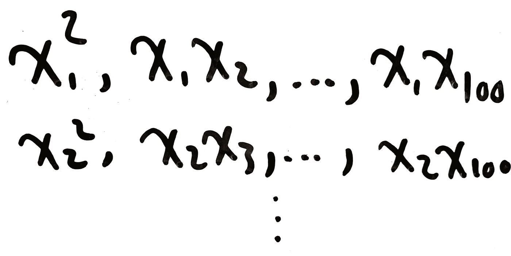

**Figure 4:** Example of All the Possible Second-Order Terms

如果我们考虑所有三阶项，我们最终会得到`O(n^3)`项。那是许多术语。

这是不是很牵强？我们会需要那么多特征或者那么复杂的假设吗？让我们举最后一个例子来说明这一点。

神经网络的一个非常常见的用途是对象识别。例如，给定一个任意的图像，我们希望我们的算法能够识别图像中是否包含一个足球。

处理图像意味着我们的算法将把像素颜色值作为输入。假设我们的图像是灰度图像，图像大小为 800 x 801(这是上面图像的实际大小)，那么我们的特征空间中就有 640800 个特征…在最坏的情况下，如果我们考虑所有的二阶项，这将超过 4000 亿项。想象一下，例如，在自动驾驶汽车中，这将如何表现。

那么解决的办法是什么。现在你可能已经猜到了:神经网络。

# 神经网络

虽然神经网络是在最近十年左右普及的，但它已经存在了一段时间。这个课题是由沃伦·麦卡洛克和沃尔特·皮茨在 20 世纪 40 年代开创的，此后许多其他人对这个领域做出了贡献。1958 年，弗兰克·罗森布拉特创造了**感知器**，一种监督学习分类算法【3】。虽然感知器不再像过去那样被广泛使用，但它是通向今天使用的更现代网络的一个很好的途径，所以我们将从解释它的工作方式开始。

## 感知器

感知器是一种二进制分类算法，它将几个二进制值作为输入，并输出一个二进制值:

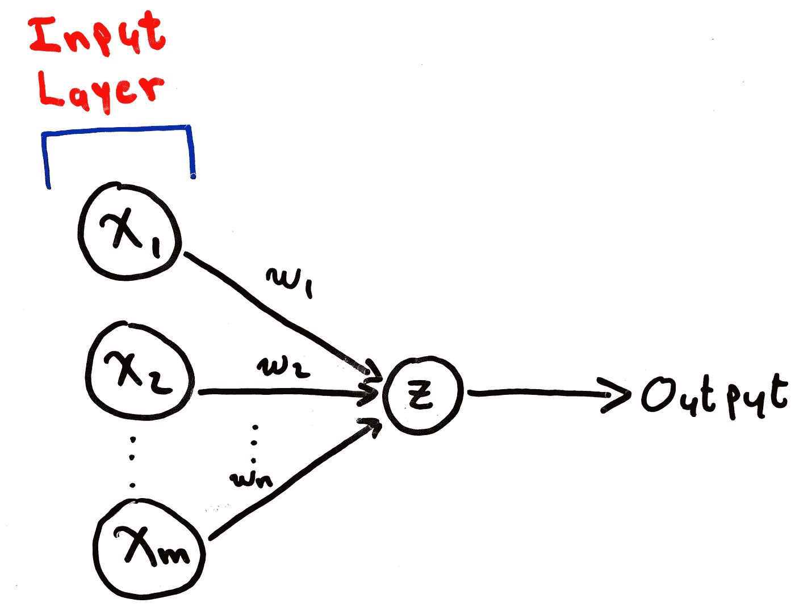

**Figure 5:** Basic Perceptron

**图 5** 是一个最基本的感知器的例子。我们来解释一下它的不同部分。

`x_1,x_2,...,x_m`是`m`二进制输入，它们组成了**输入层**。`w_1,w_2,...,w_n`就是罗森布拉特所说的**砝码**。这些权重用于描述一个输入对总输出的影响。权重较高的输入比权重较低的输入对整体结果的影响更大。所有有箭头进入**和离开**的圆圈代表通过某个函数`z`运行输入的想法，这又会产生一些输出。这些被称为**神经元**。请注意，`x_1,x_2,...,x_m`的圆圈没有箭头进入，只有箭头出来，因此它们不运行任何功能，它们仅仅代表输入。在感知器中，神经元中使用的函数是输入和权重之间的加权和:

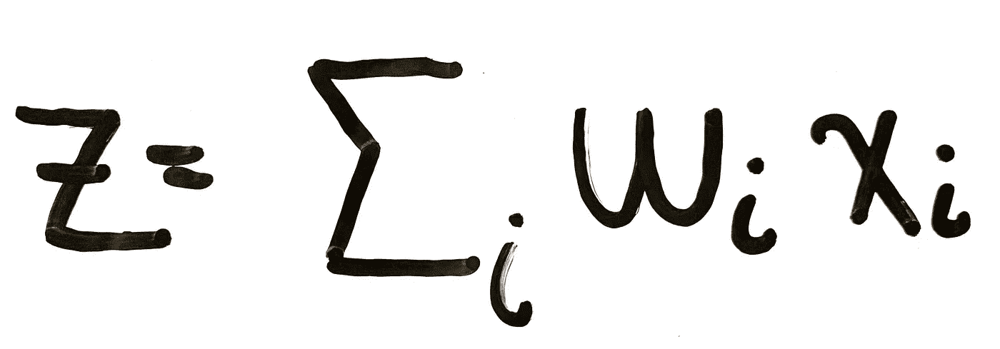

**Equation 1:** Perceptron Neuron Function

输出基于以下规则:

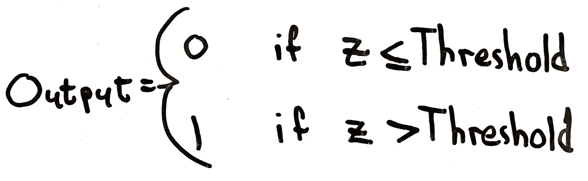

**Equation 2:** Perceptron Output Rule

*阈值*是我们选择的预定值。更大的阈值意味着我们对感知机何时输出 1 没有那么严格。更小的门槛意味着我们更严格。

我们对感知机的代数描述可能会有点混乱。我们试着简化一下。我们可以做的一件事是创建我们的输入和权重的向量，并使用两者之间的点积，给我们留下与我们在**等式 1** 中使用求和符号时相同的精确结果。我们还可以将阈值移到不等式的另一边，并为其分配变量`b`，使得`b = -threshold`:

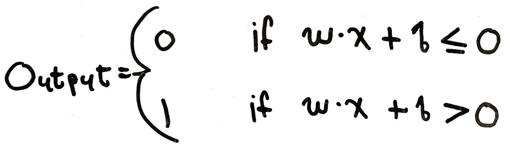

**Equation 3:** Vectorized Output Rule

这是你通常会发现的感知器的描述，也是我们在学习更现代的神经网络时会用到的。

感知器不一定只包含一个神经元。我们可以创建一个感知器网络，因此命名为**神经网络**:

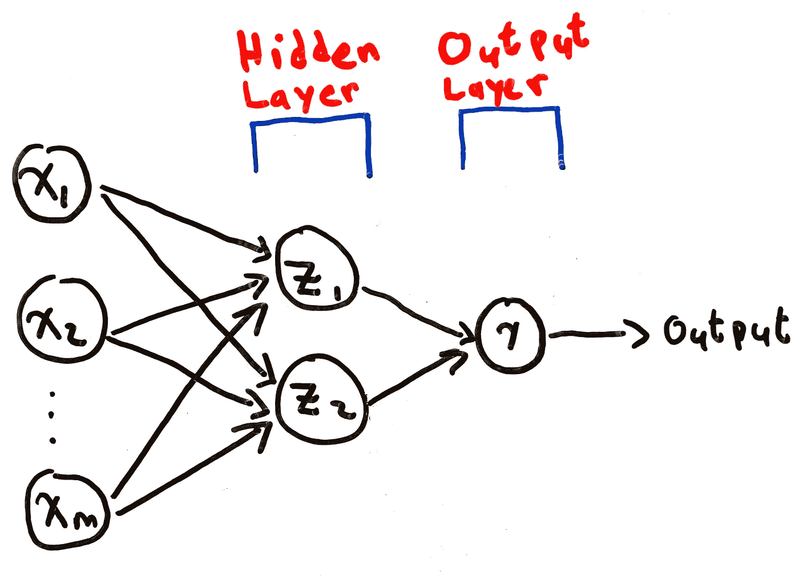

**Figure 6:** Multilayer Perceptron

我们将带有输出神经元的层称为**输出层**。输入层和输出层之间的任何层都被称为**隐藏层**。

感知器对于线性可分离数据非常有用，即可以使用线、平面或超平面分离的数据[5]。这意味着它没有解决我们之前的问题，我们需要一种方法来创建高度复杂的决策边界，而不需要非常大的假设。

输出仅限于零和一也带来了一些限制。假设我们想使用图 6 中的网络来确定写在图像上的数字是否为零。如果图像包含零，我们希望输出 1，否则输出 0。出于某种未知的原因，我们的网络不断地将数字 1 的图像标记为数字 0。我们能做什么？我们可以尝试稍微改变一些重量。但是权重的微小变化会在输出节点上产生更显著的变化。它的影响相当于将输出节点的结果从 1 变为 0，反之亦然。因此，即使我们开始正确地识别 1 不是 0，网络的其他部分在处理 1 和 0 以外的数字时，比如说 9，也可能出错。

感知器所有这些局限性的解决方案是**乙状神经元**、当今更现代、更广泛使用的神经网络类型。

## 乙状结肠神经元

使用 sigmoid 神经元的神经网络的结构与使用感知器的神经网络完全相同:输入和权重被馈送到隐藏层中的神经元，这些神经元又产生一个输出，该输出被馈送到输出层中的输出节点，这些节点最终吐出一个输出。

然而，乙状结肠神经元仍然在一些方面不同于感知器。第一，输入和输出不限于值 1 或 0。它们可以是介于两者之间的任何东西。这是第二个差异的直接影响，即现在使用的函数是 **sigmoid 函数(σ)** ，而不是我们在**等式 1** 中使用的函数:

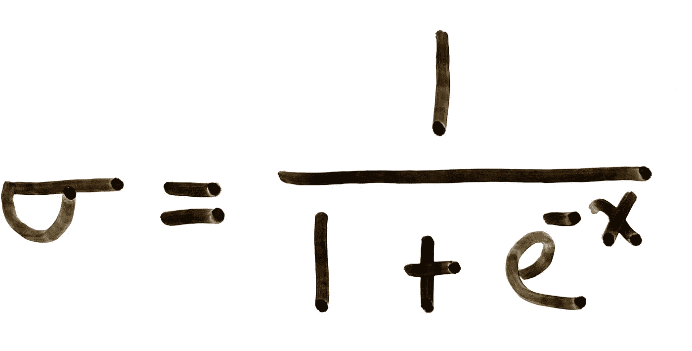

**Equation 4:** Sigmoid Function

在我们的例子中，`x`永远是**等式 1** 。您可以将 sigmoid 函数视为将任何连续值缩小为 0 到 1 之间的值的函数。由于**等式 1** 的输出确实是一个连续值，所以这个思路成立。

乙状结肠神经元也可以具有一个以上的输出，并且不限于二进制分类问题:

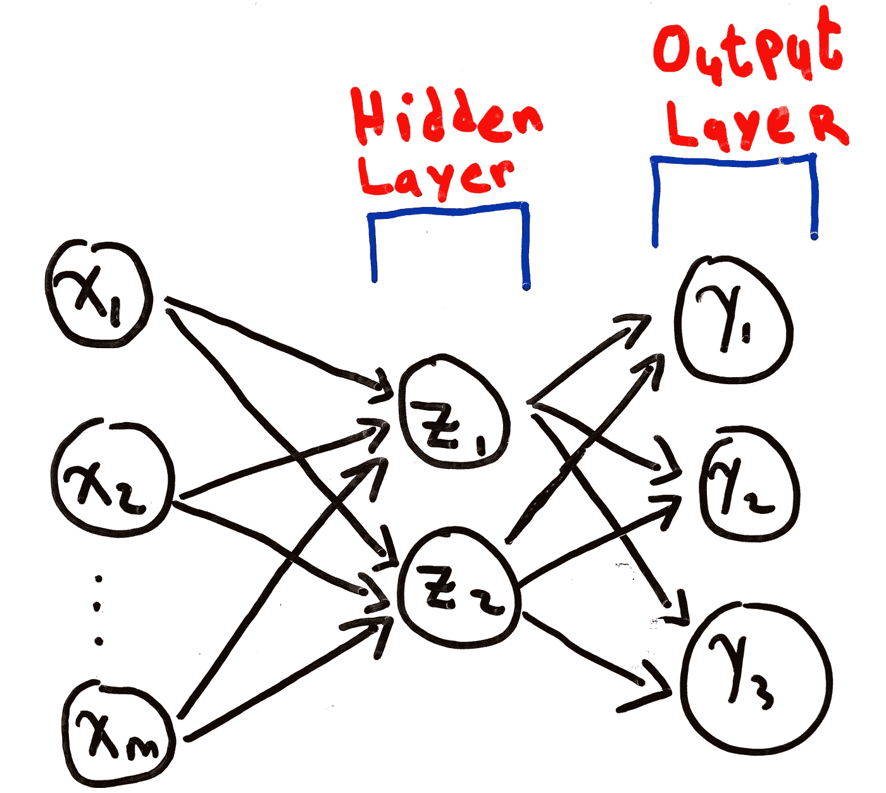

**Figure 6:** Multilayer Neural Network Using Sigmoid Neurons

理解 sigmoid 神经网络如何工作的最佳方式是通过 sigmoid 曲线:

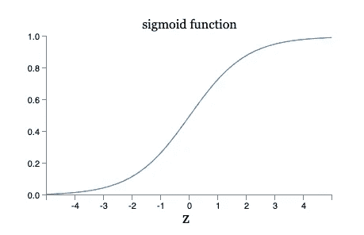

**Figure 7:** Sigmoid Curve [4]

注意在`y = 1`和`y = 0`处有渐近线，满足我们得到 0 和 1 之间的值的要求。但这是否解决了我们提到的问题，即重量的微小变化会导致输出的巨大变化？为了回答这个问题，我们可以将**图 7** 与阶跃函数的曲线进行比较:

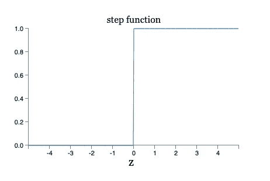

**Figure 8:** Step Function [4]

对于感知器，我们正在处理阶跃函数，其中`x`(权重)的微小变化可能导致`y`(输出)的完全变化。sigmoid 曲线只不过是阶跃函数的平滑版本。这种新的、更平滑的曲线允许通过权重的变化量来更好地反映输出的变化。

# 深度学习

到目前为止，您应该对深度学习的上述定义有了更好的理解:

> **深度学习**是机器学习的一个子领域，涉及受大脑结构和功能启发的算法，称为**人工神经网络**。*【1】*

你知道什么是神经网络，以及它们是如何工作的。但为什么是“深”，又为什么是“学”？

“学习”来自于这样一个事实，即权重的选择和更新是由我们的神经网络自主学习的，使用的是我们所谓的**学习算法**。我们将在下一篇文章中讨论学习算法。

“深度”描述了我们神经网络的特殊结构。我们今天看到的神经网络非常简单和新颖，只有不超过两个隐藏层和几个输出。在现实中，深度学习算法通过将极其复杂的问题分解为更小的子问题来解决这些问题。这种分解包括通过首先构建较小的神经网络并将它们放置在彼此之上来构建大型神经网络，共同努力解决更大、更复杂的问题。

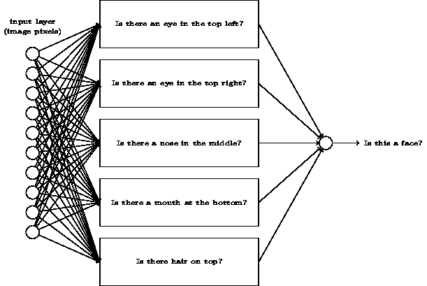

**Figure 9:** Deep Neural Network Example [4]

# 结论

这篇文章为我们将来将要讨论的一切奠定了基础。

我们从研究传统机器学习算法的局限性开始，试图理解我们为什么需要神经网络。从那里，我们看了一个最早开发的神经网络，并研究了如何用它来解决线性可分的分类问题。虽然很有用，但感知器缺乏区分不可线性分离的类的能力，因此需要更复杂的方法。

通过简单地改变每个神经元使用的功能，我们能够提出一个可以处理更复杂数据集的神经网络。虽然感知器和乙状结肠神经元的结构相似，但权重变化对输出的影响的差异使它们的能力显著不同。

在下一篇文章中，我们将讨论神经网络如何使用一种称为梯度下降的学习算法进行自我学习。在此之前，我留给你以下几点思考:

*   sigmoid 函数是我们神经元中唯一可以使用的非线性函数吗？其他神经元可以用来解决复杂问题吗？
*   遵循迈克尔·尼尔森关于深度学习的在线书籍第一章[中关于如何对写在图像上的数字进行分类的教程。然后用一些传统的最大似然算法(例如 SVM)来解决同样的问题。比较不同的指标，比如算法速度、准确率、CPU 使用率等。](http://neuralnetworksanddeeplearning.com/chap1.html)
*   研究梯度下降算法，作为我们将在下一篇文章中讨论的内容的介绍。

# 参考

1.  杰森·布朗利，“什么是深度学习”，机器学习大师，2019 年
2.  维基百科，“人工神经网络”，维基百科，2021 年
3.  维基百科，“感知机”，维基百科，2021 年
4.  迈克尔·a·尼尔森，《神经网络和深度学习》，决心出版社，2015 年
5.  Gaurav Tendolkar，“线性分类器”，机器学习笔记本，2016 年