# 深度学习第 2 部分:香草 vs 随机梯度下降

> 原文：<https://medium.com/geekculture/deep-learning-part-2-vanilla-vs-stochastic-gradient-descent-6bcecc26fd51?source=collection_archive---------8----------------------->

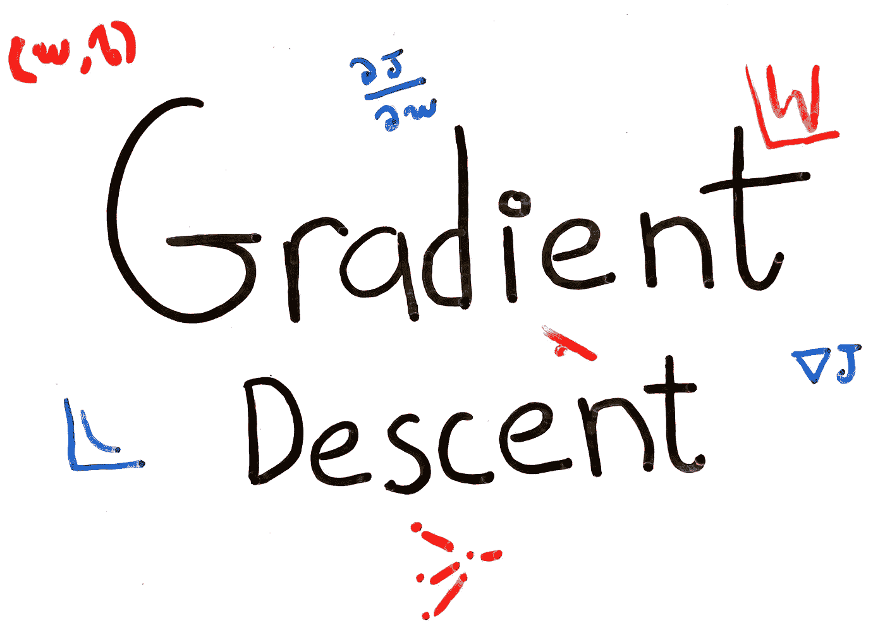

## 普通梯度下降是如何工作的，为什么它的效率低到需要随机梯度下降的地步

欢迎来到我关于深度学习的介绍性系列的第 2 部分，我们的目标是让你熟悉基本的 DL 概念。请参考底部的 D *eep 学习系列*部分，了解之前的所有文章。在这篇文章中，我们讨论了香草和随机梯度下降(SGD)。

梯度下降(GD)是在训练机器学习系统和神经网络时使用最广泛的学习算法之一。这是计算机智能世界中的一个基本概念，因此，也是传授给新的人工智能学生的第一个概念。

梯度下降并不是什么新概念。事实上，它早在 1807 年就由法国数学家奥古斯丁·路易·柯西首次提出。因此，描述和分析算法的工作量是没有限制的。因此，再写一篇关于 GD 如何工作的文章没有多大价值，因为这是重复许多其他作者一遍又一遍描述的内容。

然而，一个不经常详细讨论的想法是基本(普通)梯度下降算法的低效率，以及随机梯度下降如何帮助解决它们。这就是我们在本文中的目标。

如果你还不完全熟悉优化算法，我们将从简单描述开始。然后，我们将描述普通梯度下降和随机梯度下降之间的差异，最后，通过在神经网络上使用它们并比较不同的性能指标，对两者进行比较分析。

让我们开始吧。

# 梯度下降

## 算法

在理解 vanilla 和随机梯度下降的区别之前，让我们先看看 vanilla GD 是如何工作的，并从那里看到我们对随机 GD 做了什么改变。

如前所述，梯度下降是一种*学习*算法。但是，它学的是什么？梯度下降也被称为*优化*算法。但是，它在优化什么呢？先回答第一个问题。

机器学习领域背后的整个想法是，我们的算法可以“从经验中”自主学习。以下面的神经网络为例。该网络将 28x28 灰度图像的 784 个像素作为输入，并输出写在图像上的 1 到 9 之间的数字:

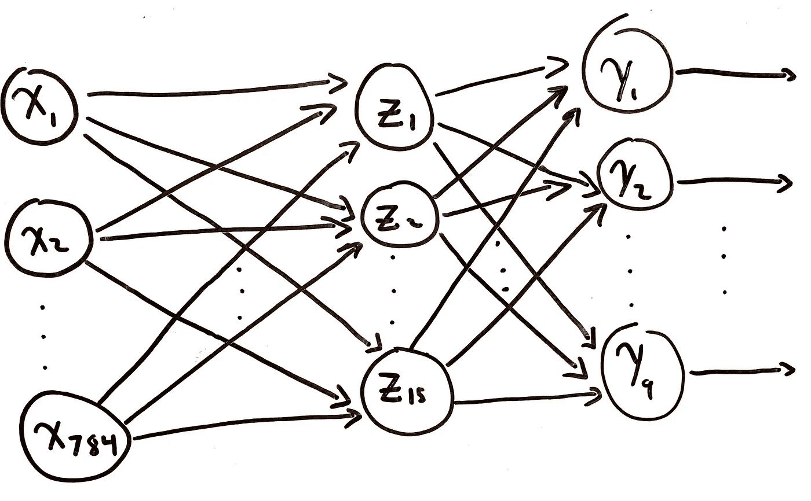

**Figure 1:** Example Neural Network for Digit Recognition

输入层和隐藏层之间有`3 * 784 = 2352`个权重，隐藏层和输出层之间有`3 * 15 = 45`个权重，总共 2397 个权重。更不用说偏见了。我们要手动选择这些权重和偏差吗？然后，如果它们没有按照我们想要的方式执行，就手动更新它们？当然不是。相反，我们将使用梯度下降来*学习*这些权重。但是怎么做呢？“如何”是我们提出的第二个问题的答案。

我们的目标是优化神经网络产生的误差。在我们的例子中，优化指的是最小化误差。

梯度下降会通过例子学习。我们将输入我们的网络图像，这些图像中的数字是已知的，我们将通过比较输出和实际结果来看看我们的神经网络是否能够正确地识别它。然后，我们分析这个误差有多大，并尝试相应地调整我们的权重，以尽量减少产生的误差。我们用来计算我们的学习算法的误差的函数被称为**成本函数**。

有许多不同的成本函数可用。在我们的例子中，我们将使用均方误差(MSE):

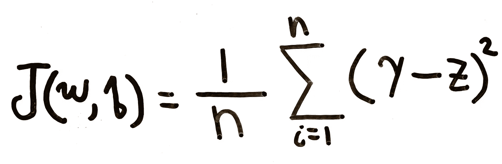

**Equation 1:** Mean Squared Error

其中`J`代表成本函数，`w`和`b`是我们的模型的权重和偏差的向量，`n`是我们拥有的训练样本的数量，`y_i`是我们输入的实际结果，`z`是在[第一部分](https://ali-h-khanafer.medium.com/deep-learning-meaning-motivation-and-nn-basic-structure-44b57b481e4c?source=your_stories_page-------------------------------------)的**等式 1** 中呈现的加权和，即我们的模型预测的结果。

请注意，该错误是基于所有训练示例的平均结果。记住这一点，因为当讨论随机梯度下降和普通梯度下降之间的差异时，它还会回来。

目标是最小化`J`。也就是说，找到产生最小误差的`w`和`b`:

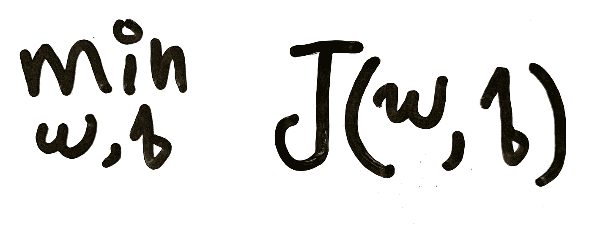

**Figure 2:** Minimizing Cost Function

理解如何最小化`J`的最好方法是看一下向量`w`的大小为 1(`[w_1]`)的情况，我们没有偏差。我们可以将成本`J(w)`绘制成`w_1`的函数:

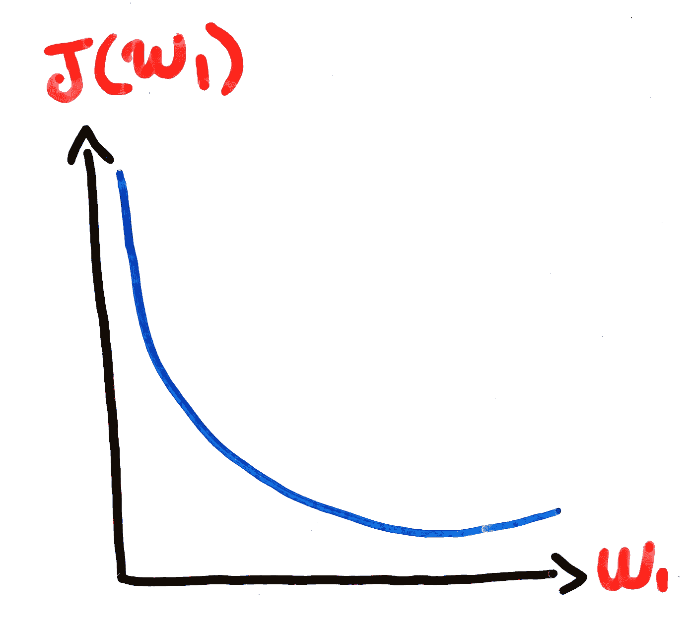

**Figure 3:** J as a Function of w_1

从视觉上，很容易看出什么`w_1`会最小化`J`。但是我们如何用代数方法来做呢？一些微积分学生可能会考虑求解`dJ/dw_1 = 0`，但是对于更复杂的函数来说，这并不总是可行的[2]，例如:

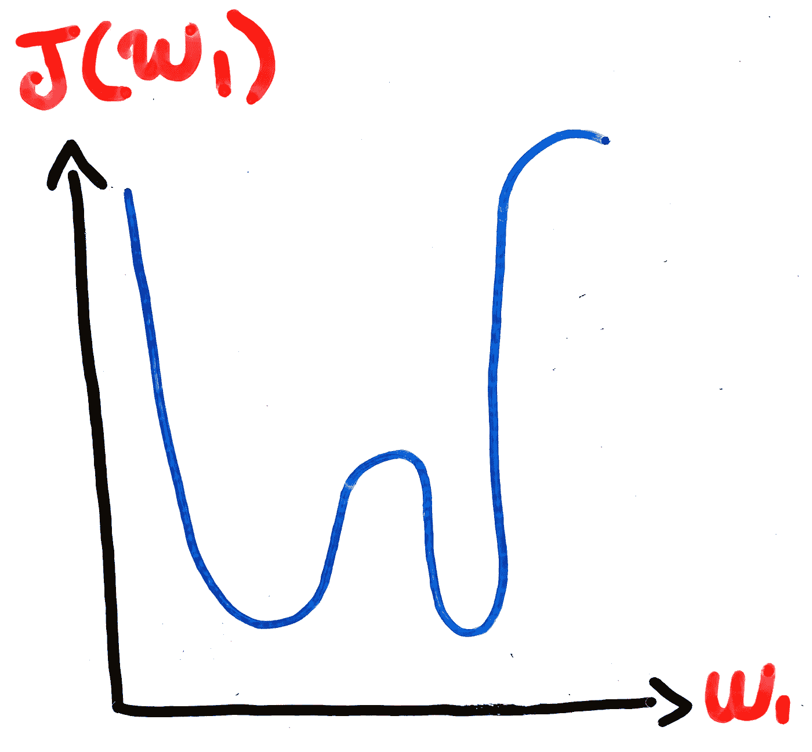

**Figure 4:** Example of More Complicated Cost Function

在上面的数字识别问题中，事情变得特别复杂，我们有超过 2000 个权重和一个超过 2000 维的函数。

更好的方法是从一个随机的`w_1`值开始，然后确定步进的方向，以获得一个较低的结果。我们可以通过找到`w_1`处`J(w)`的斜率来做到这一点。考虑图 3 中的一个随机点:

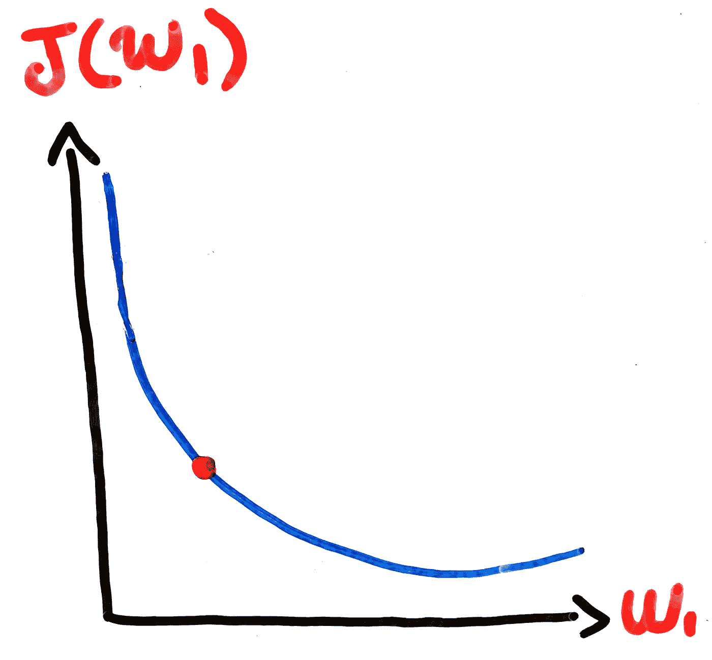

**Figure 5:** Random Point On J vs w_1 Graph

我们可以计算该点的斜率:

**Figure 6:** Slope ofRandom Point On J vs w_1 Graph

因为它是负的，我们知道我们需要向右移动`w_1`，即增加`w_1`。如果是正数，我们就向左移动。我们可以继续这样做，直到我们达到接近零的斜率，这表明我们已经达到了全局或局部最小值:

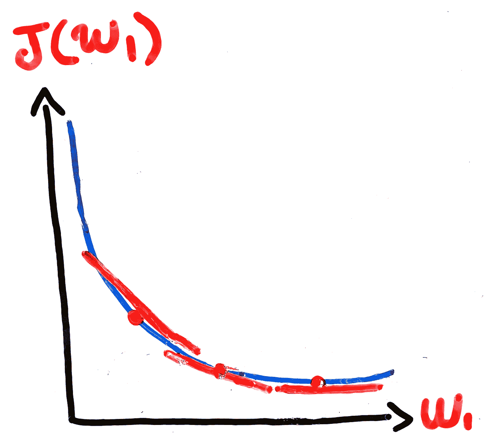

**Figure 7:** Different Slopes Before Reaching Minimum

我们可以将这个想法扩展到多变量成本函数`J`，就像我们在**等式 1** 中一样，其中`J`是`w`和`b`的函数。正如我们在单变量情况下计算斜率一样，在多变量情况下，我们将计算**梯度** (∇J)，一个给我们最陡**上升**方向的向量。直觉上，为了找到最陡下降的方向，我们取梯度-∇J.的负值

如果您理解了我刚才描述的所有内容，那么算法的其余部分就不言自明了:

1.  随机初始化权重和偏差
2.  计算这些权重和偏差造成的成本
3.  基于更新规则更新所有权重`w_k`和偏差`b_l`，其中`k`是权重的数量，`l`是偏差的数量:

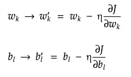

**Figure 7:** Update The Weights and Biases Rule [3]

4.从步骤 2 重新开始，直到算法收敛到局部或全局最小值

η被称为**学习率**。我不会在这篇文章中解释它，将它留给你自己的研究。

## 问题:效率低下

那么问题出在哪里呢？为什么这样效率低？为什么我们在随机梯度下降中需要一个变量？为了回答这些问题，让我们暂时离开神经网络，考虑这样一种情况:我们希望最小化线性回归模型的均方误差。由于我们在处理线性回归时不需要链式法则来计算偏导数，这个假设会让我们更容易继续 GD 的解释。计算神经网络的偏导数需要一种称为**反向传播**的算法，这是下周文章的主题。**方程 1** 的偏导数为:

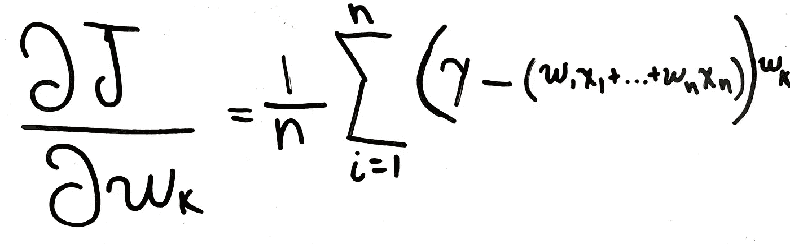

**Equation 2:** Gradient of the Mean Squared Error Function

注意，在上面的等式中，我们将`z`展开为它的完整形式。偏差的梯度将是相同的，除了我们用`b_l`替换**等式 2** 中的所有`w_k`。

你看出问题了吗？假设我们有 20，000 个权重和偏差，以及`n = 10,000`个训练示例。对于我们想要对某些`w_k`进行的每一次更新，即上述 GD 算法中的步骤 3，我们必须对所有`n`训练示例进行总结。每次运行第 3 步时，我们都会看到`20000*10000=200000000 operations`。在算法收敛之前，乘以我们运行这个更新步骤的次数…这是一个很大的操作。这就是基本(普通)GD 算法效率低下的原因。尽管神经网络的偏导数会有所不同，但这种对所有训练示例求和的思想仍然成立。

## 解决方案:随机梯度下降

我们可以把随机梯度下降和普通梯度下降的区别分别看作瀑布和敏捷设计的区别。在瀑布设计过程中，我们试图从第一次迭代开始就把一切都做好。这是一个线性过程，包括需求收集、设计、实现、验证和维护。在进入下一步之前，必须完成每一步，我们永远不能回到上一步。最终结果？您到达过程的末尾，并注意到您的项目充满了 bug，您的客户的需求已经完全改变了，并且您在过去六个月中投入的所有工作都不是很好。另一方面，敏捷方法涉及较小的迭代，不断地部署产品，以便获得客户反馈，进行适当的更改，重新部署和重复流程，所有这些都在一两周内完成。

在随机梯度下降中，我们从整个数据集中选择`m`个随机训练样本，并将其用于我们的成本函数，而不是将误差计算为所有**个训练样本的平均值。我们称这个子集为**小批量**。一旦我们的网络已经在我们的小批量中的所有数据点上被训练，我们选择一个新的随机点子集，并用它来训练我们的模型。我们继续这个过程，直到我们用尽所有的训练点，在这一点上，我们已经完成了一个**纪元**。然后，我们从新的**时期**开始，并继续直到收敛。**

更正式地说，**等式 2** 变成:

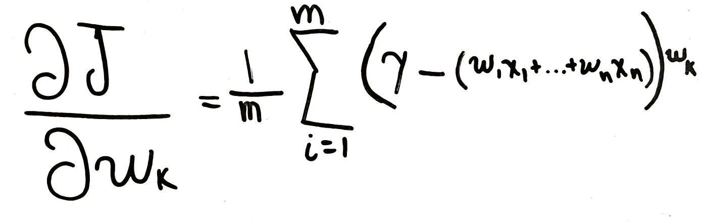

**Equation 3:** Stochastic Gradient Descent Cost Function

其中`m`是小批量的大小。如果`m`足够大，这行得通是因为[3]:

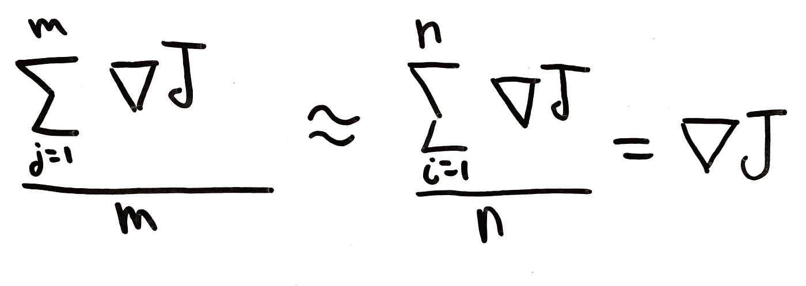

**Equation 4:** Mini-Batches Compared to Full Batch

# 比较

那么新加坡元和基本元相比如何呢？在本节中，我们将通过运行分析和查看一些指标来尝试回答这个问题。更具体地说，我们将看看它们在收敛时间、CPU 利用率和不同数据集大小的准确性方面的比较。

我们将使用迈克尔·尼尔森在他的[在线介绍性深度学习书籍](http://neuralnetworksanddeeplearning.com/)的第一章中创建的数字识别神经网络。该网络将具有 28×28 = 784 个输入，一个具有 30 个神经元的隐藏层，以及一个具有 10 个输出神经元的输出层。可以在`src/network.py`下的处找到代码[。我们将使用的数据集是](https://github.com/mnielsen/neural-networks-and-deep-learning)[MNIST 手写数字数据库](http://yann.lecun.com/exdb/mnist/)，它包含 60，000 个手写数字。

正如我们将看到的，当与神经网络一起使用时，基本梯度下降可能需要很长时间才能收敛。有时超过 24 小时。因此，我们将通过运行 SGD 200 个时期和小批量的训练集来模拟梯度下降。然后，我们将使用收到的指标来估计梯度下降的实际结果，如果我们要运行它来完成。对于香草梯度下降的完整模拟，我们将不得不运行 SGD 最少的`(784*30) + (30*10) = 23820`时期，但这将需要很长时间才能结束。按照我们现在的方式做事会给我们带来不太准确的结果，但会节省我们很多时间，并让我们很好地了解 SGD 和 vanilla GD 之间的差异。

至于纪元、小批量和学习率，我们将分别保持它们为常数 30、10 和 3。

## 随机梯度下降

我们先来看看 SGD 表现如何。

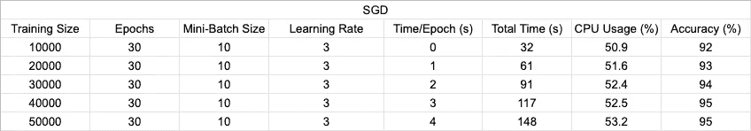

**Table 1:** Stochastic Gradient Descent Results

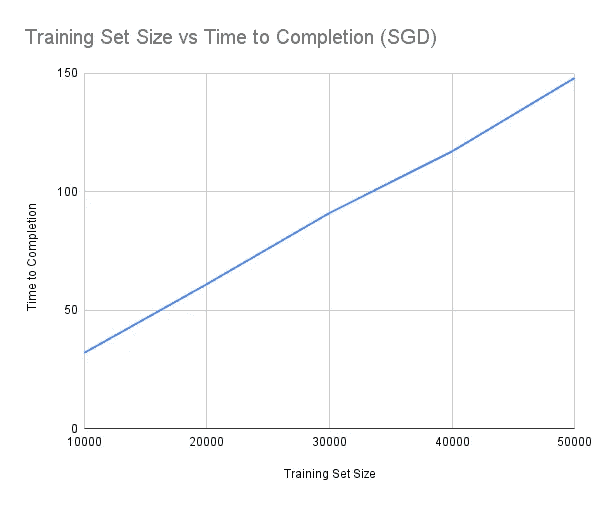

**Figure 9:** Training Set Size vs Time to Completion (SGD)

直观上，时间随着训练集规模的增大而线性增加。数据集大小为 50，000 时，大约需要两分钟半(148 秒)才能完成。请记住，这是与常数超参数(学习率，小批量，等等。)我们选择了。我们可以尝试调整这些值，也许可以得到一个稍微快一点的算法。这条线的斜率大约为 0.0031，每增加 10，000 个训练点，我们的时间大约增加 30 秒。

现在让我们看看它的 CPU 利用率:

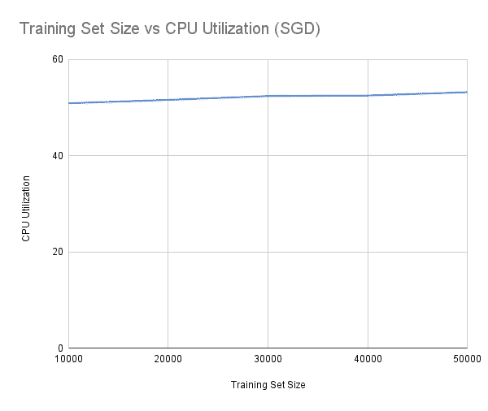

**Figure 10:** Training Set Size vs CPU Utilization (SGD)

我们正在使用的 Mac 的 CPU 利用率通常在 2%到 10%之间。我们从**图 10** 中看到，CPU 利用率基本保持在 50%左右，数据集大小之间只有两到三个百分点的变化。这些结果符合我们的预期吗？不完全是。正如我们将在后面看到的，vanilla GD 将有类似的 CPU 利用率结果。但是 SGD 的全部意义在于它更有效，所以这些结果与我们的假设相反。发生这种情况有多种原因:

1.  我用的是比较老的电脑(MacBook Pro 2016)
2.  我没有运行香草动力局完成
3.  计算 CPU 利用率时的人为错误

因此，我们已经确认了该算法是快速的，并且它的 CPU 利用率不是太高。但是，最重要的是，它有多准确？

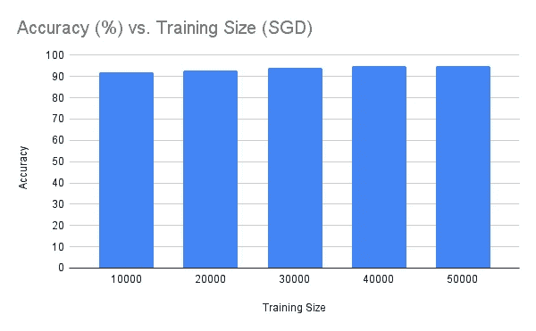

**Figure 11:** Training Set Size vs CPU Utilization (SGD)

厉害！通过一个只有 10，000 个数据点的训练集，我们能够在 30 多秒内获得 92%的准确率。另一方面，如果我们希望更准确，我们可以将训练集大小增加到 50，000，并在两分钟半内获得 95%的准确率。所有这些都没有超过 50%的 CPU 利用率。

## 香草梯度下降

现在让我们看看香草梯度下降如何在相同的精确训练数据和神经网络上执行。

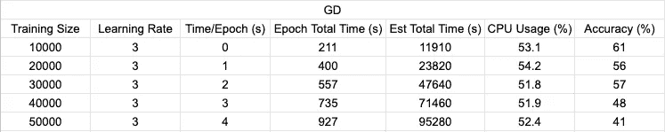

**Table 2:** Vanilla Gradient Descent Results

为了估计总时间，我们计算了完成一个历元所需的时间，然后乘以如果我们要运行完成所需的最小历元数(23820 个历元)。

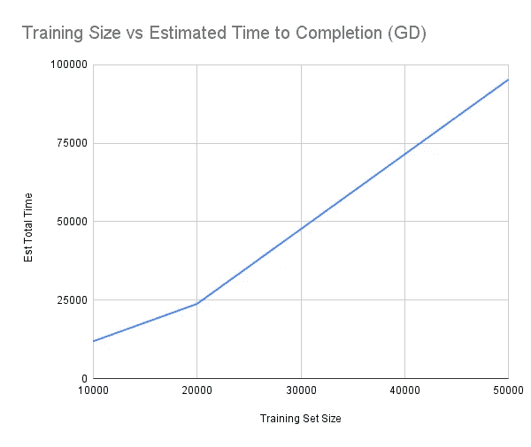

**Figure 12:** Training Size vs Estimated Time to Completion (GD)

现在，你明白为什么我们需要 SGD 来训练神经网络了吗？对于只有 10，000 人的训练集，我们需要大约 3 个小时来训练我们的模型。将这个数字与现实世界的场景进行比较，在现实世界中，通常有数百万个数据点来训练我们的神经网络。请注意，斜率约为 1.19，相比之下，使用 SGD 时的斜率为 0.0031。每增加 10，000 个数据点，完成时间的变化几乎相差 200%。

这个算法计算量大吗？让我们看看:

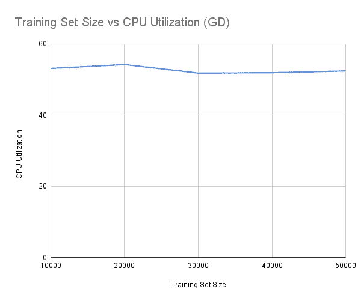

**Figure 13:** Training Set Size vs CPU Utilization (GD)

虽然利用率的波动比 SGD 稍大，但结果非常相似。同样，如上所述，这可能是由许多不同的原因造成的。

最后，让我们看看 GD 如何训练我们的模型:

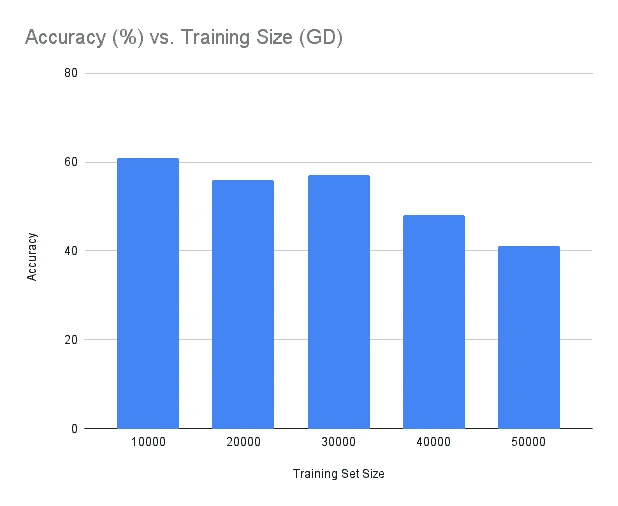

**Figure 14:** Training Set Size vs CPU Utilization (GD)

这些结果完全有意义吗？**不。**我们应该得到足够接近 SGD 接收到的精度。但是我们预料到了这一点，因为我们没有运行完算法。重要的是要认识到梯度下降最终会收敛到局部最小值，产生与我们在 SGD 中看到的一样好的结果。

然而，要认识到的一个有趣的特征是，随着训练集大小的增加，准确率会降低。为什么会这样？一个合理的答案是我们的学习率太高/太低。这也可能是我们通过 SGD 模拟梯度下降的方式。有关系吗？不完全是。我们所要做的就是了解 SGD 的表现有多好。在跑了 211 秒的基本梯度下降后，我们用 10，000 的训练集能够获得的最高精度是 61%。对于相同数量的数据，更少的时间，我们能够用 SGD 获得 92%的准确率。

# 结论

在这篇文章中，我们的目的是回答一些围绕香草和随机梯度下降的重要问题。

通过首先描述梯度下降的基本功能，我们能够指出一个非常大的问题:为了计算我们的成本函数在某个点`w`的梯度，需要计算所有训练点的总和。这给我们留下了一个计算量极大的算法。有多重？本文的第二部分探讨了这种低效率，旨在确定随机梯度下降的性能有多好。

虽然我们采取了一些捷径来完成基本梯度下降，但我们能够得出结论，随机梯度下降不仅更快，而且在更短的时间内提供了更好的结果。

但是基本梯度下降**永远不会使用**吗？不完全是。还有其他机器学习算法不像神经网络那样需要那么多求和，比如线性回归。在这种情况下，避免随机梯度下降可能更好，因为代码更复杂，并且有更多的参数要处理。

# 深度学习系列

*   **第一部分:** [深度学习:意义、动机、NN 基本结构](https://ali-h-khanafer.medium.com/deep-learning-meaning-motivation-and-nn-basic-structure-44b57b481e4c?source=your_stories_page-------------------------------------)

# 参考

[1]维基百科，[梯度下降](https://en.wikipedia.org/wiki/Gradient_descent) (2020)，维基百科关于梯度下降的部分

[2]格兰特·桑德森，[梯度下降，神经网络如何学习|第二章，深度学习](https://www.youtube.com/watch?v=IHZwWFHWa-w&t=454s&ab_channel=3Blue1Brown) (2017)，3Blue1Brown Youtube 频道

[3]迈克尔·a·尼尔森，[神经网络与深度学习](http://neuralnetworksanddeeplearning.com/) (2015)，决心出版社