# 深度学习第 3 部分:反向传播；只不过是一场电话游戏

> 原文：<https://medium.com/geekculture/deep-learning-part-3-backpropagation-nothing-but-a-game-of-telephone-e0d716f6d362?source=collection_archive---------14----------------------->

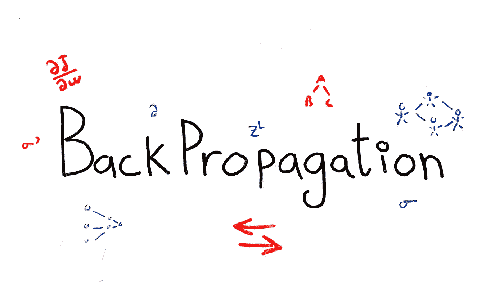

## 通过将反向传播与“电话”游戏联系起来，直观地理解反向传播

欢迎来到我关于深度学习的介绍性系列的第 3 部分，我们的目标是让你熟悉基本的 DL 概念。请参考底部的 D *eep 学习系列*部分，了解之前的所有文章。在这篇文章中，我们讨论反向传播。

在上周的文章中，我们看了梯度下降。我们看到，为了让我们的神经网络学习，我们必须不断更新我们的权重和偏差，直到我们的成本函数最小化。更新规则是基于我们的成本函数的梯度。为了简化我们对梯度下降算法的解释，我们暂时忽略了神经网络，而是使用线性回归模型。模型的这种变化引发了一些疑问:在神经网络上执行梯度下降有什么复杂的？它是否以与线性回归相同的方式应用于神经网络？确实是。然而，当计算神经网络的成本函数的梯度时，事情变得有点复杂。

我们将从建立有效计算梯度的直觉开始本周的文章。我们将通过观察在“[电话](https://en.wikipedia.org/wiki/Chinese_whispers)”的游戏中错误是如何从一个人传播到另一个人的来做到这一点。然后，我们将把这个想法与**反向传播算法**联系起来，并正式说明在使用神经网络时如何计算梯度下降的梯度。

让我们开始吧。

# 电话模拟

你是加拿大国家电话队的一员，电话世界杯就在眼前。现在，我们假设每支球队只由两种类型的球员组成:

*   **发言人**:第一个发言的人。这个人有原始消息要悄悄告诉其他玩家。
*   一个或多个**玩家:**任何接收消息的人，但不包括发言人

你的团队没有采取简单的倾听和希望最好的正常方法。相反，他们明白焦虑和紧张会发挥作用，并导致一些队友听到错误的东西。因此，每个玩家都将尝试估计前一个玩家产生的错误量，并尝试做出任何有意义的纠正。例如，考虑以下两个玩家的线性电话线路:

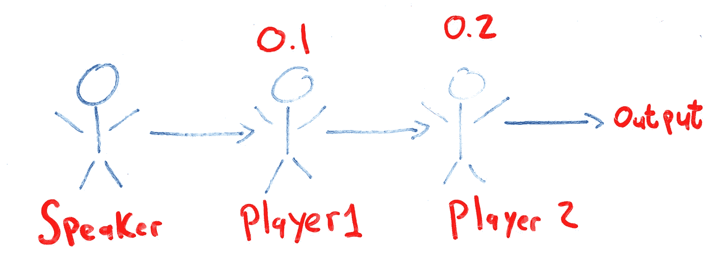

**Figure 1:** Linear Telephone Line With Two Players

参与人 1 会假设自己犯了 10%的错误。参与人 2 会假设参与人 1 犯了 20%的错误。我们把错误定义为两个句子之间不同字母的数量。例如，如果我们有以下场景:

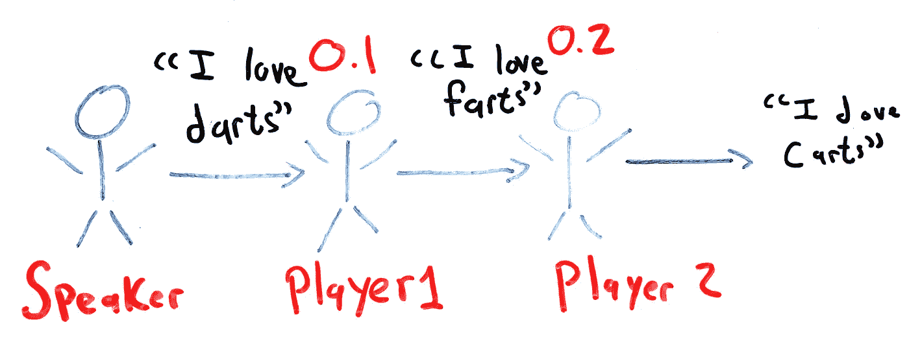

**Figure 2:** Sentence Passed Through Linear Telephone Line With Two Players

那么参与人 1 有 10%的原句是错的，因为原句中十分之一的字母被改变了。参与人 2 将试图解释参与人 1 的错误，并在他认为合适的时候修改字母。

由于这是一项团队运动，团队必须进行训练，以建立正确的化学反应，并了解每个球员对原始句子的影响。训练包括检查一些句子，确定团队哪里出错了，并相应地修改错误率。

我们在**图 2** 中的电话线显然没有经过适当的训练。我们能做些什么来获得更好的结果？我们需要一种方式向玩家描述他们哪里出错了。唯一知道原答案的人是说话的人。因此，他是唯一能比较预测结果和实际结果的人。他必须先去找参与人 1，问他听到了什么。从那里，他可以计算出参与人 1 产生的误差，告诉他相应地调整他的预测误差率，然后转移到参与人 2。说话者必须根据参与人 1 的错误率来帮助参与人 2 调整他的错误率。由于参与人 1 的错误率是 10%，而参与人 2 的预测是 20%，如果团队希望得到更好的结果，参与人 2 必须减少他的错误率。

这是一种高效的训练方式吗？也许对于我们两个玩家和一个扬声器的线性系列来说，这不是最大的交易。但是电话世界杯不仅仅由一种电话线组成。各队将不得不在一个“线程”电话线游戏中竞争。在线程电话线中，每个小组被分成几个组，每个组有一个发言人。然后说话者将不得不把句子的不同部分传给他们组中的第一个人。然后，每组的第一个人将这句话小声告诉每组的第二个人，以此类推。最后一名玩家将收到来自每组的消息，并必须做出正确的操作和决定来输出他认为最初发送的消息。例如:

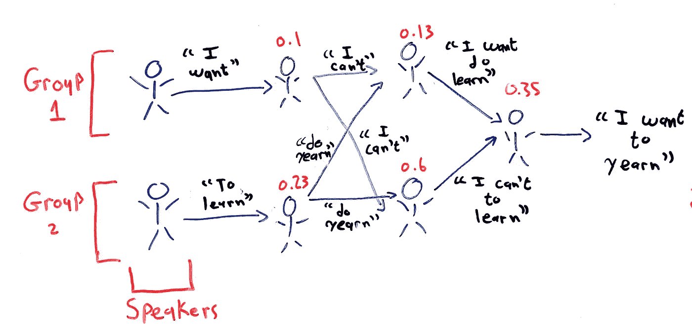

**Figure 3:** Sentence Passed Through Threaded Telephone Line

我们现在的训练方法效果如何？一个发言人必须首先去第一组的第一个玩家那里，确定他造成的错误，通知每个组的**的第二个玩家这个错误，最后通知最后一个玩家。第二个说话者必须重复同样的过程。我们的扬声器会很快变得非常疲劳。想象一下，如果我们有 10 个小组，每个小组有 10 个发言人，这个过程会有多及时。而这一切只是为了一次训练。想象一下，如果我们想要训练上百万个句子，会发生什么。我们训练方法的低效开始显现出来。那么，有没有更好的解决办法呢？**

让我们为我们的团队介绍一位新型选手，一位**评委**。法官是最后一个收到消息的人。他知道原始消息是什么，并负责将收到的消息与原始消息进行比较。不要把评委和**图 2** 和**图 3** 中的最后几位选手搞混了。这些玩家不知道原始信息是什么，而法官知道:

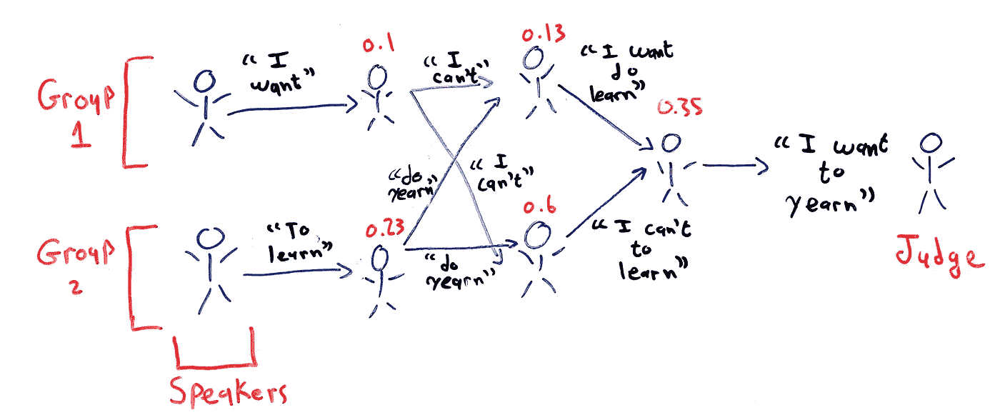

**Figure 4:** Threaded Telephone Line With A Judge

由于法官知道原始信息是什么，他可以计算出最终判决产生的总误差。有了现在已知的错误，法官就可以将收到的错误广播给小声对他说这句话的玩家。该玩家将评估他对该错误的影响，并将其传播给所有之前的玩家。只需从发言人到裁判传递一次，再从裁判到发言人传递一次，每个球员就能明白他是如何对球队的整体失误做出贡献的。与我们的原始方法相比，我们必须为每个扬声器通过整个电话线，这要快得多。

我们的结论是，当说话者负责同步错误(正向传播)时，我们的训练过程是非常低效的。解决方案是从法官开始向后传播误差。这个结论适用于神经网络，这也是为什么反向传播是最广泛使用的训练神经网络的算法。让我们看看算法是如何工作的。

# 反向传播

在我们的电话线路中的训练包括理解每个球员的预测误差所需的变化，以最小化团队的整体误差。类似地，反向传播旨在了解神经网络权重和偏差的变化将如何影响我们的成本函数。形式上，最终目标是计算:

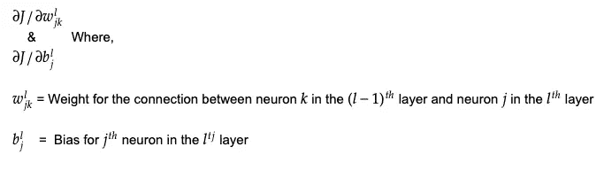

**注:**`w^l`的下标`j`和`k`没有错反。我们这样做是因为这样会让我们以后的计算更容易。

`J`扮演类似于裁判的角色，而权重和偏见扮演类似于演讲者和玩家的角色。

通常，反向传播是通过首先展示算法，然后将其与微积分中的链式法则联系起来来解释的。我们将采取相反的方法。我们将首先使用链式法则提供一种理解微分的图形方式，然后将它与反向传播算法联系起来。

## 链式法则

考虑以下等式:

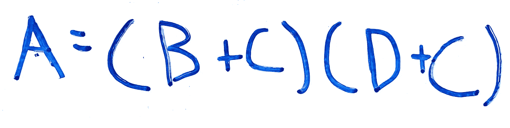

**Equation 1:** A as a Function of B, C and D

我们可以将这一功能分解为多个功能:

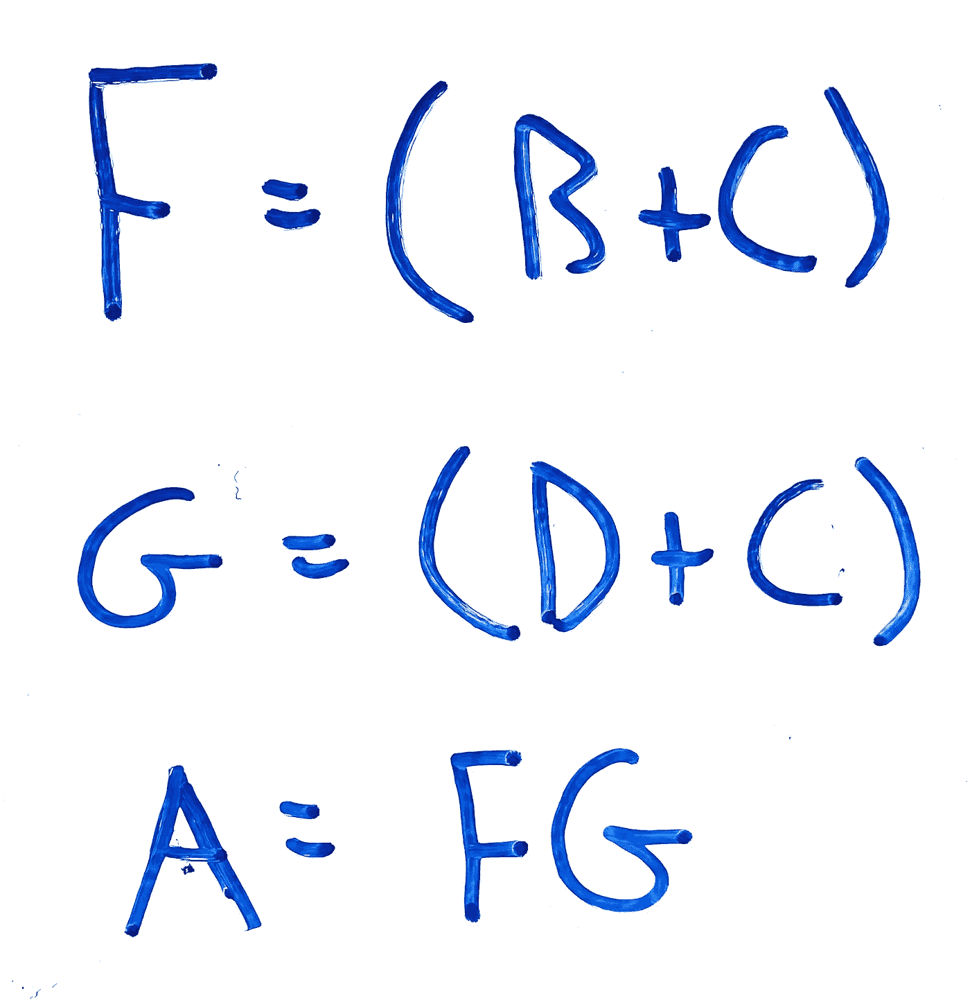

**Equation 2:** A as a Function of F and G

这样，我们可以用图形表示所有输入和`A`之间的关系:

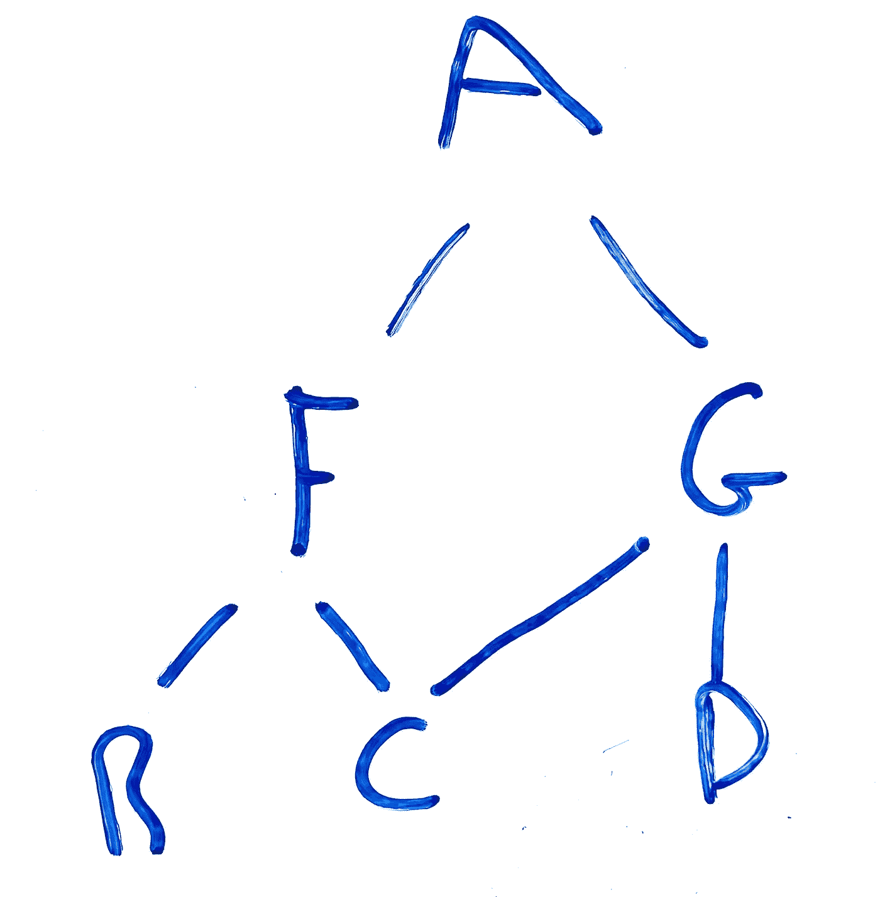

**Figure 5:** Graphical Representation of A

这个`A`的图形表示给了我们一个简单的方法来计算`A`相对于任何变量的偏导数，使用的是所谓的**链式法则**。例如，为了找到`A`相对于`C` (∂A/∂C)的偏导数，我们沿着上图中从`C`到`A`的路径。有两条可能的路径，一条通过`F`，另一条通过`G`。在找到∂A/∂C 之前，我们需要计算∂F/∂C 和∂G/∂C.。规则是:相同路径上的所有偏导数相乘，而不同路径上的所有偏导数相加。因此`A`相对于`C`的偏导数计算如下:

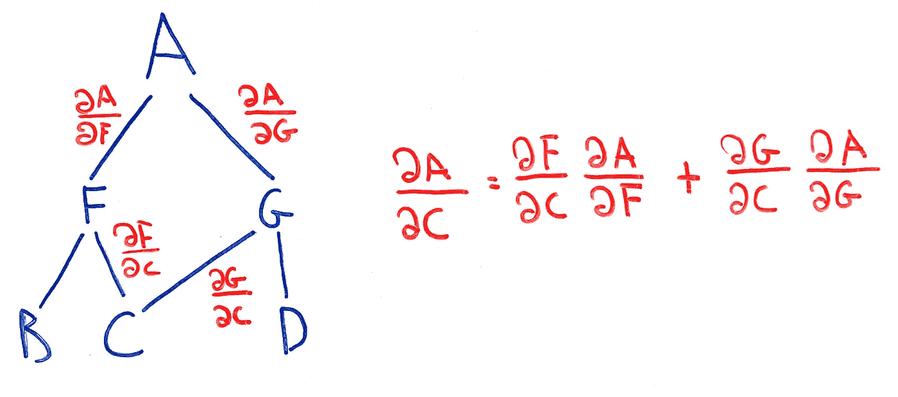

**Equation 3:** Partial Derivative of A With Respect to C

让我们将这些相同的规则应用于神经网络。

## 算法

考虑以下不超过两个节点的神经网络(为了简化我们的图，我们省略了偏差项，但它在理论上仍然存在):

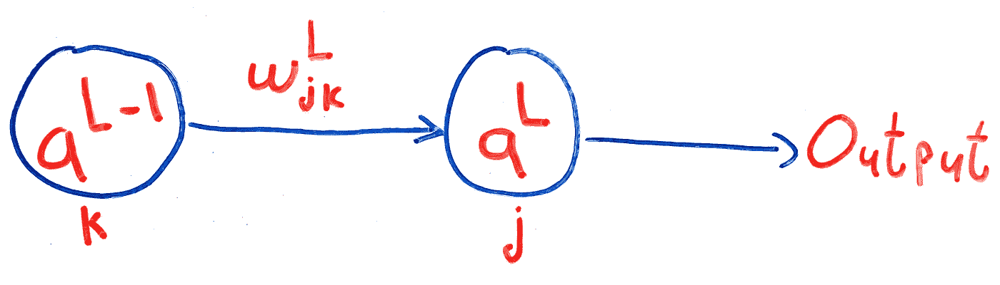

**Figure 6:** Simple Neural Network With Two Nodes

其中`a^L`指输出层【预测结果】`L`的**激活**，等于:

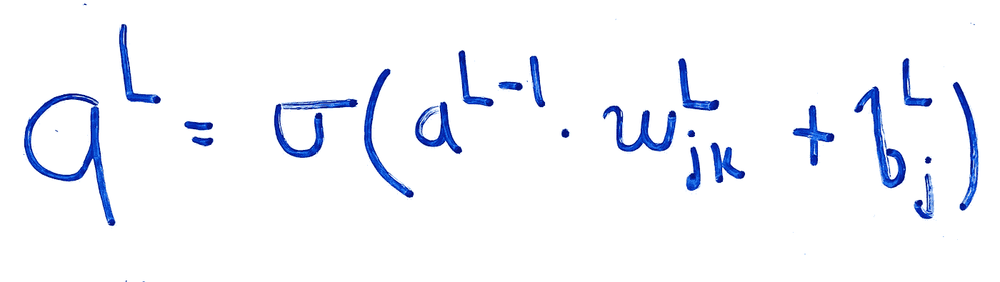

**Equation 4:** Activation of Neuron j In Layer L

传递给 sigmoid 函数(σ)的加权和在我们的等式中非常常见，因此我们将它赋给一个变量`z^L`:

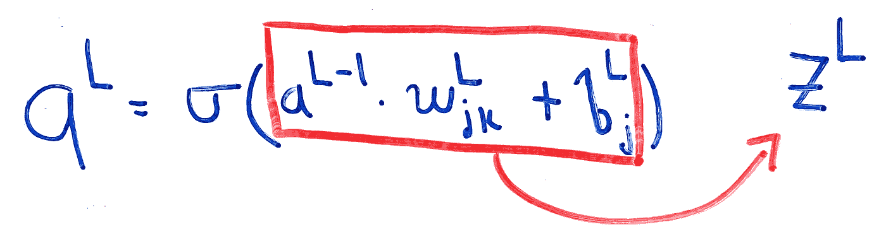

**Figure 7:** Definition of z^L

好了，我们已经处理了所有的行话。从这一点开始，我们不外乎应用我们刚才学到的链式法则。不要忘记我们的主要目标:发现权重和偏差的变化如何影响我们的成本函数。

那么，对于我们的成本函数，我们如何绘制类似于**图 5** 的图形呢？`J`井是`a^L`(预测结果)和`y`(实际值)的函数，`a^L`是`z^L`的函数，而`z^L`又是`a^(L-1)`、`w`和`b`的函数……你看到模式了吗？下面是`J`的图示:

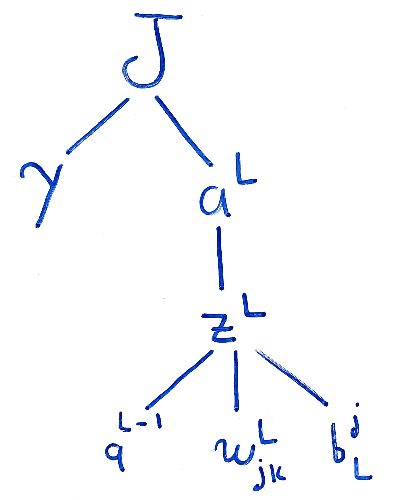

**Figure 7:** Graphical Representation of J

你能用这张图表找到∂J/∂w 和∂J/∂b 吗？是的，你可以！只需应用我们之前使用的相同规则:

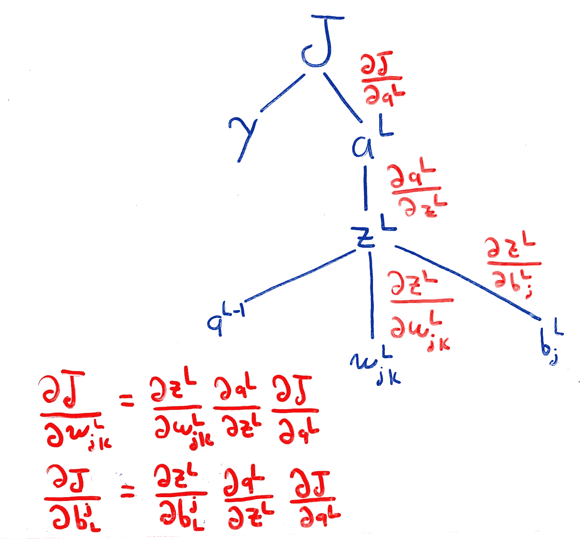

**Equation 5:** ∂J/∂w and ∂J/∂b

我们知道`z^L`和`a^L`是什么，所以剩下要做的就是计算定义∂J/∂w 和∂J/∂b 的偏导数，我们可以得出∂J/∂w 和∂J/∂b 关于任何成本函数的表达式`J`:

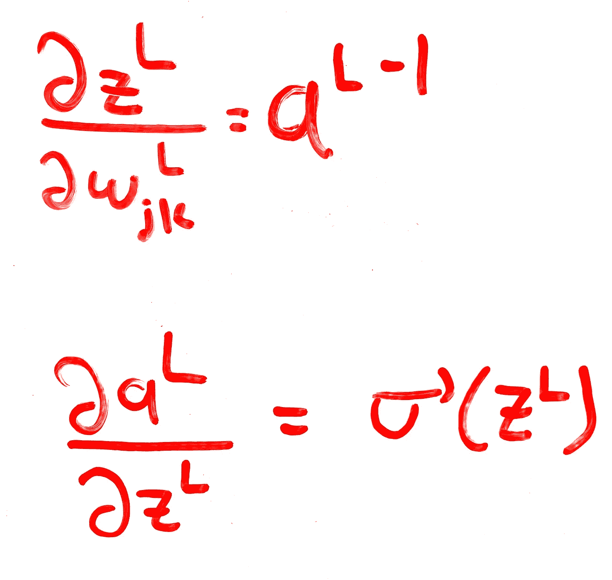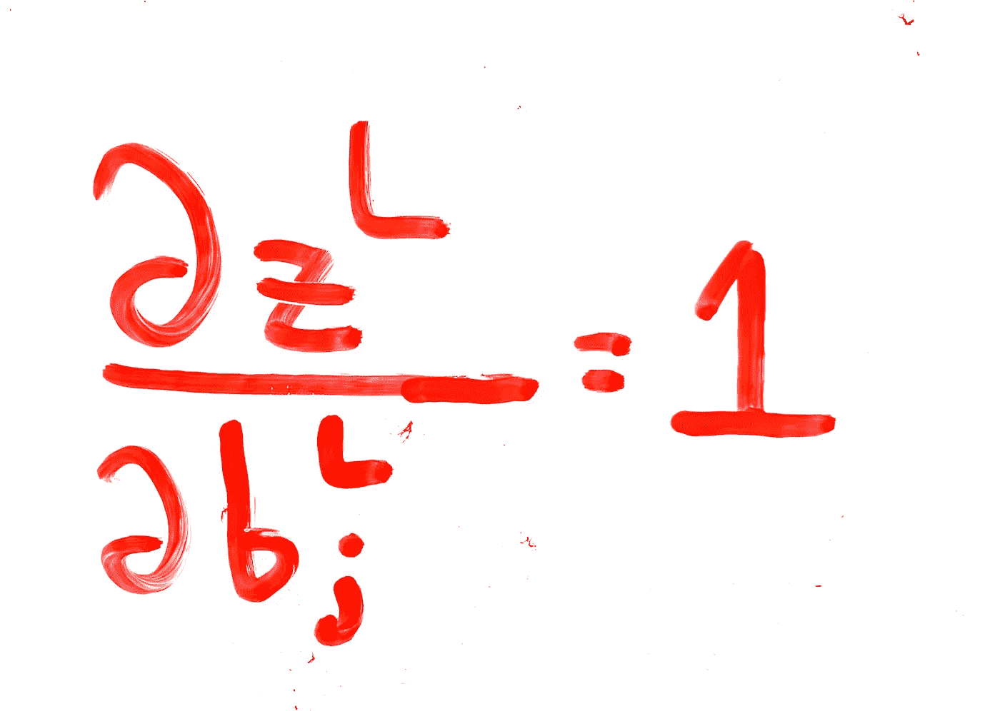

**Equations 6, 7 and 8:** Relevant Derivatives

总的来说，我们得到:

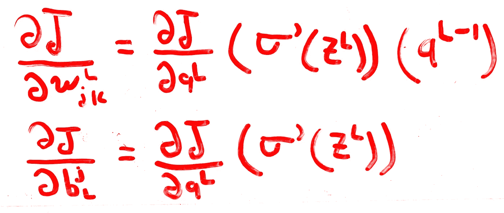

**Equations 9 and 10:** ∂J/∂w and ∂J/∂b

就是这样！我们找到了计算`J`相对于任何权重或偏差的变化的一般公式。请记住，我们通过只查看一个隐藏层，一个神经元和一个具有一个输出的输出层来简化事情。事实上，我们将有许多不同的层`l=L, (L-1), (L-2), ... ,2`，每层包含许多不同的神经元。尽管如此，我们可以遍历所有不同的层和神经元，并在**方程 9 和 10** 中使用它们的值。还要记住，这将在梯度下降过程中用于计算偏导数，这意味着我们将对我们拥有的每个训练示例运行该算法。

总体而言，反向传播算法包括:

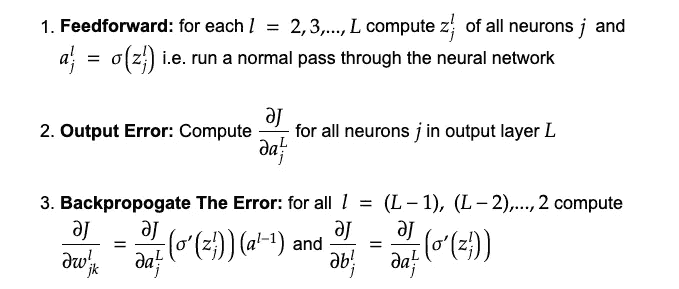

**Figure 8:** Full Backpropagation Algorithm [1]

我们算法中的**前馈**步骤相当于在我们的电话示例中由说话者传递给法官的句子。在我们的神经网络中，一个训练样本将从输入层传递到输出层。这将使我们能够评估我们的总成本`J`，并将其向后推。

# 结论

在本文中，我们研究了反向传播算法。

通过分析错误是如何通过电话线传播的，我们能够了解一个球员的错误对整个团队的影响。我们还确定了减少这种误差的最快方法，首先遍历整个电话线，并反向传播最后计算的误差。

考虑到这种误差传播的思想，以及用于对多元函数进行微分的链式法则，我们提出了一组方程，这些方程可用于有效且快速地计算我们的神经网络的成本函数的梯度。我们通过形式化算法得出结论，并看到它是如何在梯度下降中使用的。

# 深度学习系列

*   [深度学习:意义、动机和 NN 基本结构](https://ali-h-khanafer.medium.com/deep-learning-meaning-motivation-and-nn-basic-structure-44b57b481e4c?source=your_stories_page-------------------------------------)
*   [深度学习第二部分:香草 vs 随机梯度下降](https://ali-h-khanafer.medium.com/deep-learning-part-2-vanilla-vs-stochastic-gradient-descent-6bcecc26fd51)

# 参考

[1]迈克尔·a·尼尔森，[神经网络与深度学习](http://neuralnetworksanddeeplearning.com/) (2015)，决心出版社