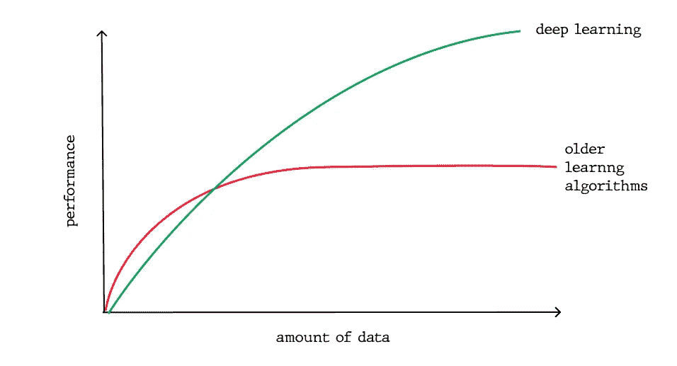
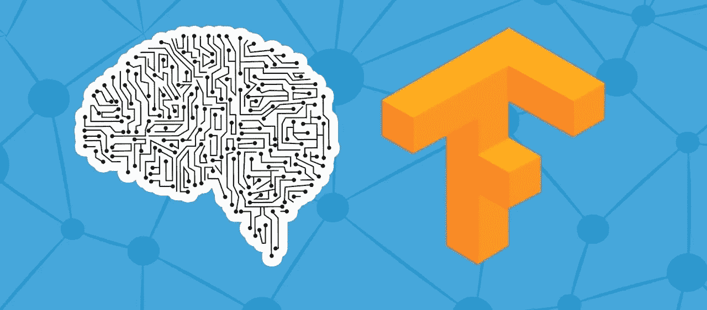
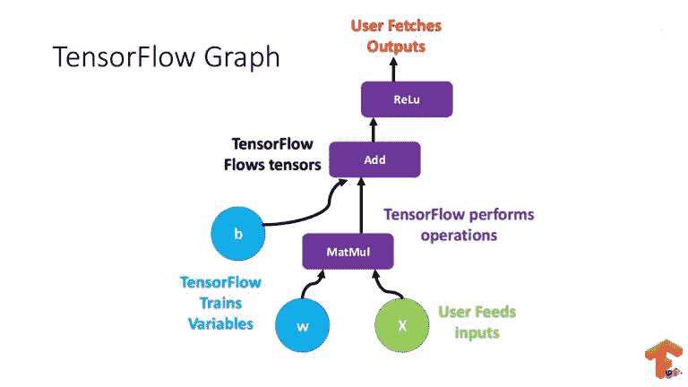

# 使用 TensorFlow 进行深度学习

> 原文：<https://medium.com/geekculture/deep-learning-with-tensorflow-d279d7511d1f?source=collection_archive---------22----------------------->

Photo by [Possessed Photography](https://unsplash.com/@possessedphotography?utm_source=medium&utm_medium=referral) on [Unsplash](https://unsplash.com?utm_source=medium&utm_medium=referral)

深度学习是机器学习的一个分支，与大脑的工作方式有着松散的联系。这是机器学习的一个子领域，涉及由大脑结构和功能启发的算法，称为**人工神经网络**。

从我记事起，我就对机器学习及其应用感兴趣，但总是缺乏学习的资源。我甚至尝试了一些课程，但对于一名新生来说，深度学习的概念有点苛刻。作为一名大二学生，我终于能够掌握机器学习的概念，并在现实世界的应用中实现它们。

如果你正在和我一样的问题中挣扎，那么你来对地方了。在我们开始之前，让我们讨论一下我知道一直困扰你的基本问题。

# **深度学习到底是什么？**

我们都非常熟悉这样一个事实，即人类大脑使用一个神经元系统来执行复杂的任务，如“观看网飞”，甚至执行一个简单的任务“推导著名的相对论”。

在深度学习中，我们喜欢通过使用人工神经网络来模仿神经元的这种行为。根据***联合创始人兼负责人 [***谷歌大脑***](https://en.wikipedia.org/wiki/Google_Brain) *:****

> **利用大脑模拟，希望:**
> 
> **–让学习算法变得更好、更容易使用。**
> 
> **–在机器学习和人工智能方面取得革命性进展。**
> 
> **我相信这是我们迈向真正人工智能的最好机会**

****

# **为什么是深度学习而不是更老的机器学习算法？**

**其中一个最重要的区别是深度学习相对于旧的机器学习算法的可扩展性:当数据很小时，深度学习的表现不好，但随着数据量的增加，深度学习在理解和执行这些数据方面会突飞猛进；相反，传统算法不太依赖于数据量。**

**对于所有认为我们为什么不适应深度学习并抛弃传统算法的人来说，答案是深度学习硬件依赖性:Dl 算法依赖于高端机器和 GPU，因为它们进行大量的矩阵乘法运算，而旧的机器学习算法可以在低端机器上完美地工作。**

**此外，可解释性也是比较的一个因素。对于深度学习算法，有时不可能解释结果，这正是为什么一些行业对深度学习的适应缓慢。**

# **张量流和深度学习有什么关系？**

****

****TensorFlow** is a framework created by Google for creating **Deep Learning** models.**

**张量流是一种流行的软件应用程序，用于实现机器学习算法，特别是神经网络。它由谷歌开发，并于 2015 年作为开源平台发布。**

**它被称为张量流，因为它将输入作为一个多维数组，现在多维数组也被称为张量，你可以构建一种你想要对输入执行的操作的流程图，这样输入从一端进入，然后它流经这个操作系统，从另一端作为输出出来，这就是为什么它被称为张量流，因为张量进入，流经一系列操作，然后它从另一端作为输出出来。**

****

# **TensorFlow 为什么这么特别？**

**TensorFlow 很受欢迎，因为它非常通用，可以在许多不同的平台上运行，可以在桌面或云上运行，也可以在移动设备上运行。 你可以在多台机器上训练它，然后你可以在不同的机器上运行它，一旦你有了训练好的模型，它现在也可以在 GPU 和 CPU 上运行，虽然 GPU 最初是为视频游戏设计的，但它们也非常擅长矩阵运算和代数，所以这使得它们在进行这种依赖于大量新代数的计算时非常快。**

**TensorFlow 非常快，因为它是用 C++编写的，但它可以被其他语言访问和控制，特别是 Python。张量流的另一个很棒的特性是一个叫做张量板的东西，现在张量板可以让你以图形和视觉的方式监控张量流在做什么。**

****

**TensorBoard 通过可视化系统中存在的每一层、权重(神经元)来帮助您理解 DL 模型。为什么有人不使用张量流？**

****

**Photo by [Ralph (Ravi) Kayden](https://unsplash.com/@ralphkayden?utm_source=medium&utm_medium=referral) on [Unsplash](https://unsplash.com?utm_source=medium&utm_medium=referral)**

# ****说够了！从哪里开始使用 TensorFlow？****

**做！**

**我们先来看看这个[***tensor flow***](https://www.tensorflow.org/)网站。您首先看到的是**“tensor flow 入门”**，这正是我们要做的！**

**当你点击它时，你会进入一个页面，在那里你会找到你想要的一切，甚至更多。有教程、解决方案、视频、博客、文档等等。**

**如果你想要一个合适的课程，那么不要担心我有你。看看这个 [**速成班**](https://developers.google.com/machine-learning/crash-course) **。**这个速成课程是由谷歌为想要跟上机器学习速度的员工开发的。现在，如果你是机器学习和张量流的新手，那么很有必要看看这个链接，这样你就可以看到谷歌的机器学习速成班和张量流 API。它非常全面，教你机器学习，但作为一个优点，实现是在 TensorFlow 中，所以这将是学习 TensorFlow 的一个非常好的方法。**

****

**Udemy、Coursera、Udacity 等网站上也有很多付费课程。这些课程非常好，但我要强调的是，只有在你用完了大量免费学习材料后，才能继续学习。**

# **好了，我已经完成了课程，我准备好了我的第一个深度学习项目。我该怎么办？**

**这里是 TensorFlow 的 [**GitHub 页面**](https://github.com/tensorflow) **的链接。**这个页面什么都有！！。他们有项目、模型、循序渐进的教程、视频和书籍。您可以随时查看 Kaggle，获取问题陈述、笔记本和数据集。**

**我这边的人说的就是这些！**

****

***感谢阅读！如果你喜欢阅读这篇文章，请点击* ***👏按钮并分享，帮助其他人找到它！*** *欢迎留言评论💬下面。可以在*[*GitHub*](https://github.com/MXNXV)*[*LinkedIn*](https://www.linkedin.com/in/manav-mandal-5b1496196/)上和我联系***

**有反馈？在[推特](https://twitter.com/_ManavMandal_)上做朋友吧。**

**所有最好的和快乐的编码！😀**