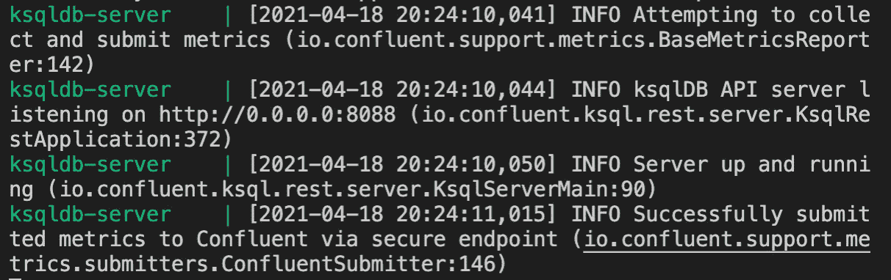
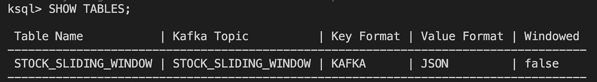
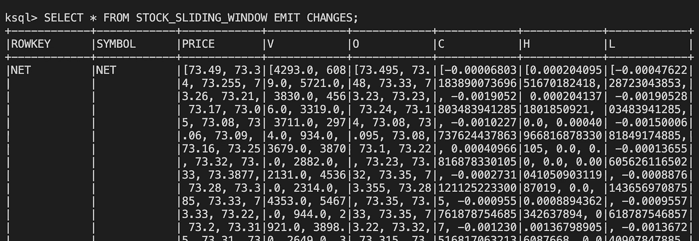
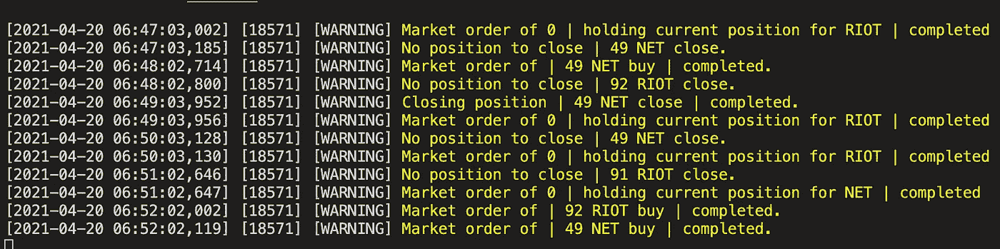

# 基于 Kafka 和 RLlib 的股票交易深度强化学习

> 原文：<https://medium.com/geekculture/deep-reinforcement-learning-for-stock-trading-with-kafka-and-rllib-d738b9634675?source=collection_archive---------2----------------------->

## *MLOps 关于如何构建低延迟、可扩展的分布式数据流以生成实时预测的教程*


Photo by [Maxim Hopman](https://unsplash.com/@nampoh?utm_source=unsplash&utm_medium=referral&utm_content=creditCopyText) on [Unsplash](https://unsplash.com/s/photos/stock-market?utm_source=unsplash&utm_medium=referral&utm_content=creditCopyText)

在本文中，我们将使用 MLOps 工作流，以算法交易为例，通过 Kafka 和 Ray 生产一个深度强化学习代理。

我们将展示如何通过使用 Kafka 创建一个生产者来从 python 客户端库中获取实时股票交易数据。我们将消费这个股票数据流并在 KSQL 中构造它，然后下沉到一个新的 Kafka 主题。接下来，我们将在《浮士德》中订阅这个新主题，我们的模型将在 REST 界面中提供实时预测。我们将在带有 Docker 微服务的 Kafka 集群上本地运行该应用程序。

我们将假设读者已经了解基本的模型训练工作流程。本文将对低延迟数据流基础设施中的服务模型提供一个有用的视角。

本课中使用的框架包括:

*   **Kafka** —一个开源的流数据存储，充当生产者和消费者类的消息队列
*   **ksqlDB** —一个事件流处理器，用于使用 KSQL 查询语言从 Kafka 主题创建结构化查询
*   **Faust** —一个 python 客户端库，用于开发高性能分布式系统，通过 Kafka 集群实现实时应用和微服务
*   Ray——用于在 python 中构建分布式应用的核心 API
*   **RLlib** —用于训练和部署可扩展 RL 代理的强化学习库
*   **Ray Serve** —一个框架无关的工具包，通过可扩展的后端和 web 服务器端点为机器学习模型提供服务

1.  **启动 Kafka Broker 并依赖 Docker Compose**

我们将使用 Docker 的微服务架构构建我们的股票交易应用程序。在下面的 docker compose 文件中，我们可以容器化我们的 Kafka broker 和 zookeeper，以及 ksqlDB 依赖项。

Zookeeper 将在端口“2181”上运行，Kafka broker 将在端口“29092”上运行。我们还将在“8088”上为 ksqlDB 服务器提供一个单独的端口。记住这些端口将有助于简化使用 Kafka 集群的这个项目的数据工程方面。

这个 Kafka 代理在使消费者能够通过 Kafka 集群中的依赖项内共享的主题获取消息和传输数据方面起着重要的作用。我们开发的后续阶段将演示这是如何真正工作的。

要运行以下 docker-compose.yml 文件，我们将在命令行中输入:

```
docker-compose up
```

除非我们选择在 headless 状态下运行该文件，否则我们应该会在 CLI 中看到来自代理和 ksqlDB 服务器的一些输出，如下所示:



Screenshot of running Kafka cluster

我们现在正在运行我们的 Kafka 集群以及所有必要的依赖项。

**2。创建一个 Kafka Producer 来传输来自纽约证券交易所的数据**

接下来，我们将创建一个生成器来实时传输来自纽约证券交易所的一分钟棒线。我们将使用 polygon.io python 客户端作为我们的 web-socket 源，并将这些数据汇集到 Kafka 主题中，这样我们就可以在 Kafka 集群中的任何地方访问这些数据流。

需要订阅 polygon.io 才能传输这些数据；然而，我们可以将这种方法应用于其他 web 套接字和其他用例。

在这个脚本中，我们使用 Kafka broker 的端口实例化了一个 Kafka Producer 对象，并用 json 序列化了我们的消息。然后，在消息处理程序中，我们调用 Kafka producer 的 send 方法，将我们的主题命名为“stock-min-bars”，并将我们的值设置为消息字符串。

通过我们的卡夫卡主题，我们现在可以选择对来自纽约证券交易所的数据流做各种事情。因为我们有一个深度强化学习代理，它可以预测给定环境当前状态下的最佳操作，所以我们必须重新构建数据流，以反映由我们的训练模型定义的特定批量。

**3。用 ksqlDB** 构造流数据

在检查我们在 RLlib 中训练的模型时，我们看到批量大小是 30，这意味着我们应该在最近的偏移之前获取 30 个数据实例。这将有效地在当前数据和最近 30 个数据实例之间创建一个滑动窗口。当下一个一分钟的烛台从我们的数据源到达并沉入我们的 Kafka 主题时，我们的滑动窗口将前进一个偏移量以反映数据流中新的当前窗口。

我们的模型将对每个新窗口进行实时预测，只要数据源在运行 Kafka 集群时产生数据，这个过程就会继续。

为此，我们将直接在 CLI 中输入 KSQL 查询，首先访问容器并配置 ksqlDB。

```
docker-compose exec ksqldb-cli ksql [http://ksqldb-server:8088](http://ksqldb-server:8088/)
```

接下来，我们将基于在上一步中创建的 Kafka 主题中的值创建一个数据流，方法是输入:

```
CREATE STREAM stock_min_bars_stream (
ev VARCHAR,
sym VARCHAR,
v DOUBLE,
o DOUBLE,
c DOUBLE,
h DOUBLE,
l DOUBLE,
price DOUBLE
) WITH (
kafka_topic = 'stock_min_bars',
value_format = 'json'
);
```

使用“stock_min_bars_stream ”,我们可以创建一个充当滑动窗口的表格。在同一个 KSQL 查询中，我们将使用“AS SELECT”将该表下沉到一个名为“stock_sliding_window”的新主题，以使滑动窗口在 Kafka 集群中可用。“LATEST_BY_OFFSET”方法将获取当前实例之前的 32 个实例。在这里，我们*而不是*创建一个‘跳跃窗口’或‘翻转窗口’,因为我们实际上只想要当前偏移量之前的先前值，而不是某个时间范围内聚合函数的单个值。(访问[汇合网站](https://docs.ksqldb.io/en/latest/)上的 ksqlDB 文档，获得关于这些方法的更全面的解释)。

```
CREATE TABLE stock_sliding_window AS
SELECT sym AS ROWKEY,
AS_VALUE(sym) as SYMBOL,
LATEST_BY_OFFSET(price,32) as PRICE,
LATEST_BY_OFFSET(v,32) as V,
LATEST_BY_OFFSET(o,32) as O,
LATEST_BY_OFFSET(c,32) as C,
LATEST_BY_OFFSET(h,32) as H,
LATEST_BY_OFFSET(l,32) as L
FROM stock_min_bars_stream
GROUP BY sym
EMIT CHANGES;
```

通过在 CLI 中发出以下命令，我们可以确保我们的 KSQL 查询正常工作:



“SHOW TABLES;” will list the tables we have created.



“SELECT * FROM STOCK_SLIDING_WINDOW EMIT CHANGES;” will return the actual contents of the table. Notice that the columns have “buffered up” a list of previous values based on the latest offset.

通过这个结构化的流，我们有效地为我们的代理提供了任何给定资产过去 30 分钟的迷你时间序列表示。这批数据将使我们的代理商做出有效的贸易决策。

**4。实现一个后端和端点来服务我们的 RL 代理**

注意:在我们开始演示之前，请参考 [Ray 网站](https://docs.ray.io/en/master/index.html)上的 [RLlib 文档](https://docs.ray.io/en/master/rllib.html)，以获得关于服务“推车杆”基线代理的更简单的教程[。](https://docs.ray.io/en/master/serve/tutorials/rllib.html)

在 RLlib 中训练了一个 RL 代理之后，实现一个实时接收数据的后端只需要两步:加载模型权重和解析 json 请求。

下面的代码包含许多我们用来训练股票交易代理的配置。RLlib 提供了一系列的配置来进行实验，为我们的用例构建有效的代理提供了大量的机会。

作为免责声明，虽然这个代理将在历史数据上实现稳定的回报，但这并不意味着这个代理将使我们在真实环境中的交易变得富有。许多世界上最聪明的人进入高频交易领域赚取可观的收入；然而，即使是最好的量化分析师也会因为许多风险而亏损:价格滑动、过度拟合、前瞻偏差、订单执行不当、代码中的小错误、报价填充、*等等*。本教程展示了一个简单的“玩具”股票交易 RL 代理，它基于 Maxim Lapan 在基本的深度 RL 教材*深度强化学习—动手*中开发的环境。

总结一下后端服务器脚本的内容，第 60–71 行包含“StockTradingModel”类，该类使用“self.agent”对象从 checkpoint 加载模型权重。在生产中，这些权重应该来自 AWS S3 或其他云存储。第 65 行的异步函数解析传入的 json 请求，并根据对 json 请求的观察计算最有利的动作。(下一节将介绍我们如何实时地从 Kafka 集群异步发送这些请求)。

下面的代码示例向 HTTP 公开后端，并为 SAC 代理建立一个端点来提供预测。

关于 [Ray Serve](https://docs.ray.io/en/master/serve/tutorial.html) 的文档展示了如何在 Ray 集群上启动它。在我们的项目中，我们将简单地运行:

```
ray init --headpython deploy_sac_trader.py
```

要停止光线簇，请输入:

```
ray stop
```

**5。如何用 Faust** 查询我们的后端服务器

Faust 框架与我们的用例完全一致，因为一家加密和股票经纪公司 Robinhood 开发了它，为基于 python 的高性能分布式系统提供了一个框架。

在本节中，我们将演示如何使用 Faust 异步查询我们的 RL 代理服务器，并使用响应(预测)在 Alpaca REST API 上买卖股票以进行纸面交易。

在上面的脚本中，我们实现了一个 Faust 应用程序，它将我们在 ksqlDB 中构建的结构化数据流连接到 Ray 服务器，这允许我们的 RL 代理每分钟对最佳交易进行实时预测。

Faust 应用程序通过第 47 行的“FAUST_BROKER_URL”连接到 Kafka 集群来实现这一点，在这里它使用 ksqlDB 中的“STOCK_SLIDING_WINDOW”主题。然后，在第 93 行的方法中，我们利用 async/await 范例用数据流异步查询服务器。这允许数据到达时的低延迟响应。



This shows an output of market orders during a paper trading test.

一旦服务器响应了交易动作，我们就产生一个新的主题“STOCK_ORDERING_SYSYEM”，作为第 124 行上的一个可等待对象。await 允许在交易动作到达后并发执行向新的 Kafka 主题发送服务器响应的任务。我们在另一个方法中使用这个新主题的股票订单，在第 87 行，将交易决策发送给经纪 api。第 88 行的 add_processor 方法允许第 57 行的 order_signal 方法充当回调函数，以便股票订单异步到达 REST API。

结论:深度强化学习与最先进的数据流框架相结合，有可能通过大规模自动化流程来解决许多业务问题，包括股票和密码交易。然而，在真实的交易环境中测试算法时必须小心。测试策略的有效方法包括纸上交易或模拟交易。许多在线经纪 API 提供了这些模拟，可以激发更强大的策略进化。

在 [GitHub](https://github.com/Ryan-Ray-Martin) 上查看整个项目。

更多信息请访问我的专业[网页](https://ryan-martin-data-scientist.herokuapp.com/)。

**参考文献:**

拉潘，马克西姆。*深度强化学习动手*。第二版。，MITP，2019。

萨顿，理查德 s 和安德鲁巴尔托。*强化学习:简介*。麻省理工学院出版社，2018 年。