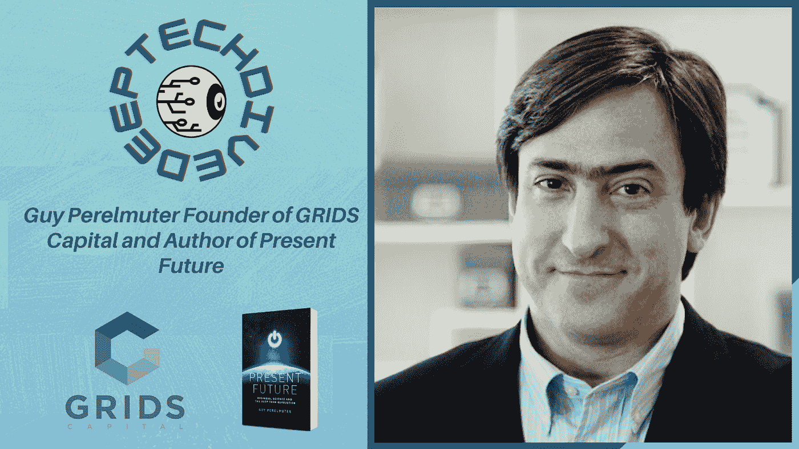

# 深度技术潜水#17 |过去将呈现未来

> 原文：<https://medium.com/geekculture/deep-tech-dive-17-the-past-will-present-the-future-af40f89a2afb?source=collection_archive---------24----------------------->

## Guy Perelmuter 网格资本的创始人和《现在的未来》的作者

***原载于*** [***深度科技内幕***](https://thedeeptechinsider.com/2021/10/26/deep-tech-dive-17-the-past-will-present-the-future/) ***(DTI)。***

认识一下  [盖伊·佩勒姆特尔](https://twitter.com/guyperelmuter?lang=en)，[网格资本](https://www.gridscapital.com/)的创始人和[现在未来](https://presentfuturebook.com/)的作者。网格资本是一家高科技风险投资公司，专注于人工智能，机器人，生命科学和技术…