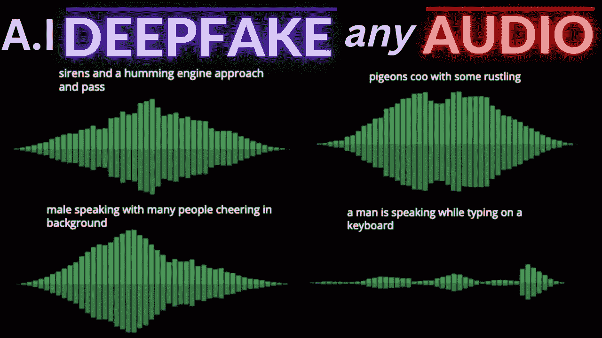
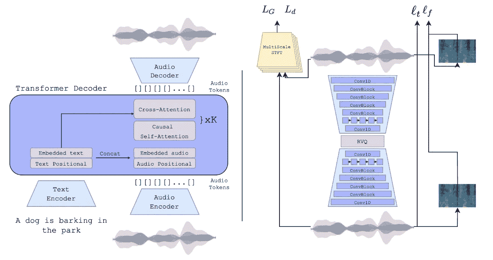
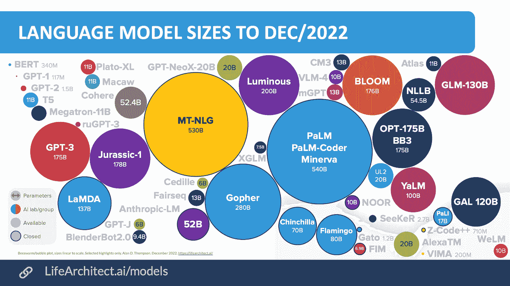
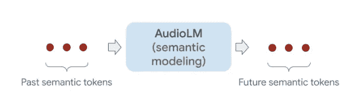
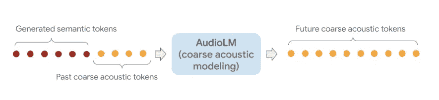

# DeepFake Audio:它会笑，会像你一样说话，会发出动物的声音&等等！

> 原文：<https://medium.com/geekculture/deepfake-audio-it-laughs-talks-like-you-makes-animal-sounds-more-c925c6e309d2?source=collection_archive---------7----------------------->

***注*** *:本文是下面贴出的视频的汇总版。该视频包含富有表现力的人工智能音频示例。如果你想看视频版本，请点击下面的链接。*

在这篇文章中，我们将探索人工智能系统在音频生成方面的各种进步。看完这篇文章，你一定会大吃一惊。我们将讨论三个独特的模型，老实说，第三个是我个人最喜欢的。让我们马上开始吧。

来自 Meta AI 和耶路撒冷希伯来大学的研究人员揭示了 AudioGen，这是一种生成性人工智能模型，可以从头开始制作新的音频。你所需要的只是你想听到的文字描述。AudioGen 还可以继续现有的音频输入，仅提供 1 秒钟的初始声音。研究人员表示，人工智能模型可以解决硬音频问题。让我们来看看这些问题。由于声音在介质中的传播方式，很难区分不同的对象(例如，区分同时说话的多人)。现实世界中录音的方式让这变得更加困难。也就是说，大多数音频形式都有背景噪声或某种形式的混响，这可以影响 AI 如何将优质音频与纯噪声分开。另一个问题是没有很多文本注释，这使得模型很难缩放。与以前的 AI 模型相比，AudioGen 提供了高质量的音频。

AudioGen model architecture

例如，它可以区分不同的声音和物体，就像几个人同时在说话一样。它甚至可以在背景中产生噪音，如混响。研究人员将总共十个音频数据集与匹配的文本注释放在一起，以帮助模型从更多数据中学习。这意味着总共使用了大约 4000 小时的音频数据。经过训练后，AudioGen 可以发出数据集中没有的新声音。例如，它可以模拟“在鸟儿啁啾的背景下穿过森林时吹口哨”。你只需要一个文本提示。

> 要回放这个音频示例，请查看本文开头发布的 Youtube 链接。

该模型还可以产生音乐，甚至唱歌，但它不是为此而设计的，目前也没有太多的方法来控制它。一组评估人员审查了 AudioGen 的结果。超过 85%的 100 个随机选择的音频样本至少有两个概念。例如，“一只狗叫，一只鸟唱”。测试人员使用从 1 到 100 的范围对声音样本进行评级。研究小组总共研究了四种模型。这些模型有 2.85 亿到 10 亿个参数。与其他数千亿的大型语言模型相比，这是一个不错的规模！

Comparative sizes of Large Language Models — M: Million, B: Billion

该团队认为 AudioGen 是未来更好的文本到音频转换的第一步。AudioGen 仍然需要一些改进。该模型尚不擅长的一点是生成可理解的句子。这可以通过在模型中精心制作语音数据来解决。该模型的另一个限制是理解文本的时间顺序。这是什么意思？例如，“*一只狗在叫，然后一只鸟在背景中嗡嗡叫*”，对比“*一只狗在叫，一只鸟在背景中嗡嗡叫*”一种情况是要求鸟在狗叫后马上开始哼唱。总的来说，模型得出的结果令人印象深刻。我绝对渴望看到接下来的几次迭代会是什么样子。谁知道呢，艺术家和视频导演可能能够生成各种音频，然后为他们的艺术进行编辑。你可以想象德瑞医生在几年后为他的专辑采样一个人工智能音频片段。

AudioGen 并不是唯一一个来自 Meta campus 的音频模型。GSLM 是另一个开创性的音频模型，可以模拟情感。所以现在我们更进一步。人们在交谈中交流非语言线索，如语调、情感表达、停顿、口音和节奏，所有这些在人际交往中都至关重要。然而，今天的人工智能系统无法捕捉这些复杂而富有表现力的信号，因为它们只在书面文本上接受训练，这些文本捕捉了我们说的内容，但没有捕捉我们说的方式。这些都不是微不足道的行动；他们对于识别交往的背景至关重要，允许他们传达关于他们的沟通目标或他们试图传达的情绪的细节，无论是讽刺、不耐烦、厌倦还是其他。GSLM 生成各种表情的音频，包括傻笑、打哈欠和哭泣。是的，你没听错。艾这才笑道:

> 要回放这个音频示例，请查看本文开头发布的 Youtube 链接。

随着世界变得越来越数字化，Meta 计划利用这些发现来改善其元宇宙体验。该团队计划让人工智能更具包容性，特别是对于那些说没有标准化书写系统的语言和方言的人。在演讲中捕捉情感表达的一个技术障碍是，这种表达经常同时影响语言的多个部分。当人们从表达喜悦转换到表达愤怒时，他们可能会使用不同的词语，并结合哭泣、咕哝和其他非语言的发声方式。由于压力，他们可能会改变语调和节奏，甚至他们的声音质量。这意味着即使很小的时间偏移或延迟也可能影响话语的流畅度。

准备好再次被震撼了吗？该模型的更新版本可以模拟两个人工智能机器人之间的实时聊天。通常，当人们参与对话时，偶尔会有重叠或暂停，这对于开发代理(如虚拟助理)非常有用。这些助理应该能够解释复杂的社会线索和信号，比如打断，以及与人聊天时的积极或消极反馈。

> 要播放这个音频示例，请参见本文开头发布的 Youtube 链接。

这种模式非常善于轮流并让对话顺畅进行；但是，您可能已经注意到，在提示音蜂鸣后产生的音频不清楚。很难理解人工智能在说什么。作者计划通过对更多数据进行训练来提高模型的清晰度。间隙和停顿很有启发性，因为重叠的言语或非言语，如“嗯”或“嗯”,可能表示同意、不同意或愿意说出来。到目前为止，这种丰富性很难用人工智能来表达。GSLM 的目标是同时模仿言语内容、非言语发声和时间。闲聊模型的工作方式很简单:两个完全相同的变压器模型被教导预测接下来要说什么，同时通过所谓的“交叉注意力”来关注对方。该模型由 10 秒钟的真实对话提示，然后继续它自己版本的闲聊。在不久的将来，Meta AI 计划将该模型用作人工智能的问答助手。想象一下和 Siri 说话，但是这个人更聪明，能表现出一系列的情绪。它会嘲笑你的笑话，尤其是那些没有人觉得好笑的笑话。语音到语音的翻译，或配音，是另一种使用情况。配音通常是通过将音频转换成文本，翻译，然后将文本转换回音频来完成的。您可以看到其中涉及的多个困难过程。GSLM 将直接转换音频，并在必要时增加深度和表现力。

如果到目前为止你还没有真正被打动，那么这个最终模型将会达到目的。我是真心的。型号是谷歌的 AudioLM。该模型可以通过只听音频来生成逼真的语音和钢琴音乐。该团队声称，在长期一致性和高保真度方面，该模型优于 GSLM。这意味着与其他模型相比，AudioLM 生成的语法更加连贯。简单来说，你实际上可以听到 AudioLm 在说什么。该模型产生的钢琴旋律也非常一致，并坚持序列的整体节奏。该模型通过专注于音频创作的两个非常重要的部分，胜过其他人工智能系统。它首先关注音频的语义，也就是说，音频的各个组成部分如何建立起来以创建有意义的输出。该模型还关注声学。这就是声波在较低水平上的变化。从声学中学习使模型能够通过改变不同的波长来创建更丰富质量的音频样本。当模型只在没有任何语义表示的声学数据上训练时，您会立即失去有意义的音频。音频比英语更胡言乱语。这类似于我们之前讨论的 GSLM 模型。由于语义，音频更容易理解，声学提供了不同角度的不同波。所以你可以看到语义在从人工智能构建音频中是多么重要。

Adding semantics to acoustics for better audio quality

AudioLM 接受了 60，000 小时的语音数据训练，另一个版本接受了 40，000 小时的钢琴音乐训练。现在，有很多钢琴课要上完。为了验证结果，谷歌团队要求人类评分员听简短的音频剪辑，并确定它们是真实的人类语音记录还是 AudioLM 的合成作品。评级显示，51.2%的时候，人类可以成功区分人工智能和真正的人类说话者。这个概率刚好超过 50%。这几乎就像一个随机的硬币投掷。这表明对于一般的听者来说，AudioLM 产生的语音很难与真实的语音区分开来。目前，由于他们内部的人工智能原则，谷歌团队没有向公众发布该模型。他们希望首先了解并减少人们将 AudioLM 产生的简短语音样本误认为真实语音的可能性。这并不奇怪，考虑到我们正处于人工智能生成媒体的时代，从文本、图像、视频到音频。错误信息和虚假信息是一个巨大的问题，公司正在努力确保它们不会增加我们社会的毒性。有了 AudioLM，你可以简单地从任何人那里获取一个四秒钟的片段，并让它产生内容，然后可以传播。在最近的新闻中，我们看到了对安东尼·鲍代恩纪录片的强烈反对，因为电影制作人使用人工智能来模仿他的声音。或者，在音乐方面，Jay-Z 起诉 YouTube 频道模仿他的声音。为了避免恶意或未经授权的使用，该团队还训练了一种检测器，可以以 98.6%的准确率找到 AudioLM 产生的合成语音。这表明，由 AudioLM 产生的音频很容易被人工智能程序检测到，尽管有些听众几乎无法分辨。该团队还计划实施其他技术，包括音频“水印”，以增加安全性。在未来，AudioLM 可以扩展到其他类型的音频，如多语言语音或多乐器音乐，以及文本到语音或语音到语音的翻译软件。我很高兴看到多乐器音乐，因为这将超越只有钢琴，有几个鼓，吉他，甚至可能是人声。

我敢打赌，你们中的许多人现在印象深刻，尤其是对 AudioLM。AI 生成的音频最重要的应用是什么？想听听大家的建议。

感谢阅读。

**资源:**

*音频发生器*

> 网址:【https://felixkreuk.github.io/text2audio_arxiv_samples/ 
> 
> paper:[https://felixkreuk . github . io/text 2 audio _ arxiv _ samples/paper . pdf](https://felixkreuk.github.io/text2audio_arxiv_samples/paper.pdf)

*GSLM——生成性口语模式*

> 网址:[https://ai . Facebook . com/blog/generating-chit-chat-including-laughts-哈欠-ums-and-other-non-language-cues-from-raw-audio/](https://ai.facebook.com/blog/generating-chit-chat-including-laughs-yawns-ums-and-other-nonverbal-cues-from-raw-audio/)
> 
> 论文:【https://arxiv.org/pdf/2111.07402.pdf】T4

闲聊

> 网址:[https://speechbot.github.io/dgslm/?FB clid = iwar 2 gsy-ueaqxpmiqfn Jr romt 0 aetk _ pvsbzz 2s 8 sqsgpjdyus 3 BH 6 gt 0v 8](https://speechbot.github.io/dgslm/?fbclid=IwAR2GsY-uEAQxPmIQfnJRwrOMt0AEtk_PvsbZZ2s8sQSGpjdYUS3Bh6gt0v8)
> 
> 论文:[https://arxiv.org/pdf/2203.16502.pdf](https://arxiv.org/pdf/2203.16502.pdf)

*AudioLM*

> 网址:[https://ai . Google blog . com/2022/10/audiolm-language-modeling-approach-to . html](https://ai.googleblog.com/2022/10/audiolm-language-modeling-approach-to.html)
> 
> 论文:[https://arxiv.org/pdf/2209.03143.pdf](https://arxiv.org/pdf/2209.03143.pdf)

**相关主题**

 [## 人工智能读心术具有惊人的准确性！是好事吗？

### 注意:如果你想要这篇文章的视频版本，有更多的可视化例子，那么点击下面的链接。

medium.com](/geekculture/ai-mind-reading-with-surprising-accuracy-is-it-a-good-thing-f4e27b95f6d5)