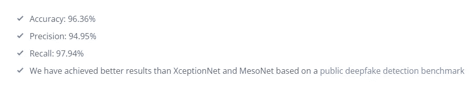
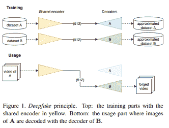
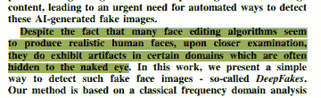
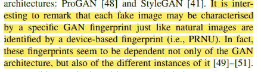
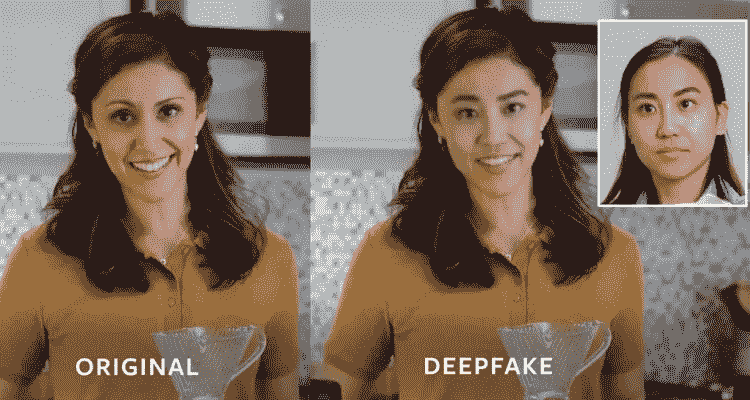
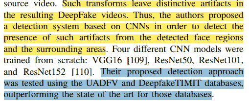
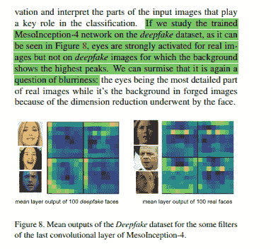
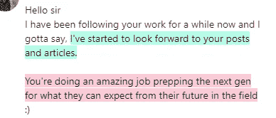

# Deepfake 检测-使用机器学习的快速和可扩展的解决方案。

> 原文：<https://medium.com/geekculture/deepfake-detection-a-fast-and-scalable-solution-using-machine-learning-618e79fcb07f?source=collection_archive---------3----------------------->

## 这是我花了很多时间研究的东西。不需要复杂的深度学习。

为了帮助我了解您[请填写此调查(匿名)](https://forms.gle/7MfQmKhEhyBTMDUD7)

Deepfakes 是很多组织的问题。在我们的社会中，创建虚假图像和视频的能力具有严重的法律和社会后果。尤其是当我们考虑到合成音频时代取得的巨大进步时。如果你认为现在围绕政治的错误信息是不好的，那就等着瞧吧，人们可以制作出真实的视频，记录他们的政治对手“说”他们想让他们说的任何话。虚假的音频、图片和视频可能会被用来混淆法律审判或以各种方式诽谤他人。我可以继续下去，但是如果你正在读这篇文章，我可能不需要。你知道危险。

In a world filled with noise and chaos, the last things we need are Deepfakes. Photo by [@chairulfajar_](https://unsplash.com/@chairulfajar_?utm_source=medium&utm_medium=referral) on [Unsplash](https://unsplash.com?utm_source=medium&utm_medium=referral)

已经有很多关于 Deepfake 检测的研究。数十亿美元被投入到创造、研究和探测它们上。有一些很有前景的解决方案可以捕捉虚假视频和图片。然而，它们非常昂贵，并且在许多关键的使用情况下不可行。在这篇文章中，我将与你分享我在这个领域的工作，包括一个以廉价和可扩展的方式检测 DeepFakes 的可能解决方案。在可预见的将来，我不会参与这个项目。我的希望是一个人能够把它向前推进，为这个领域做出很多贡献。

[Another project with very promising results](https://deepfake-detect.com/). There are a few that have popped up recently.

# 基本思想

当我们真正分析用于创建 DeepFakes/Fake 图像的技术时，我们注意到所有的方法和架构都严重依赖于处理图像，创建各种特征的表示，然后将这些组合起来创建最终的图像。这必然会留下某种图像被篡改的“指纹”。这些指纹是图像的特征(通常人类看不到)，可以被人类检测到。

Taken from: “MesoNet: a Compact Facial Video Forgery Detection Network”

通过创建一个寻找指纹的简单模型的集合，我们将拥有一个能够以最小的成本可靠地检测深度假货的系统。此外，通过教会它寻找指纹，该解决方案可以适用于捕捉更新的 DeepFakes(将基于不同的技术)和相关主题(图像/文档是否被篡改)。集成将具有更好的鲁棒性(不同的模型可以覆盖彼此的弱点)。

为了让这个想法可行，我们需要以下的东西是真的-

1.  生成的图像和真实的图像之间存在着有意义的差异，即使人眼无法立即察觉。此外，这些差异可以通过算法提取和可视化/记录。
2.  使用这些差异将与检测深度假货的最先进方法相竞争。
3.  这种提取方法可推广到不同的问题/变体。我们可以在低/高质量的图像、视频和其他变体中找到伪像的证据。

为了证实这一点，我查阅了大量的研究论文。

# 参考的研究论文-

我在 2021 年 1 月至 8 月期间从事这个项目(断断续续)。我花了很多时间通读研究论文，提炼我的想法，寻找方法。在这篇文章中，我将引用以下文件-

1.  [DeepFakes 和 Beyond:人脸处理和假货检测的调查](https://arxiv.org/abs/2001.00179)
2.  [FaceForensics++学习检测被操纵的面部图像](https://ieeexplore.ieee.org/document/9010912)
3.  [MesoNet:一个紧凑的面部视频伪造检测网络](https://arxiv.org/abs/1809.00888)
4.  [用简单的特征揭露 DeepFakes】](https://arxiv.org/abs/1911.00686)

这些将为你提供足够的证据，证明在生成的图像中人工制品的可行性，以及这个想法的力量。这将为你提供一个可以发展的基础。

# 关于假面的产生-

这是我们要看的第一部分。我们可以利用 DeepFakes 技术来创建从未存在过的人的真实照片。这具有多重安全和身份含义。骗子可以在网上创建大量的虚假人物角色。这将使他们能够更好地保护自己免受法律的制裁。如果你认为机器人和假档案现在是一个问题，等到这成为主流。这会让事情变得更糟。看看下面的图片，[由下面的网站](https://thispersondoesnotexist.com/)创建

Imagined by a GAN ([generative adversarial network)](https://en.wikipedia.org/wiki/Generative_adversarial_network) [StyleGAN2](https://arxiv.org/abs/1912.04958) (Dec 2019) — [Karras](https://research.nvidia.com/person/tero-karras) et al. and Nvidia

显然，能够检测机器创建的图像是一个巨大的优先事项。有什么指纹能让我们捕捉到假图像吗？原来有-

> 一些作者建议分析内部 GAN 管道，以便检测真实和伪造图像之间的不同伪像。**在【55】中，作者假设真实相机图像和假合成图像之间的颜色明显不同。**他们提出了一种基于颜色特征和线性支持向量机(SVM)的检测系统，用于最终分类，当使用 NIST MFC2018 数据集【62】进行评估时，**获得了最佳性能的最终 70.0% AUC**
> 
> - Deepfakes 及其他

请注意，性能是使用支持向量机和颜色特征实现的。这些只是基本的。在此基础上添加更多内容不会非常困难，并且会产生惊人的效果。然而，事情并没有到此结束。事实证明，使用这些指纹可以区分不同的 gan(甚至是同一架构的不同实例)。

这不仅对于这个想法来说非常有前途，而且对于对深度学习研究感兴趣的人来说也有一些令人兴奋的意义。研究不同的指纹可以帮助我们了解不同的 ML 模型，并实际了解幕后发生的事情。通过比较和对比不同的指纹，我们将能够了解更多关于神经网络的黑盒子。

# 交换 ID 时

DeepFakes 就是这样引入的。这也是 DeepFakes 吸引了最多关注的方面。使用 DeepFake 技术，我们可以将人的面部变形到其他人的照片和视频上。

[Source](https://android.appsapk.com/tiktok-deepfakes-manipulated-videos-with-face-swapping-technology/)

这项技术需要仔细检查。利用这一点，人们可以传播各种关于他人的错误信息。而这些假货的高质量会让人无法辨别真假。想象一下，有人在法庭上出示伪造的证据，一个无辜的人因此受到伤害。我们希望防止这种情况发生。幸运的是，DeepFakes 确实留下了一些可以被发现的伪像。

这是我们系统的巨大胜利。使用从 CNN 检测到的特征，我们可以检测 deepfakes。请记住，这是在视觉变形金刚流行之前写的。[我们已经在本文](/geekculture/facebook-ai-picks-a-fight-with-transformers-5e0f511b4383)中介绍了视觉变形金刚“看到”不同的功能。将基于注意力的特征提取结合到我们的管道中，应该可以让我们看到比这里提到的更好的结果。

Another interesting finding provides proof that we can use these artifacts to detect DeepFakes.

正如你所看到的，这个解决方案在 Deepfake 检测的两个主要用例中都有很好的工作潜力。显然，构建它需要大量的跑腿工作，因为你将不得不整合大量的功能，并找出最好的组合。然而，对于那些正在寻找工作项目的人(或任何参与 DeepFake 检测并需要一种新方法的人)，请考虑实施这种方法。[我整理了我的研究，在下面的谷歌幻灯片中加入了一些笔记和观点。请随意使用它作为您自己实现的基础。](https://docs.google.com/presentation/d/1GCyIGM_7KyjrEpRosMb0q-dHDjj5O5kQ4AvPRuHJ5ZE/edit?usp=sharing)

如果你想进入 ML，t [这篇文章给你一个逐步发展机器学习能力的计划](/geekculture/how-to-learn-machine-learning-in-2022-9ef2ea904986)。它使用免费资源。与其他训练营/课程不同，这个计划将帮助你发展基本技能，并为你在该领域的长期成功做好准备**。**

对于机器学习来说，软件工程、数学和计算机科学的基础至关重要。它将帮助你概念化，建立和优化你的 ML。我的每日时事通讯，[Technology interview simpled](https://codinginterviewsmadesimple.substack.com/)涵盖了算法设计、数学、最近的科技事件、软件工程等主题，让你成为更好的开发人员。 [**我目前正在进行一整年的八折优惠，一定要去看看。**](https://codinginterviewsmadesimple.substack.com/subscribe?coupon=1e0532f2)

我创造了[技术面试，使用通过指导多人进入顶级技术公司而发现的新技术，使面试变得简单](https://codinginterviewsmadesimple.substack.com/p/faqs-and-about-this-newsletter?r=4tnbw&s=w&utm_campaign=post&utm_medium=web)。时事通讯旨在帮助你成功，避免你在 Leetcode 上浪费时间。我有一个 100%满意的政策，所以你可以尝试一下，没有任何风险。[您可以阅读常见问题解答并在此了解更多信息](https://codinginterviewsmadesimple.substack.com/p/faqs-and-about-this-newsletter?r=4tnbw&s=w&utm_campaign=post&utm_medium=web)

如果你也有任何有趣的工作/项目/想法给我，请随时联系我。总是很乐意听你说完。

# 向我伸出手

使用下面的链接查看我的其他内容，了解更多关于辅导的信息，或者只是打个招呼。另外，查看免费的罗宾汉推荐链接。我们都得到一个免费的股票(你不用放任何钱)，对你没有任何风险。**所以不使用它只是损失免费的钱。**

查看我在 Medium 上的其他文章。https://rb.gy/zn1aiu

我的 YouTube:[https://rb.gy/88iwdd](https://rb.gy/88iwdd)

在 LinkedIn 上联系我。我们来连线:[https://rb.gy/m5ok2y](https://rb.gy/f7ltuj)

我的 insta gram:[https://rb.gy/gmvuy9](https://rb.gy/gmvuy9)

我的推特:[https://twitter.com/Machine01776819](https://twitter.com/Machine01776819)

如果你正在准备编码/技术面试:【https://codinginterviewsmadesimple.substack.com/ 

获得罗宾汉的免费股票:【https://join.robinhood.com/fnud75 