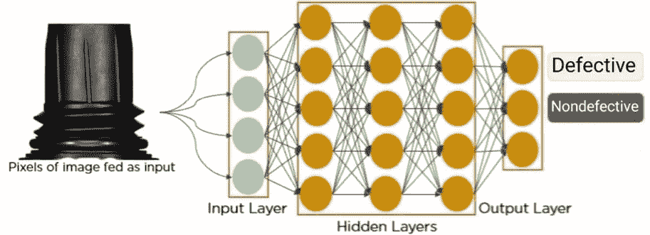
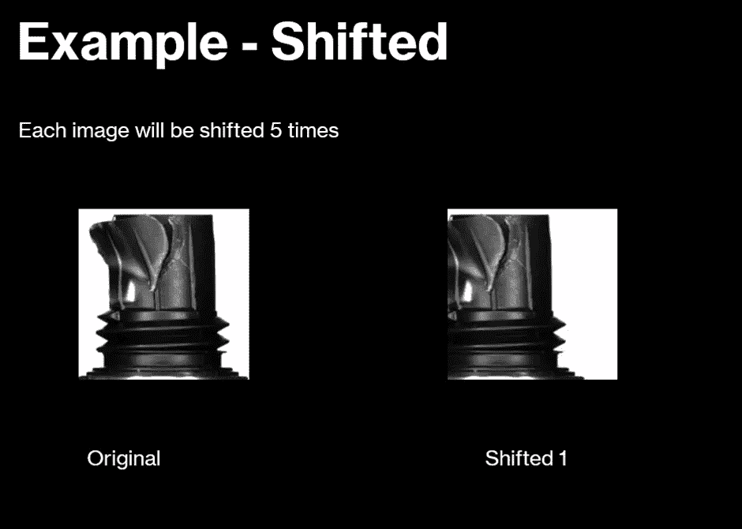
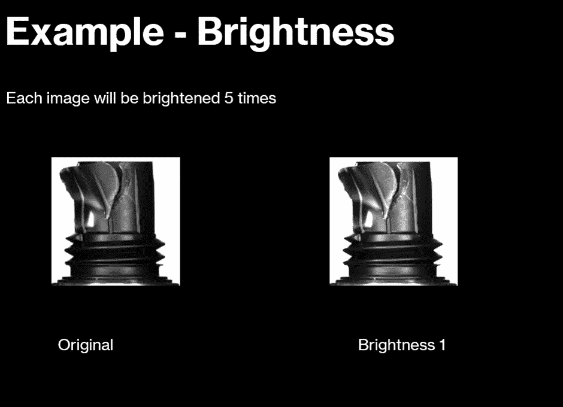
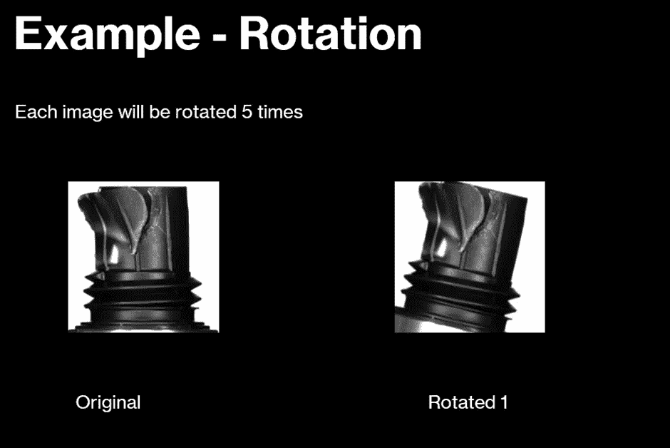
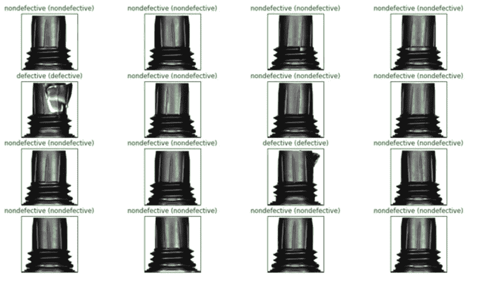

# 塑料组合件的缺陷检测

> 原文：<https://medium.com/geekculture/defect-detection-for-plastic-assembled-parts-23e67ba358ad?source=collection_archive---------19----------------------->

## 使用 CNN 识别产品中的故障

我的任务是为我的硕士学位创建一个缺陷检测人工智能，其中我使用了一个卷积神经网络(CNN)来成功检测这些缺陷。用于训练 AI 的图像很少，因此必须使用一种称为数据增强的技术来增加图像，在这种技术中，图像是通过使用缩放、亮度、旋转和移动等技术人工创建的。

这个项目有两个目标，一是增加数据集，使系统满足有限数量的图像，二是创建一个快速工作的缺陷检测系统。该项目使用了以下技术:Python、TensorFlow 和 Google Collab。

Diagram For The CNN

下图是数据扩充如何工作的示例:

Abertax 提供了 4 个产品的数据集，其中 2 个是有效的，2 个是有缺陷的，总共有大约 321 个图像。减少映像的原因如下:映像减少减少了执行时间，并且防止了由于分配的空间有限而导致的潜在 ram 崩溃。

人工智能的结果如下:

所有的产品都猜对了，这就是为什么它们以绿色出现。括号内包含图像预测应该是什么，而括号外包含预测。如果预测不正确，文本将是红色的，并且括号内外的文本将不匹配(即，无缺陷和有缺陷)。