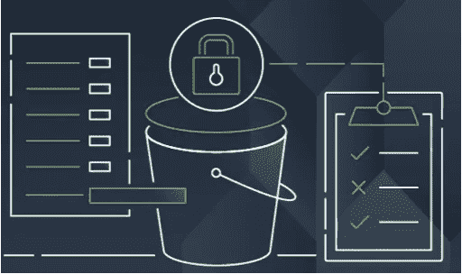

# 深度防御 S3 水桶

> 原文：<https://medium.com/geekculture/defending-in-depth-s3-buckets-66883620ea4c?source=collection_archive---------10----------------------->

Image from Amazon Web Services Blog

# **概述**

在本文中，我们将讨论如何通过验证任何可能的错误配置来提高 AWS S3 存储桶的安全级别，因为您正在创建存储桶，直到您将对象上传并存储到存储桶中。此外，我们将介绍如何保护您上传并存储在 AWS S3 存储桶中的数据对象免受恶意软件和…