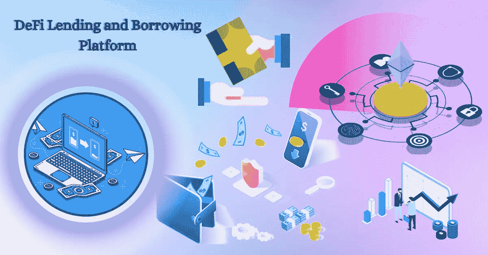

# DeFi 借贷平台——通向未来去中心化大门的唯一途径

> 原文：<https://medium.com/geekculture/defi-lending-and-borrowing-platform-the-one-way-through-the-decentralized-gate-of-future-fe85330cb4c3?source=collection_archive---------17----------------------->

DeFi Lending and Borrowing Platform

> 去中心化金融(DeFi)打破了过去一年的所有理性记录。从 2020 年 12 月 31 日微薄的 170 亿美元，到 2021 年 12 月 31 日的 2520 亿美元，生态系统在 2022 年大幅增长。它展示了 Web3 的各种未来用例，并提供了它的长寿感。由于消除了中介机构并简化了整个价值链，分散金融已准备好给银行一个下马威。
> 
> 每个经济体都依赖于这样一件事。借贷就是这样一个有效的用例。此外，企业借钱扩张。在这个过程中，他们为股东创造了财富和工作岗位。然而，个人和公司筹集资金的选择有限。从银行贷款时，需要严格的尽职调查和标准合规性。这种模式似乎会随着分散融资而改变。

## **什么是 DeFi 借贷？**

在传统和加密货币金融中， [DeFi 借贷](https://bit.ly/3MM45VL)指的是一方将货币资产(如数字货币)给予另一方以换取持续收入流的行为。

任何金融体系的一个基本原则，尤其是目前世界范围内最常实行的“部分银行”体系，是“借贷”的概念，这个概念已经存在很长时间了。这个概念非常简单:贷款人把钱给借款人，以换取一个固定的利率，仅此而已。此外，像银行这样的传统金融机构或像 P2P 贷款机构这样的独立组织会促进这种交易。

> DeFi 的理念在一个以借贷为背景的平台中得到了很好的平衡。您可以通过两个主要渠道促进加密货币环境下的借贷:集中式金融机构或分散式金融协议。所以，在去中心化金融中，获得一个平台是最简单的方法。
> 
> 所以，如果你正在经历分散化的金融，而不是传统的金融，为什么你要经历最近的金融革命而不是最古老的金融革命呢？

# **为什么 DeFi 借贷比传统借贷更受欢迎？**

让我们来看看选择 DeFi 贷款相对于传统贷款的主要好处。

我们都知道 DeFi Crypto lending 建立在区块链技术的基础上，提供最高水平的不变性和透明度。

👉**高端透明**

智能合约在 DeFi 加密货币借贷平台中充当中央权威，处理所有借出和借入的资产，并将它们存储在分散的区块链中，供公众检查和验证。因此，它提供了资金方面的完全透明。

👉**快速访问**

由于资产可以直接借出和借出，而不需要中央机构的介入， [DeFi P2P 借贷平台](https://bit.ly/3MM45VL)最终给了他们的用户更多获得资产的途径。

👉**灵活快速**

只需在 DeFi lending platform 上创建一个帐户，并将资产放入您的加密钱包中，只需几秒钟即可打开智能合同并完成借贷流程。因此，DeFi 贷款快速而灵活。

👉**审查阻力**

DeFi 贷款平台的权力下放确保每个人都有同等的权利和机会在区块链进行交易，没有任何优惠待遇。

👉**价格效率和不变性**

由于 DeFi 的不变性、透明性和速度，它可以增加用户流量，增加市场需求——这可以通过资产价格的上涨来体现。因此，DeFi 贷款平台努力实现高成本效益。

因此，为了您的财务需求，应选择 DeFi 借贷平台，而不是传统借贷平台，主要原因如下。

*收购 DeFi 借贷平台开发前需要了解的主要优势。*

## **独家优势**

他们在这里:

✅极其灵活的借贷程序

✅更快的资金转移

最透明的✅交易

✅被动贷款收入

与传统储蓄相比，✅提高了利率

✅无许可处理

✅向所有个人开放

✅不可变，这意味着任何事务都不能被更改或删除

所以，你已经了解了借贷的优势和其他方面；在继续开发之前，是时候了解顶级平台了。

# **顶级 DeFi 借贷平台**

👉 **Aave**

Aave 是一个著名的开源非托管 DeFi 借贷协议，它从流动性池策略转变为 DeFi P2P 借贷策略。

👉**复合**

Compound 是一个开源借贷协议，让以太坊网络上的用户借用资产换取抵押品并赚取利息。

👉**制造者**

Maker 是一个不同的加密货币借贷平台，主要提供 DAI 的借贷，并使用 DeFi 开源协议。

## **DeFi 借贷平台开发**

[分散融资借贷解决方案](https://bit.ly/3MM45VL)帮助您轻松创建平台。他们使用尖端技术提供端到端的开发服务，使平台看起来像流行的 DeFi 平台，如 Aave、Maker、Compound 等..因此，抓住这个机会，为增强的未来打造最佳平台。

## **结论**

你也可以看到金融的未来正朝着分散金融革命的方向发展。为了增加像 Aave 或 Compound 这样的 DeFi Lending 平台开发的受欢迎程度，以及其他受欢迎的平台，来自顶级公司的开发人员将继承有吸引力的功能。它们确保你的平台能够增加借贷，照亮金融业的未来。