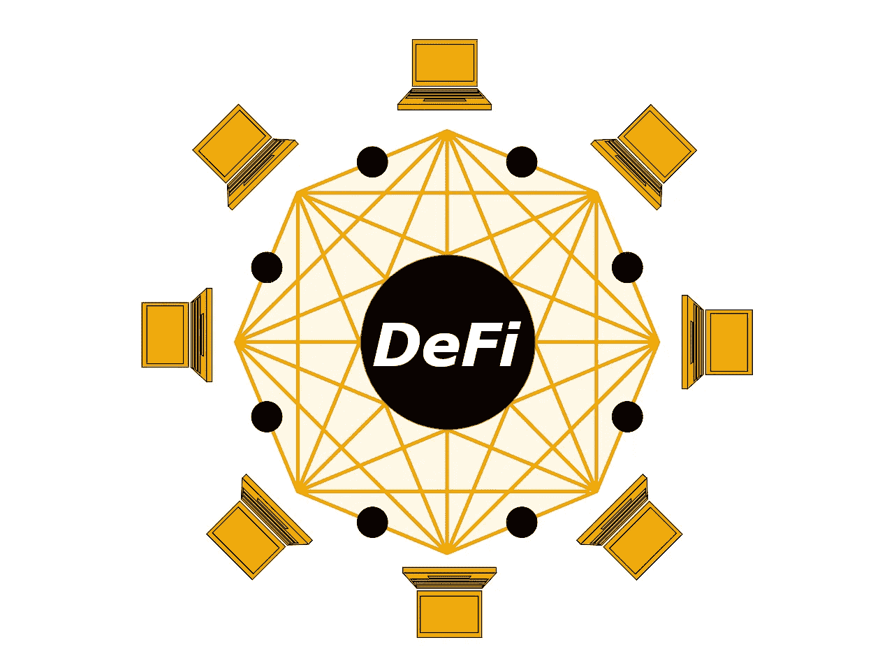

# DeFi:初学者指南，了解超越上帝银行家焦虑的时尚区块链技术

> 原文：<https://medium.com/geekculture/defi-the-beginners-guide-to-understand-the-trendy-blockchain-s-technology-beyond-god-s-bankers-80b3d6fb11ec?source=collection_archive---------15----------------------->

# 什么是 DeFi！？

DeFi，分散金融是目前受到特别关注的密码学领域之一。在其最大的野心中，DeFi 旨在重建我们今天使用的金融系统，但在某种程度上，它将消除所有可信的中介机构，如银行。

具体而言，分散金融一词可以指创建一个开放源代码、未经授权和透明的金融服务生态系统的运动，向所有人开放，并且在没有中央权力机构的情况下运作。用户将保留对其资产的完全控制权，并通过分散的点对点(P2P)应用程序(dapps)与这一生态系统进行互动。

因此，大多数银行和传统金融机构将面临许多问题。因为加密货币对传统货币构成了威胁。

DeFi 与传统金融系统的区别在于三个特征:

*   **它本来就是数字化的。**
*   **它致力于分散的基础设施。**
*   它对每个人都开放，在使用、咨询和参与建设方面也是如此。

今天，我们正处于 DeFi 的开端，事情进展得非常快。许多项目出现，现有项目获得动力。越来越多的用户，因此流动性以及交易量正在到达各种 DeFi 应用程序。用户体验是普通公众采用的主要障碍之一，用户体验正在改善，分散金融正在进入我们的智能手机。

# DeFi 的主要好处是什么？

这个新系统有几个独特的优势:

*   **它本质上是包容性的:**就像在互联网上一样，每个人都可以创建内容、分享内容并进行交易，而无需事先请求许可，分散金融(有时也称为开放金融)允许任何有互联网连接的人访问所提供的金融服务，并参与其发展，而无需请求许可。这就是为什么他被称为无权限。
*   **抵制审查:**任何实体、任何团体、任何个人都不能单方面反对双方同意的交易。
*   **基于廉洁登记簿:**交易在
    区块链上登记，不能修改或单方面取消。
*   **透明可审计:**向用户提出的条件是透明不隐藏的；此外，公开的区块链是透明的，因此任何人都可以审计，这与传统金融体系的相对不透明形成对比。
*   **它降低了交易对手风险:**没有必要委托第三方进行资金管理或交易验证。
*   **多亏了智能合约，它允许你编写可以自动化**或
    自动执行的动作，而不必求助于第三方。
*   它非常模块化:它结合了不同的协议、工具和创新，因此提供了高水平的粒度和模块化。

# DeFi 的潜在使用案例有哪些？

## **借与贷**

开放贷款协议是 DeFi 生态系统中最受欢迎的应用类型之一。与传统的信用体系相比，开放和分散的借贷有许多优势。其中包括交易的即时结算，数字资产的担保能力，信用协议前的无支票，以及未来可能的标准化。

## 货币银行服务

根据定义，DeFi 应用程序是金融应用程序，货币银行是它们的一个明显的用例。例如，这包括发行稳定的债券、抵押贷款和保险。随着区块链产业的成熟，重点是创造稳定的收入。它是一种加密资产，通常与真实资产相关联，但可以轻松转移到数字世界。由于加密货币的价格有时会快速波动，分散的稳定货币可以用于日常使用，因为它们是不由中央机构发行或控制的数字现金。

## 分散的市场

DeFi 的几个最重要的应用是分散交换(DEX)。这些平台允许用户交易数字资产，而不必依赖可信的中介(交易所)来持有他们的资金。使用智能合约的用户的投资组合之间直接进行交易。
由于分散交易所需要的维护工作少得多，因此交易费用通常低于集中交易所。

# DeFi 面临的挑战是什么？

*   **性能差:**区块链天生就比它们的集中式对手慢，这也适用于基于它们构建的应用程序。DeFi 应用程序的开发人员应该意识到这些限制，并相应地优化他们的产品。
*   **用户错误的高风险:** DeFi 应用程序将责任从中介转移到用户身上。这对我们很多人来说都是消极的一面。当产品部署在不可变的区块链上时，设计最小化用户错误风险的产品是一个特别困难的挑战。
*   **用户体验差:**目前，使用 DeFi 应用程序需要用户付出额外的努力。要使 DeFi 应用程序成为全球金融系统的关键部分，它们必须提供切实的好处，促使用户从传统系统转换到另一个系统。
*   **混乱的生态系统:**为特定用例找到最佳应用可能是一项艰巨的任务，用户应该能够灵活地找到最佳选项。挑战不仅在于创建应用，还在于考虑它们在整个 DeFi 生态系统中的位置。

# 结论

分散金融的神奇之处在于，从定义上讲，它是全球性的，世界上任何一个拥有智能手机的人都可以使用它，即使是没有银行账户的 17 亿人也可以使用它。DeFi 应用程序由任何人都可以验证的开源代码驱动。

**与我们生活的高度集中、不透明、追求利润的金融系统相比，你就会明白为什么这种愿景让密码社区着迷了！**