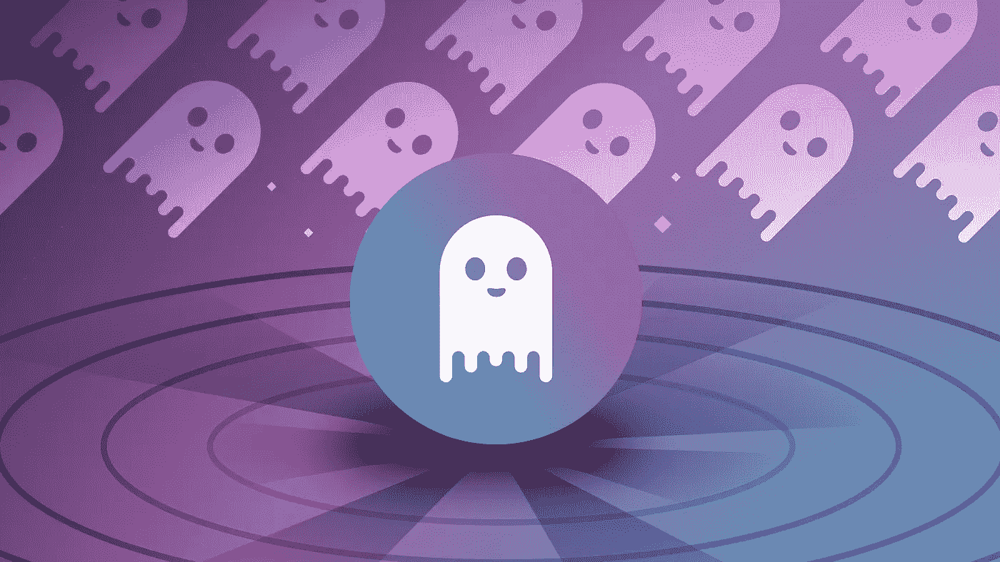
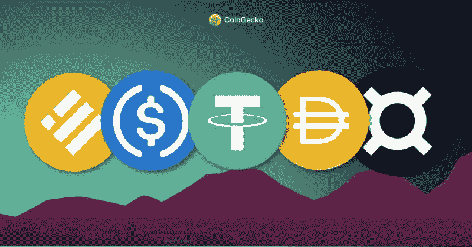

# DeFi:抵制审查之路

> 原文：<https://medium.com/geekculture/defi-the-road-back-to-censorship-resistance-e376c6c9a668?source=collection_archive---------13----------------------->

随着这一年接近尾声，“分散金融”一词可能会让人联想到一个倒闭的赌场，这个赌场将一代人的财富转移到了朝鲜。

North Korean hackers are understood to have stolen $1.2 billion in crypto since 2017, mostly from DeFi. ([Decrypt](https://decrypt.co/117857/north-korean-hackers-have-stolen-1-2b-crypto-since-2017))

然而，如果我们越过各种协议利用和虚幻价值应用，去中心化金融已经交付了一些基本要素，这些要素有望从根本上改善金融系统，基于以下品质:

1.  效率
2.  透明度
3.  弹性
4.  包含
5.  通过抵制审查实现自我主权

审视今天的景观，这个空间似乎已经在前四个维度上成功地验证了概念。使用 Aave、Enzyme 和 Uniswap 等协议，任何拥有加密钱包的人都可以——分别——在没有托管中介的情况下即时储蓄、投资和交易。区块链透明地管理和记录活动，在不利条件下，蓝筹协议比许多集中式协议表现出更强的弹性。

On Aave, users can borrow against collateral and earn interest on their deposits. Essentially – it is an autonomous, borderless and permissionless bank.

然而，在最后一个维度上，这场运动有所欠缺:对审查的抵制，自我主权的支柱，不仅取决于应用层的成功，也取决于*资产*层的健康构建。

如今，如果我们考虑以太坊(Ethereum)这个与去中心化金融最相关的链条，关键资产都有可审查的“后端”:

1.  USDC、USDT、BUSD 和其他由实体管理的法定抵押银行可以冻结用户的链上余额。
2.  WBTC 的基础比特币储备由美国托管机构 Bitgo 持有。
3.  DAI 是一种合成美元，它是在没有任何限制的情况下发行的，以大部分由法定抵押的稳定货币组成的抵押品为基础。

Ethereum’s stablecoin majors are all directly or indirectly dependent on censorable assets. (Courtesy of [CoinGecko](https://www.coingecko.com/learn/what-are-stablecoins-top-5-stablecoins-by-market-cap))

虽然这些货币资产肯定会给链上经济带来价值，但它们也通过与自身资产竞争而削弱了以太坊的主权。要理解货币溢价对任何区块链 T4 的重要性，请听听 EF 研究员贾斯汀·德雷克的播客或阅读我之前的文章。但是为了简单起见，出于说明的目的，考虑以下使用以太坊的场景:

1.  以太坊被大量采用，但交易大多以稳定的货币计价，如 USDC。这破坏了以太作为货币资产的采用，使该链没有足够的“经济安全”来抵御基于股权收购的国家级攻击。
2.  由于 Metamask 跟踪用户 IP 地址和以受监管的稳定账户命名的大部分经济活动，余额可以被当局“随意”扣押。
3.  以太坊正在经历一场有争议的硬分叉，稳定的硬币发行者必须选择他们的硬币在哪里可以兑换。由于稳定的货币在连锁经济中发挥着重要作用，发行者的决定——或适用监管者的决定——将产生决定性影响，限制连锁的主权。
4.  美国政府决定，未经许可和不受管制的美元代币不应该存在。它要求 Circle 等参与者冻结制造商 CDP 中的任何余额。戴急剧下降，随之而来的是链上混乱的(不)健康剂量。

这些情景不太可能发生，但也不奇怪。所有这些都违背了加密货币的根本目的，即金融自主和货币与国家的分离。如果一个公开的区块链必须拥有“主权”才能实现这一愿景，那么其本币就必须成功成为一种货币资产。如今，“分散化”金融的各个部分非但没有推进这一愿景，反而有可能通过 Circle 等实体成为美国金融统治地位的特洛伊木马。

这并不意味着当前的应用程序套件缺乏实用性。相反，任何拥有加密货币钱包的人现在都可以获得全方位的金融服务，这是非常重要的。然而，是否“去中心化”是一个更复杂的问题。如果它不是去中心化的，那么它更适合被归类为“金融科技”创新，而不是货币、政治或道德创新。

这在一定意义上凸显了比特币的价值。它专注于成为一种货币资产，而不是一台全球计算机，这使得它不易被分散化的金融“俘获”。然而，智能合同区块链生态系统*可以*通过一些战略努力减轻捕获的风险:

1.  这个生态系统应该团结在一个由本地资产单独担保的稳定的 T4 周围，而不是优先考虑那些依赖中央中介的人。这不仅消除了审查媒介，还促进了本币作为抵押品的使用。*
2.  生态系统应该通过链上治理在没有硬分叉的情况下管理升级。如果在规范分叉上有任何歧义，稳定的硬币发行者可以有效地控制。如果存在一个链上政治系统来提供一个关于什么构成合法进化的清晰框架，那么这种攻击媒介就会被减轻。
3.  联系以上各点，链上政治系统可用于补贴本地资产和生态系统稳定币的流动性，优先考虑“国家”货币。阅读 Tezos 上的[流动性烘焙](https://news.tezoscommons.org/liquidity-baking-bridging-deep-liquidity-for-tez-3a3a21ccc3b4)作为相关示例。
4.  生态系统应用程序应该将本地资产和/或生态系统稳定币作为主要的交易货币。

RAI is an example of an Ethereum stablecoin backed solely by ETH.

总的来说，加密货币行业可能会受益于更好的术语——例如，“开放金融”与“自主金融”。

自然，上述步骤需要一个能够采取集体行动的有凝聚力的社会政治层。它们并不打算作为一个结论性的手册，而是作为一个尝试性的心理模型，以(重新)建立更好的。

感谢您的阅读！

_________________________________________________________________

**讨论算法稳定币的正确设计超出了本文的范围，但是——简单地说——它应该被过度抵押，具有可以变成负数的自我调整利率，并且依赖于具有最小审查向量的甲骨文系统。*

*不是投资建议。有兴趣讨论这些想法吗？联系 helvantine @ pm . me*