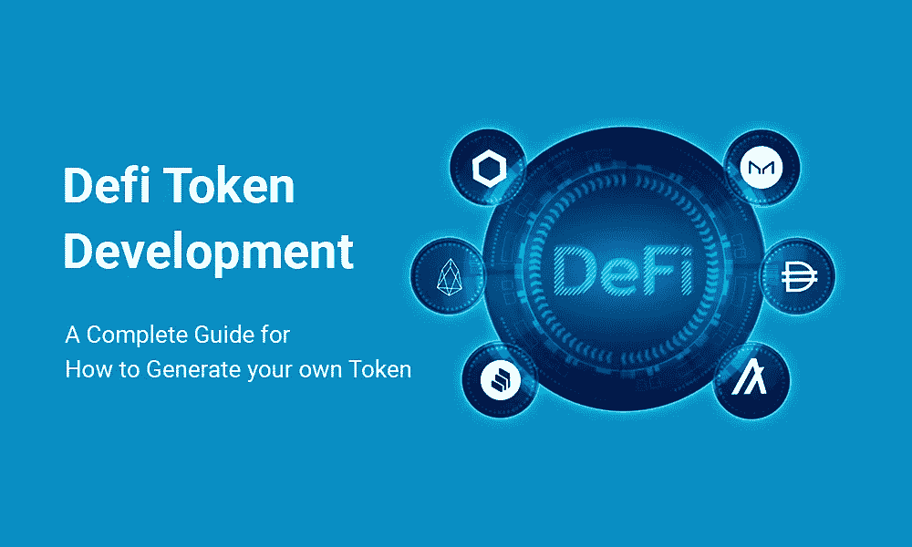

# Defi 令牌开发——如何生成自己的令牌的完整指南

> 原文：<https://medium.com/geekculture/defi-token-development-a-complete-guide-for-how-to-generate-your-own-token-7be24c33955d?source=collection_archive---------17----------------------->

Defi Token Development

在数字技术领域，defi token 业务是最有价值的商业前景之一。如今，许多企业正试图进入数字银行业，以避免限制和监管。尽管交易加密货币是进入加密行业的最佳方式之一，但许多企业主利用令牌化来为他们的运营筹集资金。

这篇博客讨论了令牌化，特别是 Defi 令牌化，开展 Defi 令牌业务的优势，以及如何创建 Defi 令牌。

# 什么是 Defi Token？

当您讨论 Defi token 及其相关业务时，并不是针对某个特定的公司。相反，它提供了各种商业选择，如贸易、投资、投票和众筹。

通俗地说，Defi token 是一种加密货币业务，它为快速成功地开展任何形式的业务提供了坚实的基础，因为它们是完全分散的。每个代币都有货币或经济价值。用户可以随时购买数量可观的代币，因为它们是 100%可替换的。因为他们提供惊人的交易和大量的贸易折扣，Defi 代币对消费者是有利的。根据其独特的功能，每个令牌都以某种方式与其他令牌不同。AAVE、凯博网络等。，是一些众所周知的 Defi 令牌。

# 蓬勃发展的 Defi 项目规范:

*   它们不受监管且分散。
*   自动化和民主运行。
*   根据加密货币市场的状况，他们会自动调整利率。
*   他们没有管理人员或验证人员来检查交易。他们都有区块链技术，这保证了交易。
*   它们比集中式的安全得多，因为它们是分散存储的，这使得解码数据具有挑战性。

# Defi Token 的意识形态:

# 足够的兴趣:

这是指客户对传统投资选项的兴趣，该投资选项必须足以覆盖风险资本成本，并且在未来是盈利的。

# 客户满意度:

应该和完美世界的投资集中化有联系。比如，委内瑞拉人对其公共资金的不满源于未受抑制的通货膨胀，正如银行客户对其金融机构的不满源于机密信息的泄露、过高的佣金和额外的预付款或不必要的组织。

# 最少竞争:

由于分散的货币市场仍在发展，一些利基市场已经被放弃或实际上无效。因为它降低了对节目质量的要求和营销计划的成本，所以在这样一个专业领域执行你的任务更简单。

# 合理费用:

一般来说，制作一个直接的加密货币定义令牌是简单且相当容易的，因此它对于几个个人来说是方便的。即使数字货币交易、信贷市场或保护管理的传输将花费大量的时间、现金和努力，但只有拥有庞大支出计划和管理的组织才能做到这一点。

# Defi 令牌中的类型:

# 实用工具令牌:

这些令牌用于帮助特定环境中的产品或服务，并且该令牌是最低级别的。

# 股权或证券代币:

这些与区块链技术中的普通股票更相似，因此它们更清晰并且没有中间体的贡献。这些类型的令牌在 ICO 平台下进行分类。用户可以使用这些代币进行募捐等活动。

# 混合令牌:

这个代币是股权代币和债务代币的混合。

# 衍生令牌:

这种象征着双方之间有一个财务协议，并从必要的资产中获得一个价值。

# 治理令牌:

这个令牌用于提供在重要平台上投票的目的。它为持有者提供了做出有效决策的能力。

# [ERC20 令牌:](https://www.alwin.io/erc20-token-development-company)

*   可替代和开源。
*   公用事业收益
*   安全便捷的交易
*   容易交换或者交易。
*   兼容令牌创建
*   令牌化你的现实世界的资产。
*   智能合同可访问
*   Dapps 的稳定平稳运行

# Defi 代币获取优势:

defi token 开发的突出优势为您提供了最佳的面向业务的解决方案。根据您的意识形态创建您自己的有效令牌，并借助 defi token 软件获得更多商业利益。

*   这个令牌的开发过程并不需要很高的预算成本。
*   进行快速自动化的交易。如果在平台上买卖代币。这些令牌为用户提供没有任何延迟的状态和公开的活动。
*   代币持有者用于许多金融活动，如借贷。一次用于投资目的，如加密交易、赌注、保险和合成资产生产。
*   这种令牌适用于所有类型的设备和操作系统，即使技术有所进步，它也很容易适应。
*   如果你是一个企业家，想利用 Defi 令牌以首次交易所发行(IEOs)、首次硬币发行(ICOs)和首次直接股票发行(IDOs)的形式进行盈利业务。
*   用户以点对点的方式进行交易，不依赖任何中间人或第三方，如中央机构和管理员。
*   基本上，用户将代币安全地存放在他们控制的数字钱包中。因此，不用担心数字盗窃或数据黑客攻击，因为加密钱包是由私钥保护的。
*   根据市场趋势，如果代币需求同时增加，代币的价格也会增加。
*   对于用户业务增长，Defi token 平台帮助投资者获得更多的流动性，并获得高水平的回报作为收入。
*   Defi 令牌平台是完全开源的，因此它有许多使用案例，因此任何人都可以获得即时访问，而不管交易更新。

# 如何生成令牌:

您必须首先选择您的代币的名称、符号或标志，以及您将向市场分销的总供应量。为了启动受保护和加密的 Defi 令牌，请选择合适且高效的区块链网络。确保你完全清楚这项投资所要解决的问题，以及你的意识形态和生产 Defi token 或 coin 的原因。

然后，你必须开始程序。您必须首先注册一个帐户，这将有助于开发您的 DeFi 令牌。应该开发、发布和集成一个新的智能合同，以提高 Defi 令牌流程的自动化程度。确保您的 defi 令牌可以轻松地发送到您的用户的各种加密地址。因此，您应该为您的用户提供一个有效且相关的地址。

开始建立一个令牌转移事件，以便您的 Defi 钱包在您的 Defi 令牌转移时得到通知。您应该选择在转移代币时加密货币交易所将征收的交易费。决定最低的交易成本，这将增加你的代币在交易中被使用的机会。使用可以集成到代币中的多加密货币钱包来帮助您存储和管理代币销售的加密货币。

更新您的令牌以利用 Defi 令牌提供的所有新功能，如迁移功能、赌注、池选项、流动性管理、托管开发、集成、管理、安全钱包和网关，以处理进出您的令牌帐户和钱包的交易。请确保您在所有主要的加密货币交易所都列出了令牌，以便世界各地的交易者都可以看到它。建立存储设施，帮助保护用户的令牌免受非法访问。确保信息是最新的，符合投资计划和交易者的要求。屏幕将显示新数据。我说完了。您的钥匙已输入。现在，您的令牌已准备好在加密业务中立足。

# 总结:

Defi 令牌被认为是 Defi 世界中的主要事物之一。Defi 在数字金融领域创造了一个独立的位置。如今，我们在日常生活中看到代币的使用越来越多。已经有很多商业人士开始了他们的分散平台，并从中获得了更多的利润和成功。如果您有任何独特的商业想法要执行，并为您的项目选择最合适的[**Defi Token Development**](https://www.alwin.io/defi-token-development-company)服务商。随着我的深入研究，我发现“WeAlwin 技术”是最好的技术。他们已经在世界各地完成了 500 多个项目，并成功实现了客户业务的增长。