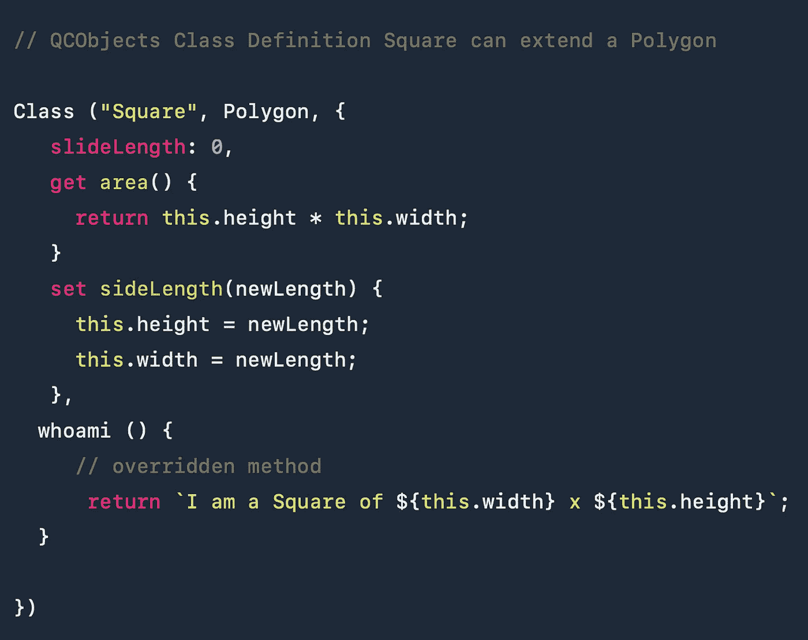

# 在 JavaScript 中定义类

> 原文：<https://medium.com/geekculture/defining-classes-in-javascript-9678d677fc6b?source=collection_archive---------17----------------------->

# 对象继承

对象继承意味着从一个类到另一个类继承属性和方法是可能的。在 JavaScript 中，类是对象原型的表示，而原型是对象属性定义的子集。

# JavaScript 中的本机继承

自 ECMAScript 2015 规范以来，JavaScript 引入了一个名为“class”(小写)的特殊关键字，它可以用作语法糖来描述表示类或对象类型的函数原型。

```
'use strict';class Polygon {
  constructor(height, width) {
    this.height = height;
    this.width = width;
  }
}class Square extends Polygon {
  constructor(sideLength) {
    super(sideLength, sideLength);
  }
  get area() {
    return this.height * this.width;
  }
  set sideLength(newLength) {
    this.height = newLength;
    this.width = newLength;
  }
}//this sample code was extracted from MDN: [https://developer.mozilla.org/en-US/docs/Web/JavaScript/Inheritance_and_the_prototype_chain#with_the_class_keyword](https://developer.mozilla.org/en-US/docs/Web/JavaScript/Inheritance_and_the_prototype_chain#with_the_class_keyword)
```

上面的代码描述了一个多边形类和一个正方形类，它们可以通过使用 new 运算符进行实例化，如下所示:

```
let polygon = new Polygon( 20, 30 );
 let square = new Square (30);
```

一个类继承另一个类的方法。扩展类(多边形)通常称为父类或抽象类，扩展类(正方形)通常称为子类或子类。

# QCObjects 使用类函数继承



现在，一个类似的代码，但是使用 QCObjects 语法，将产生更高级的结果，看起来像这样:

```
// QCObjects v2.3 codeClass ("Polygon", {
    height: 0,
    width: 0
})Class ("Square", Polygon, {
   slideLength: 0,
   get area() {
     return this.height * this.width;
   }
   set sideLength(newLength) {
     this.height = newLength;
     this.width = newLength;
   }
})// To instantiate this classes
let polygon = New(Polygon, {width: 20, height: 30})
let square = New(Square, {sideLength: 20})
```

上述代码中最重要的区别之一是，我们不需要声明一个构造函数(在第一个原生 JavaScript 代码中我们需要这样做)，因为框架会自动为我们声明它。

另一件重要的事情是，为了实例化对象多边形和正方形，我们不使用 new 运算符。我们需要用一个新的函数来代替它(当心 Class 和 New 中的大写字母)。

这种语法的一个致命优点是，您将对象定义为对象，并且不使用任何函数语法来声明类定义(QCObjects 框架在需要时会在内部为您完成)。

就像你看到的类和新特性一样简单，这些就是 QCObjects 强大的源泉，因为改变你可以声明你使用的对象的方式，你也可以用你想象不到的方式丰富它们。

# 重写方法

您还可以覆盖原生 JavaScript 中的方法。在下一个示例中，我们将创建一个名为 whoami 的方法，该方法返回一个字符串，表示“我是一个 *x* 的多边形”或“我是一个 *x* 的正方形”，分别显示消息中的 with 和 height 值。

```
class Polygon {
  constructor(height, width) {
    this.height = height;
    this.width = width;
  } whoami () {
      return `I am a Polygon of ${this.width} x ${this.height}`;
  }}class Square extends Polygon {
  constructor(sideLength) {
    super(sideLength, sideLength);
  }
  get area() {
    return this.height * this.width;
  }
  set sideLength(newLength) {
    this.height = newLength;
    this.width = newLength;
  } // overridden method 
  whoami () {
      return `I am a Square of ${this.width} x ${this.height}`;
  }}let polygon = new Polygon(20, 30);
let square = new Square (20);console.log ( polygon.whoami() );
// "I am a Polygon of 30 x 20"console.log ( square.whoami() );
// "I am a Square of 20 x 20"
```

如您所见，根据方法定义的位置(子类或父类)，相同的方法名可以被覆盖以具有不同的行为。

# 重写 QCObjects 中的方法

使用 QCObjects 可以简化上述代码，如下所示:

```
// QCObjects v2.3 codeClass ("Polygon", {
    height: 0,
    width: 0, 
    whoami () {
      return `I am a Polygon of ${this.width} x ${this.height}`;
    }
})Class ("Square", Polygon, {
   slideLength: 0,
   get area() {
     return this.height * this.width;
   }
   set sideLength(newLength) {
     this.height = newLength;
     this.width = newLength;
   },
  whoami () {
     // overridden method 
      return `I am a Square of ${this.width} x ${this.height}`;
  }})// To instantiate this classes
let polygon = New(Polygon, {width: 20, height: 30})
let square = New(Square, {sideLength: 20})
```

我们会得到完全相同的结果

```
console.log ( polygon.whoami() );
// "I am a Polygon of 30 x 20"console.log ( square.whoami() );
// "I am a Square of 20 x 20"
```

# 混合语法(除非特别需要，否则不推荐)

QCObjects 的目的是在运行时扩展 JavaScript 语言，让您拥有现代软件开发的特性，而无需使用捆绑器或静态传输器。因此，您总是可以混合本地 JavaScript 的语法扩展定义。

QCObjects 的一个很酷的地方是，您还可以创建一个新的 QCObjects 类定义来扩展传统的 JavaScript 类定义，如下所示:

```
// native language class definitionclass Polygon {
  constructor(height, width) {
    this.height = height;
    this.width = width;
  } whoami () {
      return `I am a Polygon of ${this.width} x ${this.height}`;
  }}// QCObjects Class Definition Square can extend a Polygon Class ("Square", Polygon, {
   slideLength: 0,
   get area() {
     return this.height * this.width;
   }
   set sideLength(newLength) {
     this.height = newLength;
     this.width = newLength;
   },
  whoami () {
     // overridden method 
      return `I am a Square of ${this.width} x ${this.height}`;
  }})let polygon = new Polygon(20, 30);
let square = New(Square, {sideLength: 20})console.log ( polygon.whoami() );
// "I am a Polygon of 30 x 20"console.log ( square.whoami() );
// "I am a Square of 20 x 20"
```

然而，虽然上面的代码很酷，有时也很强大，但除非您真的需要，否则不建议将其用于一般用途。

# 结论

QCObjects 类函数的语法简单且功能强大，可以声明类定义。您还可以扩展 JavaScript 本地类来定义新对象。您可以重写方法并继承父类的行为。